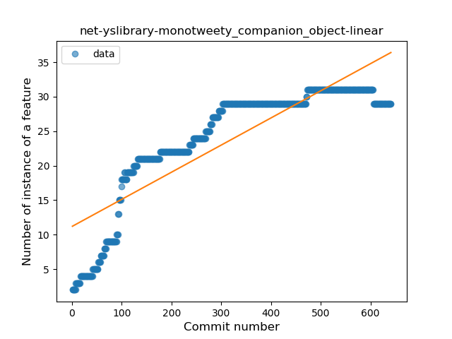
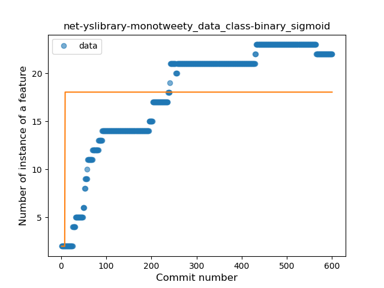

## net-yslibrary-monotweety
----
#### Metrics provided by Detekt
* Number of lines of code 7272
* Number of Kotlin files: 158
* Cyclomatic complexity: 687
* Cyclomatic complexity by thousands of lines: 187 

----
**15** features analyzed

*	<a href="#type_inference">Type Inference</a> 
*	<a href="#lambda">Lambda</a> 
*	<a href="#safe_call">Safe Call</a> 
*	<a href="#when_expr">When expression</a> 
*	<a href="#unsafe_call">Unsafe Call</a> 
*	<a href="#companion_object">Companion Object</a> 
*	<a href="#string_template">String Template</a> 
*	<a href="#func_with_default_value">Function with Default Value</a> 
*	<a href="#smart_cast">Smart Cast</a> 
*	<a href="#data_class">Data Class</a> 
*	<a href="#func_call_with_named_arg">Function call with Named Argument</a> 
*	<a href="#extension_function">Extension Function</a> 
*	<a href="#property_delegation">Property Delegation</a> 
*	<a href="#destructuring_declaration">Destructuring Declaration</a> 
*	<a href="#super_delegation">Super Delegation</a> 

### <a name="type_inference">Type Inference</a>
----
#### Functions
* **Constant Rise - Linear:** 
    * **R_Squared:** 0.86916267
* **Plateau Sudden Rise - Binary Sigmoid:** 
    * **R_Squared:** 0.62526066
* **Sudden Rise Plateau - Logarithm:** 
    * **R_Squared:** 0.60035496

**Plots** :chart_with_upwards_trend:
-----

### <a name="lambda">Lambda</a>
----
#### Functions
* **Constant Rise - Linear:** 
    * **R_Squared:** 0.80692206
* **Plateau Sudden Rise - Binary Sigmoid:** 
    * **R_Squared:** 0.71123592
* **Sudden Rise Plateau - Logarithm:** 
    * **R_Squared:** 0.67770289

**Plots** :chart_with_upwards_trend:
-----

### <a name="safe_call">Safe Call</a>
----
#### Functions
* **Constant Rise - Linear:** 
    * **R_Squared:** 0.89622577
* **Sudden Rise Plateau - Logarithm:** 
    * **R_Squared:** 0.66416369
* **Plateau Sudden Rise - Binary Sigmoid:** 
    * **R_Squared:** 0.19616332

**Plots** :chart_with_upwards_trend:
-----

### <a name="when_expr">When expression</a>
----
#### Functions
* **Sudden Rise Plateau - Logarithm:** 
    * **R_Squared:** 0.61626219
* **Constant Rise - Linear:** 
    * **R_Squared:** 0.29434749

**Plots** :chart_with_upwards_trend:
-----

### <a name="unsafe_call">Unsafe Call</a>
----
#### Functions
* **Plateau Gradual Rise - Sigmoid:** 
    * **R_Squared:** 0.93349081
* **Constant Rise - Linear:** 
    * **R_Squared:** 0.78176261
* **Sudden Rise Plateau - Logarithm:** 
    * **R_Squared:** 0.49792038

**Plots** :chart_with_upwards_trend:
-----

### <a name="companion_object">Companion Object</a>
----
#### Functions
* **Constant Rise - Linear:** 
    * **R_Squared:** 0.74968556
* **Sudden Rise Plateau - Logarithm:** 
    * **R_Squared:** 0.71126667
* **Plateau Sudden Rise - Binary Sigmoid:** 
    * **R_Squared:** 0.38140064

**Plots** :chart_with_upwards_trend:
-----

### <a name="string_template">String Template</a>
----
#### Functions
* **Sudden Rise Plateau - Logarithm:** 
    * **R_Squared:** 0.74249177
* **Constant Rise - Linear:** 
    * **R_Squared:** 0.57248313
* **Plateau Sudden Rise - Binary Sigmoid:** 
    * **R_Squared:** 0.48164808

**Plots** :chart_with_upwards_trend:
-----

### <a name="func_with_default_value">Function with Default Value</a>
----
#### Functions
* **Plateau Gradual Rise - Sigmoid:** 
    * **R_Squared:** 0.92360763
* **Sudden Rise Plateau - Logarithm:** 
    * **R_Squared:** 0.73974524
* **Constant Rise - Linear:** 
    * **R_Squared:** 0.32132689

**Plots** :chart_with_upwards_trend:
-----

### <a name="smart_cast">Smart Cast</a>
----
#### Functions
* **Sudden Rise Plateau - Logarithm:** 
    * **R_Squared:** 0.88083061
* **Constant Rise - Linear:** 
    * **R_Squared:** 0.68477715

**Plots** :chart_with_upwards_trend:
-----

### <a name="data_class">Data Class</a>
----
#### Functions
* **Constant Rise - Linear:** 
    * **R_Squared:** 0.77328009
* **Sudden Rise Plateau - Logarithm:** 
    * **R_Squared:** 0.76306402
* **Plateau Sudden Rise - Binary Sigmoid:** 
    * **R_Squared:** 0.1015269

**Plots** :chart_with_upwards_trend:
-----

### <a name="func_call_with_named_arg">Function call with Named Argument</a>
----
#### Functions
* **Constant Rise - Linear:** 
    * **R_Squared:** 0.88790098
* **Sudden Rise Plateau - Logarithm:** 
    * **R_Squared:** 0.6404731
* **Plateau Sudden Rise - Binary Sigmoid:** 
    * **R_Squared:** 0.28973405

**Plots** :chart_with_upwards_trend:
-----

### <a name="extension_function">Extension Function</a>
----
#### Functions
* **Sudden Rise Plateau - Logarithm:** 
    * **R_Squared:** 0.7662568
* **Constant Rise - Linear:** 
    * **R_Squared:** 0.60903657

**Plots** :chart_with_upwards_trend:
-----

### <a name="property_delegation">Property Delegation</a>
----
#### Functions
* **Sudden Rise - Exponential:** 
    * **R_Squared:** 0.85841347
* **Constant Rise - Linear:** 
    * **R_Squared:** 0.83647247
* **Sudden Rise Plateau - Logarithm:** 
    * **R_Squared:** 0.36292522
* **Plateau Sudden Rise - Binary Sigmoid:** 
    * **R_Squared:** 0.10478239

**Plots** :chart_with_upwards_trend:
-----

### <a name="destructuring_declaration">Destructuring Declaration</a>
----
#### Functions
* **Plateau Sudden Decline - Binary Sigmoid:** 
    * **R_Squared:** 1.0
* **Constant Decline - Linear:** 
    * **R_Squared:** 0.48664406
* **Sudden Rise Plateau - Logarithm:** 
    * **R_Squared:** -0.0

**Plots** :chart_with_upwards_trend:
-----

### <a name="super_delegation">Super Delegation</a>
----
#### Functions
* **Sudden Decline - Exponential:** 
    * **R_Squared:** 0.8421661
* **Constant Decline - Linear:** 
    * **R_Squared:** 0.03314607
* **Sudden Rise Plateau - Logarithm:** 
    * **R_Squared:** -0.0

**Plots** :chart_with_upwards_trend:
-----

