## nibarius-opera-park-android
----
#### Metrics provided by Detekt
* Number of lines of code 5272
* Number of Kotlin files: 73
* Cyclomatic complexity: 699
* Cyclomatic complexity by thousands of lines: 244 

----
**17** features analyzed

*	<a href="#type_inference">Type Inference</a> 
*	<a href="#lambda">Lambda</a> 
*	<a href="#safe_call">Safe Call</a> 
*	<a href="#when_expr">When expression</a> 
*	<a href="#companion_object">Companion Object</a> 
*	<a href="#unsafe_call">Unsafe Call</a> 
*	<a href="#string_template">String Template</a> 
*	<a href="#func_with_default_value">Function with Default Value</a> 
*	<a href="#singleton">Singleton</a> 
*	<a href="#smart_cast">Smart Cast</a> 
*	<a href="#range_expr">Range Expression</a> 
*	<a href="#func_call_with_named_arg">Function call with Named Argument</a> 
*	<a href="#data_class">Data Class</a> 
*	<a href="#extension_function">Extension Function</a> 
*	<a href="#property_delegation">Property Delegation</a> 
*	<a href="#destructuring_declaration">Destructuring Declaration</a> 
*	<a href="#inline_func">Inline Function</a> 

### <a name="type_inference">Type Inference</a>
----
#### Functions
* **Constant Rise - Linear:** 
    * **R_Squared:** 0.98719828
* **Sudden Rise - Exponential:** 
    * **R_Squared:** 0.99217859
* **Sudden Rise Plateau - Logarithm:** 
    * **R_Squared:** 0.58304245

**Plots** :chart_with_upwards_trend:
-----

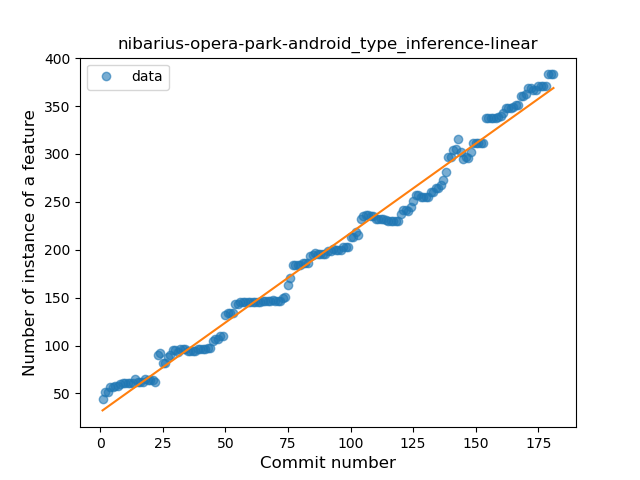
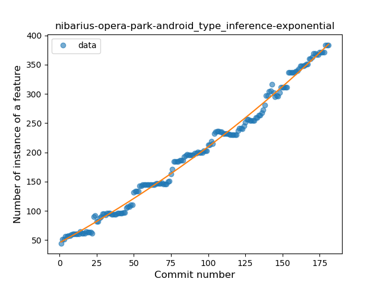
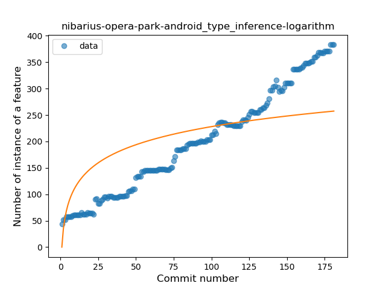
### <a name="lambda">Lambda</a>
----
#### Functions
* **Constant Rise - Linear:** 
    * **R_Squared:** 0.93848799
* **Sudden Rise - Exponential:** 
    * **R_Squared:** 0.93890239
* **Sudden Rise Plateau - Logarithm:** 
    * **R_Squared:** 0.75321786
* **Plateau Sudden Rise - Binary Sigmoid:** 
    * **R_Squared:** 0.23015836

**Plots** :chart_with_upwards_trend:
-----

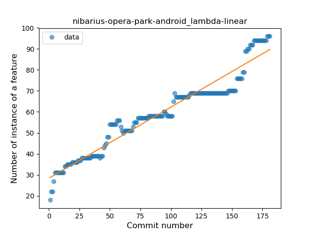
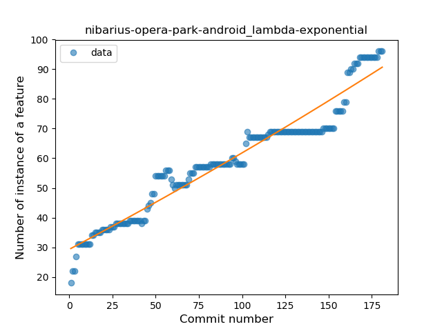

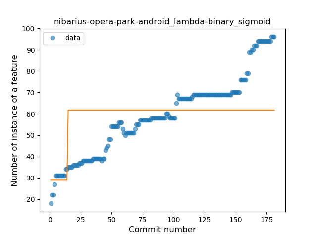
### <a name="safe_call">Safe Call</a>
----
#### Functions
* **Sudden Rise - Exponential:** 
    * **R_Squared:** 0.91088577
* **Constant Rise - Linear:** 
    * **R_Squared:** 0.78604135
* **Sudden Rise Plateau - Logarithm:** 
    * **R_Squared:** 0.52263074
* **Plateau Sudden Rise - Binary Sigmoid:** 
    * **R_Squared:** 0.22443892

**Plots** :chart_with_upwards_trend:
-----

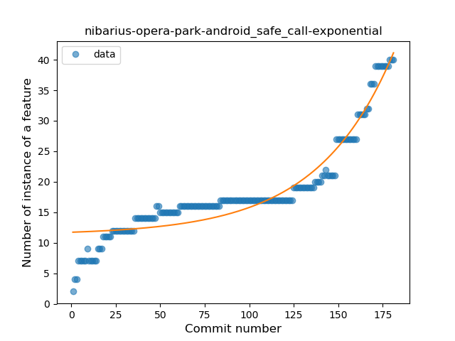
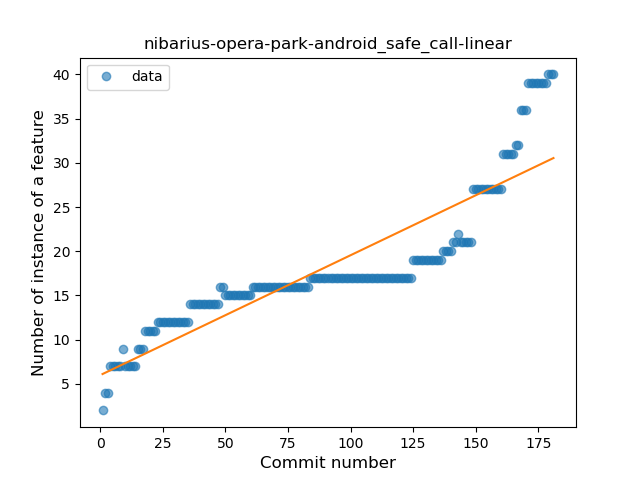
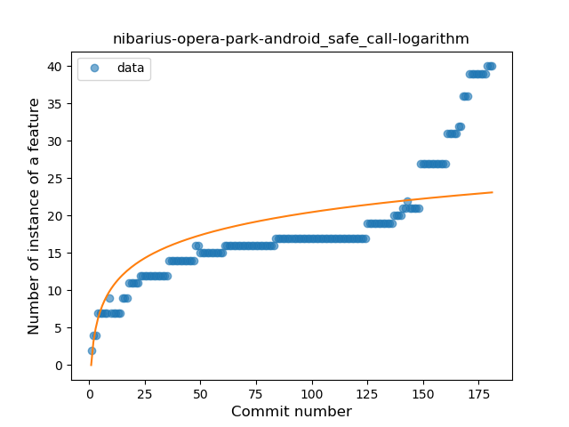
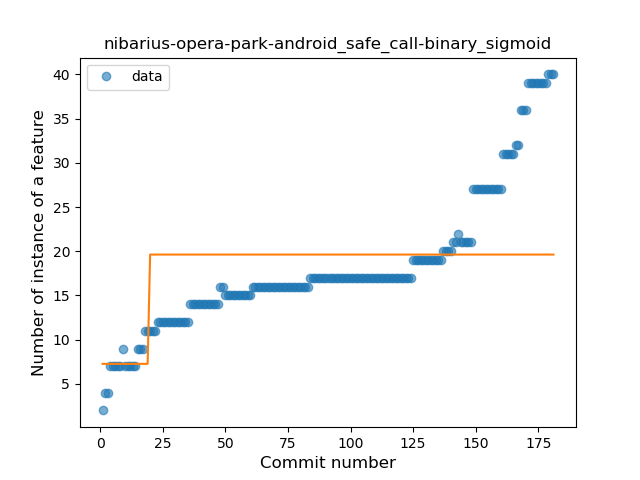
### <a name="when_expr">When expression</a>
----
#### Functions
* **Sudden Rise - Exponential:** 
    * **R_Squared:** 0.78744947
* **Constant Rise - Linear:** 
    * **R_Squared:** 0.66928902
* **Sudden Rise Plateau - Logarithm:** 
    * **R_Squared:** 0.50565545

**Plots** :chart_with_upwards_trend:
-----

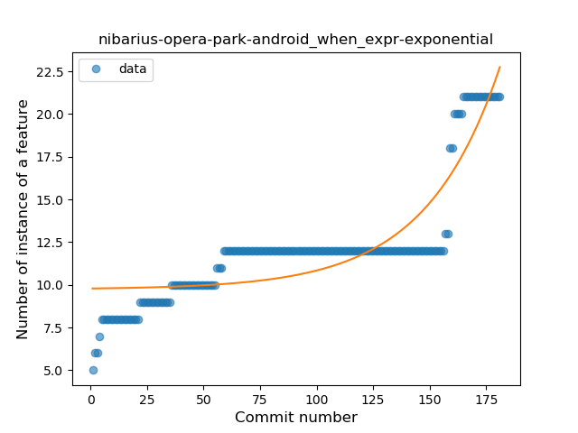
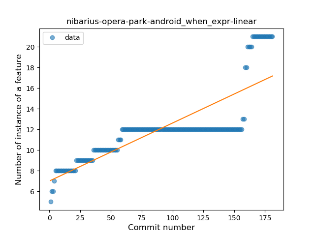
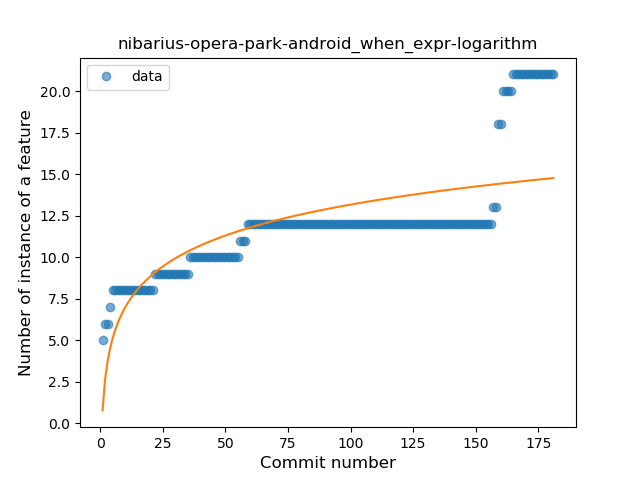
### <a name="companion_object">Companion Object</a>
----
#### Functions
* **Constant Rise - Linear:** 
    * **R_Squared:** 0.80596902
* **Sudden Rise Plateau - Logarithm:** 
    * **R_Squared:** 0.70603119

**Plots** :chart_with_upwards_trend:
-----

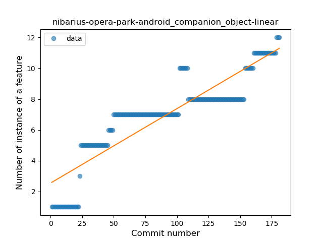
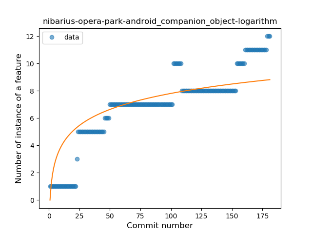
### <a name="unsafe_call">Unsafe Call</a>
----
#### Functions
* **Sudden Rise - Exponential:** 
    * **R_Squared:** 0.81429429
* **Constant Rise - Linear:** 
    * **R_Squared:** 0.21210142
* **Sudden Rise Plateau - Logarithm:** 
    * **R_Squared:** 0.03720812
* **Plateau Gradual Decline - Sigmoid:** 
    * **R_Squared:** 0.00091293

**Plots** :chart_with_upwards_trend:
-----

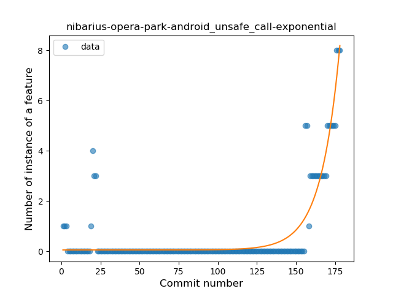
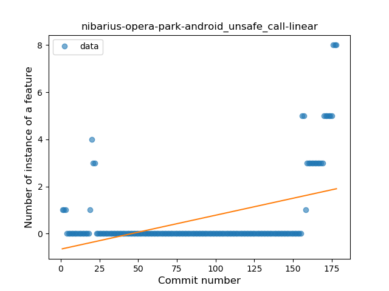
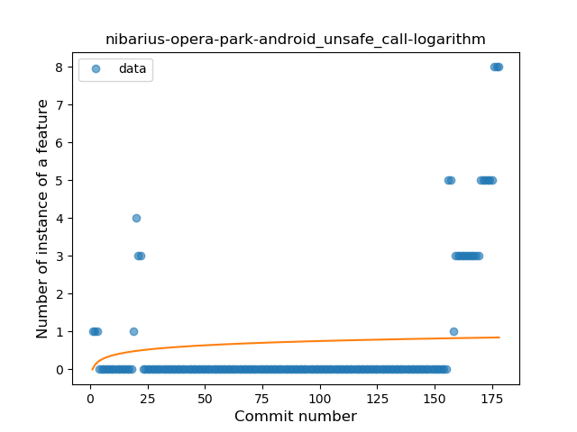
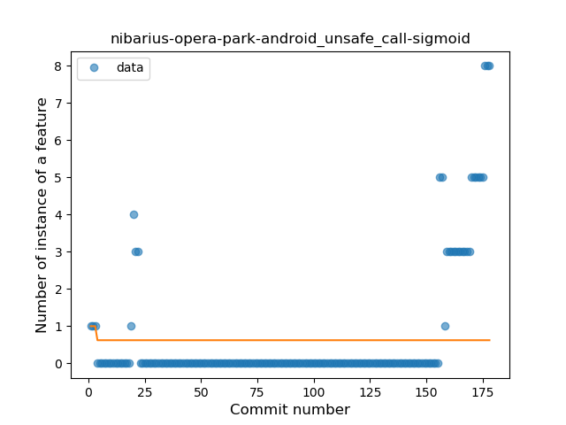
### <a name="string_template">String Template</a>
----
#### Functions
* **Sudden Rise - Exponential:** 
    * **R_Squared:** 0.83157011
* **Constant Rise - Linear:** 
    * **R_Squared:** 0.61844493
* **Sudden Rise Plateau - Logarithm:** 
    * **R_Squared:** 0.39410785

**Plots** :chart_with_upwards_trend:
-----

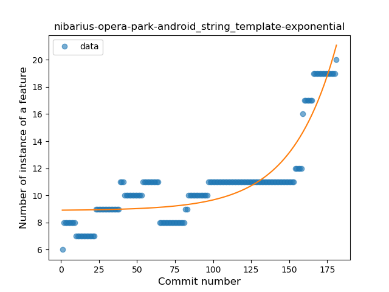
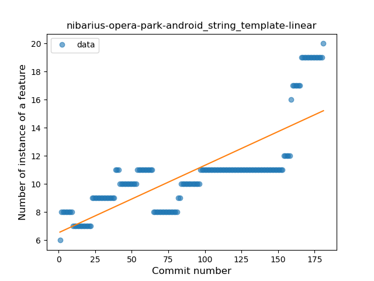
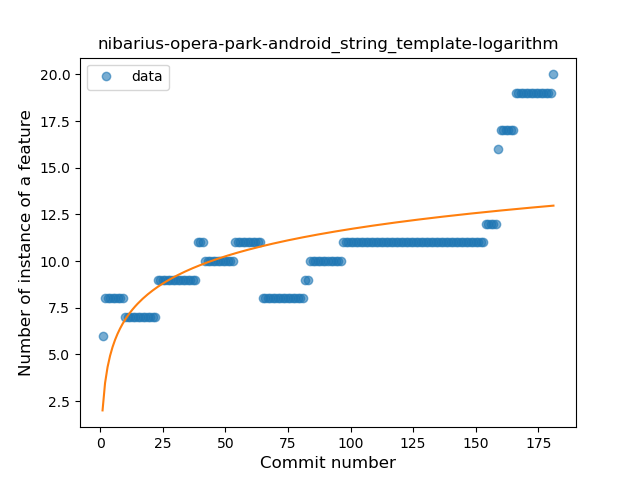
### <a name="func_with_default_value">Function with Default Value</a>
----
#### Functions
* **Plateau Gradual Rise - Sigmoid:** 
    * **R_Squared:** 0.92187999
* **Sudden Rise - Exponential:** 
    * **R_Squared:** 0.90369879
* **Constant Rise - Linear:** 
    * **R_Squared:** 0.84074853
* **Sudden Rise Plateau - Logarithm:** 
    * **R_Squared:** 0.39868098

**Plots** :chart_with_upwards_trend:
-----

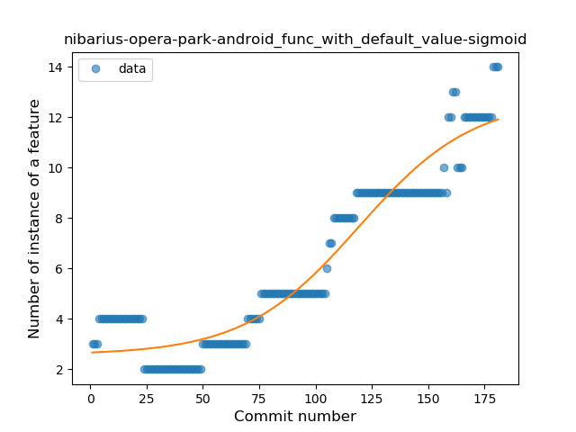
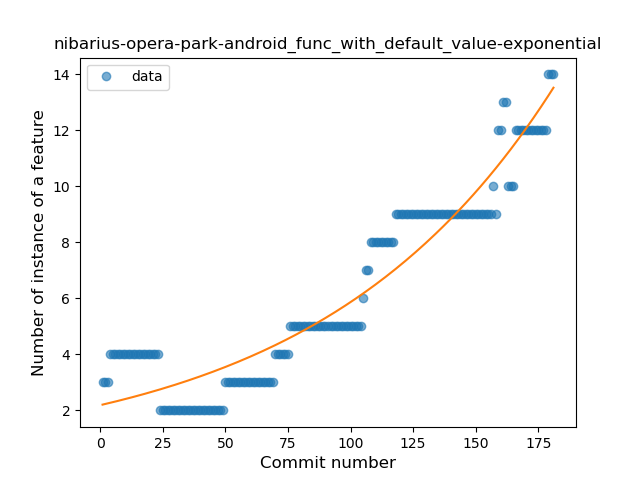
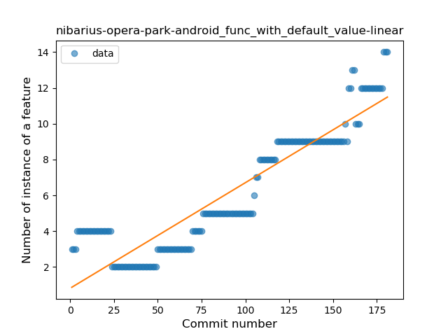
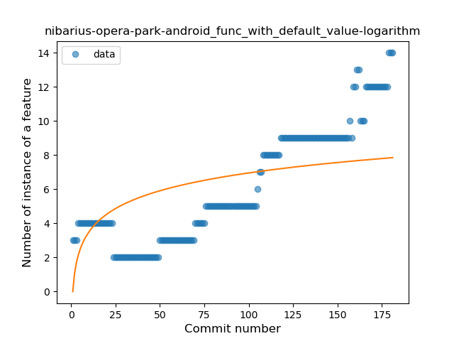
### <a name="singleton">Singleton</a>
----
#### Functions
* **Plateau Gradual Rise - Sigmoid:** 
    * **R_Squared:** 0.88410476
* **Sudden Rise Plateau - Logarithm:** 
    * **R_Squared:** 0.65488061
* **Constant Rise - Linear:** 
    * **R_Squared:** 0.57864787

**Plots** :chart_with_upwards_trend:
-----

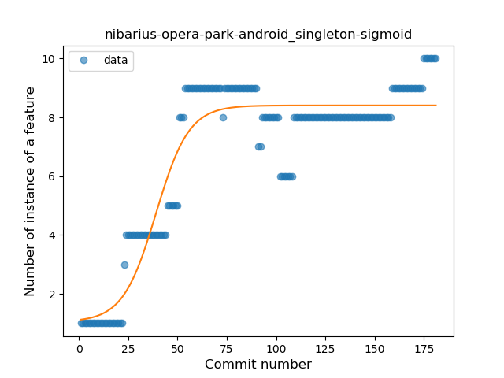
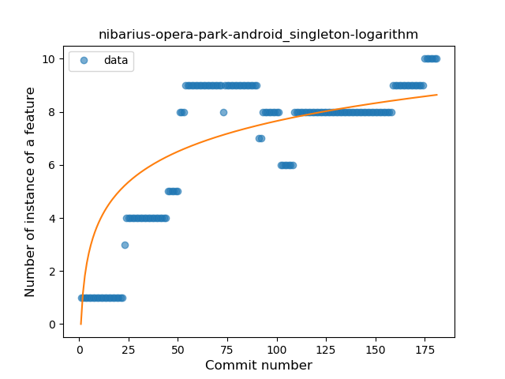

### <a name="smart_cast">Smart Cast</a>
----
#### Functions
* **Plateau Sudden Rise - Binary Sigmoid:** 
    * **R_Squared:** 0.96617217
* **Sudden Rise - Exponential:** 
    * **R_Squared:** 0.80939378
* **Constant Rise - Linear:** 
    * **R_Squared:** 0.46701809
* **Sudden Rise Plateau - Logarithm:** 
    * **R_Squared:** 0.22594121

**Plots** :chart_with_upwards_trend:
-----

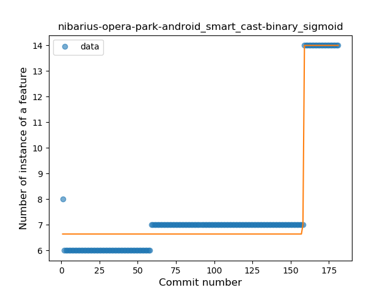
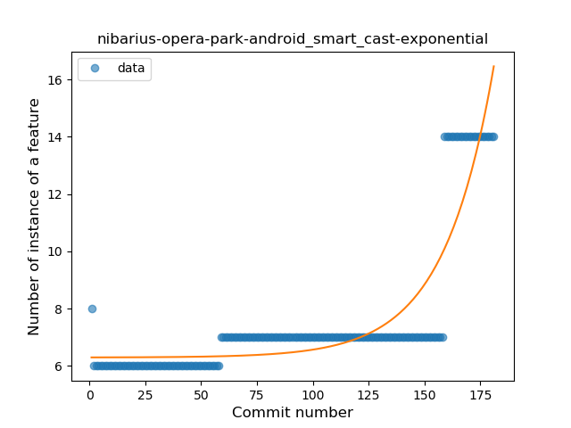
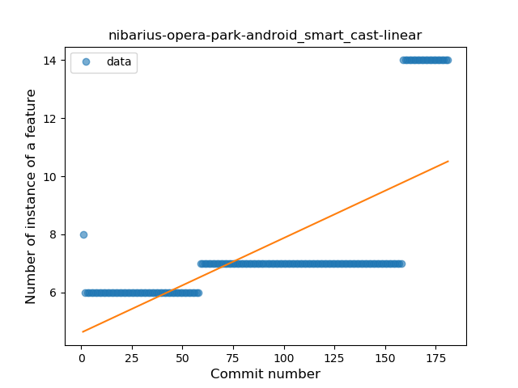
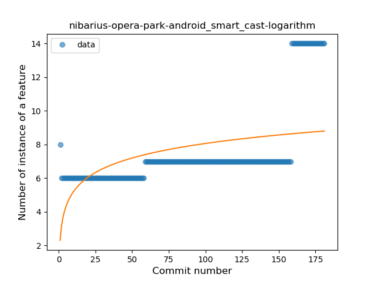
### <a name="range_expr">Range Expression</a>
----
#### Functions
* **Sudden Rise Plateau - Logarithm:** 
    * **R_Squared:** 0.92857813
* **Constant Rise - Linear:** 
    * **R_Squared:** 0.7625281

**Plots** :chart_with_upwards_trend:
-----

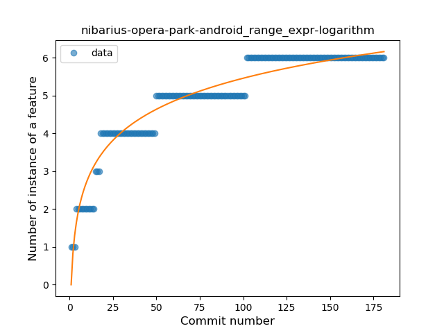
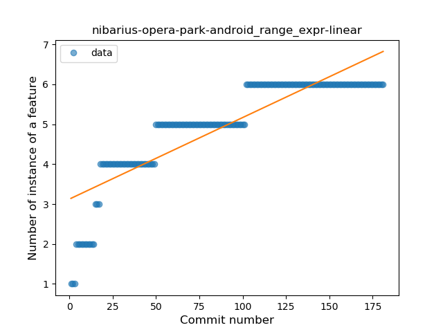
### <a name="func_call_with_named_arg">Function call with Named Argument</a>
----
#### Functions
* **Plateau Gradual Rise - Sigmoid:** 
    * **R_Squared:** 0.95508597
* **Constant Rise - Linear:** 
    * **R_Squared:** 0.86936732
* **Sudden Rise Plateau - Logarithm:** 
    * **R_Squared:** 0.72925508

**Plots** :chart_with_upwards_trend:
-----

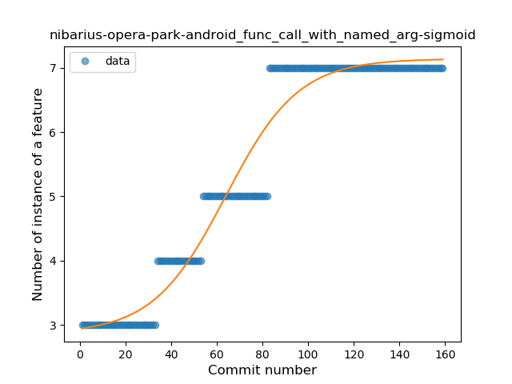
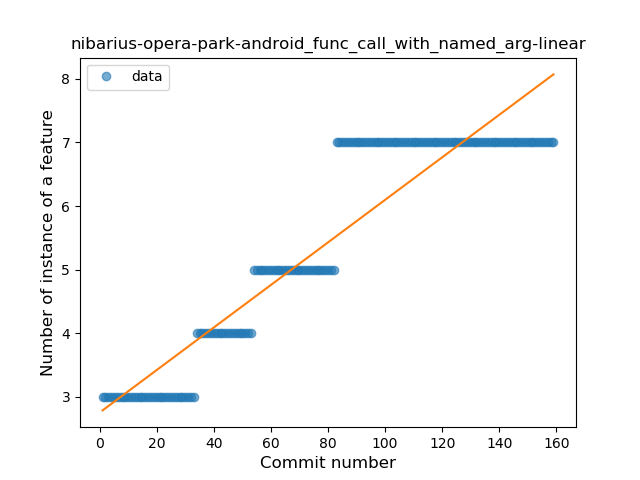
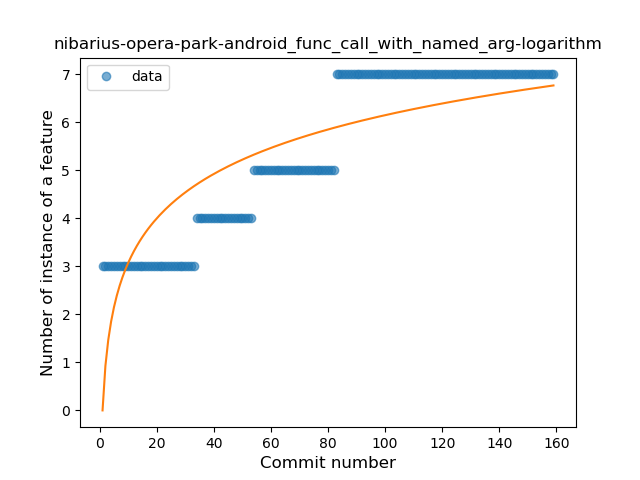
### <a name="data_class">Data Class</a>
----
#### Functions
* **Sudden Decline - Exponential:** 
    * **R_Squared:** 0.71569928
* **Constant Decline - Linear:** 
    * **R_Squared:** 0.39282248
* **Sudden Rise Plateau - Logarithm:** 
    * **R_Squared:** -0.0

**Plots** :chart_with_upwards_trend:
-----

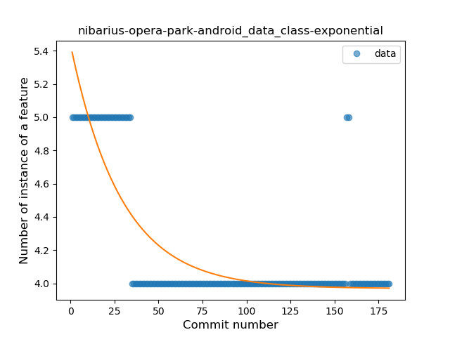
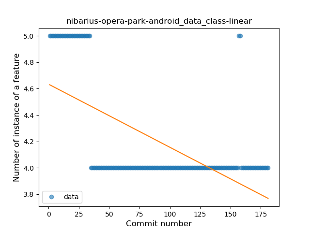
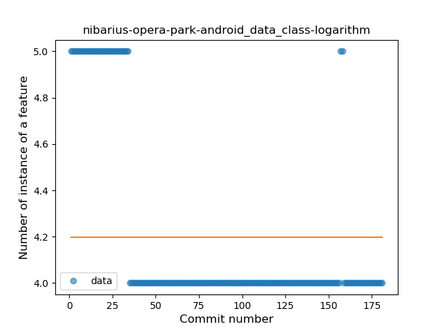
### <a name="extension_function">Extension Function</a>
----
#### Functions
* **Plateau Sudden Rise - Binary Sigmoid:** 
    * **R_Squared:** 1.0
* **Sudden Rise - Exponential:** 
    * **R_Squared:** 0.81395567
* **Instability - Polinomial 3:** )
    * **R_Squared:** 0.68564812
* **Constant Rise - Linear:** 
    * **R_Squared:** 0.21829522
* **Sudden Rise Plateau - Logarithm:** 
    * **R_Squared:** 0.09451697

**Plots** :chart_with_upwards_trend:
-----

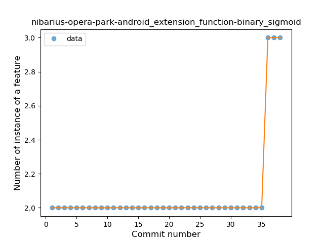

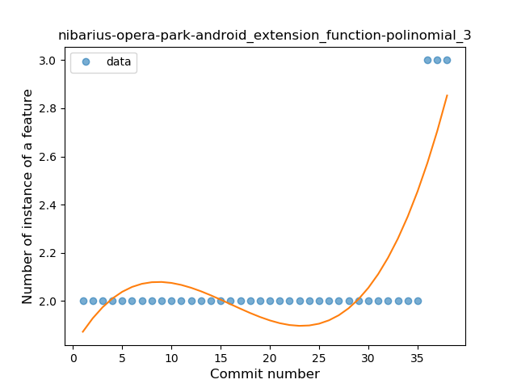
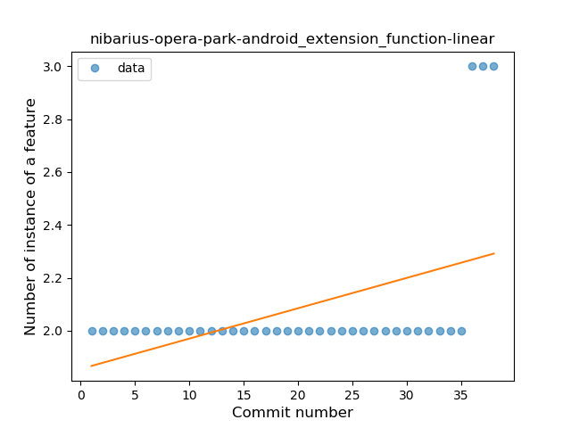
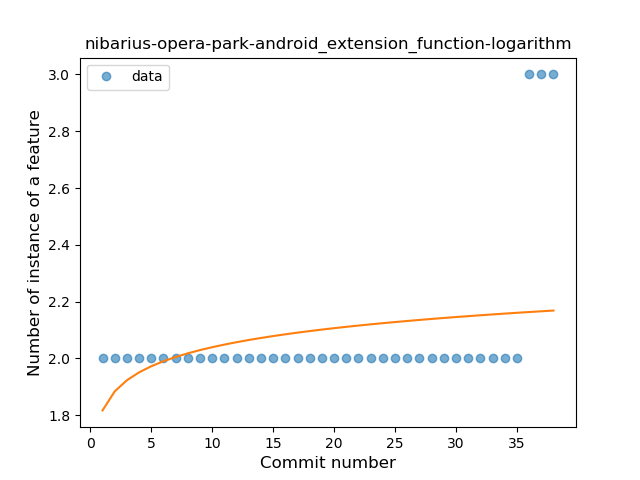
### <a name="property_delegation">Property Delegation</a>
----
#### Functions
* **Sudden Rise - Exponential:** 
    * **R_Squared:** 0.39263405
* **Sudden Rise Plateau - Logarithm:** 
    * **R_Squared:** 0.38301722
* **Plateau Sudden Rise - Binary Sigmoid:** 
    * **R_Squared:** 0.30377201
* **Constant Rise - Linear:** 
    * **R_Squared:** 0.27082588

**Plots** :chart_with_upwards_trend:
-----

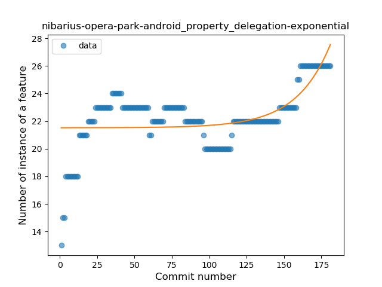
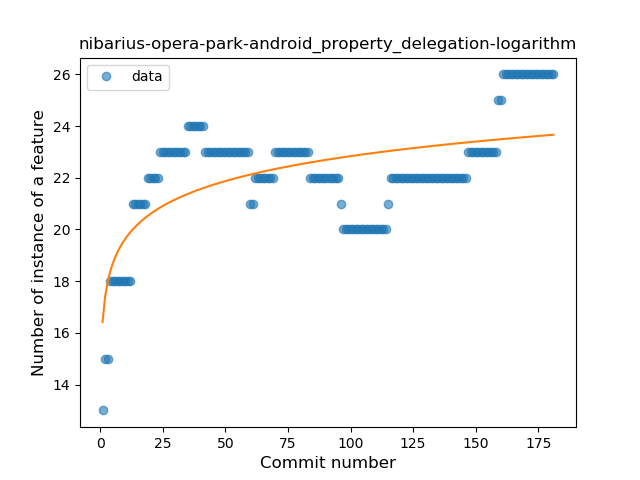
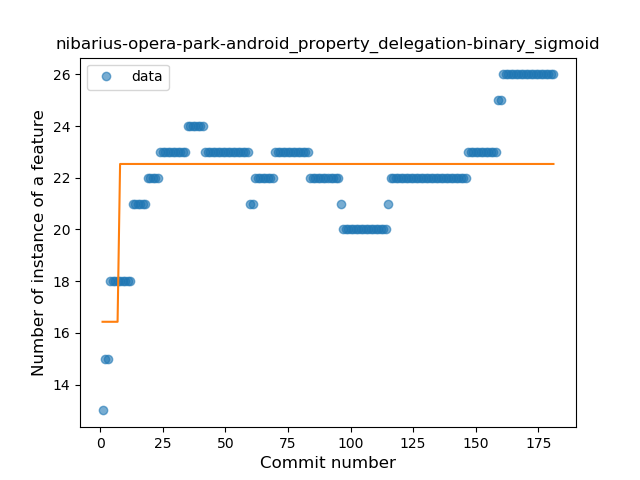
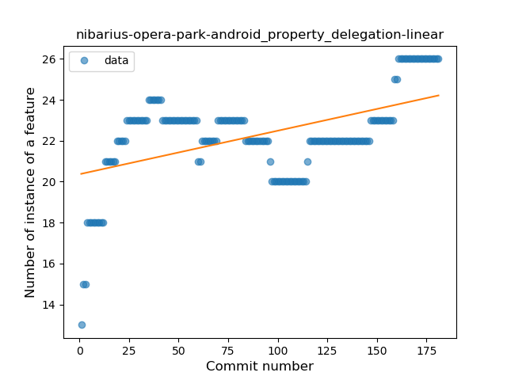
### <a name="destructuring_declaration">Destructuring Declaration</a>
----
#### Functions
* **Plateau Gradual Rise - Sigmoid:** 
    * **R_Squared:** 0.56271379
* **Sudden Rise Plateau - Logarithm:** 
    * **R_Squared:** 0.28831291
* **Constant Rise - Linear:** 
    * **R_Squared:** 0.05911418

**Plots** :chart_with_upwards_trend:
-----

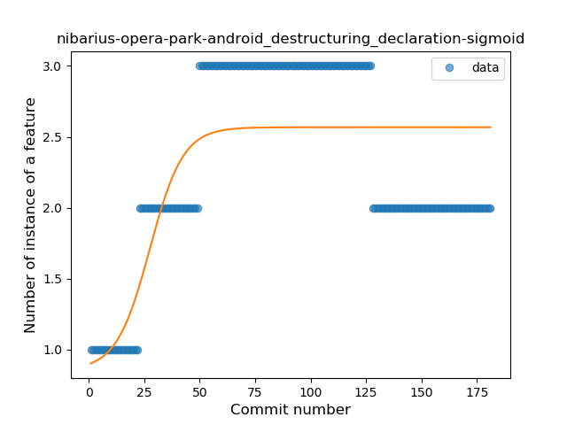
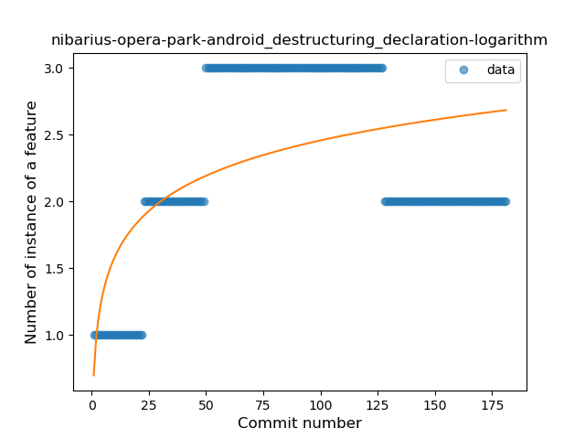
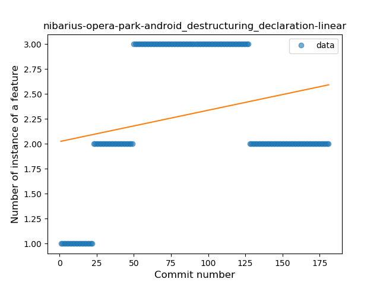
### <a name="inline_func">Inline Function</a>
----
#### Functions
* **Plateau Sudden Decline - Binary Sigmoid:** 
    * **R_Squared:** 0.81818182
* **Sudden Decline - Exponential:** 
    * **R_Squared:** 0.51442066
* **Constant Decline - Linear:** 
    * **R_Squared:** 0.2128096
* **Sudden Rise Plateau - Logarithm:** 
    * **R_Squared:** -0.0

**Plots** :chart_with_upwards_trend:
-----

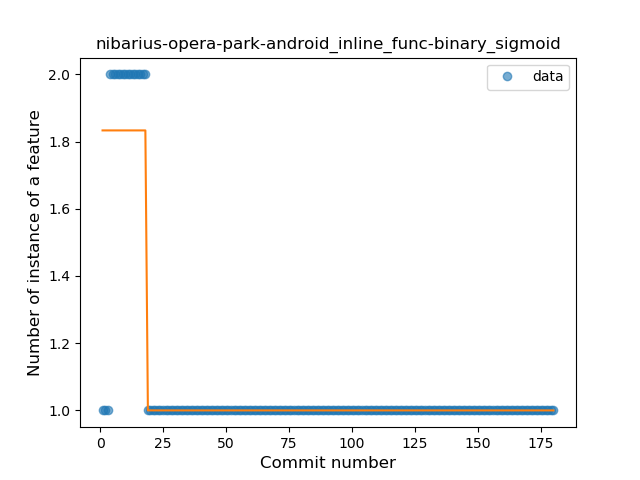
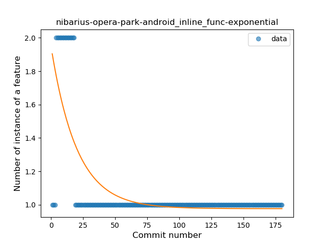
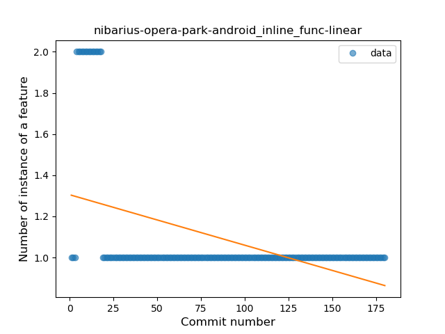
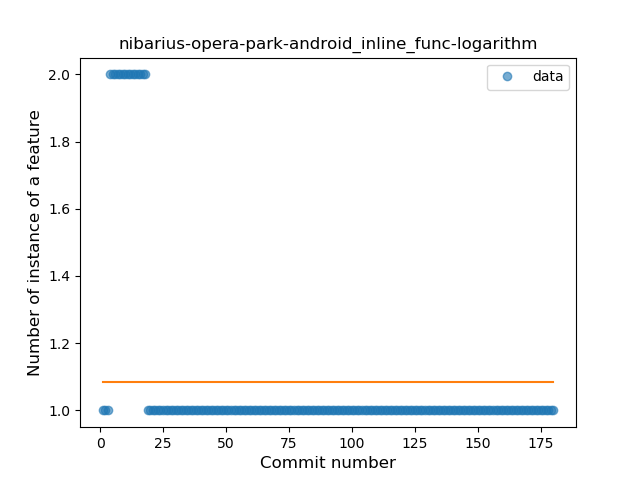
