## nicorsm-S3-16-simone
----
#### Metrics provided by Detekt
* Number of lines of code 2253
* Number of Kotlin files: 37
* Cyclomatic complexity: 248
* Cyclomatic complexity by thousands of lines: 272 

----
**11** features analyzed

*	<a href="#type_inference">Type Inference</a> 
*	<a href="#lambda">Lambda</a> 
*	<a href="#safe_call">Safe Call</a> 
*	<a href="#when_expr">When expression</a> 
*	<a href="#companion_object">Companion Object</a> 
*	<a href="#unsafe_call">Unsafe Call</a> 
*	<a href="#string_template">String Template</a> 
*	<a href="#singleton">Singleton</a> 
*	<a href="#range_expr">Range Expression</a> 
*	<a href="#extension_function">Extension Function</a> 
*	<a href="#property_delegation">Property Delegation</a> 

### <a name="type_inference">Type Inference</a>
----
#### Functions
* **Constant Rise - Linear:** 
    * **R_Squared:** 0.86272108
* **Sudden Rise Plateau - Logarithm:** 
    * **R_Squared:** 0.65538478
* **Plateau Sudden Rise - Binary Sigmoid:** 
    * **R_Squared:** 0.65796524

**Plots** :chart_with_upwards_trend:
-----

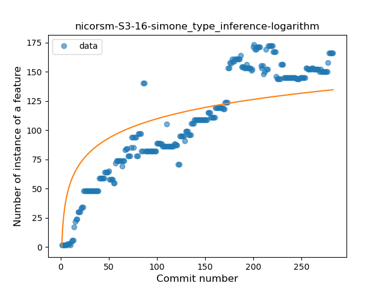
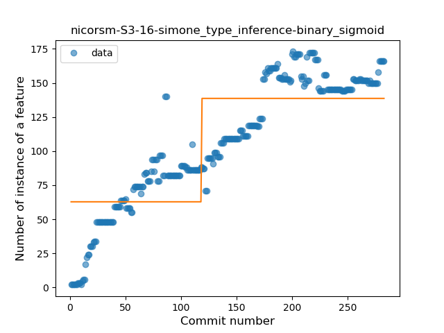
### <a name="lambda">Lambda</a>
----
#### Functions
* **Sudden Rise Plateau - Logarithm:** 
    * **R_Squared:** 0.66118528
* **Constant Rise - Linear:** 
    * **R_Squared:** 0.43707677
* **Plateau Sudden Rise - Binary Sigmoid:** 
    * **R_Squared:** 0.41930927

**Plots** :chart_with_upwards_trend:
-----

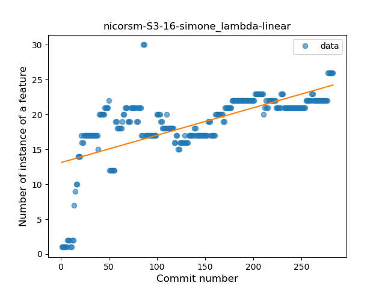

### <a name="safe_call">Safe Call</a>
----
#### Functions
* **Constant Rise - Linear:** 
    * **R_Squared:** 0.87190593
* **Sudden Rise - Exponential:** 
    * **R_Squared:** 0.87475588
* **Sudden Rise Plateau - Logarithm:** 
    * **R_Squared:** 0.41689052
* **Plateau Gradual Rise - Sigmoid:** 
    * **R_Squared:** 0.34840529

**Plots** :chart_with_upwards_trend:
-----

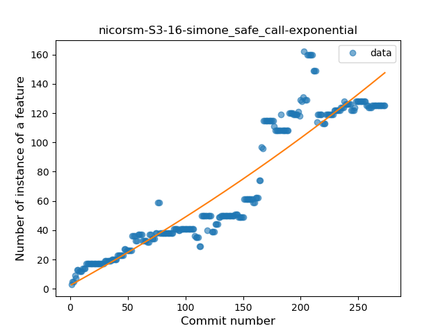
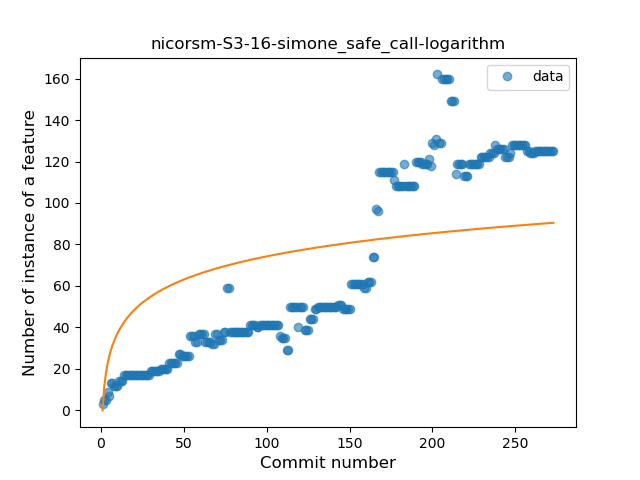
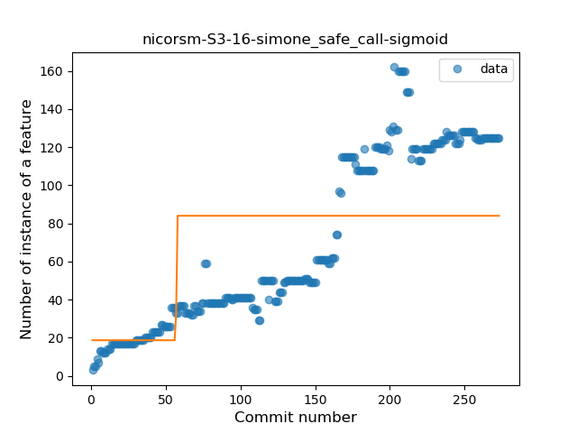
### <a name="when_expr">When expression</a>
----
#### Functions
* **Constant Rise - Linear:** 
    * **R_Squared:** 0.6532015
* **Sudden Rise Plateau - Logarithm:** 
    * **R_Squared:** 0.50277215

**Plots** :chart_with_upwards_trend:
-----

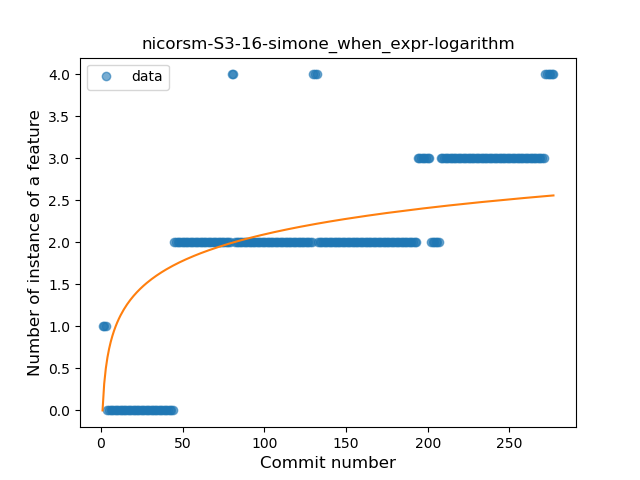
### <a name="companion_object">Companion Object</a>
----
#### Functions
* **Constant Rise - Linear:** 
    * **R_Squared:** 0.92588713
* **Plateau Gradual Rise - Sigmoid:** 
    * **R_Squared:** 0.93059371
* **Sudden Rise Plateau - Logarithm:** 
    * **R_Squared:** 0.55110589

**Plots** :chart_with_upwards_trend:
-----

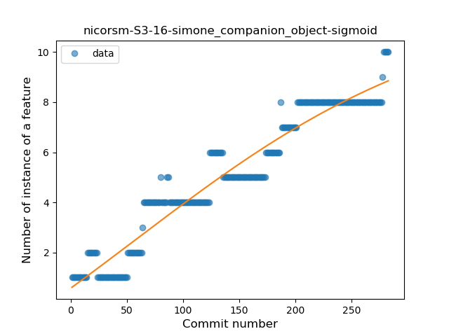
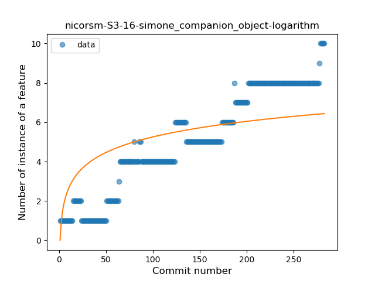
### <a name="unsafe_call">Unsafe Call</a>
----
#### Functions
* **Sudden Rise - Exponential:** 
    * **R_Squared:** 0.31687842
* **Constant Rise - Linear:** 
    * **R_Squared:** 0.26378201
* **Sudden Rise Plateau - Logarithm:** 
    * **R_Squared:** 0.18363028

**Plots** :chart_with_upwards_trend:
-----

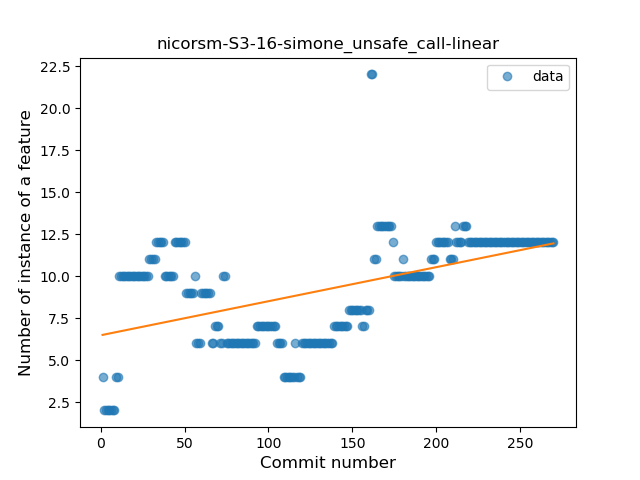

### <a name="string_template">String Template</a>
----
#### Functions
* **Plateau Sudden Decline - Binary Sigmoid:** 
    * **R_Squared:** 1.0
* **Sudden Decline - Exponential:** 
    * **R_Squared:** 0.75503655
* **Constant Decline - Linear:** 
    * **R_Squared:** 0.70456664
* **Sudden Rise Plateau - Logarithm:** 
    * **R_Squared:** -0.0

**Plots** :chart_with_upwards_trend:
-----

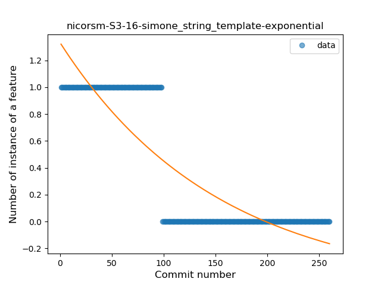
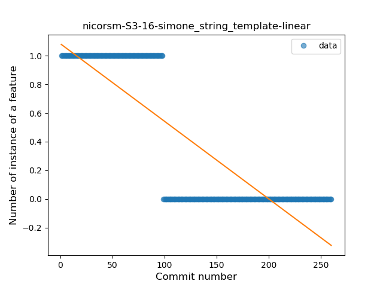
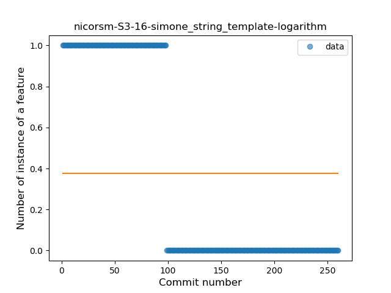
### <a name="singleton">Singleton</a>
----
#### Functions
* **Plateau Gradual Rise - Sigmoid:** 
    * **R_Squared:** 0.90670086
* **Sudden Rise - Exponential:** 
    * **R_Squared:** 0.88972781
* **Constant Rise - Linear:** 
    * **R_Squared:** 0.71422476
* **Sudden Rise Plateau - Logarithm:** 
    * **R_Squared:** 0.38483619

**Plots** :chart_with_upwards_trend:
-----

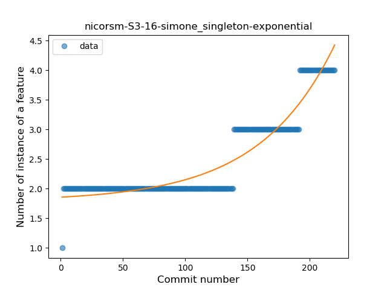
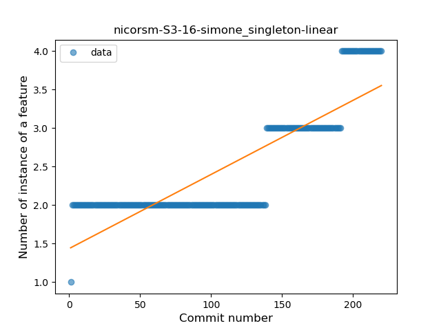

### <a name="range_expr">Range Expression</a>
----
#### Functions
* **Plateau Sudden Decline - Binary Sigmoid:** 
    * **R_Squared:** 1.0
* **Sudden Decline - Exponential:** 
    * **R_Squared:** 0.76881603
* **Constant Decline - Linear:** 
    * **R_Squared:** 0.57613959
* **Sudden Rise Plateau - Logarithm:** 
    * **R_Squared:** -0.0

**Plots** :chart_with_upwards_trend:
-----

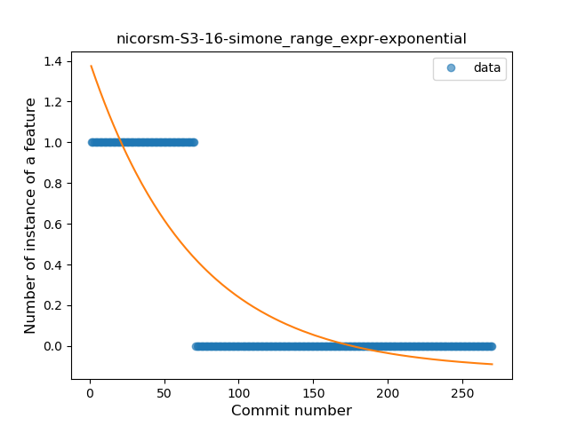
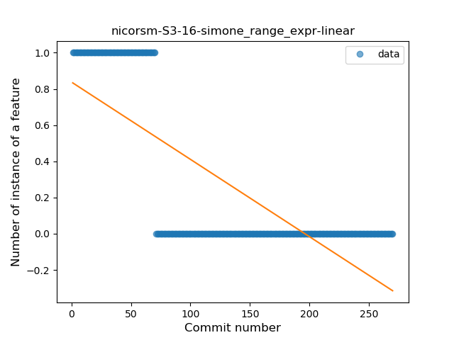
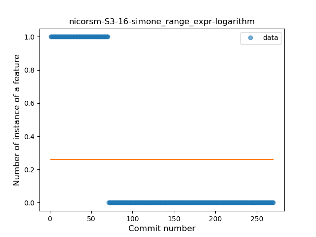
### <a name="extension_function">Extension Function</a>
----
#### Functions
* **Constant Decline - Linear:** 
    * **R_Squared:** 0.703346
* **Sudden Rise Plateau - Logarithm:** 
    * **R_Squared:** -0.0

**Plots** :chart_with_upwards_trend:
-----

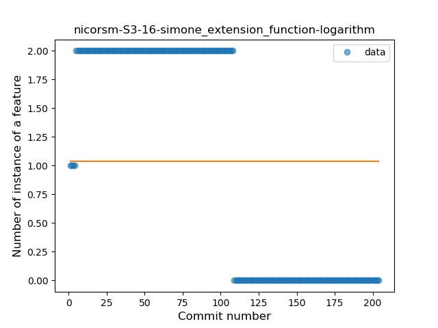
### <a name="property_delegation">Property Delegation</a>
----
#### Functions
* **Plateau Sudden Rise - Binary Sigmoid:** 
    * **R_Squared:** 0.98133224
* **Sudden Rise - Exponential:** 
    * **R_Squared:** 0.75110567
* **Constant Rise - Linear:** 
    * **R_Squared:** 0.70497112
* **Sudden Rise Plateau - Logarithm:** 
    * **R_Squared:** 0.42885084

**Plots** :chart_with_upwards_trend:
-----

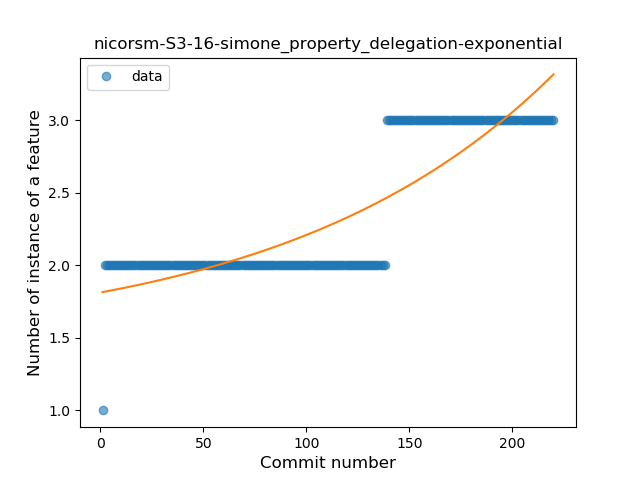
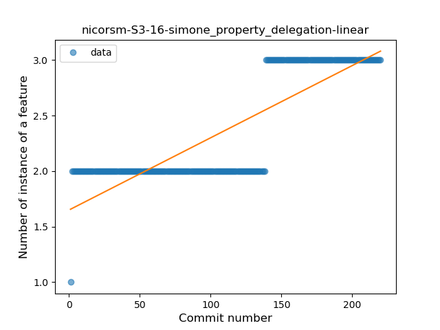
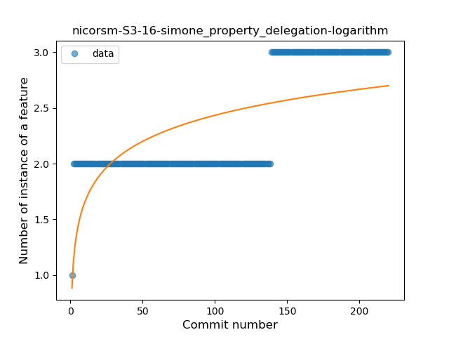
