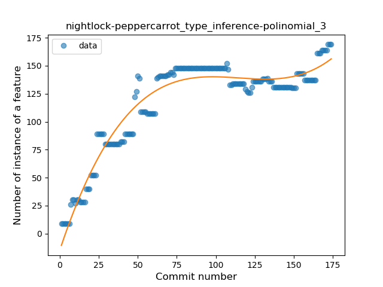
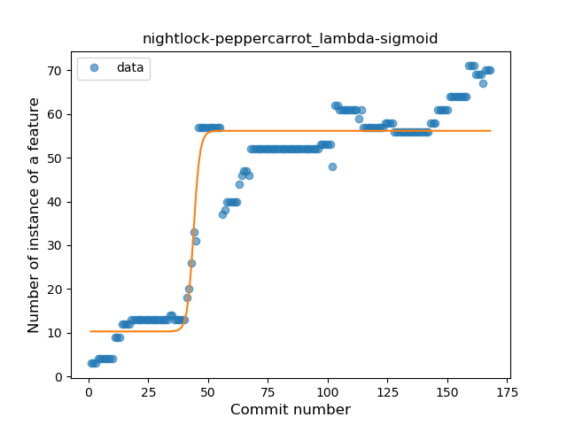
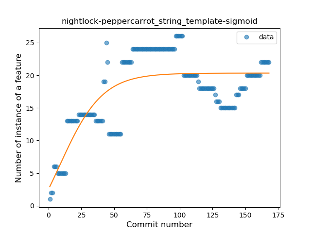
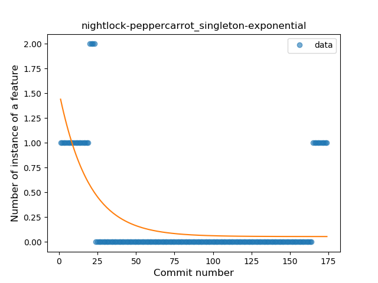

## nightlock-peppercarrot
----
#### Metrics provided by Detekt
* Number of lines of code 2525
* Number of Kotlin files: 31
* Cyclomatic complexity: 248
* Cyclomatic complexity by thousands of lines: 251 

----
**13** features analyzed

*	<a href="#type_inference">Type Inference</a> 
*	<a href="#lambda">Lambda</a> 
*	<a href="#safe_call">Safe Call</a> 
*	<a href="#when_expr">When expression</a> 
*	<a href="#unsafe_call">Unsafe Call</a> 
*	<a href="#companion_object">Companion Object</a> 
*	<a href="#string_template">String Template</a> 
*	<a href="#singleton">Singleton</a> 
*	<a href="#range_expr">Range Expression</a> 
*	<a href="#smart_cast">Smart Cast</a> 
*	<a href="#data_class">Data Class</a> 
*	<a href="#func_call_with_named_arg">Function call with Named Argument</a> 
*	<a href="#property_delegation">Property Delegation</a> 

### <a name="type_inference">Type Inference</a>
----
#### Functions
* **Instability - Polinomial 3:** )
    * **R_Squared:** 0.93078699
* **Sudden Rise Plateau - Logarithm:** 
    * **R_Squared:** 0.76767242
* **Constant Rise - Linear:** 
    * **R_Squared:** 0.62081285
* **Plateau Sudden Rise - Binary Sigmoid:** 
    * **R_Squared:** 0.14508624

**Plots** :chart_with_upwards_trend:
-----

### <a name="lambda">Lambda</a>
----
#### Functions
* **Plateau Gradual Rise - Sigmoid:** 
    * **R_Squared:** 0.90546549
* **Constant Rise - Linear:** 
    * **R_Squared:** 0.76894219
* **Sudden Rise Plateau - Logarithm:** 
    * **R_Squared:** 0.64366451

**Plots** :chart_with_upwards_trend:
-----

### <a name="safe_call">Safe Call</a>
----
#### Functions
* **Plateau Gradual Rise - Sigmoid:** 
    * **R_Squared:** 0.55322278
* **Sudden Rise Plateau - Logarithm:** 
    * **R_Squared:** 0.2838724
* **Constant Rise - Linear:** 
    * **R_Squared:** 0.06645629

**Plots** :chart_with_upwards_trend:
-----

### <a name="when_expr">When expression</a>
----
#### Functions
* **Plateau Gradual Rise - Sigmoid:** 
    * **R_Squared:** 0.90785243
* **Sudden Rise - Exponential:** 
    * **R_Squared:** 0.79429236
* **Constant Rise - Linear:** 
    * **R_Squared:** 0.77399747
* **Sudden Rise Plateau - Logarithm:** 
    * **R_Squared:** 0.28759278

**Plots** :chart_with_upwards_trend:
-----

### <a name="unsafe_call">Unsafe Call</a>
----
#### Functions
* **Sudden Rise - Exponential:** 
    * **R_Squared:** 0.55474131
* **Constant Rise - Linear:** 
    * **R_Squared:** 0.54051895
* **Sudden Rise Plateau - Logarithm:** 
    * **R_Squared:** 0.47598225

**Plots** :chart_with_upwards_trend:
-----

### <a name="companion_object">Companion Object</a>
----
#### Functions
* **Plateau Gradual Rise - Sigmoid:** 
    * **R_Squared:** 0.92294532
* **Sudden Rise Plateau - Logarithm:** 
    * **R_Squared:** 0.81211572
* **Constant Rise - Linear:** 
    * **R_Squared:** 0.70154384

**Plots** :chart_with_upwards_trend:
-----

### <a name="string_template">String Template</a>
----
#### Functions
* **Plateau Gradual Rise - Sigmoid:** 
    * **R_Squared:** 0.60445047
* **Sudden Rise Plateau - Logarithm:** 
    * **R_Squared:** 0.50338011
* **Constant Rise - Linear:** 
    * **R_Squared:** 0.25857761

**Plots** :chart_with_upwards_trend:
-----

### <a name="singleton">Singleton</a>
----
#### Functions
* **Sudden Decline - Exponential:** 
    * **R_Squared:** 0.40965454
* **Constant Decline - Linear:** 
    * **R_Squared:** 0.08549276
* **Sudden Rise Plateau - Logarithm:** 
    * **R_Squared:** -0.0

**Plots** :chart_with_upwards_trend:
-----

### <a name="range_expr">Range Expression</a>
----
#### Functions
* **Plateau Gradual Rise - Sigmoid:** 
    * **R_Squared:** 0.91454883
* **Sudden Rise Plateau - Logarithm:** 
    * **R_Squared:** 0.76472392
* **Constant Rise - Linear:** 
    * **R_Squared:** 0.43137231

**Plots** :chart_with_upwards_trend:
-----

### <a name="smart_cast">Smart Cast</a>
----
#### Functions
* **Plateau Gradual Rise - Sigmoid:** 
    * **R_Squared:** 0.57502633
* **Sudden Rise Plateau - Logarithm:** 
    * **R_Squared:** 0.52534533
* **Constant Rise - Linear:** 
    * **R_Squared:** 0.49587193

**Plots** :chart_with_upwards_trend:
-----

### <a name="data_class">Data Class</a>
----
#### Functions
* **Plateau Sudden Rise - Binary Sigmoid:** 
    * **R_Squared:** 1.0
* **Sudden Rise Plateau - Logarithm:** 
    * **R_Squared:** 0.65777874
* **Constant Rise - Linear:** 
    * **R_Squared:** 0.40105263

**Plots** :chart_with_upwards_trend:
-----

### <a name="func_call_with_named_arg">Function call with Named Argument</a>
----
#### Functions
* **Sudden Decline - Exponential:** 
    * **R_Squared:** 0.56339696
* **Constant Decline - Linear:** 
    * **R_Squared:** 0.35111115
* **Sudden Rise Plateau - Logarithm:** 
    * **R_Squared:** -0.0

**Plots** :chart_with_upwards_trend:
-----

### <a name="property_delegation">Property Delegation</a>
----
#### Functions
* **Plateau Gradual Rise - Sigmoid:** 
    * **R_Squared:** 0.83516081
* **Sudden Rise Plateau - Logarithm:** 
    * **R_Squared:** 0.53735384
* **Constant Rise - Linear:** 
    * **R_Squared:** 0.24827664

**Plots** :chart_with_upwards_trend:
-----

