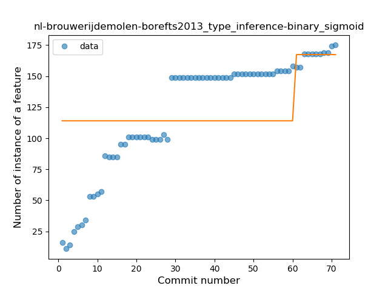
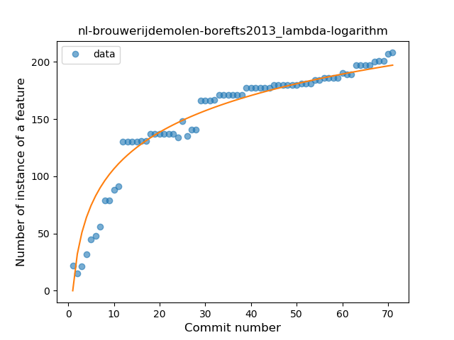
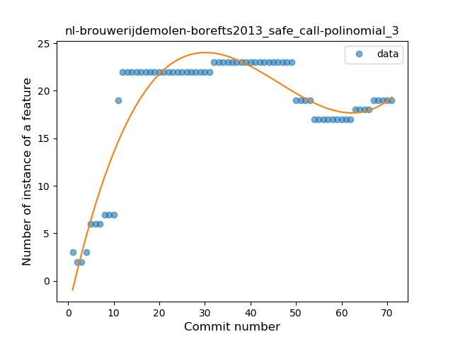
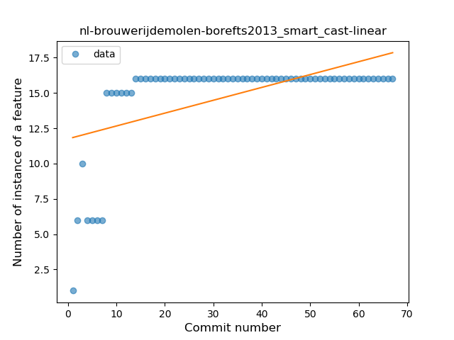
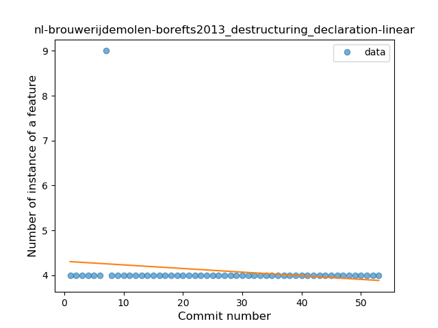
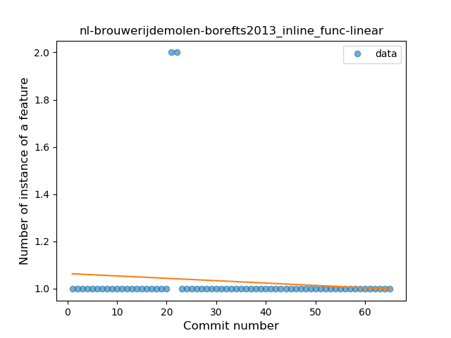
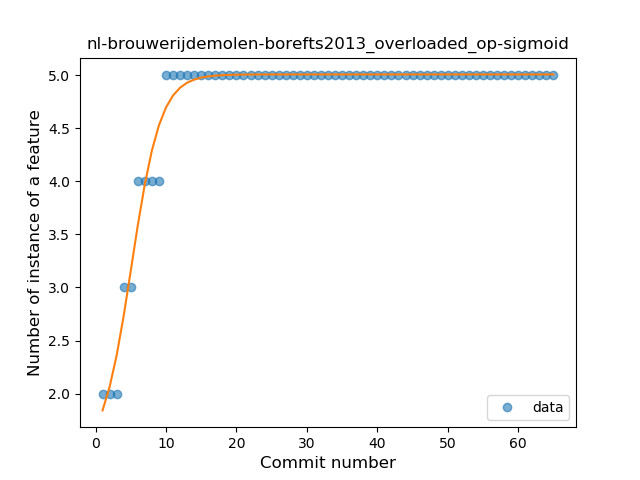
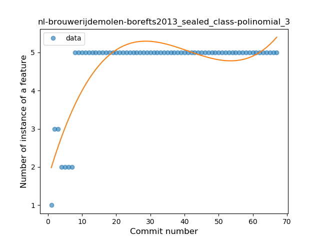

## nl-brouwerijdemolen-borefts2013
----
#### Metrics provided by Detekt
* Number of lines of code 3206
* Number of Kotlin files: 63
* Cyclomatic complexity: 371
* Cyclomatic complexity by thousands of lines: 248 

----
**19** features analyzed

*	<a href="#type_inference">Type Inference</a> 
*	<a href="#lambda">Lambda</a> 
*	<a href="#safe_call">Safe Call</a> 
*	<a href="#when_expr">When expression</a> 
*	<a href="#unsafe_call">Unsafe Call</a> 
*	<a href="#companion_object">Companion Object</a> 
*	<a href="#string_template">String Template</a> 
*	<a href="#func_with_default_value">Function with Default Value</a> 
*	<a href="#singleton">Singleton</a> 
*	<a href="#smart_cast">Smart Cast</a> 
*	<a href="#data_class">Data Class</a> 
*	<a href="#func_call_with_named_arg">Function call with Named Argument</a> 
*	<a href="#extension_function">Extension Function</a> 
*	<a href="#property_delegation">Property Delegation</a> 
*	<a href="#destructuring_declaration">Destructuring Declaration</a> 
*	<a href="#inline_func">Inline Function</a> 
*	<a href="#overloaded_op">Overloaded Operator</a> 
*	<a href="#coroutine">Coroutine</a> 
*	<a href="#sealed_class">Sealed Class</a> 

### <a name="type_inference">Type Inference</a>
----
#### Functions
* **Sudden Rise Plateau - Logarithm:** 
    * **R_Squared:** 0.87262393
* **Constant Rise - Linear:** 
    * **R_Squared:** 0.82093491
* **Plateau Sudden Rise - Binary Sigmoid:** 
    * **R_Squared:** 0.17659594

**Plots** :chart_with_upwards_trend:
-----

### <a name="lambda">Lambda</a>
----
#### Functions
* **Sudden Rise Plateau - Logarithm:** 
    * **R_Squared:** 0.94116589
* **Constant Rise - Linear:** 
    * **R_Squared:** 0.78871009

**Plots** :chart_with_upwards_trend:
-----

### <a name="safe_call">Safe Call</a>
----
#### Functions
* **Instability - Polinomial 3:** )
    * **R_Squared:** 0.86874884
* **Sudden Rise Plateau - Logarithm:** 
    * **R_Squared:** 0.45902145
* **Plateau Sudden Rise - Binary Sigmoid:** 
    * **R_Squared:** 0.33650925
* **Constant Rise - Linear:** 
    * **R_Squared:** 0.14445514

**Plots** :chart_with_upwards_trend:
-----

### <a name="when_expr">When expression</a>
----
#### Functions
* **Instability - Polinomial 3:** )
    * **R_Squared:** 0.92991593
* **Sudden Rise Plateau - Logarithm:** 
    * **R_Squared:** 0.7940597
* **Constant Rise - Linear:** 
    * **R_Squared:** 0.41355119

**Plots** :chart_with_upwards_trend:
-----

### <a name="unsafe_call">Unsafe Call</a>
----
#### Functions
* **Plateau Gradual Rise - Sigmoid:** 
    * **R_Squared:** 0.95938547
* **Constant Rise - Linear:** 
    * **R_Squared:** 0.76767691
* **Sudden Rise Plateau - Logarithm:** 
    * **R_Squared:** 0.69806653

**Plots** :chart_with_upwards_trend:
-----

### <a name="companion_object">Companion Object</a>
----
#### Functions
* **Plateau Gradual Rise - Sigmoid:** 
    * **R_Squared:** 0.98468265
* **Instability - Polinomial 3:** )
    * **R_Squared:** 0.88464555
* **Sudden Rise Plateau - Logarithm:** 
    * **R_Squared:** 0.71391945
* **Constant Rise - Linear:** 
    * **R_Squared:** 0.33947223

**Plots** :chart_with_upwards_trend:
-----

### <a name="string_template">String Template</a>
----
#### Functions
* **Sudden Rise - Exponential:** 
    * **R_Squared:** 0.7240033
* **Constant Rise - Linear:** 
    * **R_Squared:** 0.70021038
* **Sudden Rise Plateau - Logarithm:** 
    * **R_Squared:** 0.57621003

**Plots** :chart_with_upwards_trend:
-----

### <a name="func_with_default_value">Function with Default Value</a>
----
#### Functions
* **Instability - Polinomial 3:** )
    * **R_Squared:** 0.85669415
* **Sudden Rise Plateau - Logarithm:** 
    * **R_Squared:** 0.73548331
* **Constant Rise - Linear:** 
    * **R_Squared:** 0.51980361
* **Plateau Sudden Rise - Binary Sigmoid:** 
    * **R_Squared:** 0.10972762

**Plots** :chart_with_upwards_trend:
-----

### <a name="singleton">Singleton</a>
----
#### Functions
* **Instability - Polinomial 3:** )
    * **R_Squared:** 0.94584728
* **Sudden Rise Plateau - Logarithm:** 
    * **R_Squared:** 0.86144866
* **Constant Rise - Linear:** 
    * **R_Squared:** 0.61255672

**Plots** :chart_with_upwards_trend:
-----

### <a name="smart_cast">Smart Cast</a>
----
#### Functions
* **Plateau Gradual Rise - Sigmoid:** 
    * **R_Squared:** 0.93307917
* **Instability - Polinomial 3:** )
    * **R_Squared:** 0.79587618
* **Sudden Rise Plateau - Logarithm:** 
    * **R_Squared:** 0.65462627
* **Constant Rise - Linear:** 
    * **R_Squared:** 0.30628819

**Plots** :chart_with_upwards_trend:
-----

### <a name="data_class">Data Class</a>
----
#### Functions
* **Instability - Polinomial 3:** )
    * **R_Squared:** 0.84259209
* **Sudden Rise Plateau - Logarithm:** 
    * **R_Squared:** 0.69735656
* **Constant Rise - Linear:** 
    * **R_Squared:** 0.33539754

**Plots** :chart_with_upwards_trend:
-----

### <a name="func_call_with_named_arg">Function call with Named Argument</a>
----
#### Functions
* **Plateau Gradual Rise - Sigmoid:** 
    * **R_Squared:** 0.74235096
* **Sudden Rise Plateau - Logarithm:** 
    * **R_Squared:** 0.61499314
* **Constant Rise - Linear:** 
    * **R_Squared:** 0.44112452

**Plots** :chart_with_upwards_trend:
-----

### <a name="extension_function">Extension Function</a>
----
#### Functions
* **Instability - Polinomial 3:** )
    * **R_Squared:** 0.91510869
* **Sudden Rise Plateau - Logarithm:** 
    * **R_Squared:** 0.69058898
* **Constant Rise - Linear:** 
    * **R_Squared:** 0.30752841

**Plots** :chart_with_upwards_trend:
-----

### <a name="property_delegation">Property Delegation</a>
----
#### Functions
* **Sudden Rise Plateau - Logarithm:** 
    * **R_Squared:** 0.80641037
* **Constant Rise - Linear:** 
    * **R_Squared:** 0.74892113
* **Plateau Sudden Rise - Binary Sigmoid:** 
    * **R_Squared:** 0.5854418

**Plots** :chart_with_upwards_trend:
-----

### <a name="destructuring_declaration">Destructuring Declaration</a>
----
#### Functions
* **Constant Decline - Linear:** 
    * **R_Squared:** 0.03287311
* **Sudden Decline - Exponential:** 
    * **R_Squared:** 0.04116946
* **Sudden Rise Plateau - Logarithm:** 
    * **R_Squared:** -0.0

**Plots** :chart_with_upwards_trend:
-----

### <a name="inline_func">Inline Function</a>
----
#### Functions
* **Constant Decline - Linear:** 
    * **R_Squared:** 0.01192731
* **Sudden Rise Plateau - Logarithm:** 
    * **R_Squared:** -0.0

**Plots** :chart_with_upwards_trend:
-----

### <a name="overloaded_op">Overloaded Operator</a>
----
#### Functions
* **Plateau Gradual Rise - Sigmoid:** 
    * **R_Squared:** 0.97270489
* **Instability - Polinomial 3:** )
    * **R_Squared:** 0.85431065
* **Sudden Rise Plateau - Logarithm:** 
    * **R_Squared:** 0.68983245
* **Constant Rise - Linear:** 
    * **R_Squared:** 0.30992598

**Plots** :chart_with_upwards_trend:
-----

### <a name="coroutine">Coroutine</a>
----
#### Functions
* **Sudden Rise Plateau - Logarithm:** 
    * **R_Squared:** 0.87664243
* **Constant Rise - Linear:** 
    * **R_Squared:** 0.78421561

**Plots** :chart_with_upwards_trend:
-----

### <a name="sealed_class">Sealed Class</a>
----
#### Functions
* **Plateau Sudden Rise - Binary Sigmoid:** 
    * **R_Squared:** 0.94711918
* **Instability - Polinomial 3:** )
    * **R_Squared:** 0.72208602
* **Sudden Rise Plateau - Logarithm:** 
    * **R_Squared:** 0.57855213
* **Constant Rise - Linear:** 
    * **R_Squared:** 0.26590244

**Plots** :chart_with_upwards_trend:
-----

