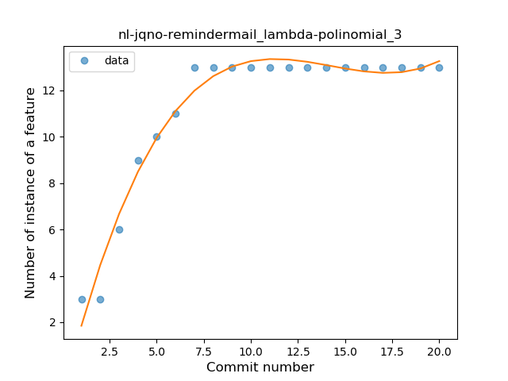
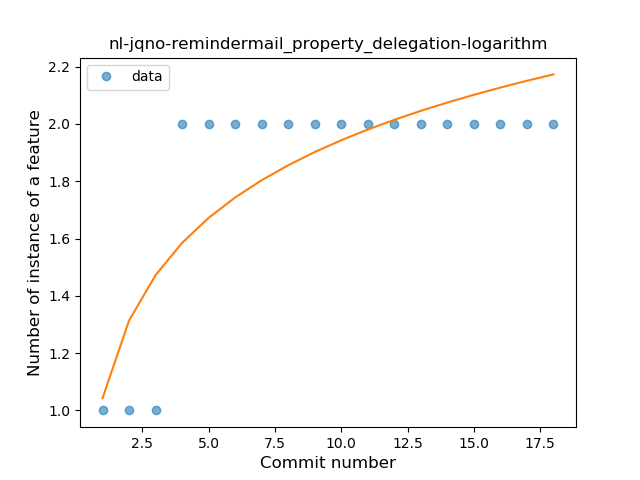

## nl-jqno-remindermail
----
#### Metrics provided by Detekt
* Number of lines of code 341
* Number of Kotlin files: 6
* Cyclomatic complexity: 56
* Cyclomatic complexity by thousands of lines: 309 

----
**6** features analyzed

*	<a href="#type_inference">Type Inference</a> 
*	<a href="#lambda">Lambda</a> 
*	<a href="#safe_call">Safe Call</a> 
*	<a href="#unsafe_call">Unsafe Call</a> 
*	<a href="#string_template">String Template</a> 
*	<a href="#property_delegation">Property Delegation</a> 

### <a name="type_inference">Type Inference</a>
----
#### Functions
* **Instability - Polinomial 3:** )
    * **R_Squared:** 0.97329466
* **Instability - Polinomial 4:** 
    * **R_Squared:** 0.97855708
* **Sudden Rise Plateau - Logarithm:** 
    * **R_Squared:** 0.85557847
* **Constant Rise - Linear:** 
    * **R_Squared:** 0.59447013

**Plots** :chart_with_upwards_trend:
-----

### <a name="lambda">Lambda</a>
----
#### Functions
* **Instability - Polinomial 3:** )
    * **R_Squared:** 0.97205073
* **Sudden Rise Plateau - Logarithm:** 
    * **R_Squared:** 0.84773726
* **Constant Rise - Linear:** 
    * **R_Squared:** 0.56888939

**Plots** :chart_with_upwards_trend:
-----

### <a name="safe_call">Safe Call</a>
----
#### Functions
* **Instability - Polinomial 4:** 
    * **R_Squared:** 0.98556049
* **Instability - Polinomial 3:** )
    * **R_Squared:** 0.91836124
* **Sudden Rise Plateau - Logarithm:** 
    * **R_Squared:** 0.69701483
* **Constant Rise - Linear:** 
    * **R_Squared:** 0.36580087

**Plots** :chart_with_upwards_trend:
-----

### <a name="unsafe_call">Unsafe Call</a>
----
#### Functions
* **Plateau Gradual Rise - Sigmoid:** 
    * **R_Squared:** 0.98527134
* **Instability - Polinomial 4:** 
    * **R_Squared:** 0.95562053
* **Instability - Polinomial 3:** )
    * **R_Squared:** 0.9266654
* **Sudden Rise Plateau - Logarithm:** 
    * **R_Squared:** 0.72368884
* **Constant Rise - Linear:** 
    * **R_Squared:** 0.40692066

**Plots** :chart_with_upwards_trend:
-----

### <a name="string_template">String Template</a>
----
#### Functions
* **Plateau Sudden Rise - Binary Sigmoid:** 
    * **R_Squared:** 1.0
* **Instability - Polinomial 4:** 
    * **R_Squared:** 0.85175439
* **Instability - Polinomial 3:** )
    * **R_Squared:** 0.8004386
* **Sudden Rise Plateau - Logarithm:** 
    * **R_Squared:** 0.59026347
* **Constant Rise - Linear:** 
    * **R_Squared:** 0.3125

**Plots** :chart_with_upwards_trend:
-----

### <a name="property_delegation">Property Delegation</a>
----
#### Functions
* **Plateau Sudden Rise - Binary Sigmoid:** 
    * **R_Squared:** 1.0
* **Instability - Polinomial 3:** )
    * **R_Squared:** 0.82817337
* **Sudden Rise Plateau - Logarithm:** 
    * **R_Squared:** 0.66854814
* **Constant Rise - Linear:** 
    * **R_Squared:** 0.41795666

**Plots** :chart_with_upwards_trend:
-----

