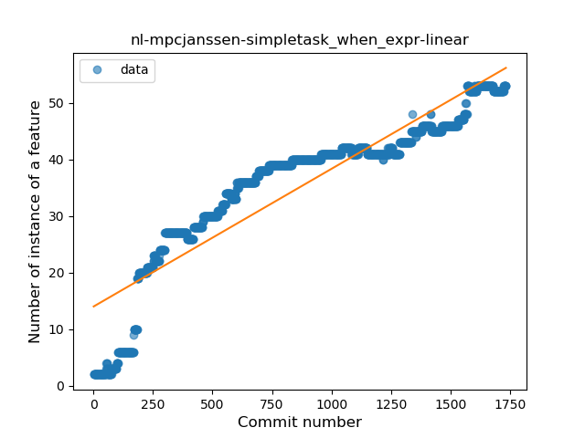
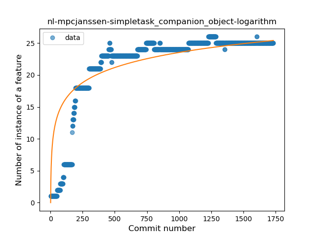
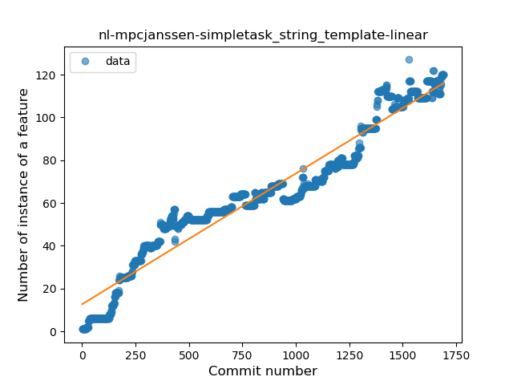
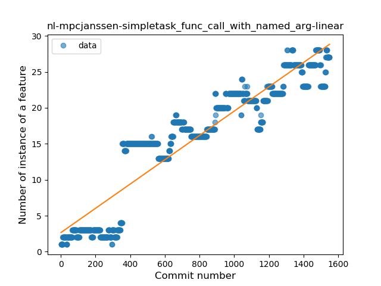
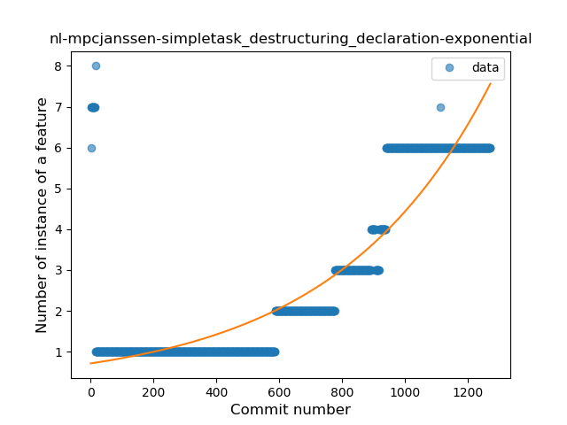

## nl-mpcjanssen-simpletask
----
#### Metrics provided by Detekt
* Number of lines of code 11163
* Number of Kotlin files: 69
* Cyclomatic complexity: 1706
* Cyclomatic complexity by thousands of lines: 264 

----
**18** features analyzed

*	<a href="#type_inference">Type Inference</a> 
*	<a href="#lambda">Lambda</a> 
*	<a href="#safe_call">Safe Call</a> 
*	<a href="#when_expr">When expression</a> 
*	<a href="#unsafe_call">Unsafe Call</a> 
*	<a href="#companion_object">Companion Object</a> 
*	<a href="#string_template">String Template</a> 
*	<a href="#func_with_default_value">Function with Default Value</a> 
*	<a href="#singleton">Singleton</a> 
*	<a href="#range_expr">Range Expression</a> 
*	<a href="#smart_cast">Smart Cast</a> 
*	<a href="#data_class">Data Class</a> 
*	<a href="#func_call_with_named_arg">Function call with Named Argument</a> 
*	<a href="#extension_function">Extension Function</a> 
*	<a href="#property_delegation">Property Delegation</a> 
*	<a href="#destructuring_declaration">Destructuring Declaration</a> 
*	<a href="#inline_func">Inline Function</a> 
*	<a href="#overloaded_op">Overloaded Operator</a> 

### <a name="type_inference">Type Inference</a>
----
#### Functions
* **Sudden Rise Plateau - Logarithm:** 
    * **R_Squared:** 0.66606576
* **Constant Rise - Linear:** 
    * **R_Squared:** 0.42523697

**Plots** :chart_with_upwards_trend:
-----

### <a name="lambda">Lambda</a>
----
#### Functions
* **Constant Rise - Linear:** 
    * **R_Squared:** 0.89193691
* **Sudden Rise Plateau - Logarithm:** 
    * **R_Squared:** 0.58946369
* **Plateau Sudden Rise - Binary Sigmoid:** 
    * **R_Squared:** 0.52432964

**Plots** :chart_with_upwards_trend:
-----

### <a name="safe_call">Safe Call</a>
----
#### Functions
* **Constant Rise - Linear:** 
    * **R_Squared:** 0.77001699
* **Sudden Rise Plateau - Logarithm:** 
    * **R_Squared:** 0.61284899
* **Plateau Sudden Rise - Binary Sigmoid:** 
    * **R_Squared:** 0.39723155

**Plots** :chart_with_upwards_trend:
-----

### <a name="when_expr">When expression</a>
----
#### Functions
* **Constant Rise - Linear:** 
    * **R_Squared:** 0.83765551
* **Sudden Rise Plateau - Logarithm:** 
    * **R_Squared:** 0.61359862
* **Plateau Sudden Rise - Binary Sigmoid:** 
    * **R_Squared:** 0.09064141

**Plots** :chart_with_upwards_trend:
-----

### <a name="unsafe_call">Unsafe Call</a>
----
#### Functions
* **Plateau Sudden Rise - Binary Sigmoid:** 
    * **R_Squared:** 0.2318304
* **Sudden Rise Plateau - Logarithm:** 
    * **R_Squared:** 0.03963005
* **Constant Decline - Linear:** 
    * **R_Squared:** 0.02852955
* **Sudden Decline - Exponential:** 
    * **R_Squared:** 0.0

**Plots** :chart_with_upwards_trend:
-----

### <a name="companion_object">Companion Object</a>
----
#### Functions
* **Sudden Rise Plateau - Logarithm:** 
    * **R_Squared:** 0.68247573
* **Constant Rise - Linear:** 
    * **R_Squared:** 0.49505974
* **Plateau Sudden Rise - Binary Sigmoid:** 
    * **R_Squared:** 0.18496736

**Plots** :chart_with_upwards_trend:
-----

### <a name="string_template">String Template</a>
----
#### Functions
* **Constant Rise - Linear:** 
    * **R_Squared:** 0.93676977
* **Sudden Rise Plateau - Logarithm:** 
    * **R_Squared:** 0.47487234
* **Plateau Sudden Rise - Binary Sigmoid:** 
    * **R_Squared:** 0.12658877

**Plots** :chart_with_upwards_trend:
-----

### <a name="func_with_default_value">Function with Default Value</a>
----
#### Functions
* **Sudden Rise Plateau - Logarithm:** 
    * **R_Squared:** 0.65990435
* **Constant Rise - Linear:** 
    * **R_Squared:** 0.53259332

**Plots** :chart_with_upwards_trend:
-----

### <a name="singleton">Singleton</a>
----
#### Functions
* **Plateau Gradual Rise - Sigmoid:** 
    * **R_Squared:** 0.86205694
* **Constant Rise - Linear:** 
    * **R_Squared:** 0.7411184
* **Sudden Rise Plateau - Logarithm:** 
    * **R_Squared:** 0.5327069

**Plots** :chart_with_upwards_trend:
-----

### <a name="range_expr">Range Expression</a>
----
#### Functions
* **Sudden Rise Plateau - Logarithm:** 
    * **R_Squared:** 0.19834801
* **Constant Rise - Linear:** 
    * **R_Squared:** 0.00638406

**Plots** :chart_with_upwards_trend:
-----

### <a name="smart_cast">Smart Cast</a>
----
#### Functions
* **Sudden Rise - Exponential:** 
    * **R_Squared:** 0.74311024
* **Constant Rise - Linear:** 
    * **R_Squared:** 0.55950078
* **Sudden Rise Plateau - Logarithm:** 
    * **R_Squared:** 0.13500222

**Plots** :chart_with_upwards_trend:
-----

### <a name="data_class">Data Class</a>
----
#### Functions
* **Sudden Rise Plateau - Logarithm:** 
    * **R_Squared:** 0.76334869
* **Constant Rise - Linear:** 
    * **R_Squared:** 0.66880446

**Plots** :chart_with_upwards_trend:
-----

### <a name="func_call_with_named_arg">Function call with Named Argument</a>
----
#### Functions
* **Constant Rise - Linear:** 
    * **R_Squared:** 0.86714573
* **Sudden Rise Plateau - Logarithm:** 
    * **R_Squared:** 0.44248805

**Plots** :chart_with_upwards_trend:
-----

### <a name="extension_function">Extension Function</a>
----
#### Functions
* **Plateau Gradual Rise - Sigmoid:** 
    * **R_Squared:** 0.94876384
* **Sudden Rise Plateau - Logarithm:** 
    * **R_Squared:** 0.648577
* **Constant Rise - Linear:** 
    * **R_Squared:** 0.4635881

**Plots** :chart_with_upwards_trend:
-----

### <a name="property_delegation">Property Delegation</a>
----
#### Functions
* **Constant Rise - Linear:** 
    * **R_Squared:** 0.78003331
* **Sudden Rise - Exponential:** 
    * **R_Squared:** 0.7860165
* **Sudden Rise Plateau - Logarithm:** 
    * **R_Squared:** 0.18923319
* **Plateau Sudden Rise - Binary Sigmoid:** 
    * **R_Squared:** 0.01530724

**Plots** :chart_with_upwards_trend:
-----

### <a name="destructuring_declaration">Destructuring Declaration</a>
----
#### Functions
* **Sudden Rise - Exponential:** 
    * **R_Squared:** 0.78967532
* **Constant Rise - Linear:** 
    * **R_Squared:** 0.67989103
* **Sudden Rise Plateau - Logarithm:** 
    * **R_Squared:** 0.16900066

**Plots** :chart_with_upwards_trend:
-----

### <a name="inline_func">Inline Function</a>
----
#### Functions
* **Plateau Sudden Rise - Binary Sigmoid:** 
    * **R_Squared:** 1.0
* **Sudden Rise Plateau - Logarithm:** 
    * **R_Squared:** 0.15729085
* **Constant Rise - Linear:** 
    * **R_Squared:** 0.01947969

**Plots** :chart_with_upwards_trend:
-----

### <a name="overloaded_op">Overloaded Operator</a>
----
#### Functions
* **Plateau Sudden Decline - Binary Sigmoid:** 
    * **R_Squared:** 1.0
* **Sudden Decline - Exponential:** 
    * **R_Squared:** 0.77340058
* **Constant Decline - Linear:** 
    * **R_Squared:** 0.53117106
* **Sudden Rise Plateau - Logarithm:** 
    * **R_Squared:** -0.0

**Plots** :chart_with_upwards_trend:
-----

