## nl-renedegroot-android-adbawake
----
#### Metrics provided by Detekt
* Number of lines of code 870
* Number of Kotlin files: 17
* Cyclomatic complexity: 63
* Cyclomatic complexity by thousands of lines: 259 

----
**6** features analyzed

*	<a href="#type_inference">Type Inference</a> 
*	<a href="#lambda">Lambda</a> 
*	<a href="#safe_call">Safe Call</a> 
*	<a href="#when_expr">When expression</a> 
*	<a href="#companion_object">Companion Object</a> 
*	<a href="#smart_cast">Smart Cast</a> 

### <a name="type_inference">Type Inference</a>
----
#### Functions
* **Constant Rise - Linear:** 
    * **R_Squared:** 0.91862108
* **Sudden Rise Plateau - Logarithm:** 
    * **R_Squared:** 0.81206519

**Plots** :chart_with_upwards_trend:
-----

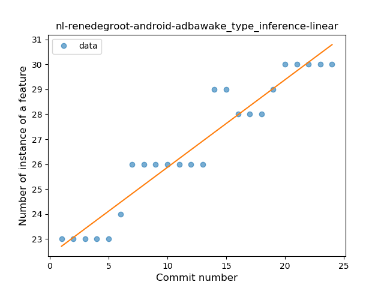
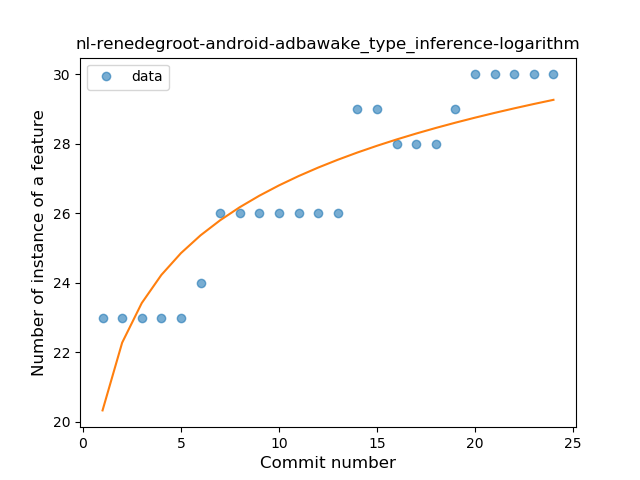
### <a name="lambda">Lambda</a>
----
#### Functions
* **Plateau Sudden Rise - Binary Sigmoid:** 
    * **R_Squared:** 1.0
* **Instability - Polinomial 3:** )
    * **R_Squared:** 0.81581703
* **Sudden Rise Plateau - Logarithm:** 
    * **R_Squared:** 0.69921223
* **Constant Rise - Linear:** 
    * **R_Squared:** 0.49565217

**Plots** :chart_with_upwards_trend:
-----

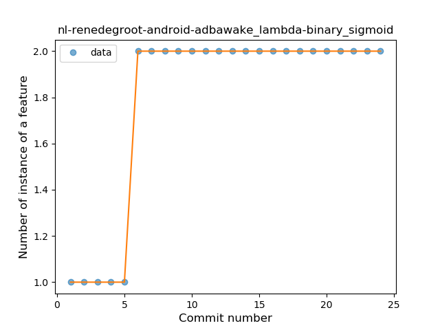
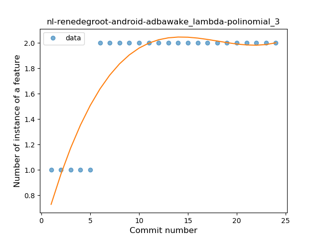
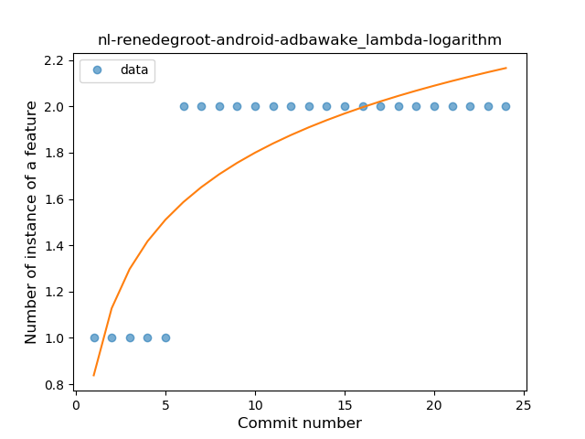
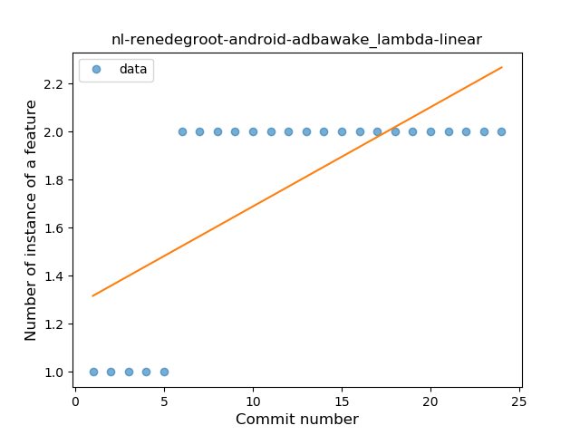
### <a name="safe_call">Safe Call</a>
----
#### Functions
* **Instability - Polinomial 3:** )
    * **R_Squared:** 0.82281004
* **Sudden Decline - Exponential:** 
    * **R_Squared:** 0.7922778
* **Constant Decline - Linear:** 
    * **R_Squared:** 0.4173913
* **Sudden Rise Plateau - Logarithm:** 
    * **R_Squared:** -0.0

**Plots** :chart_with_upwards_trend:
-----

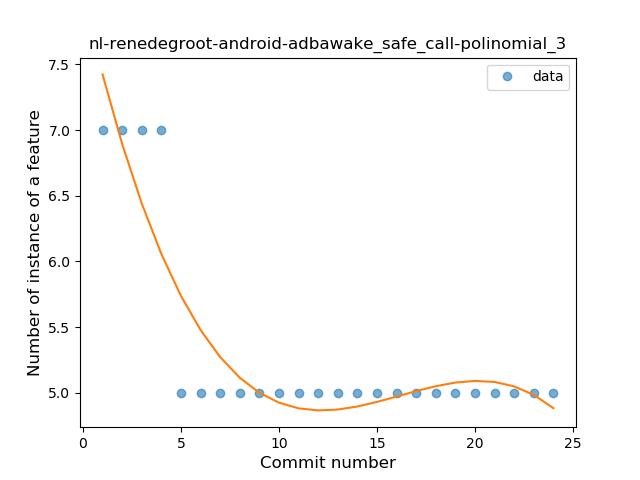
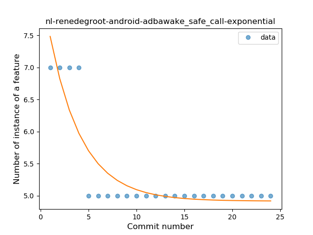
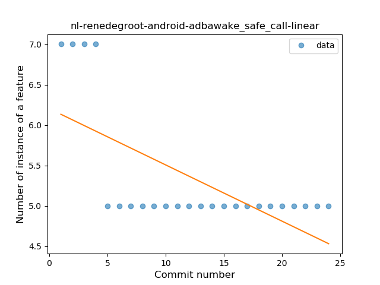
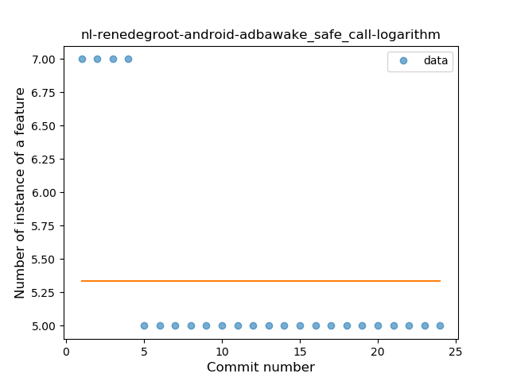
### <a name="when_expr">When expression</a>
----
#### Functions
* **Instability - Polinomial 3:** )
    * **R_Squared:** 0.81581703
* **Constant Decline - Linear:** 
    * **R_Squared:** 0.49565217
* **Sudden Rise Plateau - Logarithm:** 
    * **R_Squared:** -0.0

**Plots** :chart_with_upwards_trend:
-----

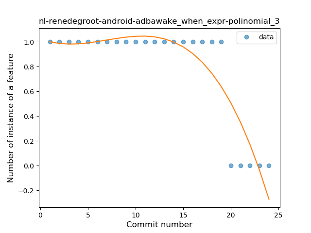
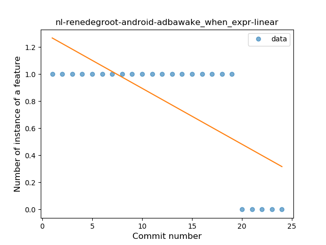
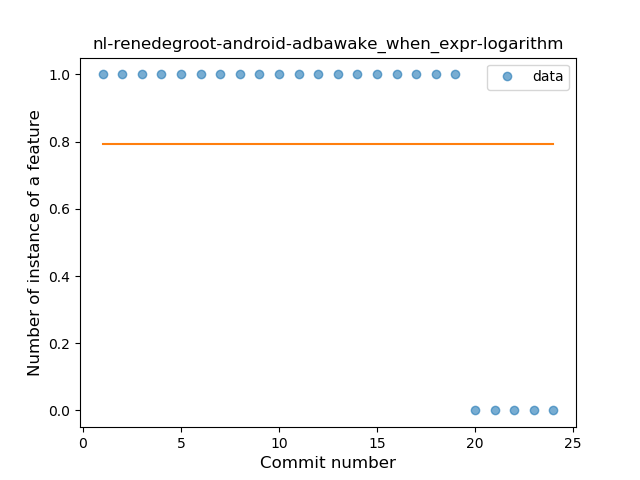
### <a name="companion_object">Companion Object</a>
----
#### Functions
* **Instability - Polinomial 3:** )
    * **R_Squared:** 0.82281004
* **Sudden Decline - Exponential:** 
    * **R_Squared:** 0.7922778
* **Constant Decline - Linear:** 
    * **R_Squared:** 0.4173913
* **Sudden Rise Plateau - Logarithm:** 
    * **R_Squared:** -0.0

**Plots** :chart_with_upwards_trend:
-----

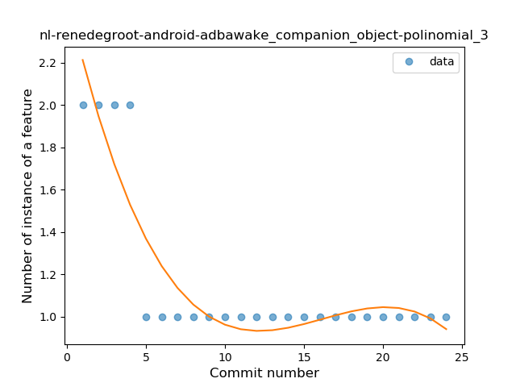
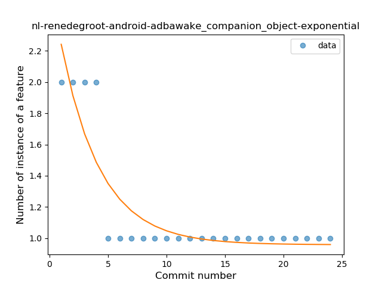
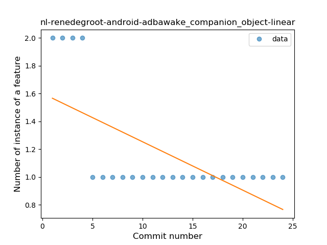
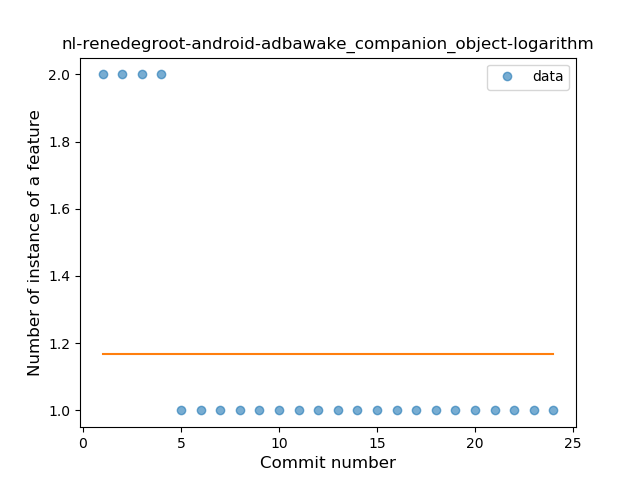
### <a name="smart_cast">Smart Cast</a>
----
#### Functions
* **Plateau Sudden Rise - Binary Sigmoid:** 
    * **R_Squared:** 1.0
* **Instability - Polinomial 4:** 
    * **R_Squared:** 0.8747245
* **Instability - Polinomial 3:** )
    * **R_Squared:** 0.84399176
* **Sudden Rise - Exponential:** 
    * **R_Squared:** 0.75378672
* **Constant Rise - Linear:** 
    * **R_Squared:** 0.73043478
* **Sudden Rise Plateau - Logarithm:** 
    * **R_Squared:** 0.4948067

**Plots** :chart_with_upwards_trend:
-----

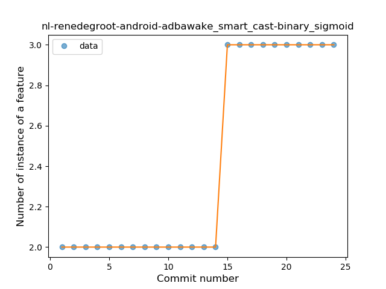
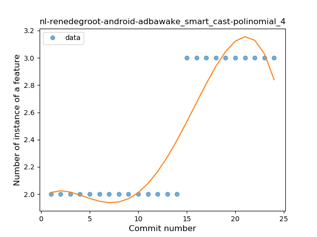
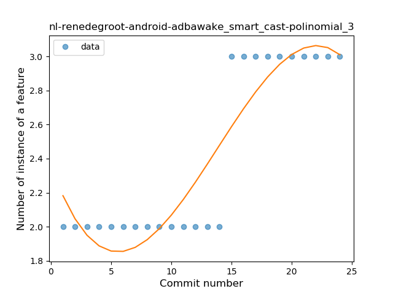
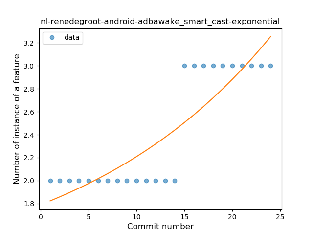
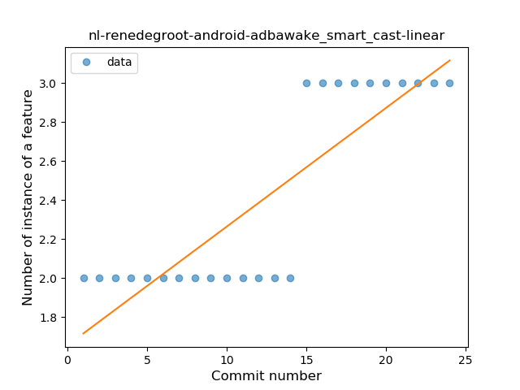
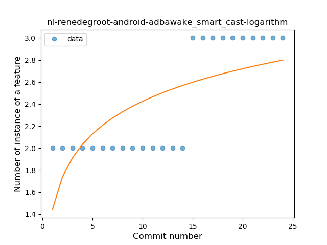
