## ofalvai-BPInfo
----
#### Metrics provided by Detekt
* Number of lines of code 6225
* Number of Kotlin files: 57
* Cyclomatic complexity: 759
* Cyclomatic complexity by thousands of lines: 292 

----
**15** features analyzed

*	<a href="#type_inference">Type Inference</a> 
*	<a href="#lambda">Lambda</a> 
*	<a href="#safe_call">Safe Call</a> 
*	<a href="#when_expr">When expression</a> 
*	<a href="#companion_object">Companion Object</a> 
*	<a href="#unsafe_call">Unsafe Call</a> 
*	<a href="#string_template">String Template</a> 
*	<a href="#singleton">Singleton</a> 
*	<a href="#smart_cast">Smart Cast</a> 
*	<a href="#range_expr">Range Expression</a> 
*	<a href="#func_call_with_named_arg">Function call with Named Argument</a> 
*	<a href="#data_class">Data Class</a> 
*	<a href="#extension_function">Extension Function</a> 
*	<a href="#property_delegation">Property Delegation</a> 
*	<a href="#destructuring_declaration">Destructuring Declaration</a> 

### <a name="type_inference">Type Inference</a>
----
#### Functions
* **Constant Rise - Linear:** 
    * **R_Squared:** 0.78986308
* **Sudden Rise Plateau - Logarithm:** 
    * **R_Squared:** 0.64457887

**Plots** :chart_with_upwards_trend:
-----

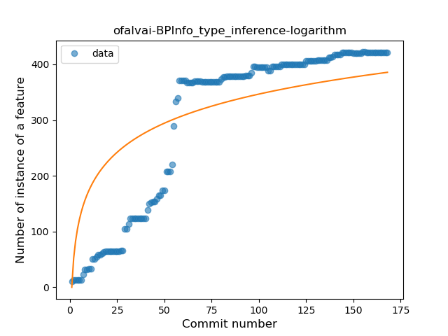
### <a name="lambda">Lambda</a>
----
#### Functions
* **Constant Rise - Linear:** 
    * **R_Squared:** 0.94553681
* **Sudden Rise Plateau - Logarithm:** 
    * **R_Squared:** 0.62874829

**Plots** :chart_with_upwards_trend:
-----

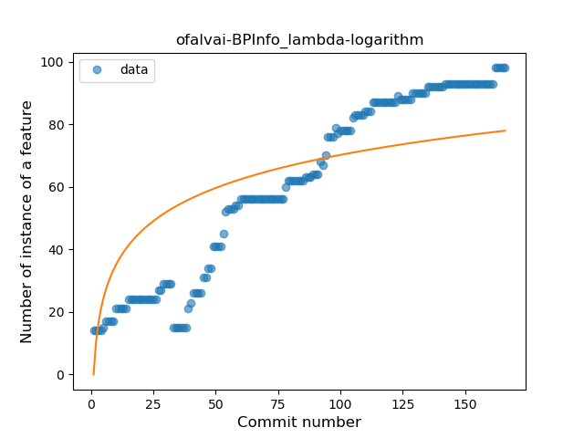
### <a name="safe_call">Safe Call</a>
----
#### Functions
* **Constant Rise - Linear:** 
    * **R_Squared:** 0.91633625
* **Sudden Rise Plateau - Logarithm:** 
    * **R_Squared:** 0.69841096

**Plots** :chart_with_upwards_trend:
-----

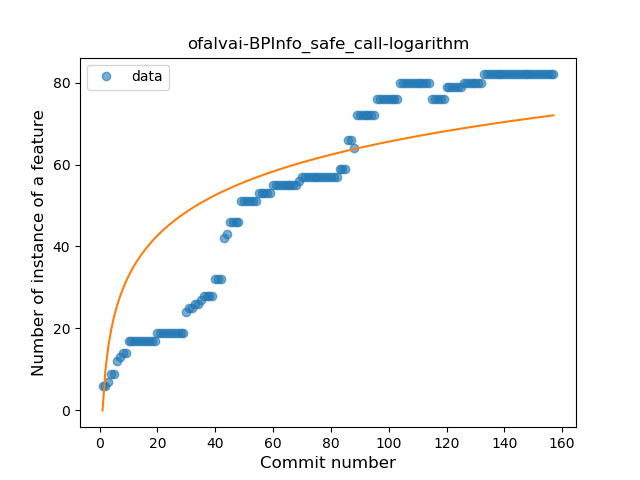
### <a name="when_expr">When expression</a>
----
#### Functions
* **Sudden Rise Plateau - Logarithm:** 
    * **R_Squared:** 0.82486717
* **Constant Rise - Linear:** 
    * **R_Squared:** 0.68178655

**Plots** :chart_with_upwards_trend:
-----

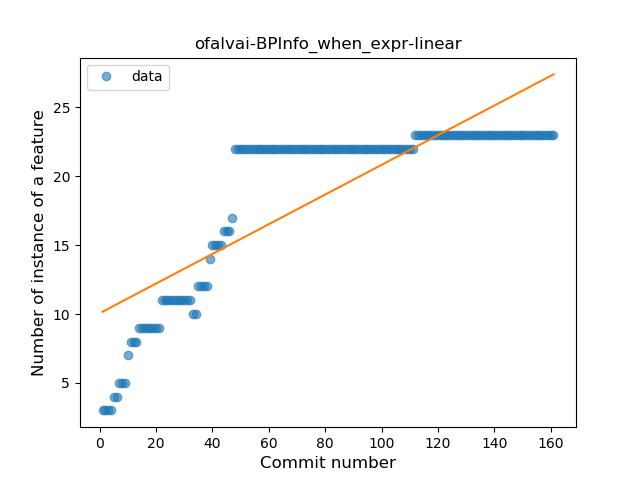
### <a name="companion_object">Companion Object</a>
----
#### Functions
* **Plateau Gradual Rise - Sigmoid:** 
    * **R_Squared:** 0.97802835
* **Constant Rise - Linear:** 
    * **R_Squared:** 0.80375016
* **Sudden Rise Plateau - Logarithm:** 
    * **R_Squared:** 0.64654965

**Plots** :chart_with_upwards_trend:
-----

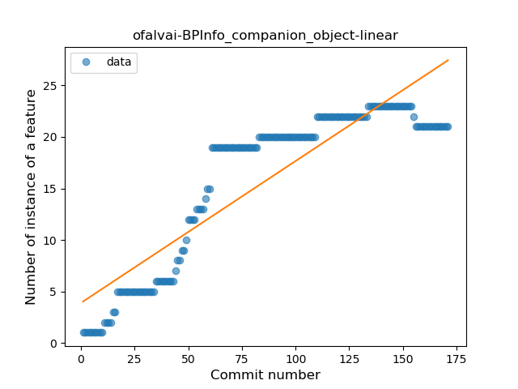
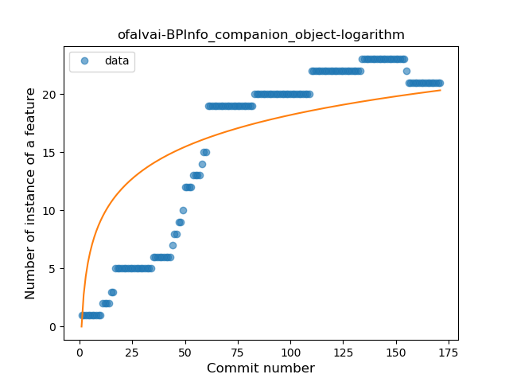
### <a name="unsafe_call">Unsafe Call</a>
----
#### Functions
* **Sudden Rise Plateau - Logarithm:** 
    * **R_Squared:** 0.26568767
* **Constant Rise - Linear:** 
    * **R_Squared:** 0.2152876

**Plots** :chart_with_upwards_trend:
-----

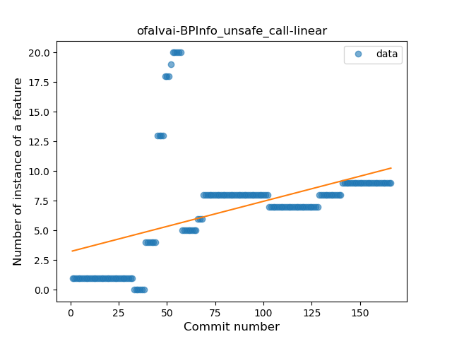
### <a name="string_template">String Template</a>
----
#### Functions
* **Plateau Gradual Rise - Sigmoid:** 
    * **R_Squared:** 0.86088351
* **Sudden Rise - Exponential:** 
    * **R_Squared:** 0.77609058
* **Constant Rise - Linear:** 
    * **R_Squared:** 0.75302002
* **Sudden Rise Plateau - Logarithm:** 
    * **R_Squared:** 0.60497378

**Plots** :chart_with_upwards_trend:
-----

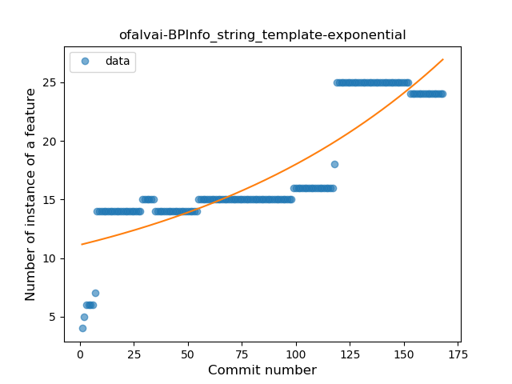
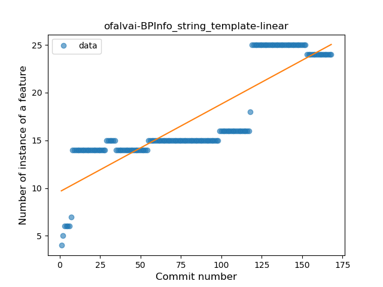
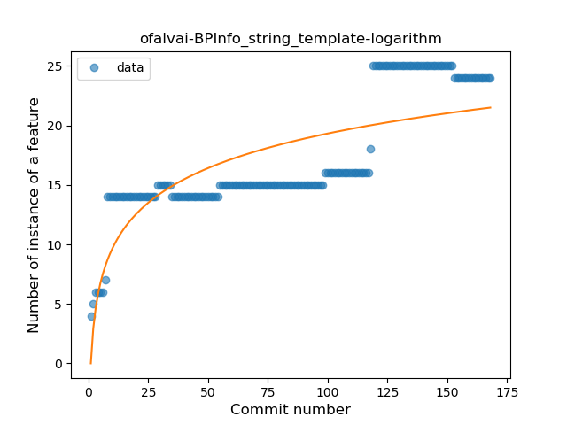
### <a name="singleton">Singleton</a>
----
#### Functions
* **Sudden Rise - Exponential:** 
    * **R_Squared:** 0.93210968
* **Constant Rise - Linear:** 
    * **R_Squared:** 0.88447212
* **Sudden Rise Plateau - Logarithm:** 
    * **R_Squared:** 0.46823666

**Plots** :chart_with_upwards_trend:
-----

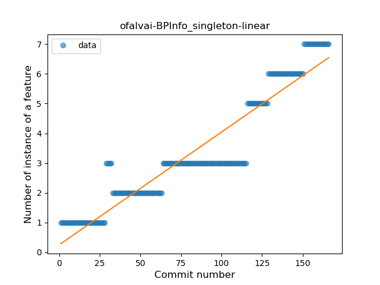
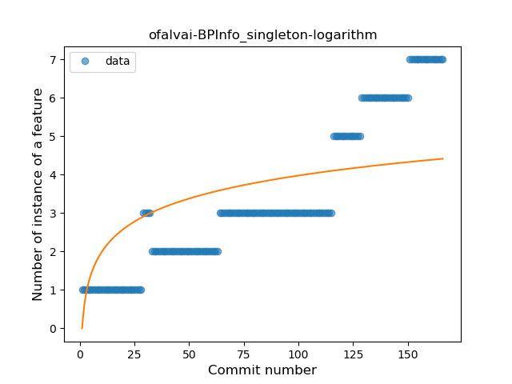
### <a name="smart_cast">Smart Cast</a>
----
#### Functions
* **Sudden Rise Plateau - Logarithm:** 
    * **R_Squared:** 0.81888791
* **Constant Rise - Linear:** 
    * **R_Squared:** 0.74893783

**Plots** :chart_with_upwards_trend:
-----

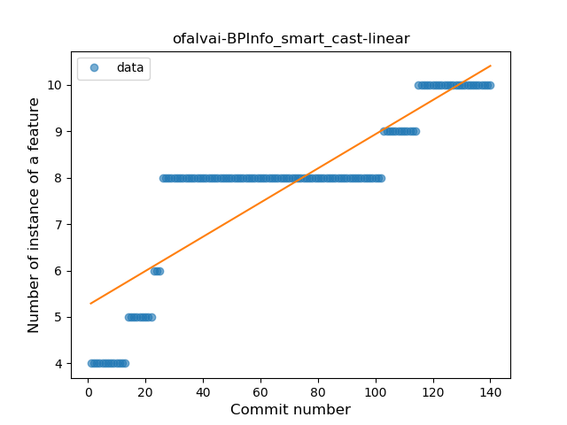
### <a name="range_expr">Range Expression</a>
----
#### Functions
* **Sudden Rise Plateau - Logarithm:** 
    * **R_Squared:** 0.6609516
* **Constant Rise - Linear:** 
    * **R_Squared:** 0.60008044

**Plots** :chart_with_upwards_trend:
-----

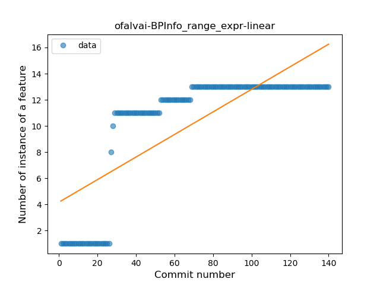
### <a name="func_call_with_named_arg">Function call with Named Argument</a>
----
#### Functions
* **Sudden Rise Plateau - Logarithm:** 
    * **R_Squared:** 0.0872357
* **Constant Rise - Linear:** 
    * **R_Squared:** 0.06311777

**Plots** :chart_with_upwards_trend:
-----

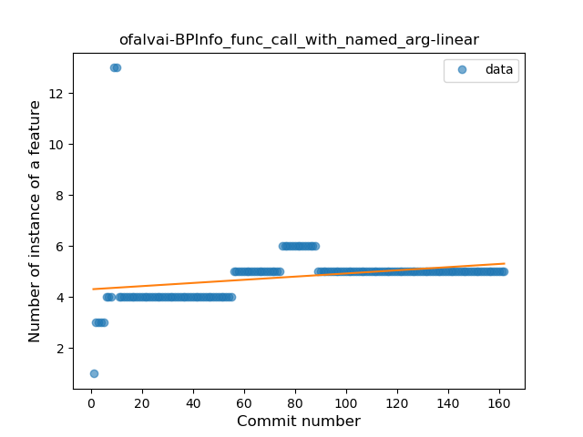
### <a name="data_class">Data Class</a>
----
#### Functions
* **Plateau Sudden Rise - Binary Sigmoid:** 
    * **R_Squared:** 1.0
* **Sudden Rise - Exponential:** 
    * **R_Squared:** 0.7524993
* **Constant Rise - Linear:** 
    * **R_Squared:** 0.72772915
* **Sudden Rise Plateau - Logarithm:** 
    * **R_Squared:** 0.43102593

**Plots** :chart_with_upwards_trend:
-----

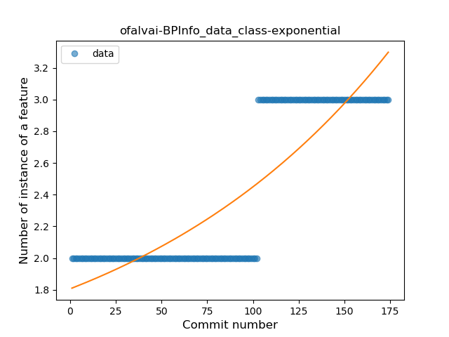
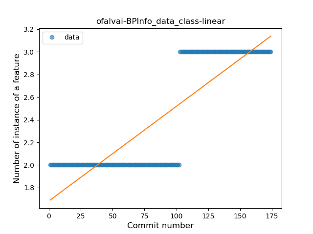
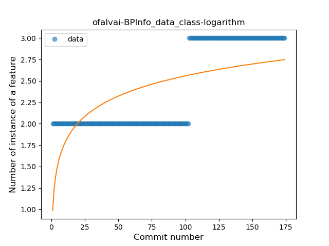
### <a name="extension_function">Extension Function</a>
----
#### Functions
* **Constant Decline - Linear:** 
    * **R_Squared:** 0.30753493
* **Sudden Rise - Exponential:** 
    * **R_Squared:** -0.0
* **Sudden Rise Plateau - Logarithm:** 
    * **R_Squared:** -0.0

**Plots** :chart_with_upwards_trend:
-----

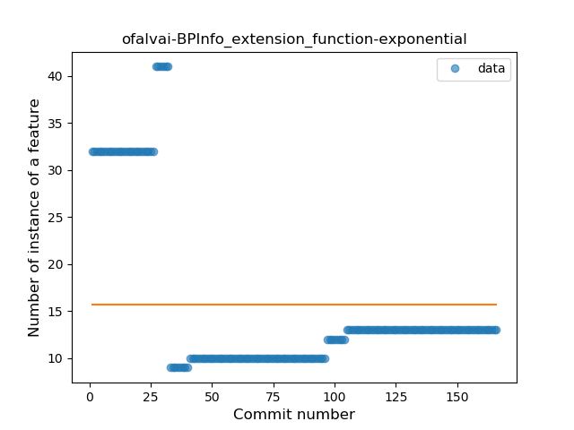

### <a name="property_delegation">Property Delegation</a>
----
#### Functions
* **Plateau Sudden Rise - Binary Sigmoid:** 
    * **R_Squared:** 0.92925714
* **Constant Rise - Linear:** 
    * **R_Squared:** 0.68747047
* **Sudden Rise Plateau - Logarithm:** 
    * **R_Squared:** 0.66182856

**Plots** :chart_with_upwards_trend:
-----

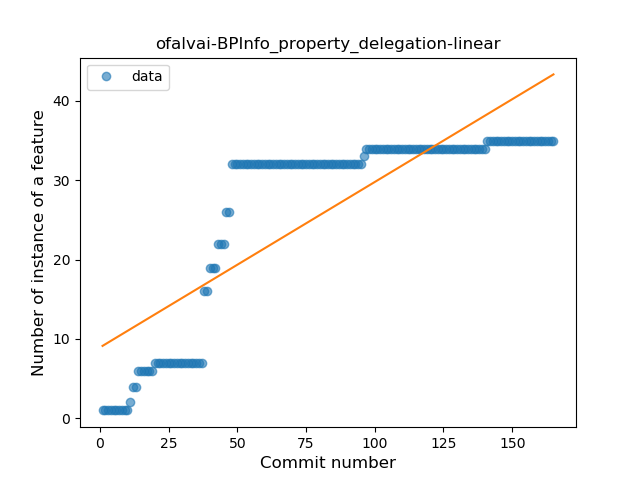
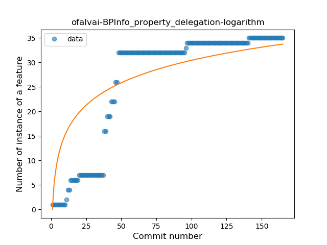
### <a name="destructuring_declaration">Destructuring Declaration</a>
----
#### Functions
* **Plateau Sudden Rise - Binary Sigmoid:** 
    * **R_Squared:** 1.0
* **Sudden Rise Plateau - Logarithm:** 
    * **R_Squared:** 0.66798022
* **Constant Rise - Linear:** 
    * **R_Squared:** 0.44007347

**Plots** :chart_with_upwards_trend:
-----

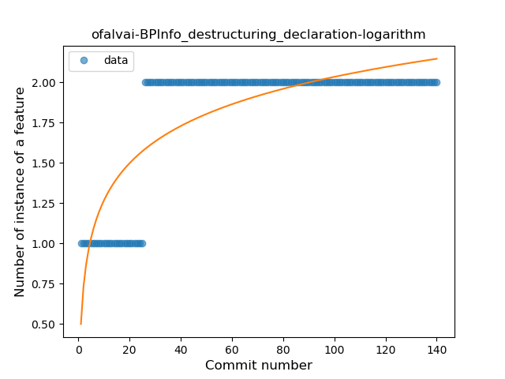
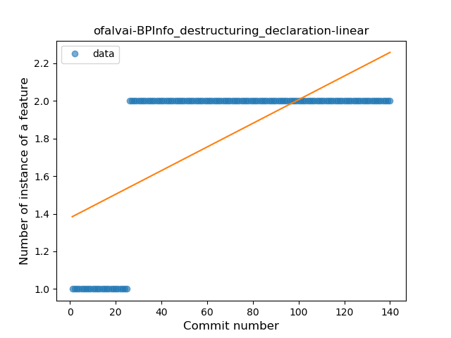
