## ohmae-DmsExplorer
----
#### Metrics provided by Detekt
* Number of lines of code 2071
* Number of Kotlin files: 33
* Cyclomatic complexity: 237
* Cyclomatic complexity by thousands of lines: 237 

----
**10** features analyzed

*	<a href="#type_inference">Type Inference</a> 
*	<a href="#lambda">Lambda</a> 
*	<a href="#safe_call">Safe Call</a> 
*	<a href="#when_expr">When expression</a> 
*	<a href="#companion_object">Companion Object</a> 
*	<a href="#func_with_default_value">Function with Default Value</a> 
*	<a href="#singleton">Singleton</a> 
*	<a href="#range_expr">Range Expression</a> 
*	<a href="#func_call_with_named_arg">Function call with Named Argument</a> 
*	<a href="#property_delegation">Property Delegation</a> 

### <a name="type_inference">Type Inference</a>
----
#### Functions
* **Instability - Polinomial 3:** )
    * **R_Squared:** 0.91361131
* **Constant Rise - Linear:** 
    * **R_Squared:** 0.84100954
* **Sudden Rise Plateau - Logarithm:** 
    * **R_Squared:** 0.65213924

**Plots** :chart_with_upwards_trend:
-----

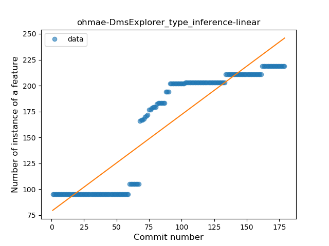
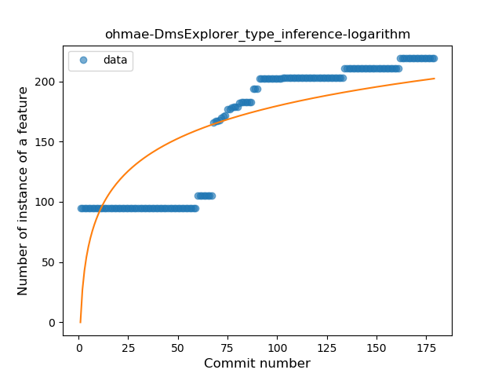
### <a name="lambda">Lambda</a>
----
#### Functions
* **Sudden Rise Plateau - Logarithm:** 
    * **R_Squared:** 0.74786474
* **Constant Rise - Linear:** 
    * **R_Squared:** 0.36786927

**Plots** :chart_with_upwards_trend:
-----

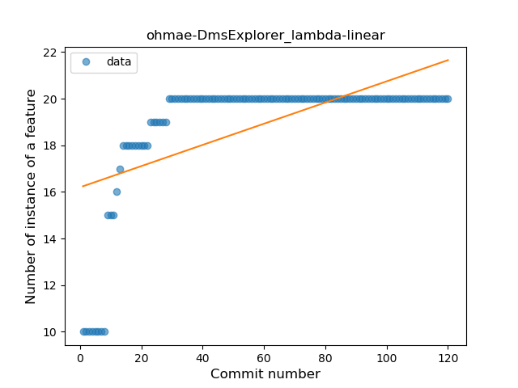
### <a name="safe_call">Safe Call</a>
----
#### Functions
* **Constant Rise - Linear:** 
    * **R_Squared:** 0.7937905
* **Sudden Rise Plateau - Logarithm:** 
    * **R_Squared:** 0.5866052

**Plots** :chart_with_upwards_trend:
-----

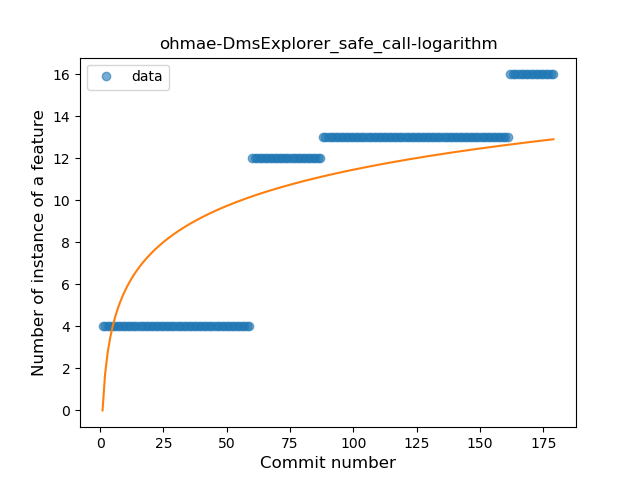
### <a name="when_expr">When expression</a>
----
#### Functions
* **Plateau Sudden Rise - Binary Sigmoid:** 
    * **R_Squared:** 0.84882845
* **Sudden Rise Plateau - Logarithm:** 
    * **R_Squared:** 0.71584054
* **Constant Rise - Linear:** 
    * **R_Squared:** 0.64176332

**Plots** :chart_with_upwards_trend:
-----

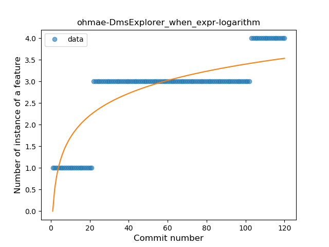
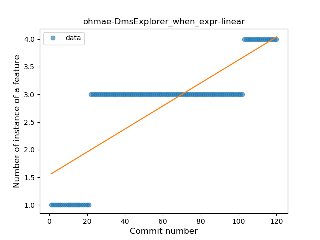
### <a name="companion_object">Companion Object</a>
----
#### Functions
* **Plateau Gradual Rise - Sigmoid:** 
    * **R_Squared:** 0.68018598
* **Sudden Rise Plateau - Logarithm:** 
    * **R_Squared:** 0.2391853
* **Constant Rise - Linear:** 
    * **R_Squared:** 0.01623473

**Plots** :chart_with_upwards_trend:
-----

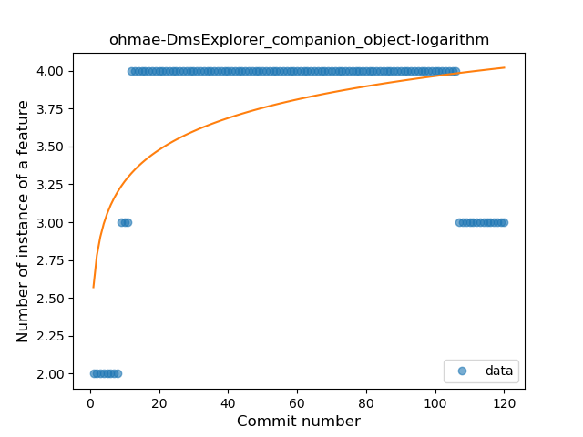
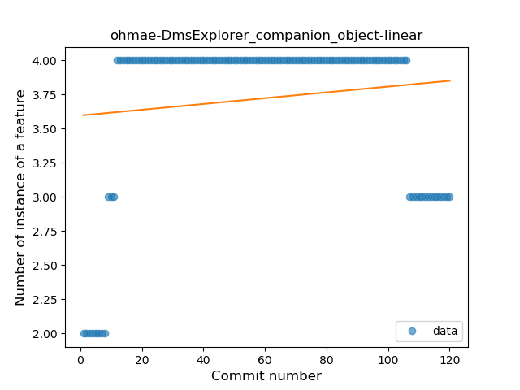
### <a name="func_with_default_value">Function with Default Value</a>
----
#### Functions
* **Sudden Rise Plateau - Logarithm:** 
    * **R_Squared:** 0.86988944
* **Constant Rise - Linear:** 
    * **R_Squared:** 0.74815598

**Plots** :chart_with_upwards_trend:
-----

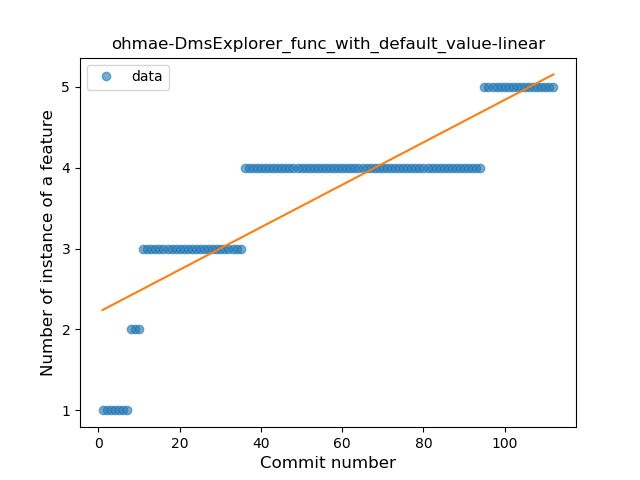
### <a name="singleton">Singleton</a>
----
#### Functions
* **Constant Rise - Linear:** 
    * **R_Squared:** 0.84645266
* **Sudden Rise Plateau - Logarithm:** 
    * **R_Squared:** 0.52158367

**Plots** :chart_with_upwards_trend:
-----

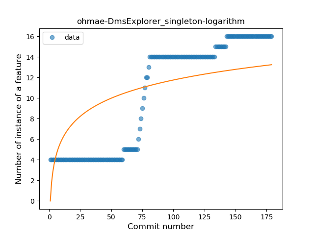
### <a name="range_expr">Range Expression</a>
----
#### Functions
* **Plateau Sudden Rise - Binary Sigmoid:** 
    * **R_Squared:** 1.0
* **Sudden Rise - Exponential:** 
    * **R_Squared:** 0.78592391
* **Constant Rise - Linear:** 
    * **R_Squared:** 0.40468787
* **Sudden Rise Plateau - Logarithm:** 
    * **R_Squared:** 0.17597822

**Plots** :chart_with_upwards_trend:
-----

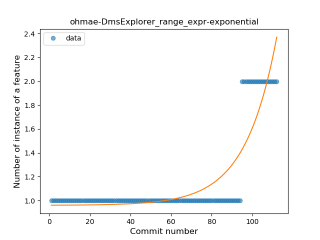
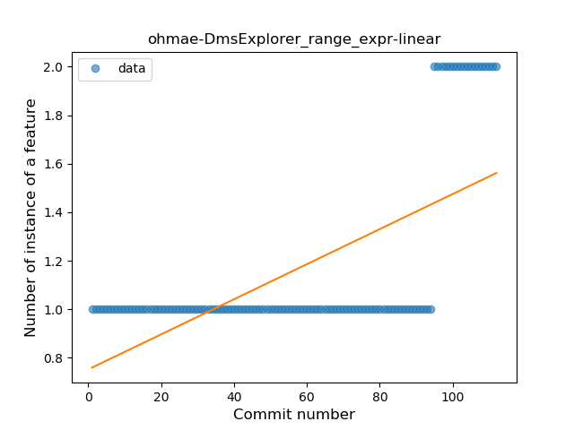
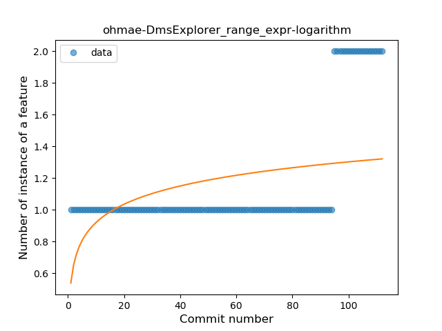
### <a name="func_call_with_named_arg">Function call with Named Argument</a>
----
#### Functions
* **Plateau Sudden Rise - Binary Sigmoid:** 
    * **R_Squared:** 1.0
* **Sudden Rise Plateau - Logarithm:** 
    * **R_Squared:** 0.6530095
* **Constant Rise - Linear:** 
    * **R_Squared:** 0.38252656

**Plots** :chart_with_upwards_trend:
-----

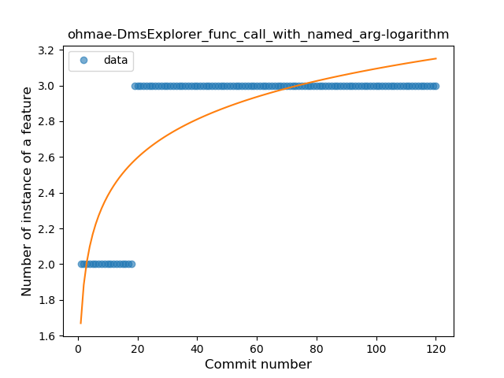
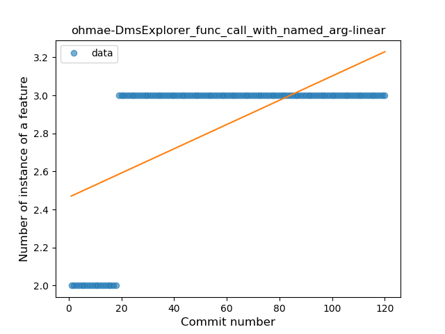
### <a name="property_delegation">Property Delegation</a>
----
#### Functions
* **Plateau Sudden Rise - Binary Sigmoid:** 
    * **R_Squared:** 1.0
* **Sudden Rise Plateau - Logarithm:** 
    * **R_Squared:** 0.31656999
* **Constant Rise - Linear:** 
    * **R_Squared:** 0.07821095

**Plots** :chart_with_upwards_trend:
-----

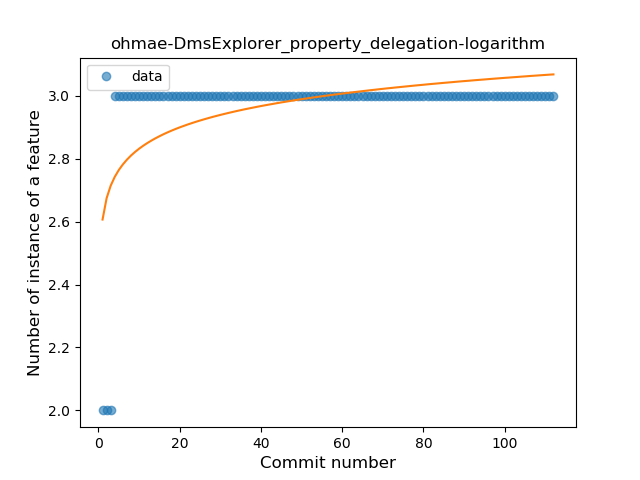
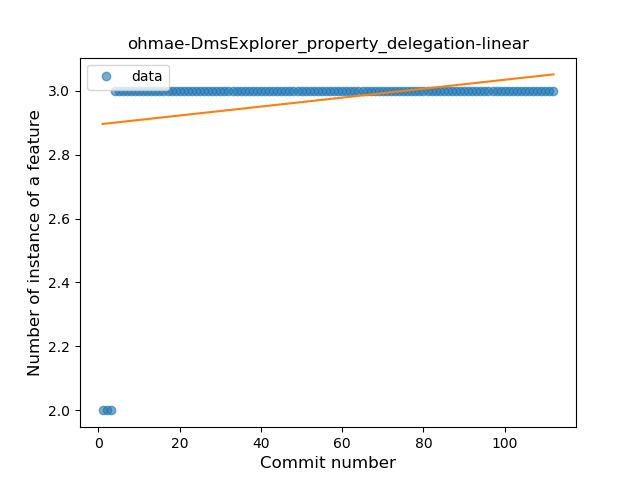
