## ohmae-VoiceMessageBoard
----
#### Metrics provided by Detekt
* Number of lines of code 3287
* Number of Kotlin files: 33
* Cyclomatic complexity: 443
* Cyclomatic complexity by thousands of lines: 288 

----
**12** features analyzed

*	<a href="#type_inference">Type Inference</a> 
*	<a href="#lambda">Lambda</a> 
*	<a href="#safe_call">Safe Call</a> 
*	<a href="#when_expr">When expression</a> 
*	<a href="#companion_object">Companion Object</a> 
*	<a href="#unsafe_call">Unsafe Call</a> 
*	<a href="#func_with_default_value">Function with Default Value</a> 
*	<a href="#singleton">Singleton</a> 
*	<a href="#smart_cast">Smart Cast</a> 
*	<a href="#range_expr">Range Expression</a> 
*	<a href="#extension_function">Extension Function</a> 
*	<a href="#property_delegation">Property Delegation</a> 

### <a name="type_inference">Type Inference</a>
----
#### Functions
* **Sudden Rise Plateau - Logarithm:** 
    * **R_Squared:** 0.75303385
* **Constant Rise - Linear:** 
    * **R_Squared:** 0.68029852

**Plots** :chart_with_upwards_trend:
-----

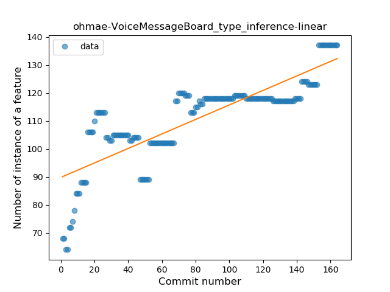
### <a name="lambda">Lambda</a>
----
#### Functions
* **Constant Rise - Linear:** 
    * **R_Squared:** 0.84398617
* **Sudden Rise Plateau - Logarithm:** 
    * **R_Squared:** 0.70790224

**Plots** :chart_with_upwards_trend:
-----

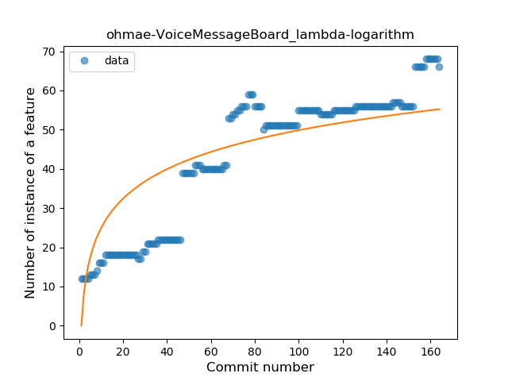
### <a name="safe_call">Safe Call</a>
----
#### Functions
* **Sudden Rise Plateau - Logarithm:** 
    * **R_Squared:** 0.75323775
* **Constant Rise - Linear:** 
    * **R_Squared:** 0.67724018

**Plots** :chart_with_upwards_trend:
-----

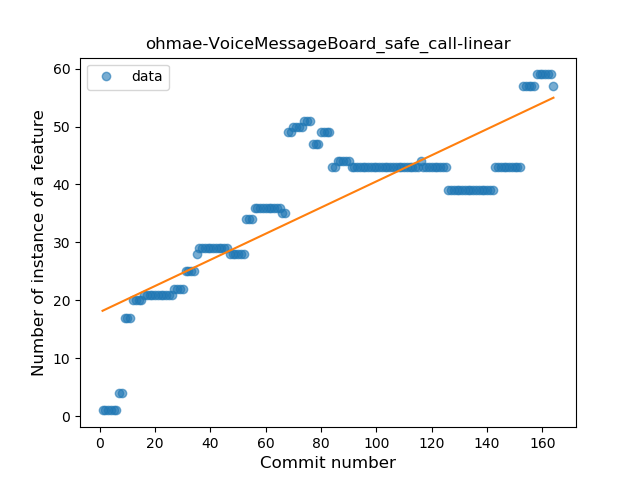
### <a name="when_expr">When expression</a>
----
#### Functions
* **Plateau Gradual Rise - Sigmoid:** 
    * **R_Squared:** 0.96547032
* **Sudden Rise - Exponential:** 
    * **R_Squared:** 0.93121251
* **Constant Rise - Linear:** 
    * **R_Squared:** 0.89822169
* **Sudden Rise Plateau - Logarithm:** 
    * **R_Squared:** 0.38815314

**Plots** :chart_with_upwards_trend:
-----

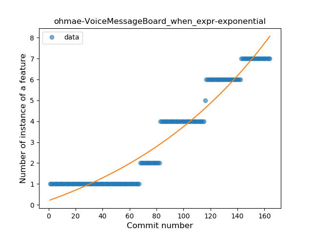
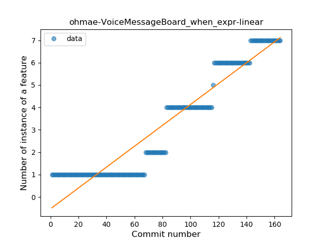
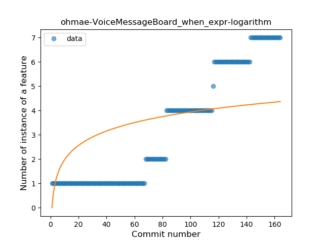
### <a name="companion_object">Companion Object</a>
----
#### Functions
* **Sudden Rise Plateau - Logarithm:** 
    * **R_Squared:** 0.80675145
* **Constant Rise - Linear:** 
    * **R_Squared:** 0.73919312

**Plots** :chart_with_upwards_trend:
-----

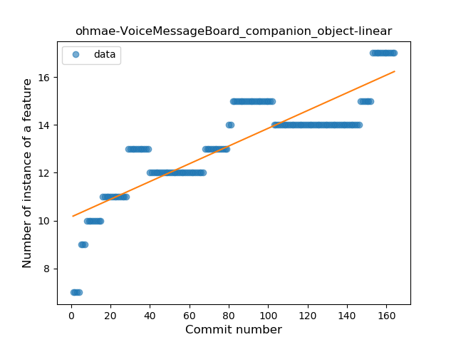
### <a name="unsafe_call">Unsafe Call</a>
----
#### Functions
* **Constant Rise - Linear:** 
    * **R_Squared:** 0.55116431
* **Sudden Rise Plateau - Logarithm:** 
    * **R_Squared:** 0.33565534

**Plots** :chart_with_upwards_trend:
-----

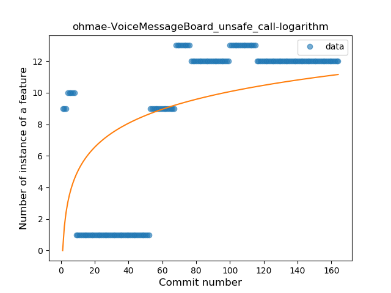
### <a name="func_with_default_value">Function with Default Value</a>
----
#### Functions
* **Plateau Gradual Rise - Sigmoid:** 
    * **R_Squared:** 0.86342944
* **Sudden Rise - Exponential:** 
    * **R_Squared:** 0.83959783
* **Constant Rise - Linear:** 
    * **R_Squared:** 0.67630592
* **Sudden Rise Plateau - Logarithm:** 
    * **R_Squared:** 0.47856408

**Plots** :chart_with_upwards_trend:
-----

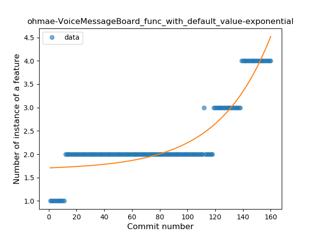
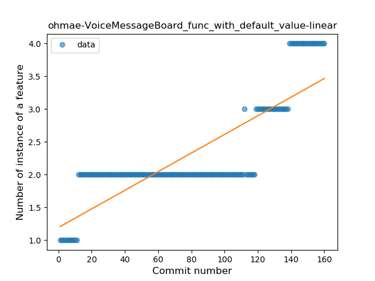
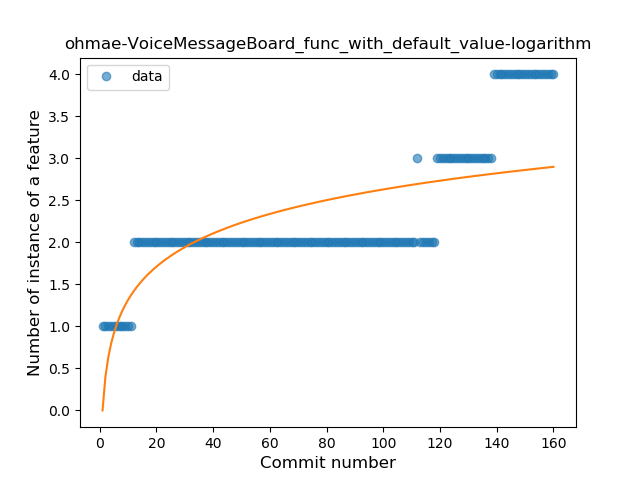
### <a name="singleton">Singleton</a>
----
#### Functions
* **Sudden Rise - Exponential:** 
    * **R_Squared:** 0.75115759
* **Constant Rise - Linear:** 
    * **R_Squared:** 0.63786665
* **Sudden Rise Plateau - Logarithm:** 
    * **R_Squared:** 0.45859753

**Plots** :chart_with_upwards_trend:
-----

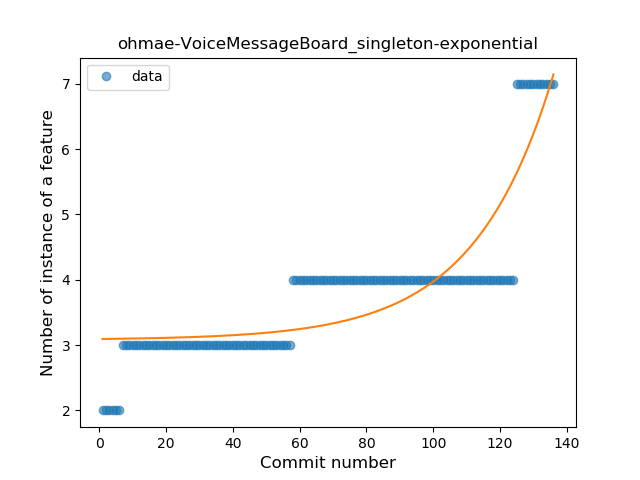
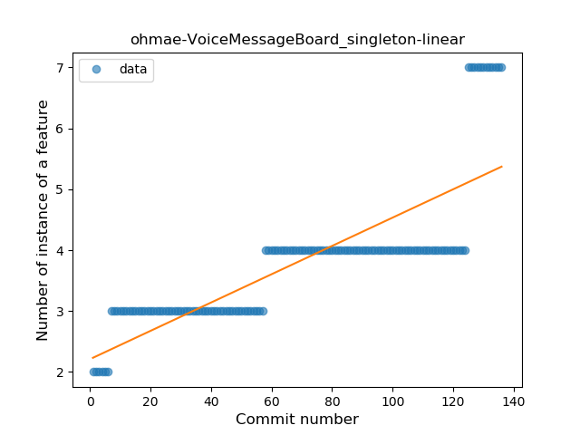
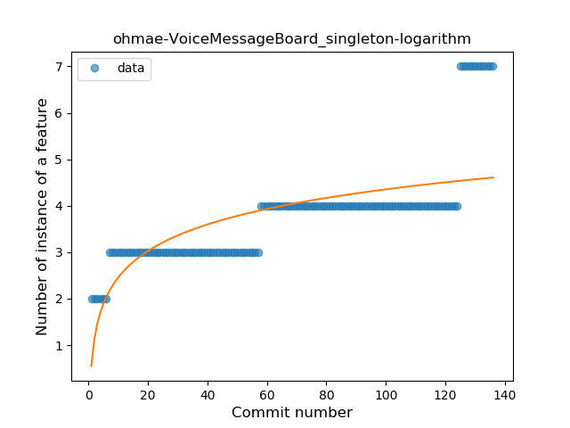
### <a name="smart_cast">Smart Cast</a>
----
#### Functions
* **Sudden Rise - Exponential:** 
    * **R_Squared:** 0.91688529
* **Plateau Gradual Rise - Sigmoid:** 
    * **R_Squared:** 0.91932823
* **Constant Rise - Linear:** 
    * **R_Squared:** 0.83858801
* **Sudden Rise Plateau - Logarithm:** 
    * **R_Squared:** 0.47496865

**Plots** :chart_with_upwards_trend:
-----

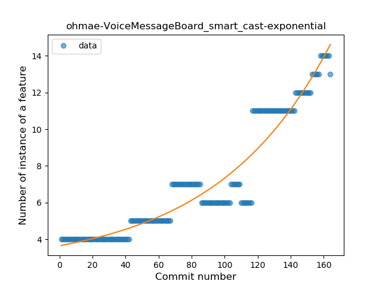
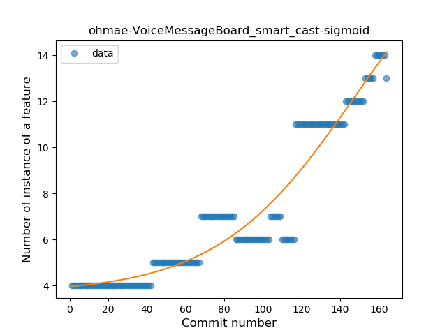
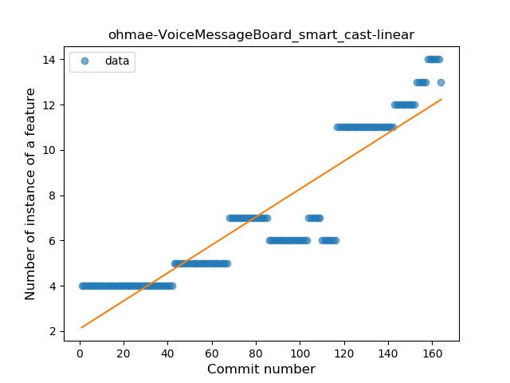
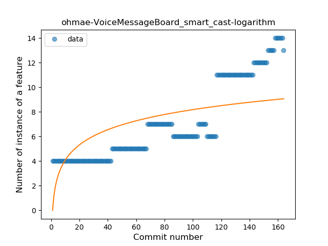
### <a name="range_expr">Range Expression</a>
----
#### Functions
* **Plateau Sudden Rise - Binary Sigmoid:** 
    * **R_Squared:** 1.0
* **Sudden Rise - Exponential:** 
    * **R_Squared:** 0.76850255
* **Constant Rise - Linear:** 
    * **R_Squared:** 0.57972973
* **Sudden Rise Plateau - Logarithm:** 
    * **R_Squared:** 0.28018494

**Plots** :chart_with_upwards_trend:
-----

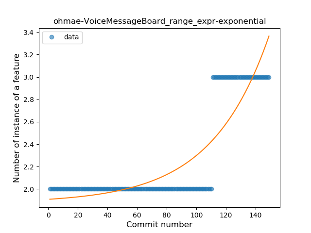
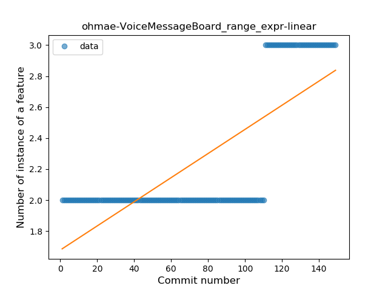
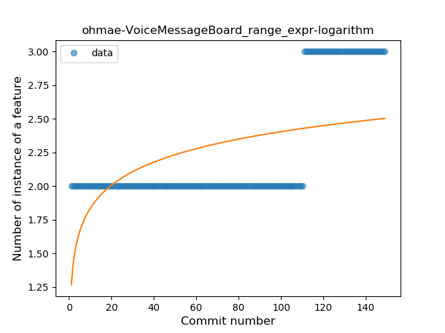
### <a name="extension_function">Extension Function</a>
----
#### Functions
* **Plateau Sudden Rise - Binary Sigmoid:** 
    * **R_Squared:** 1.0
* **Sudden Rise - Exponential:** 
    * **R_Squared:** 0.7630513
* **Constant Rise - Linear:** 
    * **R_Squared:** 0.63947368
* **Sudden Rise Plateau - Logarithm:** 
    * **R_Squared:** 0.35797036

**Plots** :chart_with_upwards_trend:
-----

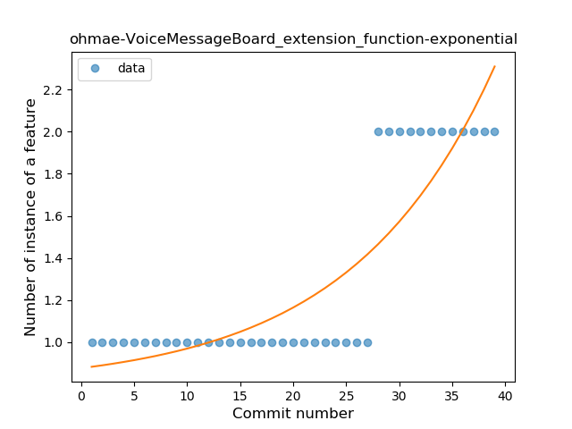
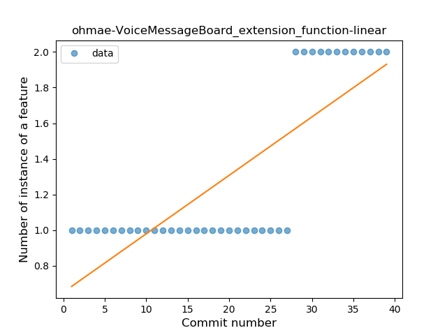
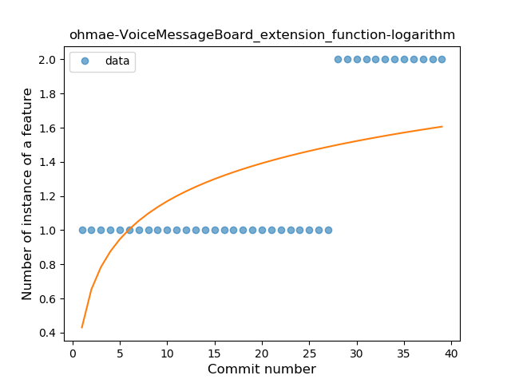
### <a name="property_delegation">Property Delegation</a>
----
#### Functions
* **Plateau Sudden Rise - Binary Sigmoid:** 
    * **R_Squared:** 0.52936956
* **Sudden Rise Plateau - Logarithm:** 
    * **R_Squared:** 0.12729826
* **Constant Rise - Linear:** 
    * **R_Squared:** 0.00621529

**Plots** :chart_with_upwards_trend:
-----

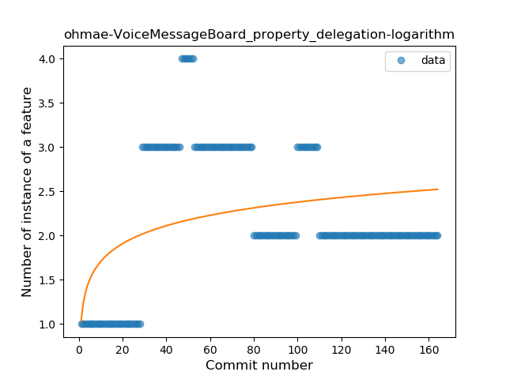
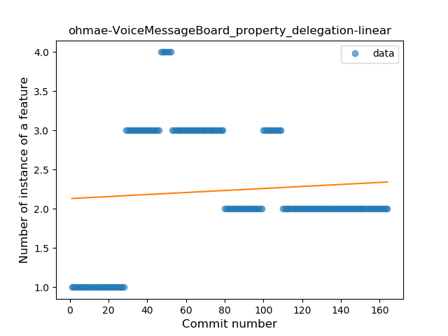
