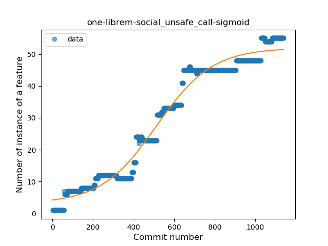
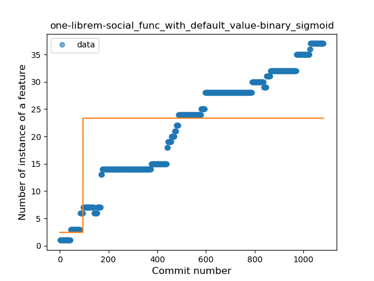
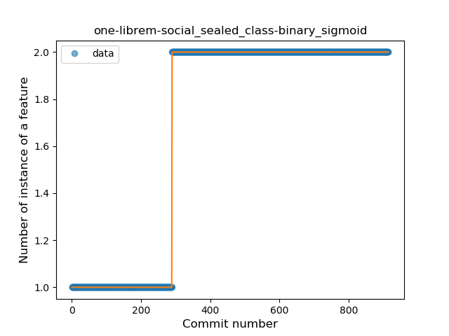

## one-librem-social
----
#### Metrics provided by Detekt
* Number of lines of code 19692
* Number of Kotlin files: 185
* Cyclomatic complexity: 2404
* Cyclomatic complexity by thousands of lines: 243 

----
**18** features analyzed

*	<a href="#type_inference">Type Inference</a> 
*	<a href="#lambda">Lambda</a> 
*	<a href="#safe_call">Safe Call</a> 
*	<a href="#when_expr">When expression</a> 
*	<a href="#unsafe_call">Unsafe Call</a> 
*	<a href="#companion_object">Companion Object</a> 
*	<a href="#string_template">String Template</a> 
*	<a href="#func_with_default_value">Function with Default Value</a> 
*	<a href="#singleton">Singleton</a> 
*	<a href="#range_expr">Range Expression</a> 
*	<a href="#smart_cast">Smart Cast</a> 
*	<a href="#data_class">Data Class</a> 
*	<a href="#func_call_with_named_arg">Function call with Named Argument</a> 
*	<a href="#extension_function">Extension Function</a> 
*	<a href="#property_delegation">Property Delegation</a> 
*	<a href="#destructuring_declaration">Destructuring Declaration</a> 
*	<a href="#sealed_class">Sealed Class</a> 
*	<a href="#type_alias">Type Alias</a> 

### <a name="type_inference">Type Inference</a>
----
#### Functions
* **Constant Rise - Linear:** 
    * **R_Squared:** 0.96810275
* **Sudden Rise Plateau - Logarithm:** 
    * **R_Squared:** 0.46322081

**Plots** :chart_with_upwards_trend:
-----

### <a name="lambda">Lambda</a>
----
#### Functions
* **Sudden Rise - Exponential:** 
    * **R_Squared:** 0.97584068
* **Constant Rise - Linear:** 
    * **R_Squared:** 0.95692409
* **Plateau Sudden Rise - Binary Sigmoid:** 
    * **R_Squared:** 0.42256175
* **Sudden Rise Plateau - Logarithm:** 
    * **R_Squared:** 0.29657613

**Plots** :chart_with_upwards_trend:
-----

### <a name="safe_call">Safe Call</a>
----
#### Functions
* **Constant Rise - Linear:** 
    * **R_Squared:** 0.9733035
* **Sudden Rise - Exponential:** 
    * **R_Squared:** 0.97514036
* **Sudden Rise Plateau - Logarithm:** 
    * **R_Squared:** 0.37519268
* **Plateau Sudden Rise - Binary Sigmoid:** 
    * **R_Squared:** 0.29919204

**Plots** :chart_with_upwards_trend:
-----

### <a name="when_expr">When expression</a>
----
#### Functions
* **Constant Rise - Linear:** 
    * **R_Squared:** 0.95788051
* **Plateau Sudden Rise - Binary Sigmoid:** 
    * **R_Squared:** 0.77678398
* **Sudden Rise Plateau - Logarithm:** 
    * **R_Squared:** 0.47851837

**Plots** :chart_with_upwards_trend:
-----

### <a name="unsafe_call">Unsafe Call</a>
----
#### Functions
* **Plateau Gradual Rise - Sigmoid:** 
    * **R_Squared:** 0.97560806
* **Constant Rise - Linear:** 
    * **R_Squared:** 0.94727106
* **Sudden Rise Plateau - Logarithm:** 
    * **R_Squared:** 0.39795364

**Plots** :chart_with_upwards_trend:
-----

### <a name="companion_object">Companion Object</a>
----
#### Functions
* **Constant Rise - Linear:** 
    * **R_Squared:** 0.97422217
* **Sudden Rise Plateau - Logarithm:** 
    * **R_Squared:** 0.40419406
* **Plateau Gradual Rise - Sigmoid:** 
    * **R_Squared:** 0.28062318

**Plots** :chart_with_upwards_trend:
-----

### <a name="string_template">String Template</a>
----
#### Functions
* **Constant Rise - Linear:** 
    * **R_Squared:** 0.93407633
* **Sudden Rise Plateau - Logarithm:** 
    * **R_Squared:** 0.36072753

**Plots** :chart_with_upwards_trend:
-----

### <a name="func_with_default_value">Function with Default Value</a>
----
#### Functions
* **Constant Rise - Linear:** 
    * **R_Squared:** 0.95394976
* **Sudden Rise Plateau - Logarithm:** 
    * **R_Squared:** 0.51362168
* **Plateau Sudden Rise - Binary Sigmoid:** 
    * **R_Squared:** 0.32900127

**Plots** :chart_with_upwards_trend:
-----

### <a name="singleton">Singleton</a>
----
#### Functions
* **Constant Rise - Linear:** 
    * **R_Squared:** 0.89899993
* **Sudden Rise Plateau - Logarithm:** 
    * **R_Squared:** 0.44786276

**Plots** :chart_with_upwards_trend:
-----

### <a name="range_expr">Range Expression</a>
----
#### Functions
* **Plateau Gradual Rise - Sigmoid:** 
    * **R_Squared:** 0.96257243
* **Sudden Rise - Exponential:** 
    * **R_Squared:** 0.94152165
* **Constant Rise - Linear:** 
    * **R_Squared:** 0.91211535
* **Sudden Rise Plateau - Logarithm:** 
    * **R_Squared:** 0.32695563

**Plots** :chart_with_upwards_trend:
-----

### <a name="smart_cast">Smart Cast</a>
----
#### Functions
* **Constant Rise - Linear:** 
    * **R_Squared:** 0.97221398
* **Plateau Sudden Rise - Binary Sigmoid:** 
    * **R_Squared:** 0.77429931
* **Sudden Rise Plateau - Logarithm:** 
    * **R_Squared:** 0.46222981

**Plots** :chart_with_upwards_trend:
-----

### <a name="data_class">Data Class</a>
----
#### Functions
* **Constant Rise - Linear:** 
    * **R_Squared:** 0.94315563
* **Sudden Rise Plateau - Logarithm:** 
    * **R_Squared:** 0.58254508

**Plots** :chart_with_upwards_trend:
-----

### <a name="func_call_with_named_arg">Function call with Named Argument</a>
----
#### Functions
* **Plateau Gradual Rise - Sigmoid:** 
    * **R_Squared:** 0.97916221
* **Constant Rise - Linear:** 
    * **R_Squared:** 0.92763895
* **Sudden Rise Plateau - Logarithm:** 
    * **R_Squared:** 0.34759584

**Plots** :chart_with_upwards_trend:
-----

### <a name="extension_function">Extension Function</a>
----
#### Functions
* **Constant Rise - Linear:** 
    * **R_Squared:** 0.87623018
* **Sudden Rise Plateau - Logarithm:** 
    * **R_Squared:** 0.37759891

**Plots** :chart_with_upwards_trend:
-----

### <a name="property_delegation">Property Delegation</a>
----
#### Functions
* **Plateau Gradual Rise - Sigmoid:** 
    * **R_Squared:** 0.91173592
* **Constant Rise - Linear:** 
    * **R_Squared:** 0.90131476
* **Sudden Rise Plateau - Logarithm:** 
    * **R_Squared:** 0.42933384

**Plots** :chart_with_upwards_trend:
-----

### <a name="destructuring_declaration">Destructuring Declaration</a>
----
#### Functions
* **Plateau Gradual Rise - Sigmoid:** 
    * **R_Squared:** 0.95679284
* **Constant Rise - Linear:** 
    * **R_Squared:** 0.88085293
* **Sudden Rise Plateau - Logarithm:** 
    * **R_Squared:** 0.31285619

**Plots** :chart_with_upwards_trend:
-----

### <a name="sealed_class">Sealed Class</a>
----
#### Functions
* **Plateau Sudden Rise - Binary Sigmoid:** 
    * **R_Squared:** 1.0
* **Constant Rise - Linear:** 
    * **R_Squared:** 0.64864525
* **Sudden Rise Plateau - Logarithm:** 
    * **R_Squared:** 0.5933224

**Plots** :chart_with_upwards_trend:
-----

### <a name="type_alias">Type Alias</a>
----
#### Functions
* **Constant Rise - Linear:** 
    * **R_Squared:** 0.68823585
* **Sudden Rise Plateau - Logarithm:** 
    * **R_Squared:** 0.58773919

**Plots** :chart_with_upwards_trend:
-----

