## openium-auvergne-webcams-droid
----
#### Metrics provided by Detekt
* Number of lines of code 5399
* Number of Kotlin files: 63
* Cyclomatic complexity: 779
* Cyclomatic complexity by thousands of lines: 291 

----
**16** features analyzed

*	<a href="#type_inference">Type Inference</a> 
*	<a href="#lambda">Lambda</a> 
*	<a href="#safe_call">Safe Call</a> 
*	<a href="#when_expr">When expression</a> 
*	<a href="#companion_object">Companion Object</a> 
*	<a href="#unsafe_call">Unsafe Call</a> 
*	<a href="#string_template">String Template</a> 
*	<a href="#func_with_default_value">Function with Default Value</a> 
*	<a href="#singleton">Singleton</a> 
*	<a href="#smart_cast">Smart Cast</a> 
*	<a href="#range_expr">Range Expression</a> 
*	<a href="#func_call_with_named_arg">Function call with Named Argument</a> 
*	<a href="#data_class">Data Class</a> 
*	<a href="#extension_function">Extension Function</a> 
*	<a href="#property_delegation">Property Delegation</a> 
*	<a href="#inline_func">Inline Function</a> 

### <a name="type_inference">Type Inference</a>
----
#### Functions
* **Constant Rise - Linear:** 
    * **R_Squared:** 0.94107619
* **Sudden Rise Plateau - Logarithm:** 
    * **R_Squared:** 0.6171329

**Plots** :chart_with_upwards_trend:
-----

### <a name="lambda">Lambda</a>
----
#### Functions
* **Constant Rise - Linear:** 
    * **R_Squared:** 0.93577042
* **Sudden Rise Plateau - Logarithm:** 
    * **R_Squared:** 0.70183906
* **Plateau Sudden Rise - Binary Sigmoid:** 
    * **R_Squared:** 0.64340496

**Plots** :chart_with_upwards_trend:
-----

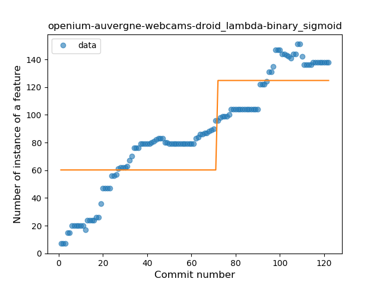
### <a name="safe_call">Safe Call</a>
----
#### Functions
* **Constant Rise - Linear:** 
    * **R_Squared:** 0.96042092
* **Sudden Rise Plateau - Logarithm:** 
    * **R_Squared:** 0.57678472
* **Plateau Sudden Rise - Binary Sigmoid:** 
    * **R_Squared:** 0.45728172

**Plots** :chart_with_upwards_trend:
-----

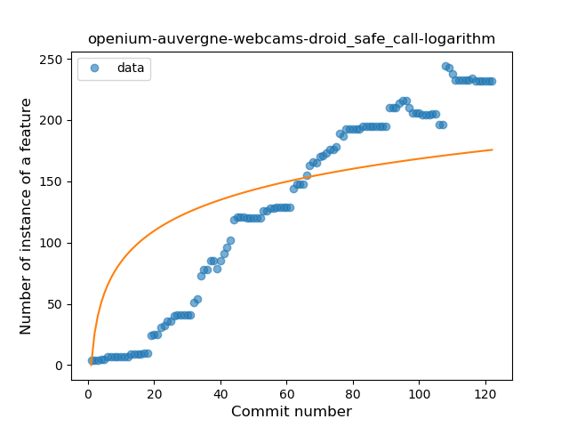
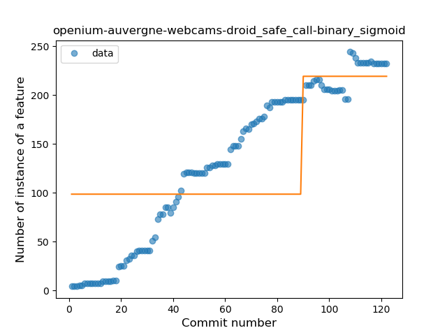
### <a name="when_expr">When expression</a>
----
#### Functions
* **Plateau Sudden Rise - Binary Sigmoid:** 
    * **R_Squared:** 1.0
* **Sudden Rise Plateau - Logarithm:** 
    * **R_Squared:** 0.64394718
* **Constant Rise - Linear:** 
    * **R_Squared:** 0.62082777

**Plots** :chart_with_upwards_trend:
-----

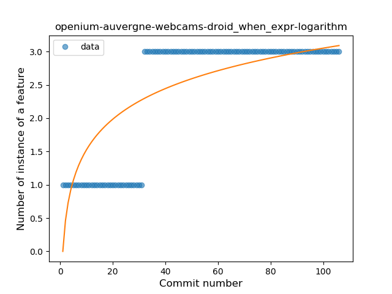
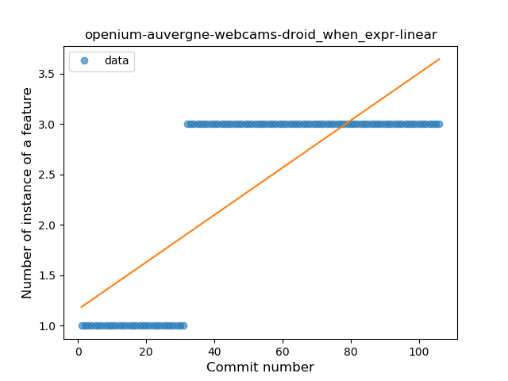
### <a name="companion_object">Companion Object</a>
----
#### Functions
* **Plateau Sudden Rise - Binary Sigmoid:** 
    * **R_Squared:** 0.89134632
* **Constant Rise - Linear:** 
    * **R_Squared:** 0.83075581
* **Sudden Rise Plateau - Logarithm:** 
    * **R_Squared:** 0.59726659

**Plots** :chart_with_upwards_trend:
-----

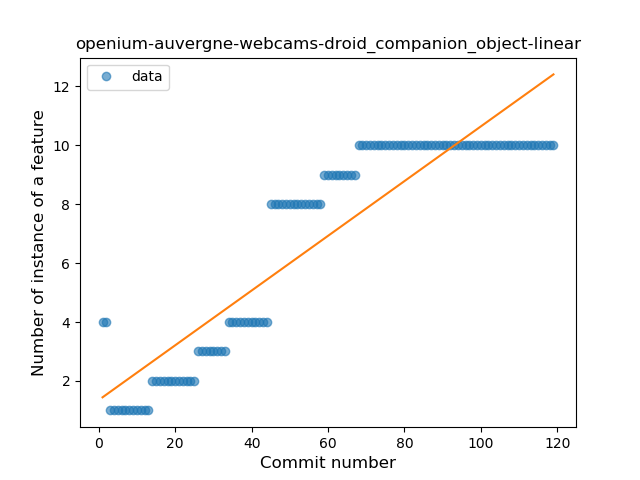
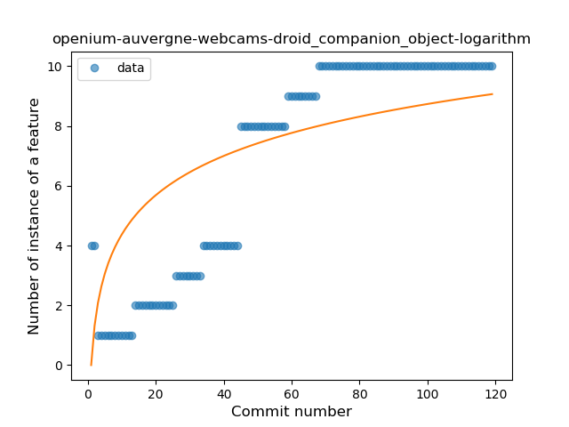
### <a name="unsafe_call">Unsafe Call</a>
----
#### Functions
* **Constant Rise - Linear:** 
    * **R_Squared:** 0.6028167
* **Sudden Rise Plateau - Logarithm:** 
    * **R_Squared:** 0.45940362
* **Plateau Sudden Rise - Binary Sigmoid:** 
    * **R_Squared:** 0.00327549

**Plots** :chart_with_upwards_trend:
-----

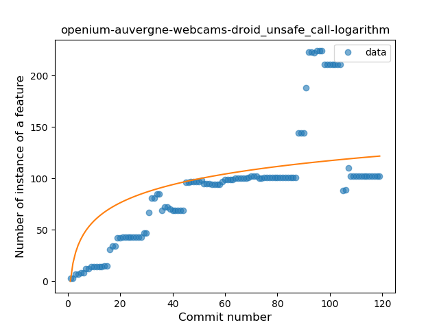
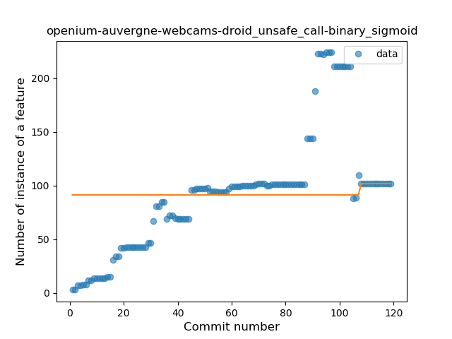
### <a name="string_template">String Template</a>
----
#### Functions
* **Plateau Gradual Rise - Sigmoid:** 
    * **R_Squared:** 0.94679812
* **Sudden Rise - Exponential:** 
    * **R_Squared:** 0.77297733
* **Constant Rise - Linear:** 
    * **R_Squared:** 0.64466073
* **Sudden Rise Plateau - Logarithm:** 
    * **R_Squared:** 0.2727003

**Plots** :chart_with_upwards_trend:
-----

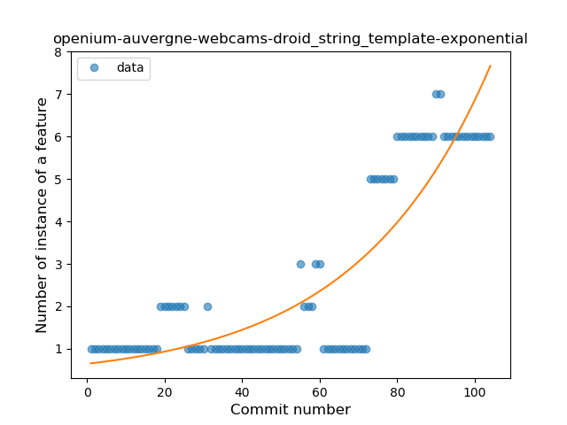
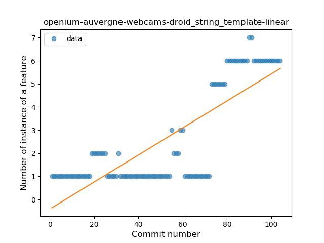
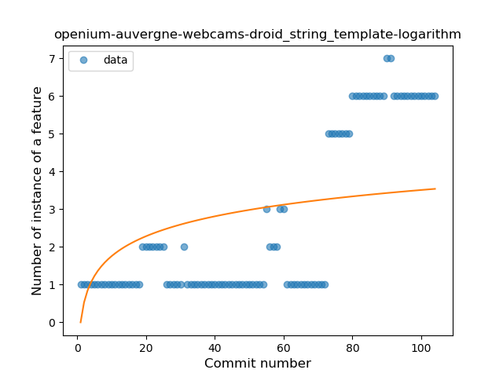
### <a name="func_with_default_value">Function with Default Value</a>
----
#### Functions
* **Plateau Gradual Rise - Sigmoid:** 
    * **R_Squared:** 0.75317831
* **Sudden Rise Plateau - Logarithm:** 
    * **R_Squared:** 0.5000451
* **Constant Rise - Linear:** 
    * **R_Squared:** 0.24653638

**Plots** :chart_with_upwards_trend:
-----

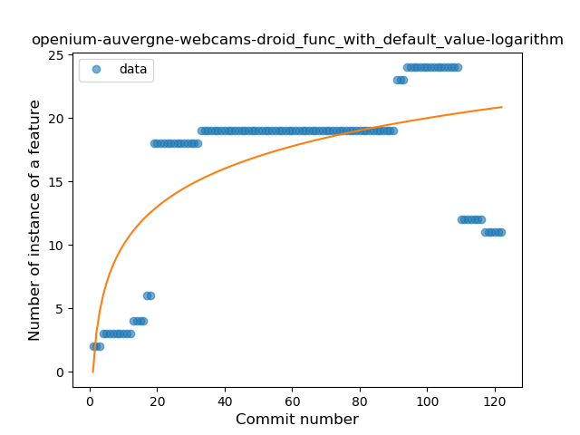
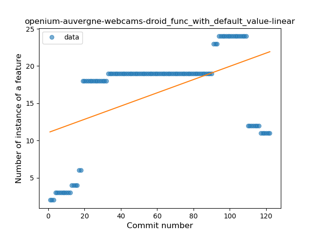
### <a name="singleton">Singleton</a>
----
#### Functions
* **Constant Rise - Linear:** 
    * **R_Squared:** 0.95705936
* **Plateau Gradual Rise - Sigmoid:** 
    * **R_Squared:** 0.95965372
* **Sudden Rise Plateau - Logarithm:** 
    * **R_Squared:** 0.72863512

**Plots** :chart_with_upwards_trend:
-----

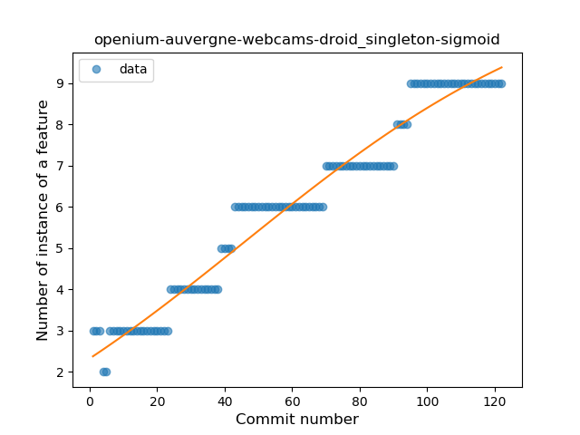
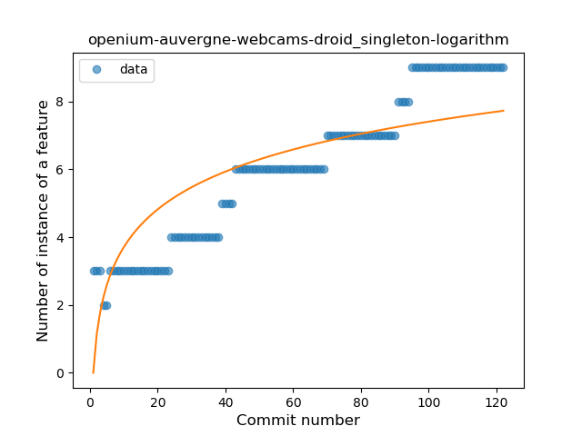
### <a name="smart_cast">Smart Cast</a>
----
#### Functions
* **Sudden Rise - Exponential:** 
    * **R_Squared:** 0.77743021
* **Constant Rise - Linear:** 
    * **R_Squared:** 0.74614053
* **Sudden Rise Plateau - Logarithm:** 
    * **R_Squared:** 0.42168865

**Plots** :chart_with_upwards_trend:
-----

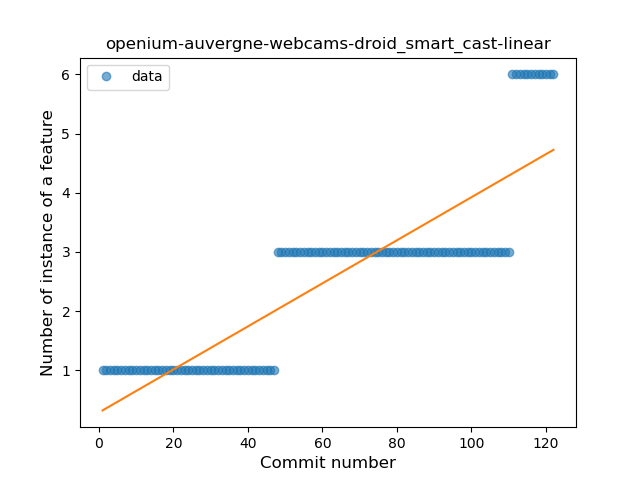
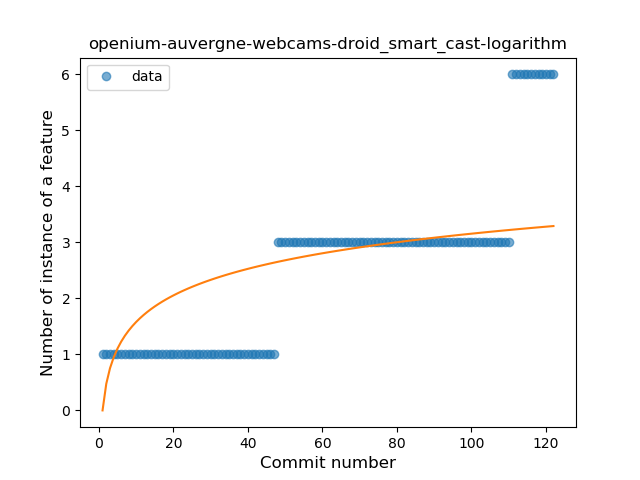
### <a name="range_expr">Range Expression</a>
----
#### Functions
* **Plateau Sudden Rise - Binary Sigmoid:** 
    * **R_Squared:** 0.84802758
* **Constant Rise - Linear:** 
    * **R_Squared:** 0.51672457
* **Sudden Rise Plateau - Logarithm:** 
    * **R_Squared:** 0.51421154

**Plots** :chart_with_upwards_trend:
-----

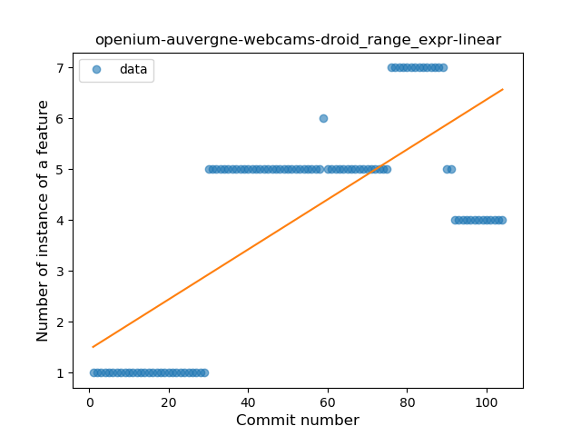
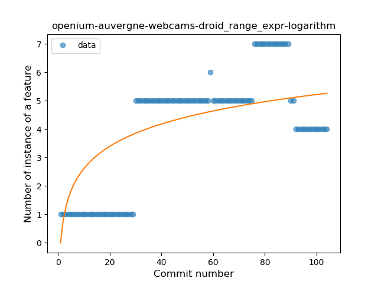
### <a name="func_call_with_named_arg">Function call with Named Argument</a>
----
#### Functions
* **Plateau Gradual Rise - Sigmoid:** 
    * **R_Squared:** 0.89986437
* **Sudden Rise - Exponential:** 
    * **R_Squared:** 0.8752115
* **Constant Rise - Linear:** 
    * **R_Squared:** 0.77811514
* **Sudden Rise Plateau - Logarithm:** 
    * **R_Squared:** 0.31407661

**Plots** :chart_with_upwards_trend:
-----

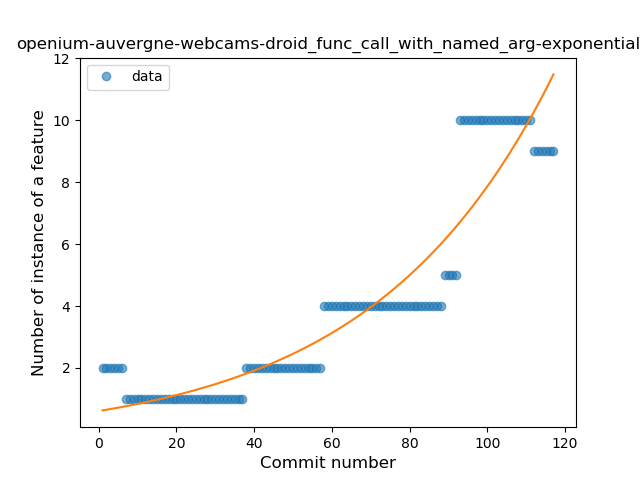
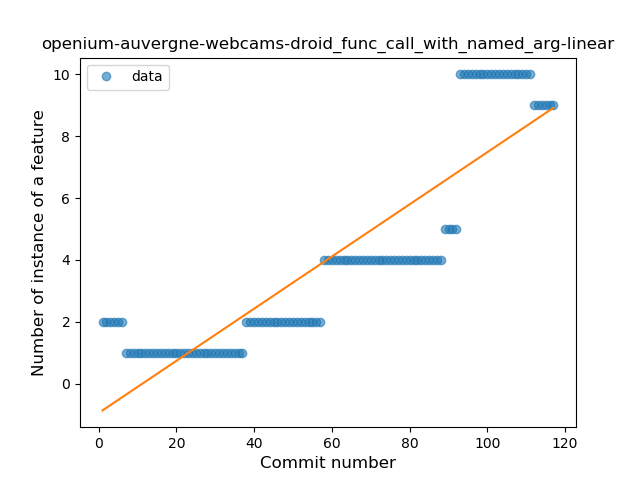
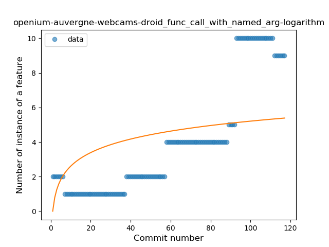
### <a name="data_class">Data Class</a>
----
#### Functions
* **Plateau Gradual Rise - Sigmoid:** 
    * **R_Squared:** 0.96933345
* **Sudden Rise - Exponential:** 
    * **R_Squared:** 0.80420855
* **Constant Rise - Linear:** 
    * **R_Squared:** 0.66448147
* **Sudden Rise Plateau - Logarithm:** 
    * **R_Squared:** 0.34839882

**Plots** :chart_with_upwards_trend:
-----

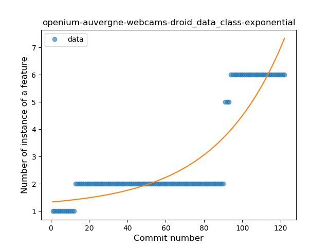
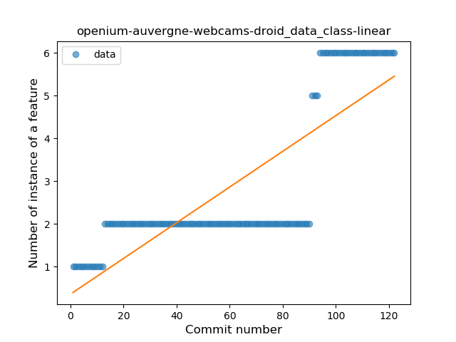
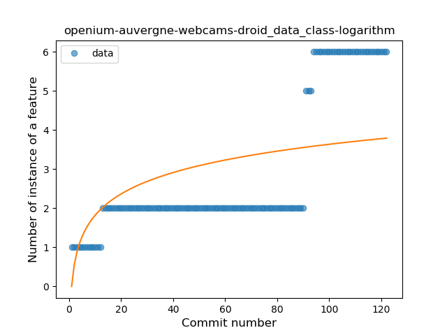
### <a name="extension_function">Extension Function</a>
----
#### Functions
* **Sudden Rise Plateau - Logarithm:** 
    * **R_Squared:** 0.17522967
* **Constant Rise - Linear:** 
    * **R_Squared:** 0.01708829

**Plots** :chart_with_upwards_trend:
-----

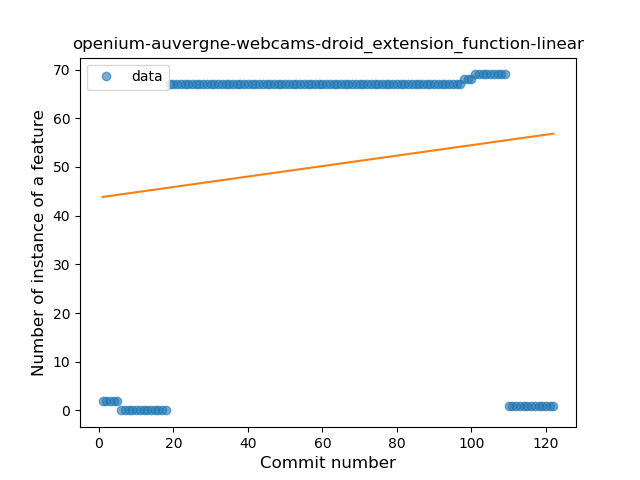
### <a name="property_delegation">Property Delegation</a>
----
#### Functions
* **Constant Rise - Linear:** 
    * **R_Squared:** 0.43820202
* **Sudden Rise Plateau - Logarithm:** 
    * **R_Squared:** 0.42280734

**Plots** :chart_with_upwards_trend:
-----

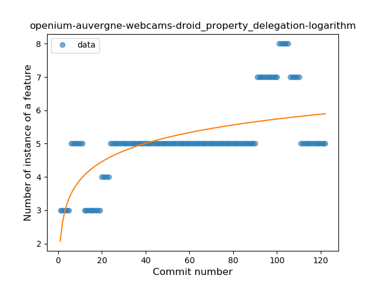
### <a name="inline_func">Inline Function</a>
----
#### Functions
* **Sudden Rise Plateau - Logarithm:** 
    * **R_Squared:** 0.09915317
* **Constant Rise - Linear:** 
    * **R_Squared:** 0.00385987

**Plots** :chart_with_upwards_trend:
-----

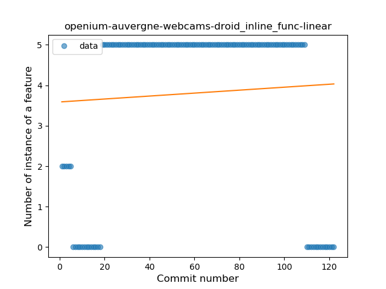
