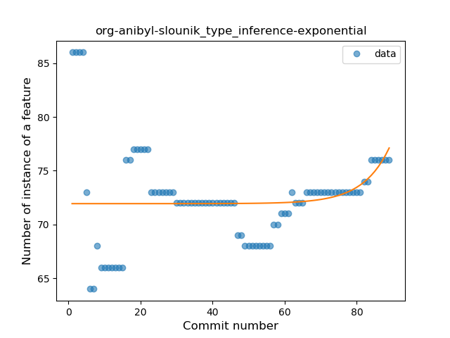
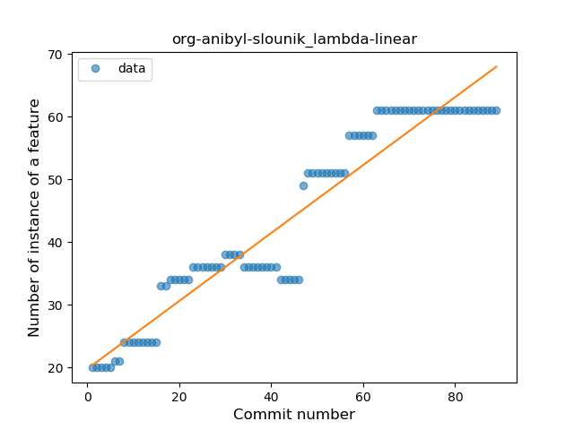
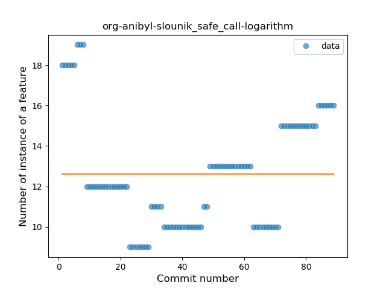
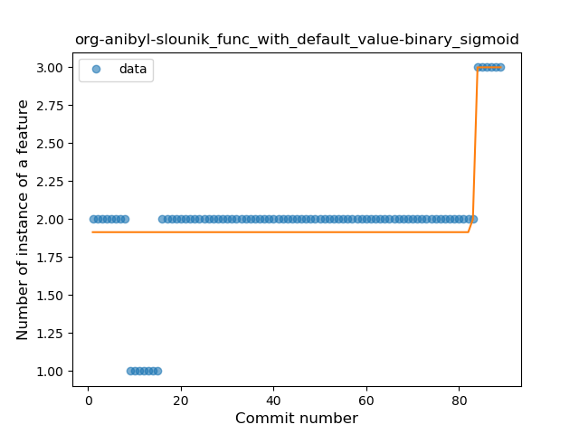
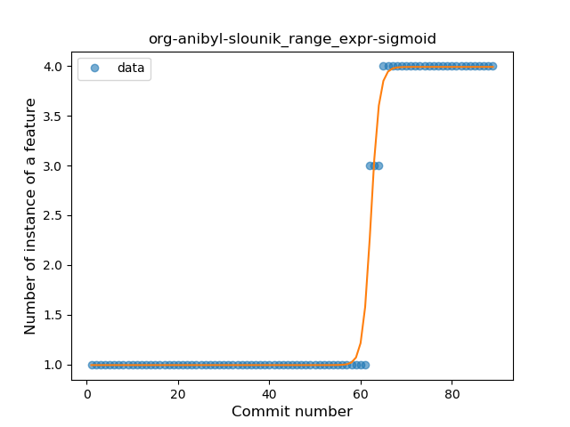

## org-anibyl-slounik
----
#### Metrics provided by Detekt
* Number of lines of code 2303
* Number of Kotlin files: 32
* Cyclomatic complexity: 244
* Cyclomatic complexity by thousands of lines: 222 

----
**14** features analyzed

*	<a href="#type_inference">Type Inference</a> 
*	<a href="#lambda">Lambda</a> 
*	<a href="#safe_call">Safe Call</a> 
*	<a href="#when_expr">When expression</a> 
*	<a href="#unsafe_call">Unsafe Call</a> 
*	<a href="#companion_object">Companion Object</a> 
*	<a href="#string_template">String Template</a> 
*	<a href="#func_with_default_value">Function with Default Value</a> 
*	<a href="#singleton">Singleton</a> 
*	<a href="#range_expr">Range Expression</a> 
*	<a href="#func_call_with_named_arg">Function call with Named Argument</a> 
*	<a href="#extension_function">Extension Function</a> 
*	<a href="#property_delegation">Property Delegation</a> 
*	<a href="#overloaded_op">Overloaded Operator</a> 

### <a name="type_inference">Type Inference</a>
----
#### Functions
* **Sudden Rise - Exponential:** 
    * **R_Squared:** 0.05821154
* **Constant Rise - Linear:** 
    * **R_Squared:** 1.79e-06
* **Sudden Rise Plateau - Logarithm:** 
    * **R_Squared:** -0.0
* **Plateau Sudden Decline - Binary Sigmoid:** 
    * **R_Squared:** 0.00874754

**Plots** :chart_with_upwards_trend:
-----

### <a name="lambda">Lambda</a>
----
#### Functions
* **Constant Rise - Linear:** 
    * **R_Squared:** 0.91609589
* **Sudden Rise Plateau - Logarithm:** 
    * **R_Squared:** 0.76352631

**Plots** :chart_with_upwards_trend:
-----

### <a name="safe_call">Safe Call</a>
----
#### Functions
* **Sudden Rise - Exponential:** 
    * **R_Squared:** 0.1829035
* **Constant Rise - Linear:** 
    * **R_Squared:** 0.00485791
* **Sudden Rise Plateau - Logarithm:** 
    * **R_Squared:** -0.0

**Plots** :chart_with_upwards_trend:
-----

### <a name="when_expr">When expression</a>
----
#### Functions
* **Plateau Gradual Rise - Sigmoid:** 
    * **R_Squared:** 0.88662368
* **Sudden Rise - Exponential:** 
    * **R_Squared:** 0.83366788
* **Constant Rise - Linear:** 
    * **R_Squared:** 0.80496428
* **Sudden Rise Plateau - Logarithm:** 
    * **R_Squared:** 0.58949494

**Plots** :chart_with_upwards_trend:
-----

### <a name="unsafe_call">Unsafe Call</a>
----
#### Functions
* **Instability - Polinomial 3:** )
    * **R_Squared:** 0.84174958
* **Constant Decline - Linear:** 
    * **R_Squared:** 0.39038079
* **Sudden Rise - Exponential:** 
    * **R_Squared:** -0.0
* **Sudden Rise Plateau - Logarithm:** 
    * **R_Squared:** -0.0

**Plots** :chart_with_upwards_trend:
-----

### <a name="companion_object">Companion Object</a>
----
#### Functions
* **Plateau Sudden Decline - Binary Sigmoid:** 
    * **R_Squared:** 0.63634988
* **Sudden Decline - Exponential:** 
    * **R_Squared:** 0.37818289
* **Constant Decline - Linear:** 
    * **R_Squared:** 0.01972265
* **Sudden Rise Plateau - Logarithm:** 
    * **R_Squared:** -0.0

**Plots** :chart_with_upwards_trend:
-----

### <a name="string_template">String Template</a>
----
#### Functions
* **Sudden Rise - Exponential:** 
    * **R_Squared:** 0.88247992
* **Instability - Polinomial 3:** )
    * **R_Squared:** 0.88511014
* **Constant Rise - Linear:** 
    * **R_Squared:** 0.64673773
* **Sudden Rise Plateau - Logarithm:** 
    * **R_Squared:** 0.32292047

**Plots** :chart_with_upwards_trend:
-----

### <a name="func_with_default_value">Function with Default Value</a>
----
#### Functions
* **Plateau Sudden Rise - Binary Sigmoid:** 
    * **R_Squared:** 0.50707869
* **Sudden Rise - Exponential:** 
    * **R_Squared:** 0.44319666
* **Constant Rise - Linear:** 
    * **R_Squared:** 0.30198176
* **Sudden Rise Plateau - Logarithm:** 
    * **R_Squared:** 0.17345916

**Plots** :chart_with_upwards_trend:
-----

### <a name="singleton">Singleton</a>
----
#### Functions
* **Sudden Decline - Exponential:** 
    * **R_Squared:** 0.92568396
* **Constant Decline - Linear:** 
    * **R_Squared:** 0.40094859
* **Sudden Rise Plateau - Logarithm:** 
    * **R_Squared:** -0.0

**Plots** :chart_with_upwards_trend:
-----

### <a name="range_expr">Range Expression</a>
----
#### Functions
* **Plateau Gradual Rise - Sigmoid:** 
    * **R_Squared:** 0.99186468
* **Sudden Rise - Exponential:** 
    * **R_Squared:** 0.78852939
* **Constant Rise - Linear:** 
    * **R_Squared:** 0.65582164
* **Sudden Rise Plateau - Logarithm:** 
    * **R_Squared:** 0.29887496

**Plots** :chart_with_upwards_trend:
-----

### <a name="func_call_with_named_arg">Function call with Named Argument</a>
----
#### Functions
* **Plateau Gradual Rise - Sigmoid:** 
    * **R_Squared:** 0.8375913
* **Sudden Rise Plateau - Logarithm:** 
    * **R_Squared:** 0.47475737
* **Constant Rise - Linear:** 
    * **R_Squared:** 0.19113401

**Plots** :chart_with_upwards_trend:
-----

### <a name="extension_function">Extension Function</a>
----
#### Functions
* **Plateau Gradual Rise - Sigmoid:** 
    * **R_Squared:** 0.78213549
* **Sudden Rise Plateau - Logarithm:** 
    * **R_Squared:** 0.5070508
* **Constant Rise - Linear:** 
    * **R_Squared:** 0.19298155

**Plots** :chart_with_upwards_trend:
-----

### <a name="property_delegation">Property Delegation</a>
----
#### Functions
* **Instability - Polinomial 3:** )
    * **R_Squared:** 0.81279175
* **Sudden Decline - Exponential:** 
    * **R_Squared:** 0.78888288
* **Constant Decline - Linear:** 
    * **R_Squared:** 0.38101604
* **Sudden Rise Plateau - Logarithm:** 
    * **R_Squared:** 0.0

**Plots** :chart_with_upwards_trend:
-----

### <a name="overloaded_op">Overloaded Operator</a>
----
#### Functions
* **Sudden Decline - Exponential:** 
    * **R_Squared:** 0.90674059
* **Constant Decline - Linear:** 
    * **R_Squared:** 0.20218651
* **Sudden Rise Plateau - Logarithm:** 
    * **R_Squared:** -0.0

**Plots** :chart_with_upwards_trend:
-----

