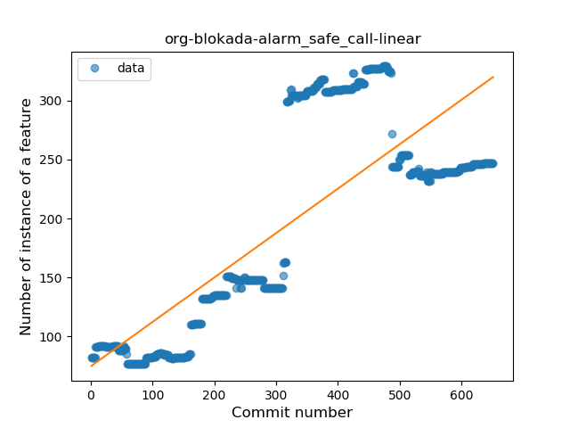
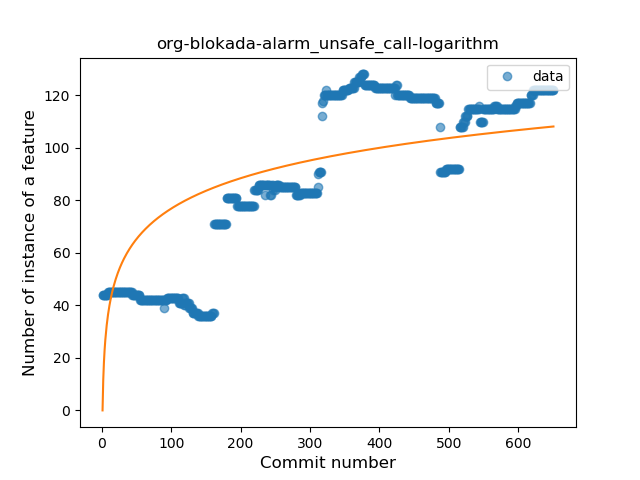
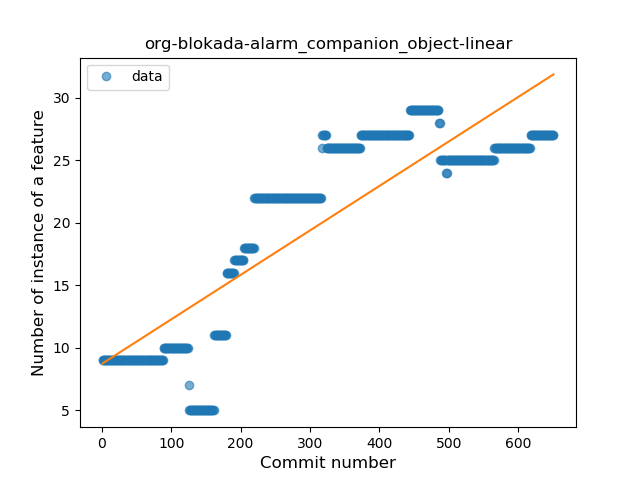
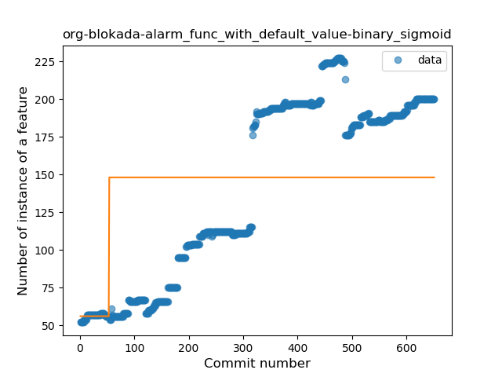
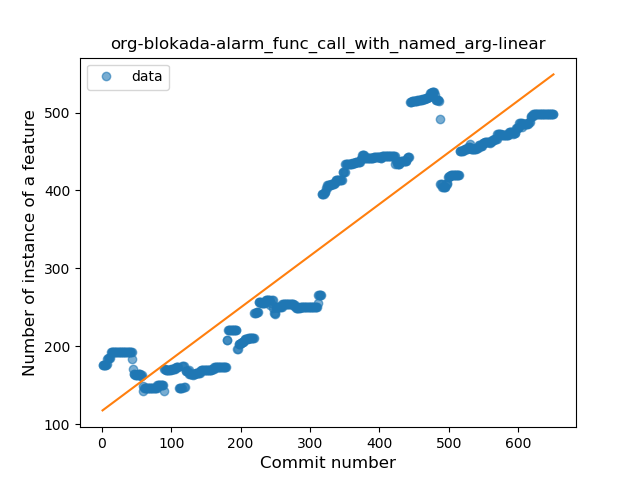

## org-blokada-alarm
----
#### Metrics provided by Detekt
* Number of lines of code 23498
* Number of Kotlin files: 182
* Cyclomatic complexity: 3934
* Cyclomatic complexity by thousands of lines: 274 

----
**21** features analyzed

*	<a href="#type_inference">Type Inference</a> 
*	<a href="#lambda">Lambda</a> 
*	<a href="#safe_call">Safe Call</a> 
*	<a href="#when_expr">When expression</a> 
*	<a href="#unsafe_call">Unsafe Call</a> 
*	<a href="#companion_object">Companion Object</a> 
*	<a href="#string_template">String Template</a> 
*	<a href="#func_with_default_value">Function with Default Value</a> 
*	<a href="#singleton">Singleton</a> 
*	<a href="#range_expr">Range Expression</a> 
*	<a href="#smart_cast">Smart Cast</a> 
*	<a href="#data_class">Data Class</a> 
*	<a href="#func_call_with_named_arg">Function call with Named Argument</a> 
*	<a href="#extension_function">Extension Function</a> 
*	<a href="#property_delegation">Property Delegation</a> 
*	<a href="#destructuring_declaration">Destructuring Declaration</a> 
*	<a href="#overloaded_op">Overloaded Operator</a> 
*	<a href="#coroutine">Coroutine</a> 
*	<a href="#sealed_class">Sealed Class</a> 
*	<a href="#type_alias">Type Alias</a> 
*	<a href="#super_delegation">Super Delegation</a> 

### <a name="type_inference">Type Inference</a>
----
#### Functions
* **Constant Rise - Linear:** 
    * **R_Squared:** 0.690589
* **Sudden Rise Plateau - Logarithm:** 
    * **R_Squared:** 0.51931756

**Plots** :chart_with_upwards_trend:
-----

### <a name="lambda">Lambda</a>
----
#### Functions
* **Constant Rise - Linear:** 
    * **R_Squared:** 0.59184189
* **Sudden Rise Plateau - Logarithm:** 
    * **R_Squared:** 0.51695887

**Plots** :chart_with_upwards_trend:
-----

### <a name="safe_call">Safe Call</a>
----
#### Functions
* **Constant Rise - Linear:** 
    * **R_Squared:** 0.61919382
* **Sudden Rise Plateau - Logarithm:** 
    * **R_Squared:** 0.4216674
* **Plateau Sudden Rise - Binary Sigmoid:** 
    * **R_Squared:** 0.14988543

**Plots** :chart_with_upwards_trend:
-----

### <a name="when_expr">When expression</a>
----
#### Functions
* **Plateau Gradual Rise - Sigmoid:** 
    * **R_Squared:** 0.95810987
* **Constant Rise - Linear:** 
    * **R_Squared:** 0.82174764
* **Sudden Rise Plateau - Logarithm:** 
    * **R_Squared:** 0.43508649

**Plots** :chart_with_upwards_trend:
-----

### <a name="unsafe_call">Unsafe Call</a>
----
#### Functions
* **Constant Rise - Linear:** 
    * **R_Squared:** 0.75248096
* **Sudden Rise Plateau - Logarithm:** 
    * **R_Squared:** 0.57041124

**Plots** :chart_with_upwards_trend:
-----

### <a name="companion_object">Companion Object</a>
----
#### Functions
* **Constant Rise - Linear:** 
    * **R_Squared:** 0.741102
* **Sudden Rise Plateau - Logarithm:** 
    * **R_Squared:** 0.54991305
* **Plateau Gradual Decline - Sigmoid:** 
    * **R_Squared:** 0.0

**Plots** :chart_with_upwards_trend:
-----

### <a name="string_template">String Template</a>
----
#### Functions
* **Constant Rise - Linear:** 
    * **R_Squared:** 0.82099221
* **Sudden Rise Plateau - Logarithm:** 
    * **R_Squared:** 0.56171112
* **Plateau Sudden Rise - Binary Sigmoid:** 
    * **R_Squared:** 0.37193149

**Plots** :chart_with_upwards_trend:
-----

### <a name="func_with_default_value">Function with Default Value</a>
----
#### Functions
* **Constant Rise - Linear:** 
    * **R_Squared:** 0.82144424
* **Sudden Rise Plateau - Logarithm:** 
    * **R_Squared:** 0.5146185
* **Plateau Sudden Rise - Binary Sigmoid:** 
    * **R_Squared:** 0.17504426

**Plots** :chart_with_upwards_trend:
-----

### <a name="singleton">Singleton</a>
----
#### Functions
* **Constant Rise - Linear:** 
    * **R_Squared:** 0.78344512
* **Sudden Rise Plateau - Logarithm:** 
    * **R_Squared:** 0.67533422

**Plots** :chart_with_upwards_trend:
-----

### <a name="range_expr">Range Expression</a>
----
#### Functions
* **Plateau Gradual Rise - Sigmoid:** 
    * **R_Squared:** 0.94783939
* **Constant Rise - Linear:** 
    * **R_Squared:** 0.82648645
* **Sudden Rise Plateau - Logarithm:** 
    * **R_Squared:** 0.3692209

**Plots** :chart_with_upwards_trend:
-----

### <a name="smart_cast">Smart Cast</a>
----
#### Functions
* **Sudden Rise - Exponential:** 
    * **R_Squared:** 0.36149058
* **Constant Rise - Linear:** 
    * **R_Squared:** 0.34527544
* **Sudden Rise Plateau - Logarithm:** 
    * **R_Squared:** 0.1926751

**Plots** :chart_with_upwards_trend:
-----

### <a name="data_class">Data Class</a>
----
#### Functions
* **Constant Rise - Linear:** 
    * **R_Squared:** 0.72607067
* **Sudden Rise Plateau - Logarithm:** 
    * **R_Squared:** 0.38675194

**Plots** :chart_with_upwards_trend:
-----

### <a name="func_call_with_named_arg">Function call with Named Argument</a>
----
#### Functions
* **Constant Rise - Linear:** 
    * **R_Squared:** 0.85977755
* **Sudden Rise Plateau - Logarithm:** 
    * **R_Squared:** 0.49396219

**Plots** :chart_with_upwards_trend:
-----

### <a name="extension_function">Extension Function</a>
----
#### Functions
* **Constant Rise - Linear:** 
    * **R_Squared:** 0.86509794
* **Sudden Rise Plateau - Logarithm:** 
    * **R_Squared:** 0.40422118

**Plots** :chart_with_upwards_trend:
-----

### <a name="property_delegation">Property Delegation</a>
----
#### Functions
* **Constant Decline - Linear:** 
    * **R_Squared:** 0.02110515
* **Sudden Rise Plateau - Logarithm:** 
    * **R_Squared:** 0.01016987
* **Sudden Decline - Exponential:** 
    * **R_Squared:** 0.0

**Plots** :chart_with_upwards_trend:
-----

### <a name="destructuring_declaration">Destructuring Declaration</a>
----
#### Functions
* **Constant Rise - Linear:** 
    * **R_Squared:** 0.75691089
* **Sudden Rise Plateau - Logarithm:** 
    * **R_Squared:** 0.4421556

**Plots** :chart_with_upwards_trend:
-----

### <a name="overloaded_op">Overloaded Operator</a>
----
#### Functions
* **Constant Rise - Linear:** 
    * **R_Squared:** 0.06285368
* **Sudden Rise - Exponential:** 
    * **R_Squared:** 0.06285265
* **Sudden Rise Plateau - Logarithm:** 
    * **R_Squared:** 0.01998552
* **Plateau Sudden Decline - Binary Sigmoid:** 
    * **R_Squared:** 0.00283345

**Plots** :chart_with_upwards_trend:
-----

### <a name="coroutine">Coroutine</a>
----
#### Functions
* **Sudden Rise - Exponential:** 
    * **R_Squared:** 0.86144663
* **Constant Rise - Linear:** 
    * **R_Squared:** 0.80662451
* **Sudden Rise Plateau - Logarithm:** 
    * **R_Squared:** 0.50297639

**Plots** :chart_with_upwards_trend:
-----

### <a name="sealed_class">Sealed Class</a>
----
#### Functions
* **Sudden Rise - Exponential:** 
    * **R_Squared:** 0.5301215
* **Constant Rise - Linear:** 
    * **R_Squared:** 0.22462913
* **Plateau Sudden Decline - Binary Sigmoid:** 
    * **R_Squared:** 0.14874494
* **Sudden Rise Plateau - Logarithm:** 
    * **R_Squared:** 0.00934307

**Plots** :chart_with_upwards_trend:
-----

### <a name="type_alias">Type Alias</a>
----
#### Functions
* **Plateau Gradual Rise - Sigmoid:** 
    * **R_Squared:** 0.97490726
* **Constant Rise - Linear:** 
    * **R_Squared:** 0.7270699
* **Sudden Rise Plateau - Logarithm:** 
    * **R_Squared:** 0.41656916

**Plots** :chart_with_upwards_trend:
-----

### <a name="super_delegation">Super Delegation</a>
----
#### Functions
* **Plateau Sudden Rise - Binary Sigmoid:** 
    * **R_Squared:** 1.0
* **Sudden Rise Plateau - Logarithm:** 
    * **R_Squared:** 0.46796456
* **Constant Rise - Linear:** 
    * **R_Squared:** 0.14398331

**Plots** :chart_with_upwards_trend:
-----

