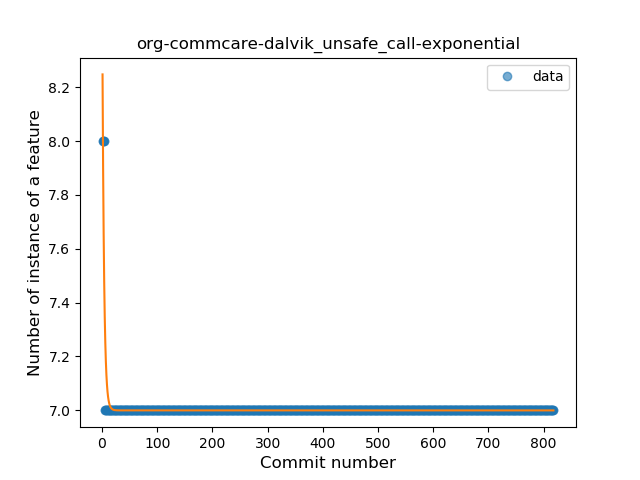

## org-commcare-dalvik
----
#### Metrics provided by Detekt
* Number of lines of code 257
* Number of Kotlin files: 3
* Cyclomatic complexity: 40
* Cyclomatic complexity by thousands of lines: 285 

----
**3** features analyzed

*	<a href="#type_inference">Type Inference</a> 
*	<a href="#unsafe_call">Unsafe Call</a> 
*	<a href="#companion_object">Companion Object</a> 

### <a name="type_inference">Type Inference</a>
----
#### Functions
* **Sudden Rise - Exponential:** 
    * **R_Squared:** 0.84461384
* **Constant Rise - Linear:** 
    * **R_Squared:** 0.18882077
* **Sudden Rise Plateau - Logarithm:** 
    * **R_Squared:** 0.070725

**Plots** :chart_with_upwards_trend:
-----

### <a name="unsafe_call">Unsafe Call</a>
----
#### Functions
* **Sudden Decline - Exponential:** 
    * **R_Squared:** 0.82057794
* **Plateau Gradual Decline - Sigmoid:** 
    * **R_Squared:** 0.26306306
* **Constant Decline - Linear:** 
    * **R_Squared:** 0.01459821
* **Sudden Rise Plateau - Logarithm:** 
    * **R_Squared:** -0.0

**Plots** :chart_with_upwards_trend:
-----

### <a name="companion_object">Companion Object</a>
----
#### Functions
* **Plateau Sudden Decline - Binary Sigmoid:** 
    * **R_Squared:** 1.0
* **Sudden Decline - Exponential:** 
    * **R_Squared:** 0.80487876
* **Constant Decline - Linear:** 
    * **R_Squared:** 0.15921736
* **Sudden Rise Plateau - Logarithm:** 
    * **R_Squared:** -0.0

**Plots** :chart_with_upwards_trend:
-----

