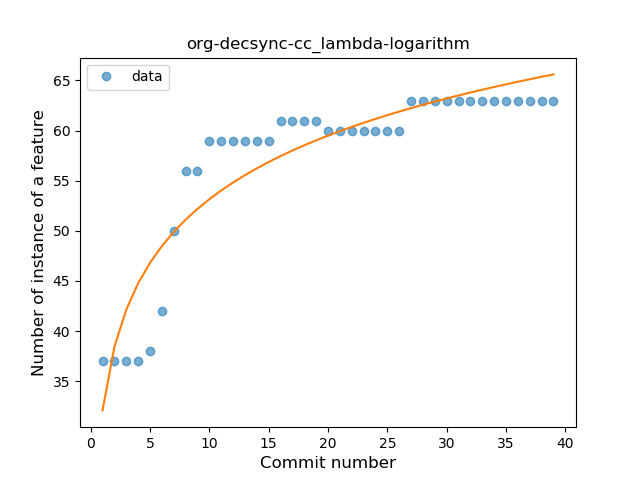

## org-decsync-cc
----
#### Metrics provided by Detekt
* Number of lines of code 2044
* Number of Kotlin files: 16
* Cyclomatic complexity: 299
* Cyclomatic complexity by thousands of lines: 275 

----
**9** features analyzed

*	<a href="#type_inference">Type Inference</a> 
*	<a href="#lambda">Lambda</a> 
*	<a href="#safe_call">Safe Call</a> 
*	<a href="#when_expr">When expression</a> 
*	<a href="#unsafe_call">Unsafe Call</a> 
*	<a href="#string_template">String Template</a> 
*	<a href="#singleton">Singleton</a> 
*	<a href="#smart_cast">Smart Cast</a> 
*	<a href="#func_call_with_named_arg">Function call with Named Argument</a> 

### <a name="type_inference">Type Inference</a>
----
#### Functions
* **Sudden Rise Plateau - Logarithm:** 
    * **R_Squared:** 0.87378245
* **Constant Rise - Linear:** 
    * **R_Squared:** 0.66405961

**Plots** :chart_with_upwards_trend:
-----

### <a name="lambda">Lambda</a>
----
#### Functions
* **Instability - Polinomial 3:** )
    * **R_Squared:** 0.91941606
* **Sudden Rise Plateau - Logarithm:** 
    * **R_Squared:** 0.84625652
* **Constant Rise - Linear:** 
    * **R_Squared:** 0.61942125

**Plots** :chart_with_upwards_trend:
-----

### <a name="safe_call">Safe Call</a>
----
#### Functions
* **Constant Rise - Linear:** 
    * **R_Squared:** 0.90033316
* **Sudden Rise Plateau - Logarithm:** 
    * **R_Squared:** 0.90689303

**Plots** :chart_with_upwards_trend:
-----

### <a name="when_expr">When expression</a>
----
#### Functions
* **Instability - Polinomial 3:** )
    * **R_Squared:** 0.88321264
* **Sudden Rise Plateau - Logarithm:** 
    * **R_Squared:** 0.7194416
* **Constant Rise - Linear:** 
    * **R_Squared:** 0.42911322

**Plots** :chart_with_upwards_trend:
-----

### <a name="unsafe_call">Unsafe Call</a>
----
#### Functions
* **Constant Rise - Linear:** 
    * **R_Squared:** 0.74648181
* **Sudden Rise Plateau - Logarithm:** 
    * **R_Squared:** 0.71039908

**Plots** :chart_with_upwards_trend:
-----

### <a name="string_template">String Template</a>
----
#### Functions
* **Instability - Polinomial 3:** )
    * **R_Squared:** 0.70662167
* **Sudden Rise Plateau - Logarithm:** 
    * **R_Squared:** 0.38798499
* **Constant Rise - Linear:** 
    * **R_Squared:** 0.16284079

**Plots** :chart_with_upwards_trend:
-----

### <a name="singleton">Singleton</a>
----
#### Functions
* **Instability - Polinomial 3:** )
    * **R_Squared:** 0.79967965
* **Sudden Rise Plateau - Logarithm:** 
    * **R_Squared:** 0.62725971
* **Constant Rise - Linear:** 
    * **R_Squared:** 0.33552632

**Plots** :chart_with_upwards_trend:
-----

### <a name="smart_cast">Smart Cast</a>
----
#### Functions
* **Plateau Sudden Decline - Binary Sigmoid:** 
    * **R_Squared:** 1.0
* **Instability - Polinomial 3:** )
    * **R_Squared:** 0.8598385
* **Constant Decline - Linear:** 
    * **R_Squared:** 0.75
* **Sudden Decline - Exponential:** 
    * **R_Squared:** 0.75054969
* **Sudden Rise Plateau - Logarithm:** 
    * **R_Squared:** -0.0

**Plots** :chart_with_upwards_trend:
-----

### <a name="func_call_with_named_arg">Function call with Named Argument</a>
----
#### Functions
* **Plateau Sudden Decline - Binary Sigmoid:** 
    * **R_Squared:** 1.0
* **Sudden Decline - Exponential:** 
    * **R_Squared:** 0.75614201
* **Constant Decline - Linear:** 
    * **R_Squared:** 0.70381232
* **Sudden Rise Plateau - Logarithm:** 
    * **R_Squared:** -0.0

**Plots** :chart_with_upwards_trend:
-----

