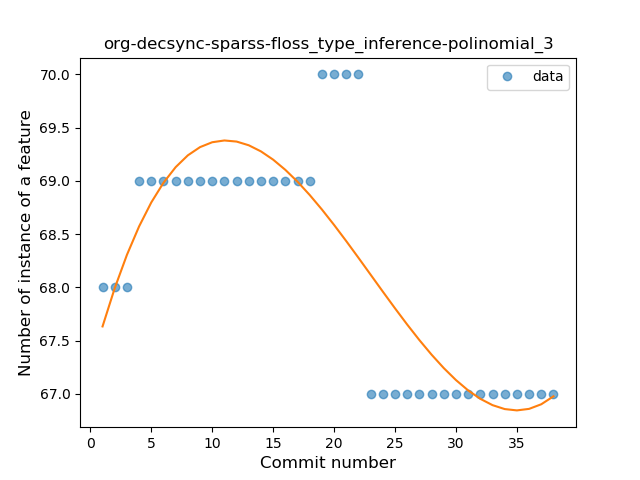
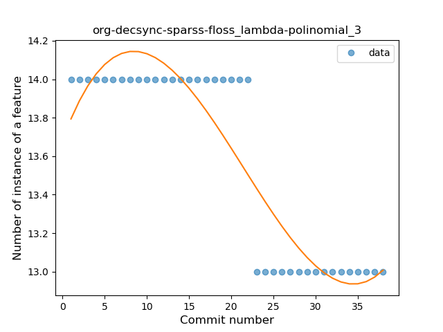
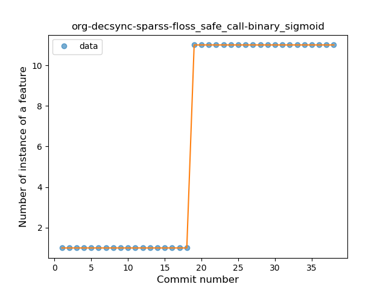
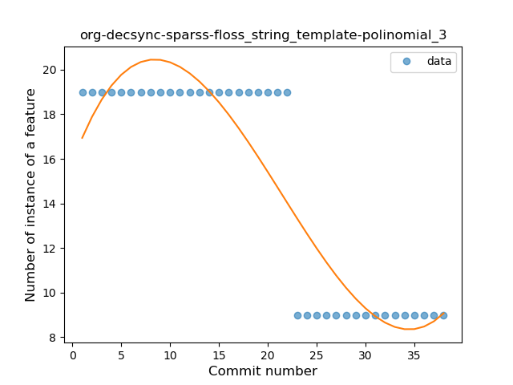

## org-decsync-sparss-floss
----
#### Metrics provided by Detekt
* Number of lines of code 527
* Number of Kotlin files: 3
* Cyclomatic complexity: 100
* Cyclomatic complexity by thousands of lines: 343 

----
**8** features analyzed

*	<a href="#type_inference">Type Inference</a> 
*	<a href="#lambda">Lambda</a> 
*	<a href="#safe_call">Safe Call</a> 
*	<a href="#when_expr">When expression</a> 
*	<a href="#unsafe_call">Unsafe Call</a> 
*	<a href="#string_template">String Template</a> 
*	<a href="#smart_cast">Smart Cast</a> 
*	<a href="#func_call_with_named_arg">Function call with Named Argument</a> 

### <a name="type_inference">Type Inference</a>
----
#### Functions
* **Instability - Polinomial 3:** )
    * **R_Squared:** 0.69115225
* **Constant Decline - Linear:** 
    * **R_Squared:** 0.41805177
* **Sudden Rise Plateau - Logarithm:** 
    * **R_Squared:** -0.0

**Plots** :chart_with_upwards_trend:
-----

### <a name="lambda">Lambda</a>
----
#### Functions
* **Instability - Polinomial 3:** )
    * **R_Squared:** 0.84429458
* **Constant Decline - Linear:** 
    * **R_Squared:** 0.73180873
* **Sudden Rise Plateau - Logarithm:** 
    * **R_Squared:** -0.0

**Plots** :chart_with_upwards_trend:
-----

### <a name="safe_call">Safe Call</a>
----
#### Functions
* **Plateau Sudden Rise - Binary Sigmoid:** 
    * **R_Squared:** 1.0
* **Instability - Polinomial 3:** )
    * **R_Squared:** 0.85841235
* **Constant Rise - Linear:** 
    * **R_Squared:** 0.74844075
* **Sudden Rise Plateau - Logarithm:** 
    * **R_Squared:** 0.45830902

**Plots** :chart_with_upwards_trend:
-----

### <a name="when_expr">When expression</a>
----
#### Functions
* **Instability - Polinomial 3:** )
    * **R_Squared:** 0.84429458
* **Constant Decline - Linear:** 
    * **R_Squared:** 0.73180873
* **Sudden Rise Plateau - Logarithm:** 
    * **R_Squared:** -0.0

**Plots** :chart_with_upwards_trend:
-----

### <a name="unsafe_call">Unsafe Call</a>
----
#### Functions
* **Plateau Sudden Rise - Binary Sigmoid:** 
    * **R_Squared:** 0.99582672
* **Instability - Polinomial 4:** 
    * **R_Squared:** 0.84595537
* **Instability - Polinomial 3:** )
    * **R_Squared:** 0.81097431
* **Sudden Rise - Exponential:** 
    * **R_Squared:** 0.72294376
* **Constant Rise - Linear:** 
    * **R_Squared:** 0.69664709
* **Sudden Rise Plateau - Logarithm:** 
    * **R_Squared:** 0.3407135

**Plots** :chart_with_upwards_trend:
-----

### <a name="string_template">String Template</a>
----
#### Functions
* **Instability - Polinomial 4:** 
    * **R_Squared:** 0.87188833
* **Instability - Polinomial 3:** )
    * **R_Squared:** 0.84429458
* **Constant Decline - Linear:** 
    * **R_Squared:** 0.73180873
* **Sudden Rise Plateau - Logarithm:** 
    * **R_Squared:** -0.0

**Plots** :chart_with_upwards_trend:
-----

### <a name="smart_cast">Smart Cast</a>
----
#### Functions
* **Plateau Sudden Decline - Binary Sigmoid:** 
    * **R_Squared:** 1.0
* **Instability - Polinomial 4:** 
    * **R_Squared:** 0.87188833
* **Instability - Polinomial 3:** )
    * **R_Squared:** 0.84429458
* **Constant Decline - Linear:** 
    * **R_Squared:** 0.73180873
* **Sudden Rise Plateau - Logarithm:** 
    * **R_Squared:** -0.0

**Plots** :chart_with_upwards_trend:
-----

### <a name="func_call_with_named_arg">Function call with Named Argument</a>
----
#### Functions
* **Plateau Sudden Decline - Binary Sigmoid:** 
    * **R_Squared:** 1.0
* **Instability - Polinomial 3:** )
    * **R_Squared:** 0.84429458
* **Constant Decline - Linear:** 
    * **R_Squared:** 0.73180873
* **Sudden Rise Plateau - Logarithm:** 
    * **R_Squared:** 0.0

**Plots** :chart_with_upwards_trend:
-----

