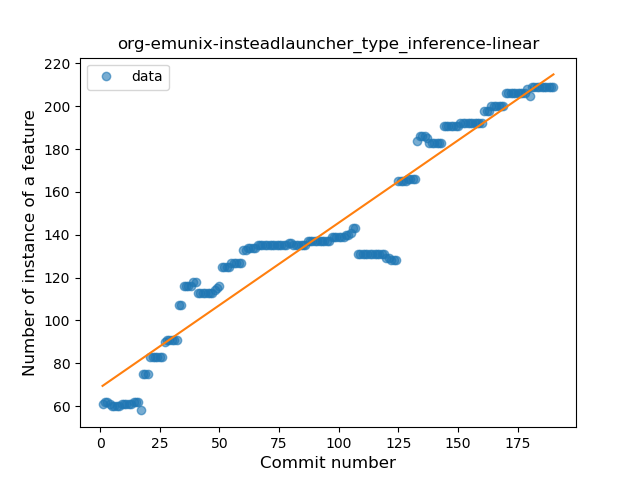
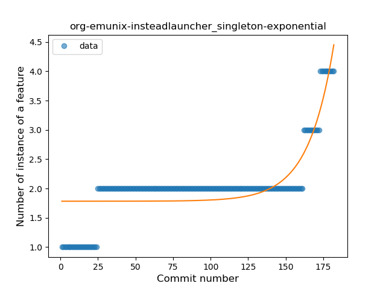
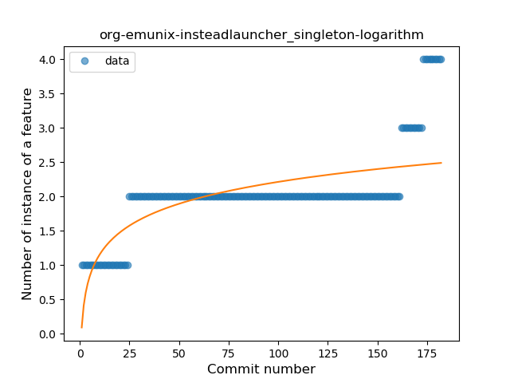
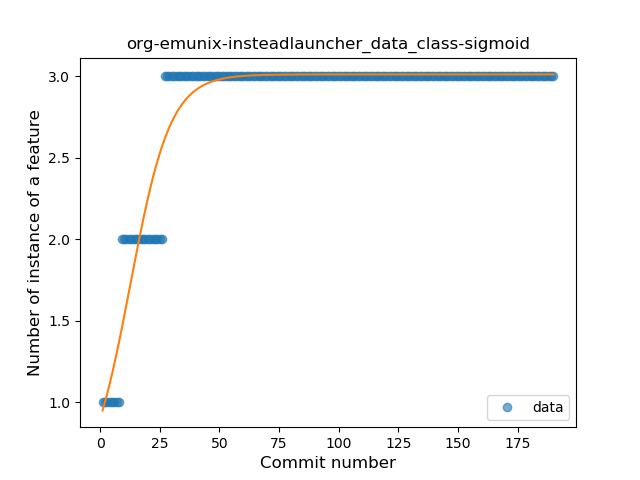
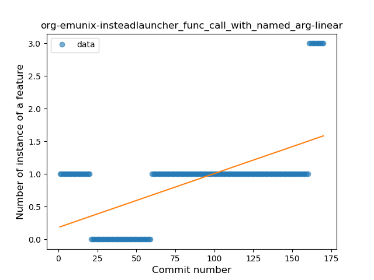
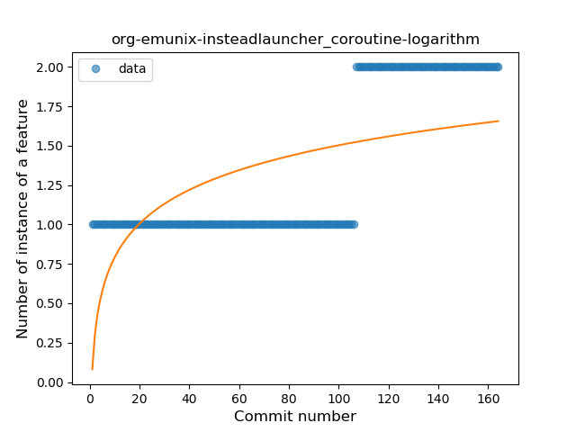

## org-emunix-insteadlauncher
----
#### Metrics provided by Detekt
* Number of lines of code 3168
* Number of Kotlin files: 46
* Cyclomatic complexity: 494
* Cyclomatic complexity by thousands of lines: 311 

----
**15** features analyzed

*	<a href="#type_inference">Type Inference</a> 
*	<a href="#lambda">Lambda</a> 
*	<a href="#safe_call">Safe Call</a> 
*	<a href="#when_expr">When expression</a> 
*	<a href="#unsafe_call">Unsafe Call</a> 
*	<a href="#companion_object">Companion Object</a> 
*	<a href="#string_template">String Template</a> 
*	<a href="#func_with_default_value">Function with Default Value</a> 
*	<a href="#singleton">Singleton</a> 
*	<a href="#range_expr">Range Expression</a> 
*	<a href="#data_class">Data Class</a> 
*	<a href="#func_call_with_named_arg">Function call with Named Argument</a> 
*	<a href="#extension_function">Extension Function</a> 
*	<a href="#destructuring_declaration">Destructuring Declaration</a> 
*	<a href="#coroutine">Coroutine</a> 

### <a name="type_inference">Type Inference</a>
----
#### Functions
* **Constant Rise - Linear:** 
    * **R_Squared:** 0.91916394
* **Sudden Rise Plateau - Logarithm:** 
    * **R_Squared:** 0.76077295
* **Plateau Sudden Rise - Binary Sigmoid:** 
    * **R_Squared:** 0.718338

**Plots** :chart_with_upwards_trend:
-----

### <a name="lambda">Lambda</a>
----
#### Functions
* **Constant Rise - Linear:** 
    * **R_Squared:** 0.94598679
* **Sudden Rise Plateau - Logarithm:** 
    * **R_Squared:** 0.75923923

**Plots** :chart_with_upwards_trend:
-----

### <a name="safe_call">Safe Call</a>
----
#### Functions
* **Sudden Rise - Exponential:** 
    * **R_Squared:** 0.8520104
* **Constant Rise - Linear:** 
    * **R_Squared:** 0.82821194
* **Sudden Rise Plateau - Logarithm:** 
    * **R_Squared:** 0.56936107

**Plots** :chart_with_upwards_trend:
-----

### <a name="when_expr">When expression</a>
----
#### Functions
* **Plateau Gradual Rise - Sigmoid:** 
    * **R_Squared:** 0.92320559
* **Sudden Rise Plateau - Logarithm:** 
    * **R_Squared:** 0.6883966
* **Constant Rise - Linear:** 
    * **R_Squared:** 0.52916506

**Plots** :chart_with_upwards_trend:
-----

### <a name="unsafe_call">Unsafe Call</a>
----
#### Functions
* **Constant Rise - Linear:** 
    * **R_Squared:** 0.98129483
* **Sudden Rise Plateau - Logarithm:** 
    * **R_Squared:** 0.5847222

**Plots** :chart_with_upwards_trend:
-----

### <a name="companion_object">Companion Object</a>
----
#### Functions
* **Constant Rise - Linear:** 
    * **R_Squared:** 0.84768346
* **Plateau Gradual Rise - Sigmoid:** 
    * **R_Squared:** 0.84804515
* **Sudden Rise Plateau - Logarithm:** 
    * **R_Squared:** 0.67012377

**Plots** :chart_with_upwards_trend:
-----

### <a name="string_template">String Template</a>
----
#### Functions
* **Constant Rise - Linear:** 
    * **R_Squared:** 0.91147948
* **Sudden Rise Plateau - Logarithm:** 
    * **R_Squared:** 0.74705215

**Plots** :chart_with_upwards_trend:
-----

### <a name="func_with_default_value">Function with Default Value</a>
----
#### Functions
* **Plateau Gradual Rise - Sigmoid:** 
    * **R_Squared:** 0.97962471
* **Sudden Rise Plateau - Logarithm:** 
    * **R_Squared:** 0.81757514
* **Constant Rise - Linear:** 
    * **R_Squared:** 0.46124374

**Plots** :chart_with_upwards_trend:
-----

### <a name="singleton">Singleton</a>
----
#### Functions
* **Sudden Rise - Exponential:** 
    * **R_Squared:** 0.6963262
* **Plateau Gradual Rise - Sigmoid:** 
    * **R_Squared:** 0.70586446
* **Constant Rise - Linear:** 
    * **R_Squared:** 0.52664423
* **Sudden Rise Plateau - Logarithm:** 
    * **R_Squared:** 0.46579564

**Plots** :chart_with_upwards_trend:
-----

### <a name="range_expr">Range Expression</a>
----
#### Functions
* **Plateau Gradual Decline - Sigmoid:** 
    * **R_Squared:** 0.73888997
* **Constant Decline - Linear:** 
    * **R_Squared:** 0.53418364
* **Sudden Rise Plateau - Logarithm:** 
    * **R_Squared:** -0.0

**Plots** :chart_with_upwards_trend:
-----

### <a name="data_class">Data Class</a>
----
#### Functions
* **Plateau Gradual Rise - Sigmoid:** 
    * **R_Squared:** 0.92313893
* **Sudden Rise Plateau - Logarithm:** 
    * **R_Squared:** 0.71035534
* **Constant Rise - Linear:** 
    * **R_Squared:** 0.3258696

**Plots** :chart_with_upwards_trend:
-----

### <a name="func_call_with_named_arg">Function call with Named Argument</a>
----
#### Functions
* **Sudden Rise - Exponential:** 
    * **R_Squared:** 0.56155777
* **Constant Rise - Linear:** 
    * **R_Squared:** 0.36180531
* **Sudden Rise Plateau - Logarithm:** 
    * **R_Squared:** 0.1262547

**Plots** :chart_with_upwards_trend:
-----

### <a name="extension_function">Extension Function</a>
----
#### Functions
* **Constant Rise - Linear:** 
    * **R_Squared:** 0.79661095
* **Sudden Rise - Exponential:** 
    * **R_Squared:** 0.7971167
* **Sudden Rise Plateau - Logarithm:** 
    * **R_Squared:** 0.79273436

**Plots** :chart_with_upwards_trend:
-----

### <a name="destructuring_declaration">Destructuring Declaration</a>
----
#### Functions
* **Plateau Sudden Rise - Binary Sigmoid:** 
    * **R_Squared:** 0.89372795
* **Constant Rise - Linear:** 
    * **R_Squared:** 0.76048583
* **Sudden Rise Plateau - Logarithm:** 
    * **R_Squared:** 0.69188423

**Plots** :chart_with_upwards_trend:
-----

### <a name="coroutine">Coroutine</a>
----
#### Functions
* **Plateau Sudden Rise - Binary Sigmoid:** 
    * **R_Squared:** 1.0
* **Sudden Rise - Exponential:** 
    * **R_Squared:** 0.757122
* **Constant Rise - Linear:** 
    * **R_Squared:** 0.68577803
* **Sudden Rise Plateau - Logarithm:** 
    * **R_Squared:** 0.37291249

**Plots** :chart_with_upwards_trend:
-----

