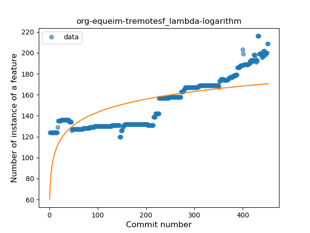
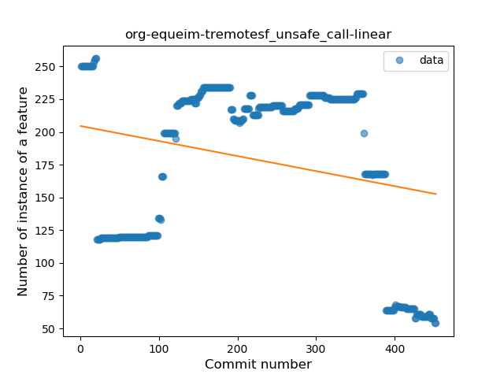
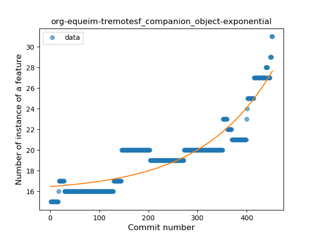

## org-equeim-tremotesf
----
#### Metrics provided by Detekt
* Number of lines of code 9571
* Number of Kotlin files: 52
* Cyclomatic complexity: 1317
* Cyclomatic complexity by thousands of lines: 268 

----
**18** features analyzed

*	<a href="#type_inference">Type Inference</a> 
*	<a href="#lambda">Lambda</a> 
*	<a href="#safe_call">Safe Call</a> 
*	<a href="#when_expr">When expression</a> 
*	<a href="#unsafe_call">Unsafe Call</a> 
*	<a href="#companion_object">Companion Object</a> 
*	<a href="#string_template">String Template</a> 
*	<a href="#func_with_default_value">Function with Default Value</a> 
*	<a href="#singleton">Singleton</a> 
*	<a href="#range_expr">Range Expression</a> 
*	<a href="#smart_cast">Smart Cast</a> 
*	<a href="#data_class">Data Class</a> 
*	<a href="#func_call_with_named_arg">Function call with Named Argument</a> 
*	<a href="#extension_function">Extension Function</a> 
*	<a href="#property_delegation">Property Delegation</a> 
*	<a href="#destructuring_declaration">Destructuring Declaration</a> 
*	<a href="#inline_func">Inline Function</a> 
*	<a href="#overloaded_op">Overloaded Operator</a> 

### <a name="type_inference">Type Inference</a>
----
#### Functions
* **Sudden Decline - Exponential:** 
    * **R_Squared:** 0.67926502
* **Constant Decline - Linear:** 
    * **R_Squared:** 0.50754809
* **Sudden Rise Plateau - Logarithm:** 
    * **R_Squared:** 0.0

**Plots** :chart_with_upwards_trend:
-----

### <a name="lambda">Lambda</a>
----
#### Functions
* **Sudden Rise - Exponential:** 
    * **R_Squared:** 0.93639111
* **Constant Rise - Linear:** 
    * **R_Squared:** 0.87678044
* **Sudden Rise Plateau - Logarithm:** 
    * **R_Squared:** 0.51759804

**Plots** :chart_with_upwards_trend:
-----

### <a name="safe_call">Safe Call</a>
----
#### Functions
* **Sudden Rise - Exponential:** 
    * **R_Squared:** 0.882013
* **Constant Rise - Linear:** 
    * **R_Squared:** 0.54730768
* **Sudden Rise Plateau - Logarithm:** 
    * **R_Squared:** 0.27730475

**Plots** :chart_with_upwards_trend:
-----

### <a name="when_expr">When expression</a>
----
#### Functions
* **Sudden Rise - Exponential:** 
    * **R_Squared:** 0.17606064
* **Constant Rise - Linear:** 
    * **R_Squared:** 0.00227153
* **Sudden Rise Plateau - Logarithm:** 
    * **R_Squared:** -0.0
* **Plateau Sudden Decline - Binary Sigmoid:** 
    * **R_Squared:** 0.00217781

**Plots** :chart_with_upwards_trend:
-----

### <a name="unsafe_call">Unsafe Call</a>
----
#### Functions
* **Constant Decline - Linear:** 
    * **R_Squared:** 0.05839027
* **Sudden Rise - Exponential:** 
    * **R_Squared:** 0.0
* **Sudden Rise Plateau - Logarithm:** 
    * **R_Squared:** -0.0

**Plots** :chart_with_upwards_trend:
-----

### <a name="companion_object">Companion Object</a>
----
#### Functions
* **Sudden Rise - Exponential:** 
    * **R_Squared:** 0.84353239
* **Constant Rise - Linear:** 
    * **R_Squared:** 0.7719615
* **Sudden Rise Plateau - Logarithm:** 
    * **R_Squared:** 0.52160202

**Plots** :chart_with_upwards_trend:
-----

### <a name="string_template">String Template</a>
----
#### Functions
* **Sudden Decline - Exponential:** 
    * **R_Squared:** 0.42957488
* **Constant Decline - Linear:** 
    * **R_Squared:** 0.11907263
* **Sudden Rise Plateau - Logarithm:** 
    * **R_Squared:** -0.0

**Plots** :chart_with_upwards_trend:
-----

### <a name="func_with_default_value">Function with Default Value</a>
----
#### Functions
* **Sudden Rise - Exponential:** 
    * **R_Squared:** 0.9063402
* **Constant Rise - Linear:** 
    * **R_Squared:** 0.85261069
* **Sudden Rise Plateau - Logarithm:** 
    * **R_Squared:** 0.49402236

**Plots** :chart_with_upwards_trend:
-----

### <a name="singleton">Singleton</a>
----
#### Functions
* **Plateau Gradual Decline - Sigmoid:** 
    * **R_Squared:** 0.94412038
* **Sudden Decline - Exponential:** 
    * **R_Squared:** 0.67847081
* **Constant Decline - Linear:** 
    * **R_Squared:** 0.48043195
* **Sudden Rise Plateau - Logarithm:** 
    * **R_Squared:** -0.0

**Plots** :chart_with_upwards_trend:
-----

### <a name="range_expr">Range Expression</a>
----
#### Functions
* **Sudden Rise Plateau - Logarithm:** 
    * **R_Squared:** 0.02160563
* **Constant Decline - Linear:** 
    * **R_Squared:** 0.01128277

**Plots** :chart_with_upwards_trend:
-----

### <a name="smart_cast">Smart Cast</a>
----
#### Functions
* **Plateau Gradual Decline - Sigmoid:** 
    * **R_Squared:** 0.77168765
* **Sudden Decline - Exponential:** 
    * **R_Squared:** 0.64452256
* **Constant Decline - Linear:** 
    * **R_Squared:** 0.62722945
* **Sudden Rise Plateau - Logarithm:** 
    * **R_Squared:** -0.0

**Plots** :chart_with_upwards_trend:
-----

### <a name="data_class">Data Class</a>
----
#### Functions
* **Sudden Rise - Exponential:** 
    * **R_Squared:** 0.92599359
* **Constant Rise - Linear:** 
    * **R_Squared:** 0.64631908
* **Sudden Rise Plateau - Logarithm:** 
    * **R_Squared:** 0.22335085

**Plots** :chart_with_upwards_trend:
-----

### <a name="func_call_with_named_arg">Function call with Named Argument</a>
----
#### Functions
* **Plateau Sudden Rise - Binary Sigmoid:** 
    * **R_Squared:** 0.93142247
* **Constant Rise - Linear:** 
    * **R_Squared:** 0.7405659
* **Sudden Rise Plateau - Logarithm:** 
    * **R_Squared:** 0.57406978

**Plots** :chart_with_upwards_trend:
-----

### <a name="extension_function">Extension Function</a>
----
#### Functions
* **Plateau Gradual Rise - Sigmoid:** 
    * **R_Squared:** 0.97576032
* **Sudden Rise - Exponential:** 
    * **R_Squared:** 0.86820839
* **Constant Rise - Linear:** 
    * **R_Squared:** 0.40879537
* **Sudden Rise Plateau - Logarithm:** 
    * **R_Squared:** 0.07804164

**Plots** :chart_with_upwards_trend:
-----

### <a name="property_delegation">Property Delegation</a>
----
#### Functions
* **Sudden Decline - Exponential:** 
    * **R_Squared:** 0.74666303
* **Constant Decline - Linear:** 
    * **R_Squared:** 0.62718797
* **Plateau Sudden Decline - Binary Sigmoid:** 
    * **R_Squared:** 0.34601348
* **Sudden Rise Plateau - Logarithm:** 
    * **R_Squared:** -0.0

**Plots** :chart_with_upwards_trend:
-----

### <a name="destructuring_declaration">Destructuring Declaration</a>
----
#### Functions
* **Sudden Rise - Exponential:** 
    * **R_Squared:** 0.16154666
* **Constant Rise - Linear:** 
    * **R_Squared:** 0.00086807
* **Sudden Rise Plateau - Logarithm:** 
    * **R_Squared:** -0.0
* **Plateau Gradual Rise - Sigmoid:** 
    * **R_Squared:** 0.00033857

**Plots** :chart_with_upwards_trend:
-----

### <a name="inline_func">Inline Function</a>
----
#### Functions
* **Sudden Rise - Exponential:** 
    * **R_Squared:** 0.87273306
* **Constant Rise - Linear:** 
    * **R_Squared:** 0.77002348
* **Sudden Rise Plateau - Logarithm:** 
    * **R_Squared:** 0.48880859

**Plots** :chart_with_upwards_trend:
-----

### <a name="overloaded_op">Overloaded Operator</a>
----
#### Functions
* **Sudden Decline - Exponential:** 
    * **R_Squared:** 0.76083162
* **Constant Decline - Linear:** 
    * **R_Squared:** 0.65126797
* **Sudden Rise Plateau - Logarithm:** 
    * **R_Squared:** -0.0

**Plots** :chart_with_upwards_trend:
-----

