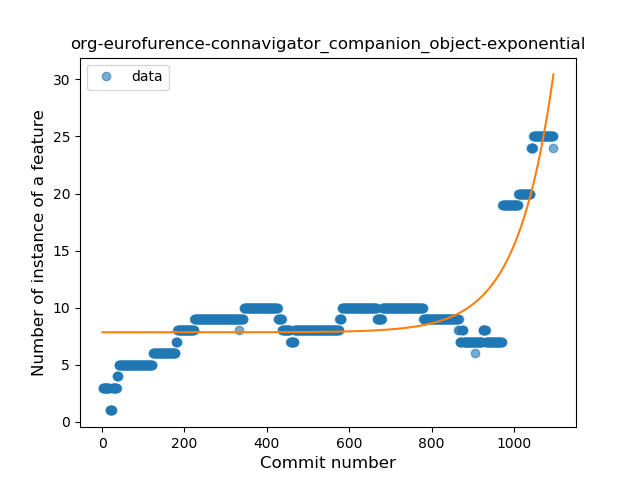
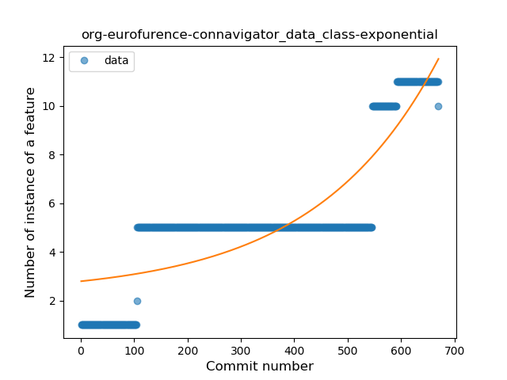
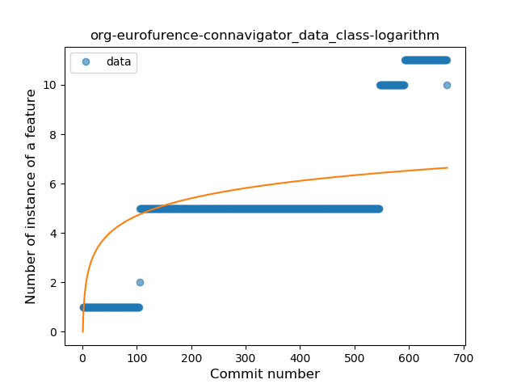
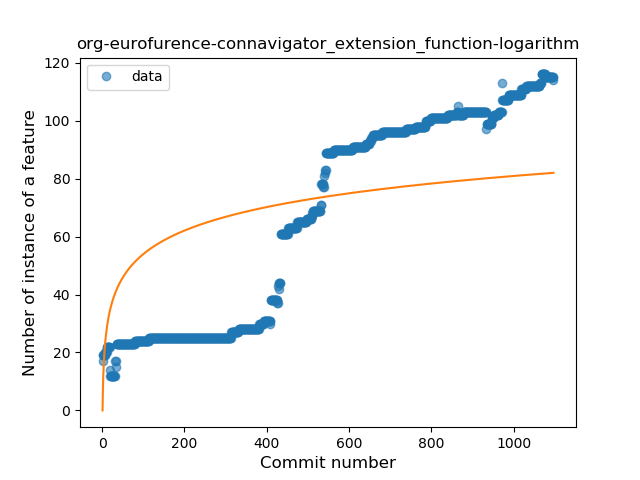

## org-eurofurence-connavigator
----
#### Metrics provided by Detekt
* Number of lines of code 11498
* Number of Kotlin files: 104
* Cyclomatic complexity: 1413
* Cyclomatic complexity by thousands of lines: 250 

----
**20** features analyzed

*	<a href="#type_inference">Type Inference</a> 
*	<a href="#lambda">Lambda</a> 
*	<a href="#safe_call">Safe Call</a> 
*	<a href="#when_expr">When expression</a> 
*	<a href="#unsafe_call">Unsafe Call</a> 
*	<a href="#companion_object">Companion Object</a> 
*	<a href="#string_template">String Template</a> 
*	<a href="#func_with_default_value">Function with Default Value</a> 
*	<a href="#singleton">Singleton</a> 
*	<a href="#range_expr">Range Expression</a> 
*	<a href="#smart_cast">Smart Cast</a> 
*	<a href="#data_class">Data Class</a> 
*	<a href="#func_call_with_named_arg">Function call with Named Argument</a> 
*	<a href="#extension_function">Extension Function</a> 
*	<a href="#property_delegation">Property Delegation</a> 
*	<a href="#destructuring_declaration">Destructuring Declaration</a> 
*	<a href="#inline_func">Inline Function</a> 
*	<a href="#overloaded_op">Overloaded Operator</a> 
*	<a href="#super_delegation">Super Delegation</a> 
*	<a href="#infix_func">Infix Function</a> 

### <a name="type_inference">Type Inference</a>
----
#### Functions
* **Constant Rise - Linear:** 
    * **R_Squared:** 0.92113562
* **Sudden Rise Plateau - Logarithm:** 
    * **R_Squared:** 0.62277218
* **Plateau Sudden Rise - Binary Sigmoid:** 
    * **R_Squared:** 0.58230702

**Plots** :chart_with_upwards_trend:
-----

### <a name="lambda">Lambda</a>
----
#### Functions
* **Constant Rise - Linear:** 
    * **R_Squared:** 0.95398546
* **Sudden Rise - Exponential:** 
    * **R_Squared:** 0.95427719
* **Sudden Rise Plateau - Logarithm:** 
    * **R_Squared:** 0.35900101
* **Plateau Sudden Rise - Binary Sigmoid:** 
    * **R_Squared:** 0.29802246

**Plots** :chart_with_upwards_trend:
-----

### <a name="safe_call">Safe Call</a>
----
#### Functions
* **Sudden Rise - Exponential:** 
    * **R_Squared:** 0.95329565
* **Constant Rise - Linear:** 
    * **R_Squared:** 0.7108507
* **Plateau Gradual Rise - Sigmoid:** 
    * **R_Squared:** 0.27159856
* **Sudden Rise Plateau - Logarithm:** 
    * **R_Squared:** 0.16968516

**Plots** :chart_with_upwards_trend:
-----

### <a name="when_expr">When expression</a>
----
#### Functions
* **Constant Rise - Linear:** 
    * **R_Squared:** 0.79978452
* **Sudden Rise Plateau - Logarithm:** 
    * **R_Squared:** 0.49883818
* **Plateau Sudden Rise - Binary Sigmoid:** 
    * **R_Squared:** 0.05402969

**Plots** :chart_with_upwards_trend:
-----

### <a name="unsafe_call">Unsafe Call</a>
----
#### Functions
* **Constant Decline - Linear:** 
    * **R_Squared:** 0.01497977
* **Sudden Rise Plateau - Logarithm:** 
    * **R_Squared:** 0.01121513

**Plots** :chart_with_upwards_trend:
-----

### <a name="companion_object">Companion Object</a>
----
#### Functions
* **Sudden Rise - Exponential:** 
    * **R_Squared:** 0.75090902
* **Constant Rise - Linear:** 
    * **R_Squared:** 0.437482
* **Sudden Rise Plateau - Logarithm:** 
    * **R_Squared:** 0.26835395
* **Plateau Sudden Rise - Binary Sigmoid:** 
    * **R_Squared:** 0.1968089

**Plots** :chart_with_upwards_trend:
-----

### <a name="string_template">String Template</a>
----
#### Functions
* **Constant Rise - Linear:** 
    * **R_Squared:** 0.84862181
* **Sudden Rise Plateau - Logarithm:** 
    * **R_Squared:** 0.36715232
* **Plateau Sudden Rise - Binary Sigmoid:** 
    * **R_Squared:** 0.13608265

**Plots** :chart_with_upwards_trend:
-----

### <a name="func_with_default_value">Function with Default Value</a>
----
#### Functions
* **Sudden Rise Plateau - Logarithm:** 
    * **R_Squared:** 0.24790014
* **Constant Rise - Linear:** 
    * **R_Squared:** 0.14967704

**Plots** :chart_with_upwards_trend:
-----

### <a name="singleton">Singleton</a>
----
#### Functions
* **Constant Rise - Linear:** 
    * **R_Squared:** 0.87472276
* **Sudden Rise Plateau - Logarithm:** 
    * **R_Squared:** 0.61771584

**Plots** :chart_with_upwards_trend:
-----

### <a name="range_expr">Range Expression</a>
----
#### Functions
* **Sudden Rise - Exponential:** 
    * **R_Squared:** 0.8842994
* **Constant Rise - Linear:** 
    * **R_Squared:** 0.44469915
* **Sudden Rise Plateau - Logarithm:** 
    * **R_Squared:** 0.06498143
* **Plateau Sudden Rise - Binary Sigmoid:** 
    * **R_Squared:** 0.05195012

**Plots** :chart_with_upwards_trend:
-----

### <a name="smart_cast">Smart Cast</a>
----
#### Functions
* **Constant Rise - Linear:** 
    * **R_Squared:** 0.8022538
* **Sudden Rise Plateau - Logarithm:** 
    * **R_Squared:** 0.38448636

**Plots** :chart_with_upwards_trend:
-----

### <a name="data_class">Data Class</a>
----
#### Functions
* **Sudden Rise - Exponential:** 
    * **R_Squared:** 0.747785
* **Constant Rise - Linear:** 
    * **R_Squared:** 0.70045838
* **Sudden Rise Plateau - Logarithm:** 
    * **R_Squared:** 0.38991756

**Plots** :chart_with_upwards_trend:
-----

### <a name="func_call_with_named_arg">Function call with Named Argument</a>
----
#### Functions
* **Sudden Rise - Exponential:** 
    * **R_Squared:** 0.91897421
* **Plateau Gradual Rise - Sigmoid:** 
    * **R_Squared:** 0.92529932
* **Constant Rise - Linear:** 
    * **R_Squared:** 0.66764781
* **Sudden Rise Plateau - Logarithm:** 
    * **R_Squared:** 0.13795199

**Plots** :chart_with_upwards_trend:
-----

### <a name="extension_function">Extension Function</a>
----
#### Functions
* **Constant Rise - Linear:** 
    * **R_Squared:** 0.90644185
* **Sudden Rise Plateau - Logarithm:** 
    * **R_Squared:** 0.41452979
* **Plateau Sudden Rise - Binary Sigmoid:** 
    * **R_Squared:** 0.04692244

**Plots** :chart_with_upwards_trend:
-----

### <a name="property_delegation">Property Delegation</a>
----
#### Functions
* **Constant Rise - Linear:** 
    * **R_Squared:** 0.72477932
* **Sudden Rise Plateau - Logarithm:** 
    * **R_Squared:** 0.68806856
* **Plateau Sudden Rise - Binary Sigmoid:** 
    * **R_Squared:** 0.50285091

**Plots** :chart_with_upwards_trend:
-----

### <a name="destructuring_declaration">Destructuring Declaration</a>
----
#### Functions
* **Sudden Rise - Exponential:** 
    * **R_Squared:** 0.87803933
* **Constant Rise - Linear:** 
    * **R_Squared:** 0.78680431
* **Sudden Rise Plateau - Logarithm:** 
    * **R_Squared:** 0.18273473

**Plots** :chart_with_upwards_trend:
-----

### <a name="inline_func">Inline Function</a>
----
#### Functions
* **Constant Rise - Linear:** 
    * **R_Squared:** 0.66376239
* **Sudden Rise Plateau - Logarithm:** 
    * **R_Squared:** 0.35632256

**Plots** :chart_with_upwards_trend:
-----

### <a name="overloaded_op">Overloaded Operator</a>
----
#### Functions
* **Sudden Rise Plateau - Logarithm:** 
    * **R_Squared:** 0.8294391
* **Constant Rise - Linear:** 
    * **R_Squared:** 0.69343904
* **Plateau Sudden Rise - Binary Sigmoid:** 
    * **R_Squared:** 0.05435169

**Plots** :chart_with_upwards_trend:
-----

### <a name="super_delegation">Super Delegation</a>
----
#### Functions
* **Sudden Rise - Exponential:** 
    * **R_Squared:** 0.64059964
* **Constant Rise - Linear:** 
    * **R_Squared:** 0.16807089
* **Sudden Rise Plateau - Logarithm:** 
    * **R_Squared:** 0.01079719

**Plots** :chart_with_upwards_trend:
-----

### <a name="infix_func">Infix Function</a>
----
#### Functions
* **Constant Rise - Linear:** 
    * **R_Squared:** 0.80834609
* **Sudden Rise Plateau - Logarithm:** 
    * **R_Squared:** 0.35281611
* **Plateau Sudden Rise - Binary Sigmoid:** 
    * **R_Squared:** 0.02429259

**Plots** :chart_with_upwards_trend:
-----

