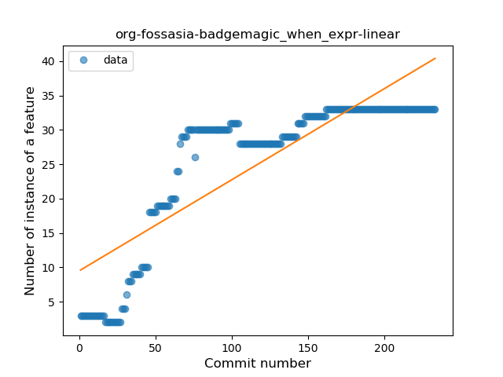
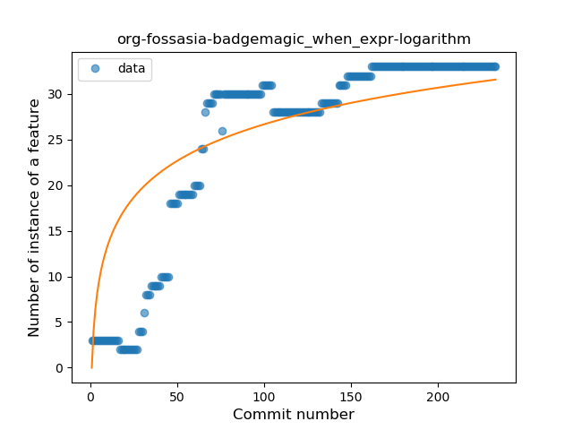
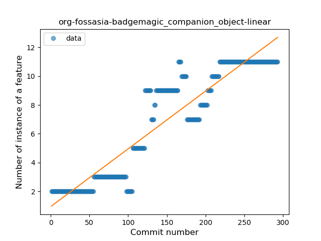
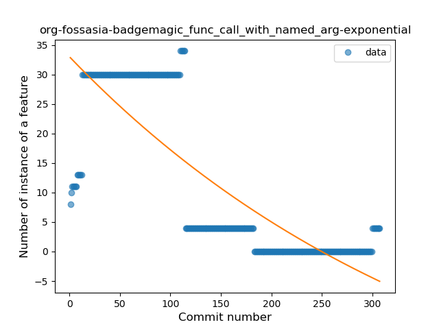
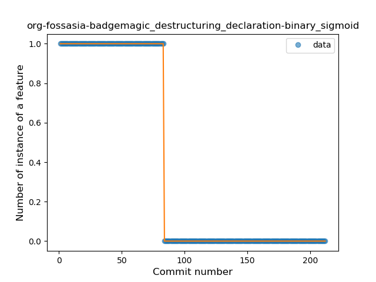

## org-fossasia-badgemagic
----
#### Metrics provided by Detekt
* Number of lines of code 5344
* Number of Kotlin files: 69
* Cyclomatic complexity: 871
* Cyclomatic complexity by thousands of lines: 280 

----
**16** features analyzed

*	<a href="#type_inference">Type Inference</a> 
*	<a href="#lambda">Lambda</a> 
*	<a href="#safe_call">Safe Call</a> 
*	<a href="#when_expr">When expression</a> 
*	<a href="#unsafe_call">Unsafe Call</a> 
*	<a href="#companion_object">Companion Object</a> 
*	<a href="#string_template">String Template</a> 
*	<a href="#func_with_default_value">Function with Default Value</a> 
*	<a href="#singleton">Singleton</a> 
*	<a href="#range_expr">Range Expression</a> 
*	<a href="#smart_cast">Smart Cast</a> 
*	<a href="#data_class">Data Class</a> 
*	<a href="#func_call_with_named_arg">Function call with Named Argument</a> 
*	<a href="#extension_function">Extension Function</a> 
*	<a href="#property_delegation">Property Delegation</a> 
*	<a href="#destructuring_declaration">Destructuring Declaration</a> 

### <a name="type_inference">Type Inference</a>
----
#### Functions
* **Constant Rise - Linear:** 
    * **R_Squared:** 0.94627912
* **Sudden Rise Plateau - Logarithm:** 
    * **R_Squared:** 0.53801594

**Plots** :chart_with_upwards_trend:
-----

### <a name="lambda">Lambda</a>
----
#### Functions
* **Sudden Rise Plateau - Logarithm:** 
    * **R_Squared:** 0.85284719
* **Constant Rise - Linear:** 
    * **R_Squared:** 0.76864356
* **Plateau Sudden Rise - Binary Sigmoid:** 
    * **R_Squared:** 0.46896493

**Plots** :chart_with_upwards_trend:
-----

### <a name="safe_call">Safe Call</a>
----
#### Functions
* **Constant Rise - Linear:** 
    * **R_Squared:** 0.87010587
* **Sudden Rise Plateau - Logarithm:** 
    * **R_Squared:** 0.42695351
* **Plateau Gradual Rise - Sigmoid:** 
    * **R_Squared:** 0.33525771

**Plots** :chart_with_upwards_trend:
-----

### <a name="when_expr">When expression</a>
----
#### Functions
* **Constant Rise - Linear:** 
    * **R_Squared:** 0.7051163
* **Plateau Sudden Rise - Binary Sigmoid:** 
    * **R_Squared:** 0.71294948
* **Sudden Rise Plateau - Logarithm:** 
    * **R_Squared:** 0.67003596

**Plots** :chart_with_upwards_trend:
-----

### <a name="unsafe_call">Unsafe Call</a>
----
#### Functions
* **Plateau Sudden Decline - Binary Sigmoid:** 
    * **R_Squared:** 1.0
* **Sudden Decline - Exponential:** 
    * **R_Squared:** 0.81095236
* **Constant Decline - Linear:** 
    * **R_Squared:** 0.08483452
* **Sudden Rise Plateau - Logarithm:** 
    * **R_Squared:** -0.0

**Plots** :chart_with_upwards_trend:
-----

### <a name="companion_object">Companion Object</a>
----
#### Functions
* **Constant Rise - Linear:** 
    * **R_Squared:** 0.86238197
* **Sudden Rise Plateau - Logarithm:** 
    * **R_Squared:** 0.48458485

**Plots** :chart_with_upwards_trend:
-----

### <a name="string_template">String Template</a>
----
#### Functions
* **Constant Rise - Linear:** 
    * **R_Squared:** 0.9008417
* **Sudden Rise Plateau - Logarithm:** 
    * **R_Squared:** 0.69050251

**Plots** :chart_with_upwards_trend:
-----

### <a name="func_with_default_value">Function with Default Value</a>
----
#### Functions
* **Plateau Gradual Rise - Sigmoid:** 
    * **R_Squared:** 0.21608791
* **Sudden Rise Plateau - Logarithm:** 
    * **R_Squared:** 0.10090902
* **Constant Rise - Linear:** 
    * **R_Squared:** 0.00446207

**Plots** :chart_with_upwards_trend:
-----

### <a name="singleton">Singleton</a>
----
#### Functions
* **Plateau Gradual Rise - Sigmoid:** 
    * **R_Squared:** 0.89302719
* **Constant Rise - Linear:** 
    * **R_Squared:** 0.8314535
* **Sudden Rise Plateau - Logarithm:** 
    * **R_Squared:** 0.77777322

**Plots** :chart_with_upwards_trend:
-----

### <a name="range_expr">Range Expression</a>
----
#### Functions
* **Constant Rise - Linear:** 
    * **R_Squared:** 0.8605792
* **Sudden Rise Plateau - Logarithm:** 
    * **R_Squared:** 0.63011789
* **Plateau Gradual Rise - Sigmoid:** 
    * **R_Squared:** 0.61085317

**Plots** :chart_with_upwards_trend:
-----

### <a name="smart_cast">Smart Cast</a>
----
#### Functions
* **Plateau Gradual Rise - Sigmoid:** 
    * **R_Squared:** 0.99056383
* **Sudden Rise - Exponential:** 
    * **R_Squared:** 0.76199969
* **Constant Rise - Linear:** 
    * **R_Squared:** 0.72055637
* **Sudden Rise Plateau - Logarithm:** 
    * **R_Squared:** 0.26226337

**Plots** :chart_with_upwards_trend:
-----

### <a name="data_class">Data Class</a>
----
#### Functions
* **Plateau Gradual Rise - Sigmoid:** 
    * **R_Squared:** 0.85536633
* **Constant Rise - Linear:** 
    * **R_Squared:** 0.5645564
* **Sudden Rise Plateau - Logarithm:** 
    * **R_Squared:** 0.50467008

**Plots** :chart_with_upwards_trend:
-----

### <a name="func_call_with_named_arg">Function call with Named Argument</a>
----
#### Functions
* **Sudden Decline - Exponential:** 
    * **R_Squared:** 0.66038674
* **Constant Decline - Linear:** 
    * **R_Squared:** 0.64929401
* **Sudden Rise Plateau - Logarithm:** 
    * **R_Squared:** -0.0

**Plots** :chart_with_upwards_trend:
-----

### <a name="extension_function">Extension Function</a>
----
#### Functions
* **Plateau Sudden Decline - Binary Sigmoid:** 
    * **R_Squared:** 0.63174446
* **Sudden Decline - Exponential:** 
    * **R_Squared:** 0.31293666
* **Constant Decline - Linear:** 
    * **R_Squared:** 0.24133923
* **Sudden Rise Plateau - Logarithm:** 
    * **R_Squared:** -0.0

**Plots** :chart_with_upwards_trend:
-----

### <a name="property_delegation">Property Delegation</a>
----
#### Functions
* **Sudden Rise - Exponential:** 
    * **R_Squared:** 0.0865725
* **Sudden Rise Plateau - Logarithm:** 
    * **R_Squared:** 0.04137059
* **Constant Rise - Linear:** 
    * **R_Squared:** 0.02262573

**Plots** :chart_with_upwards_trend:
-----

### <a name="destructuring_declaration">Destructuring Declaration</a>
----
#### Functions
* **Plateau Sudden Decline - Binary Sigmoid:** 
    * **R_Squared:** 1.0
* **Sudden Decline - Exponential:** 
    * **R_Squared:** 0.7539279
* **Constant Decline - Linear:** 
    * **R_Squared:** 0.71470529
* **Sudden Rise Plateau - Logarithm:** 
    * **R_Squared:** -0.0

**Plots** :chart_with_upwards_trend:
-----

