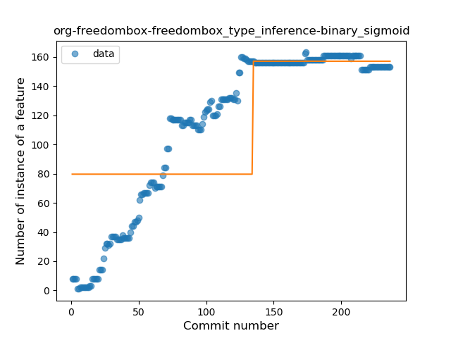
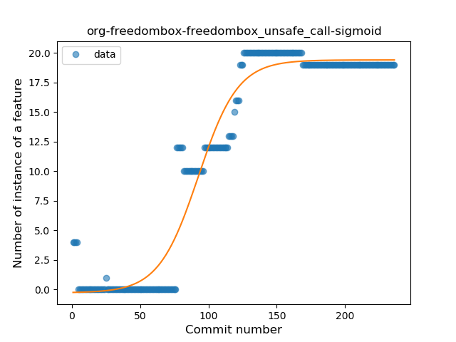
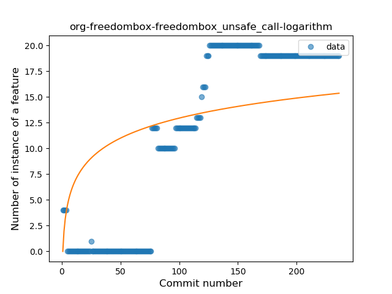
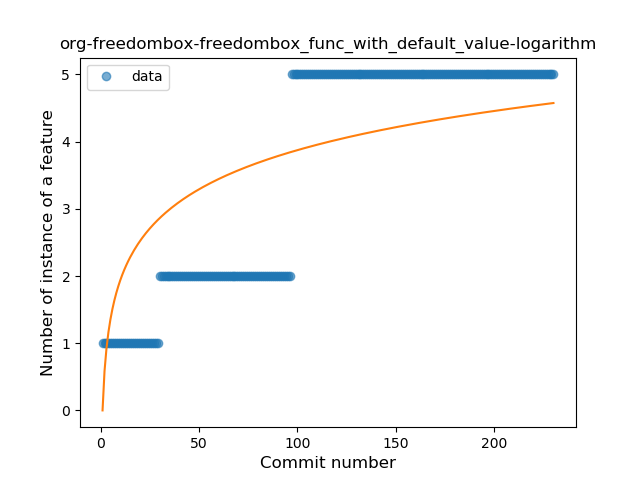
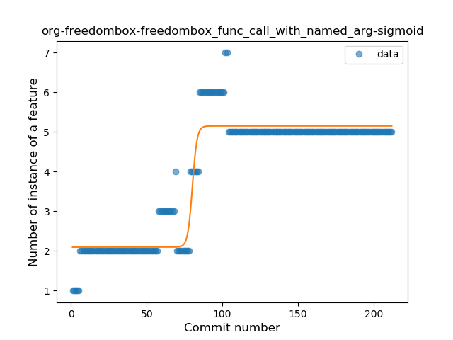

## org-freedombox-freedombox
----
#### Metrics provided by Detekt
* Number of lines of code 2512
* Number of Kotlin files: 38
* Cyclomatic complexity: 230
* Cyclomatic complexity by thousands of lines: 251 

----
**11** features analyzed

*	<a href="#type_inference">Type Inference</a> 
*	<a href="#lambda">Lambda</a> 
*	<a href="#safe_call">Safe Call</a> 
*	<a href="#when_expr">When expression</a> 
*	<a href="#unsafe_call">Unsafe Call</a> 
*	<a href="#companion_object">Companion Object</a> 
*	<a href="#string_template">String Template</a> 
*	<a href="#func_with_default_value">Function with Default Value</a> 
*	<a href="#singleton">Singleton</a> 
*	<a href="#data_class">Data Class</a> 
*	<a href="#func_call_with_named_arg">Function call with Named Argument</a> 

### <a name="type_inference">Type Inference</a>
----
#### Functions
* **Constant Rise - Linear:** 
    * **R_Squared:** 0.81699596
* **Sudden Rise Plateau - Logarithm:** 
    * **R_Squared:** 0.64110259
* **Plateau Sudden Rise - Binary Sigmoid:** 
    * **R_Squared:** 0.50842856

**Plots** :chart_with_upwards_trend:
-----

### <a name="lambda">Lambda</a>
----
#### Functions
* **Constant Rise - Linear:** 
    * **R_Squared:** 0.92048465
* **Sudden Rise Plateau - Logarithm:** 
    * **R_Squared:** 0.50442684
* **Plateau Gradual Rise - Sigmoid:** 
    * **R_Squared:** 0.35457352

**Plots** :chart_with_upwards_trend:
-----

### <a name="safe_call">Safe Call</a>
----
#### Functions
* **Constant Rise - Linear:** 
    * **R_Squared:** 0.93396823
* **Sudden Rise Plateau - Logarithm:** 
    * **R_Squared:** 0.6239945

**Plots** :chart_with_upwards_trend:
-----

### <a name="when_expr">When expression</a>
----
#### Functions
* **Plateau Sudden Rise - Binary Sigmoid:** 
    * **R_Squared:** 1.0
* **Sudden Rise Plateau - Logarithm:** 
    * **R_Squared:** 0.3273271
* **Constant Rise - Linear:** 
    * **R_Squared:** 0.09084249

**Plots** :chart_with_upwards_trend:
-----

### <a name="unsafe_call">Unsafe Call</a>
----
#### Functions
* **Plateau Gradual Rise - Sigmoid:** 
    * **R_Squared:** 0.9551842
* **Constant Rise - Linear:** 
    * **R_Squared:** 0.80005593
* **Sudden Rise Plateau - Logarithm:** 
    * **R_Squared:** 0.39690099

**Plots** :chart_with_upwards_trend:
-----

### <a name="companion_object">Companion Object</a>
----
#### Functions
* **Plateau Gradual Rise - Sigmoid:** 
    * **R_Squared:** 0.86985198
* **Sudden Rise Plateau - Logarithm:** 
    * **R_Squared:** 0.77721721
* **Constant Rise - Linear:** 
    * **R_Squared:** 0.66240498

**Plots** :chart_with_upwards_trend:
-----

### <a name="string_template">String Template</a>
----
#### Functions
* **Constant Rise - Linear:** 
    * **R_Squared:** 0.73979741
* **Sudden Rise Plateau - Logarithm:** 
    * **R_Squared:** 0.56874298

**Plots** :chart_with_upwards_trend:
-----

### <a name="func_with_default_value">Function with Default Value</a>
----
#### Functions
* **Plateau Sudden Rise - Binary Sigmoid:** 
    * **R_Squared:** 0.9680247
* **Constant Rise - Linear:** 
    * **R_Squared:** 0.77218104
* **Sudden Rise Plateau - Logarithm:** 
    * **R_Squared:** 0.57100084

**Plots** :chart_with_upwards_trend:
-----

### <a name="singleton">Singleton</a>
----
#### Functions
* **Plateau Sudden Decline - Binary Sigmoid:** 
    * **R_Squared:** 1.0
* **Sudden Decline - Exponential:** 
    * **R_Squared:** 0.78815424
* **Constant Decline - Linear:** 
    * **R_Squared:** 0.37923457
* **Sudden Rise Plateau - Logarithm:** 
    * **R_Squared:** -0.0

**Plots** :chart_with_upwards_trend:
-----

### <a name="data_class">Data Class</a>
----
#### Functions
* **Plateau Sudden Rise - Binary Sigmoid:** 
    * **R_Squared:** 1.0
* **Sudden Rise Plateau - Logarithm:** 
    * **R_Squared:** 0.58405893
* **Constant Rise - Linear:** 
    * **R_Squared:** 0.55846221

**Plots** :chart_with_upwards_trend:
-----

### <a name="func_call_with_named_arg">Function call with Named Argument</a>
----
#### Functions
* **Plateau Gradual Rise - Sigmoid:** 
    * **R_Squared:** 0.90978111
* **Constant Rise - Linear:** 
    * **R_Squared:** 0.61496093
* **Sudden Rise Plateau - Logarithm:** 
    * **R_Squared:** 0.58728054

**Plots** :chart_with_upwards_trend:
-----

