## org-havenapp-main
----
#### Metrics provided by Detekt
* Number of lines of code 1114
* Number of Kotlin files: 26
* Cyclomatic complexity: 120
* Cyclomatic complexity by thousands of lines: 250 

----
**7** features analyzed

*	<a href="#type_inference">Type Inference</a> 
*	<a href="#lambda">Lambda</a> 
*	<a href="#safe_call">Safe Call</a> 
*	<a href="#when_expr">When expression</a> 
*	<a href="#unsafe_call">Unsafe Call</a> 
*	<a href="#companion_object">Companion Object</a> 
*	<a href="#string_template">String Template</a> 

### <a name="type_inference">Type Inference</a>
----
#### Functions
* **Constant Rise - Linear:** 
    * **R_Squared:** 0.89239303
* **Sudden Rise - Exponential:** 
    * **R_Squared:** 0.89598883
* **Sudden Rise Plateau - Logarithm:** 
    * **R_Squared:** 0.41824742

**Plots** :chart_with_upwards_trend:
-----

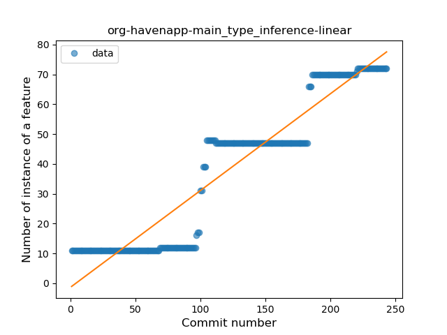
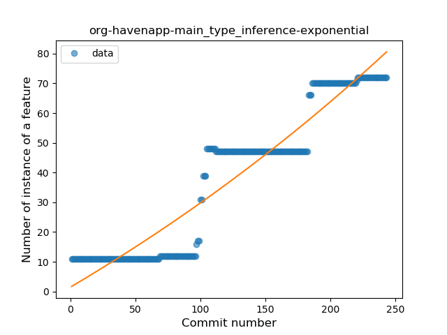
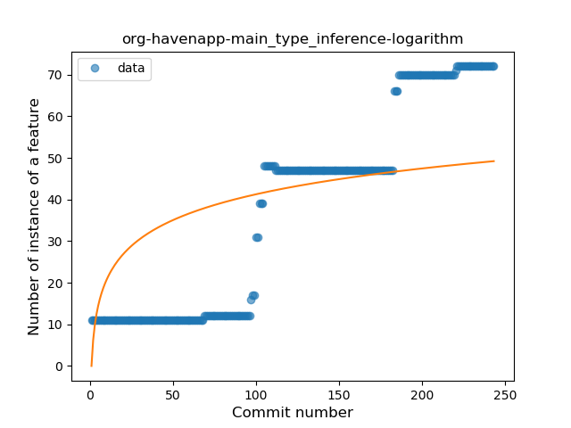
### <a name="lambda">Lambda</a>
----
#### Functions
* **Plateau Gradual Rise - Sigmoid:** 
    * **R_Squared:** 0.96106354
* **Constant Rise - Linear:** 
    * **R_Squared:** 0.84225094
* **Sudden Rise Plateau - Logarithm:** 
    * **R_Squared:** 0.35411303

**Plots** :chart_with_upwards_trend:
-----

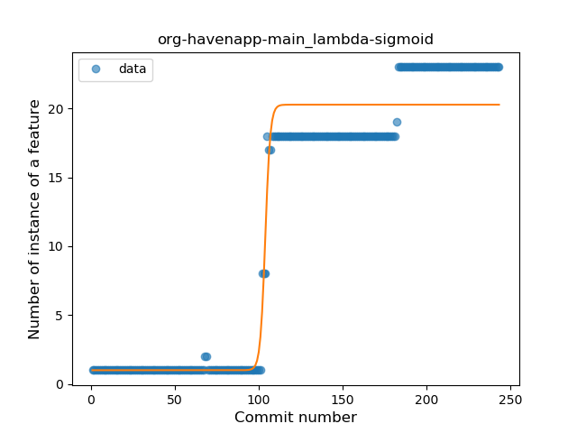
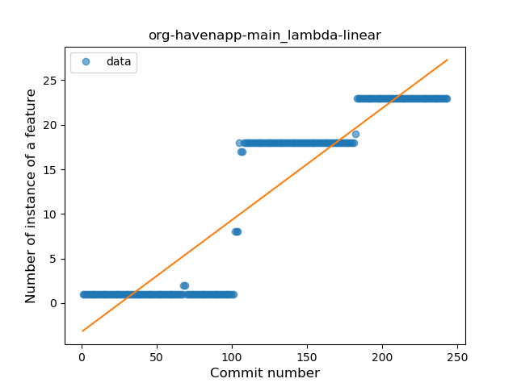
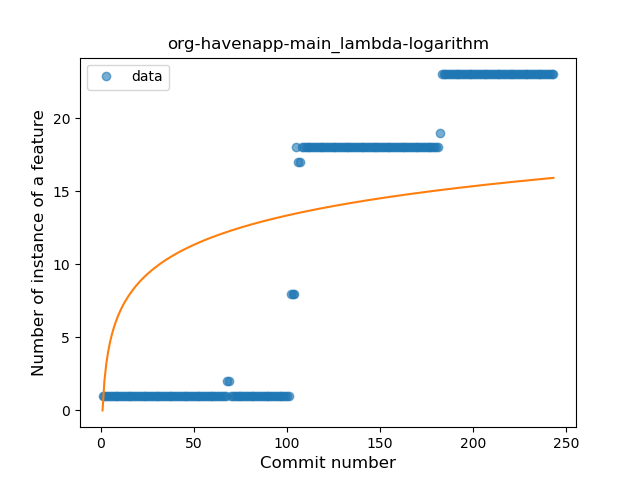
### <a name="safe_call">Safe Call</a>
----
#### Functions
* **Constant Rise - Linear:** 
    * **R_Squared:** 0.89050406
* **Sudden Rise - Exponential:** 
    * **R_Squared:** 0.89420082
* **Sudden Rise Plateau - Logarithm:** 
    * **R_Squared:** 0.35846703

**Plots** :chart_with_upwards_trend:
-----

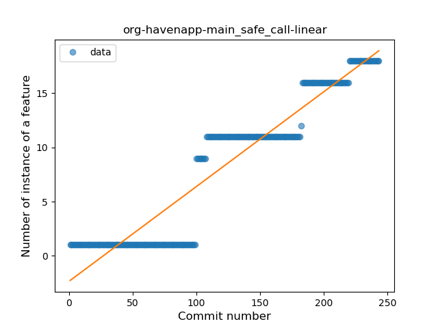
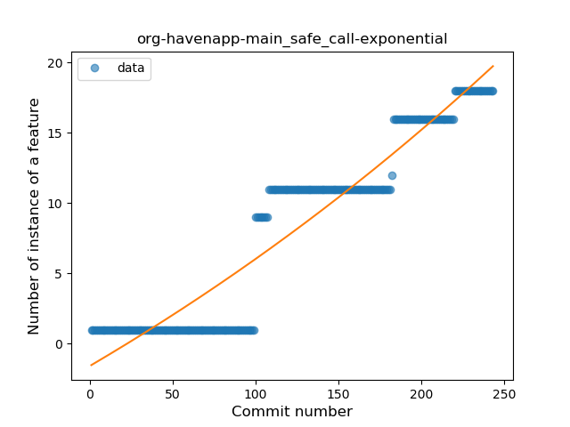
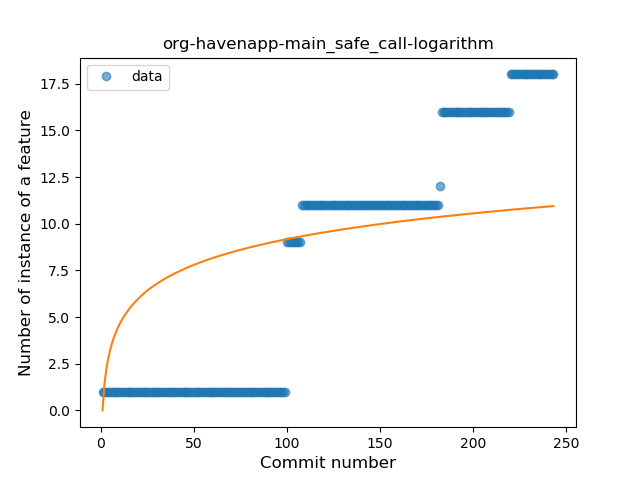
### <a name="when_expr">When expression</a>
----
#### Functions
* **Plateau Sudden Rise - Binary Sigmoid:** 
    * **R_Squared:** 1.0
* **Constant Rise - Linear:** 
    * **R_Squared:** 0.73618073
* **Sudden Rise Plateau - Logarithm:** 
    * **R_Squared:** 0.56172169

**Plots** :chart_with_upwards_trend:
-----

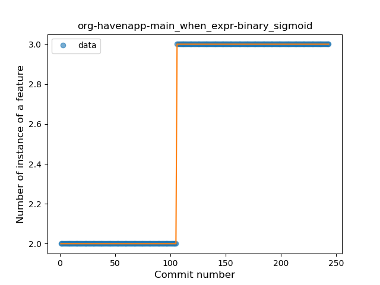
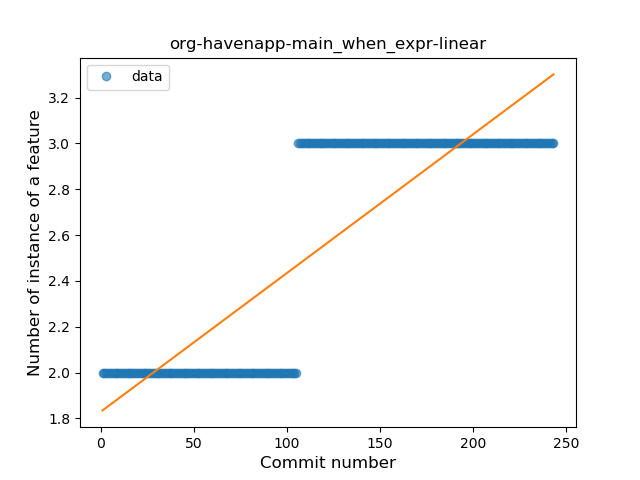
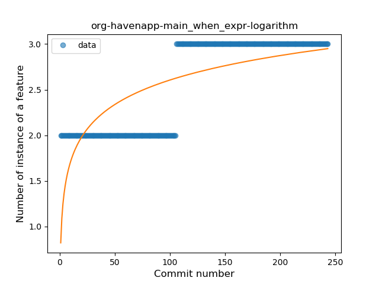
### <a name="unsafe_call">Unsafe Call</a>
----
#### Functions
* **Plateau Gradual Rise - Sigmoid:** 
    * **R_Squared:** 0.98163334
* **Constant Rise - Linear:** 
    * **R_Squared:** 0.81474992
* **Sudden Rise Plateau - Logarithm:** 
    * **R_Squared:** 0.40596042

**Plots** :chart_with_upwards_trend:
-----

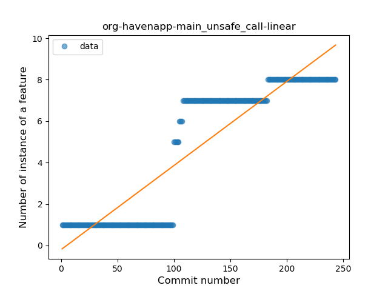
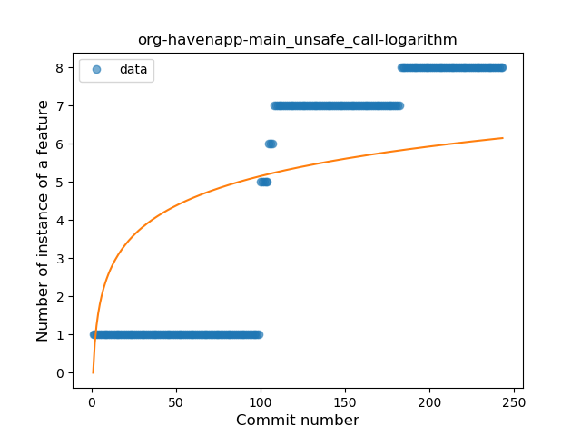
### <a name="companion_object">Companion Object</a>
----
#### Functions
* **Plateau Gradual Rise - Sigmoid:** 
    * **R_Squared:** 0.9948864
* **Constant Rise - Linear:** 
    * **R_Squared:** 0.74875606
* **Sudden Rise Plateau - Logarithm:** 
    * **R_Squared:** 0.58556642

**Plots** :chart_with_upwards_trend:
-----

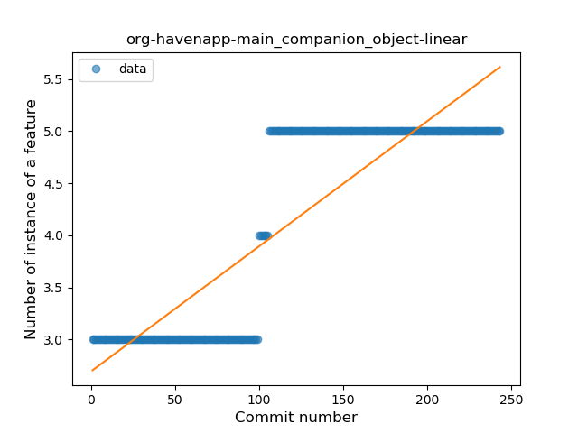
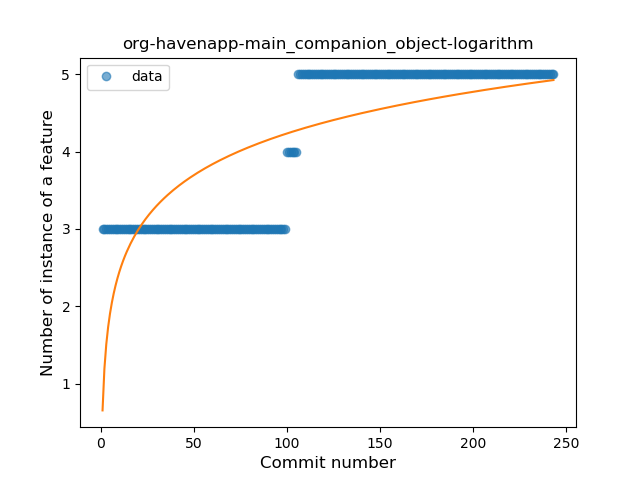
### <a name="string_template">String Template</a>
----
#### Functions
* **Plateau Gradual Rise - Sigmoid:** 
    * **R_Squared:** 0.92308819
* **Sudden Rise - Exponential:** 
    * **R_Squared:** 0.89787545
* **Constant Rise - Linear:** 
    * **R_Squared:** 0.80036908
* **Sudden Rise Plateau - Logarithm:** 
    * **R_Squared:** 0.42512358

**Plots** :chart_with_upwards_trend:
-----

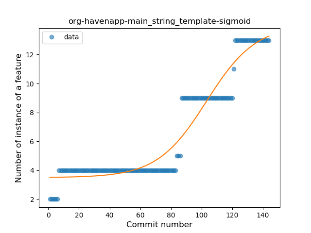
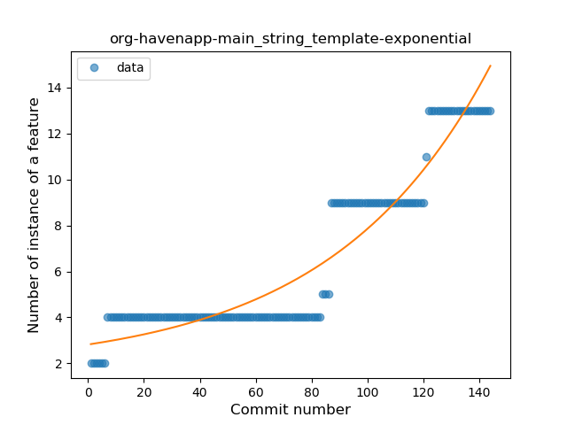
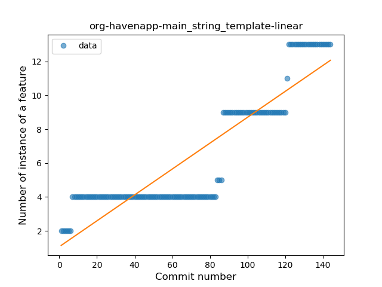
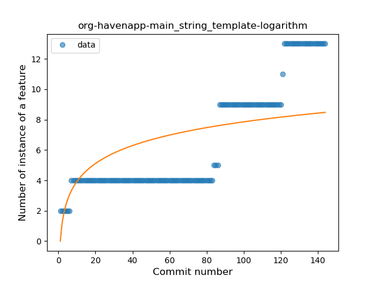
