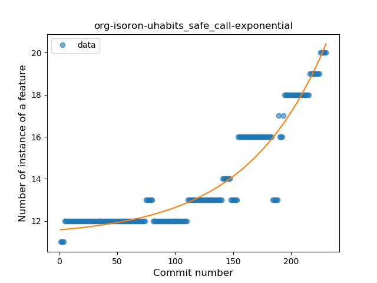
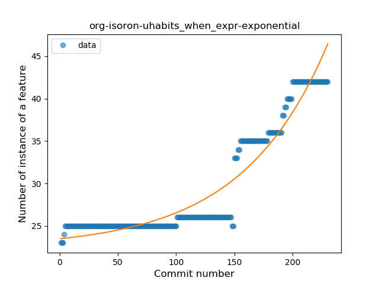
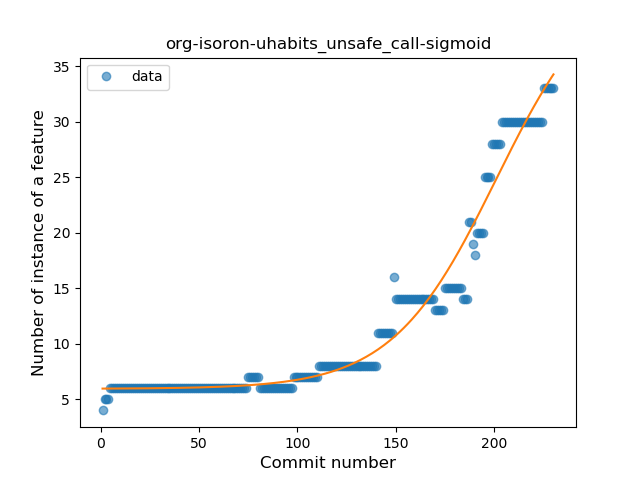
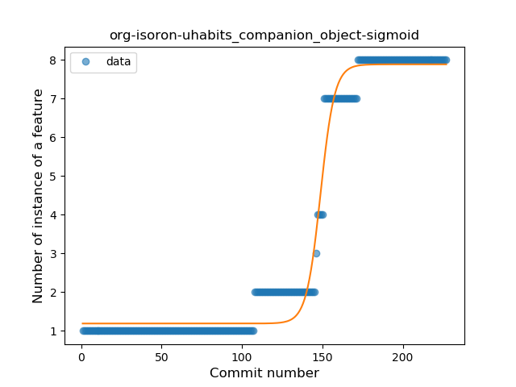
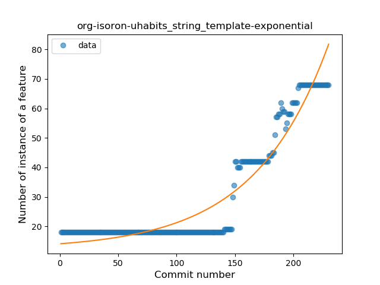
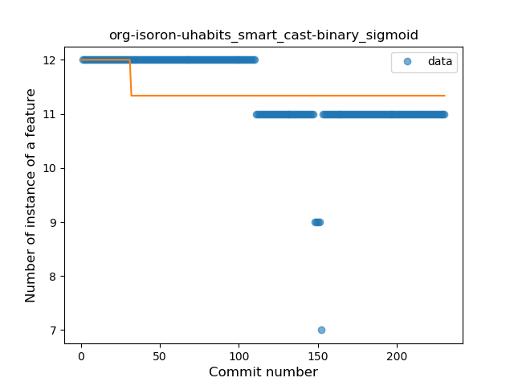

## org-isoron-uhabits
----
#### Metrics provided by Detekt
* Number of lines of code 17246
* Number of Kotlin files: 193
* Cyclomatic complexity: 1226
* Cyclomatic complexity by thousands of lines: 117 

----
**16** features analyzed

*	<a href="#type_inference">Type Inference</a> 
*	<a href="#lambda">Lambda</a> 
*	<a href="#safe_call">Safe Call</a> 
*	<a href="#when_expr">When expression</a> 
*	<a href="#unsafe_call">Unsafe Call</a> 
*	<a href="#companion_object">Companion Object</a> 
*	<a href="#string_template">String Template</a> 
*	<a href="#func_with_default_value">Function with Default Value</a> 
*	<a href="#singleton">Singleton</a> 
*	<a href="#range_expr">Range Expression</a> 
*	<a href="#smart_cast">Smart Cast</a> 
*	<a href="#data_class">Data Class</a> 
*	<a href="#func_call_with_named_arg">Function call with Named Argument</a> 
*	<a href="#extension_function">Extension Function</a> 
*	<a href="#destructuring_declaration">Destructuring Declaration</a> 
*	<a href="#coroutine">Coroutine</a> 

### <a name="type_inference">Type Inference</a>
----
#### Functions
* **Sudden Rise - Exponential:** 
    * **R_Squared:** 0.77107462
* **Constant Rise - Linear:** 
    * **R_Squared:** 0.62523445
* **Sudden Rise Plateau - Logarithm:** 
    * **R_Squared:** 0.15946022

**Plots** :chart_with_upwards_trend:
-----

### <a name="lambda">Lambda</a>
----
#### Functions
* **Sudden Rise - Exponential:** 
    * **R_Squared:** 0.92839403
* **Constant Rise - Linear:** 
    * **R_Squared:** 0.68239406
* **Sudden Rise Plateau - Logarithm:** 
    * **R_Squared:** 0.36296826

**Plots** :chart_with_upwards_trend:
-----

### <a name="safe_call">Safe Call</a>
----
#### Functions
* **Sudden Rise - Exponential:** 
    * **R_Squared:** 0.91077371
* **Constant Rise - Linear:** 
    * **R_Squared:** 0.76376196
* **Sudden Rise Plateau - Logarithm:** 
    * **R_Squared:** 0.42789816

**Plots** :chart_with_upwards_trend:
-----

### <a name="when_expr">When expression</a>
----
#### Functions
* **Sudden Rise - Exponential:** 
    * **R_Squared:** 0.91378202
* **Constant Rise - Linear:** 
    * **R_Squared:** 0.76399947
* **Sudden Rise Plateau - Logarithm:** 
    * **R_Squared:** 0.40897256

**Plots** :chart_with_upwards_trend:
-----

### <a name="unsafe_call">Unsafe Call</a>
----
#### Functions
* **Plateau Gradual Rise - Sigmoid:** 
    * **R_Squared:** 0.96953999
* **Sudden Rise - Exponential:** 
    * **R_Squared:** 0.95845108
* **Constant Rise - Linear:** 
    * **R_Squared:** 0.72444199
* **Sudden Rise Plateau - Logarithm:** 
    * **R_Squared:** 0.28329609

**Plots** :chart_with_upwards_trend:
-----

### <a name="companion_object">Companion Object</a>
----
#### Functions
* **Plateau Gradual Rise - Sigmoid:** 
    * **R_Squared:** 0.98233907
* **Sudden Rise - Exponential:** 
    * **R_Squared:** 0.85199532
* **Constant Rise - Linear:** 
    * **R_Squared:** 0.77966028
* **Sudden Rise Plateau - Logarithm:** 
    * **R_Squared:** 0.26906479

**Plots** :chart_with_upwards_trend:
-----

### <a name="string_template">String Template</a>
----
#### Functions
* **Sudden Rise - Exponential:** 
    * **R_Squared:** 0.91426228
* **Constant Rise - Linear:** 
    * **R_Squared:** 0.72127861
* **Sudden Rise Plateau - Logarithm:** 
    * **R_Squared:** 0.300994

**Plots** :chart_with_upwards_trend:
-----

### <a name="func_with_default_value">Function with Default Value</a>
----
#### Functions
* **Plateau Sudden Rise - Binary Sigmoid:** 
    * **R_Squared:** 0.97707916
* **Sudden Rise - Exponential:** 
    * **R_Squared:** 0.76732434
* **Constant Rise - Linear:** 
    * **R_Squared:** 0.68046521
* **Sudden Rise Plateau - Logarithm:** 
    * **R_Squared:** 0.36093001

**Plots** :chart_with_upwards_trend:
-----

### <a name="singleton">Singleton</a>
----
#### Functions
* **Plateau Gradual Rise - Sigmoid:** 
    * **R_Squared:** 0.93093083
* **Instability - Polinomial 3:** )
    * **R_Squared:** 0.93606787
* **Constant Rise - Linear:** 
    * **R_Squared:** 0.88327526
* **Sudden Rise Plateau - Logarithm:** 
    * **R_Squared:** 0.66504667

**Plots** :chart_with_upwards_trend:
-----

### <a name="range_expr">Range Expression</a>
----
#### Functions
* **Plateau Gradual Rise - Sigmoid:** 
    * **R_Squared:** 0.95190791
* **Sudden Rise - Exponential:** 
    * **R_Squared:** 0.93423561
* **Constant Rise - Linear:** 
    * **R_Squared:** 0.68148027
* **Sudden Rise Plateau - Logarithm:** 
    * **R_Squared:** 0.17505259

**Plots** :chart_with_upwards_trend:
-----

### <a name="smart_cast">Smart Cast</a>
----
#### Functions
* **Constant Decline - Linear:** 
    * **R_Squared:** 0.48459234
* **Sudden Decline - Exponential:** 
    * **R_Squared:** 0.49084107
* **Plateau Sudden Decline - Binary Sigmoid:** 
    * **R_Squared:** 0.11772603
* **Sudden Rise Plateau - Logarithm:** 
    * **R_Squared:** 0.0

**Plots** :chart_with_upwards_trend:
-----

### <a name="data_class">Data Class</a>
----
#### Functions
* **Sudden Rise Plateau - Logarithm:** 
    * **R_Squared:** 0.90148259
* **Constant Rise - Linear:** 
    * **R_Squared:** 0.74820331

**Plots** :chart_with_upwards_trend:
-----

### <a name="func_call_with_named_arg">Function call with Named Argument</a>
----
#### Functions
* **Plateau Gradual Rise - Sigmoid:** 
    * **R_Squared:** 0.98923383
* **Sudden Rise - Exponential:** 
    * **R_Squared:** 0.732692
* **Constant Rise - Linear:** 
    * **R_Squared:** 0.67079392
* **Sudden Rise Plateau - Logarithm:** 
    * **R_Squared:** 0.31460665

**Plots** :chart_with_upwards_trend:
-----

### <a name="extension_function">Extension Function</a>
----
#### Functions
* **Sudden Rise - Exponential:** 
    * **R_Squared:** 0.80003908
* **Constant Rise - Linear:** 
    * **R_Squared:** 0.71434827
* **Sudden Rise Plateau - Logarithm:** 
    * **R_Squared:** 0.37951519

**Plots** :chart_with_upwards_trend:
-----

### <a name="destructuring_declaration">Destructuring Declaration</a>
----
#### Functions
* **Plateau Sudden Rise - Binary Sigmoid:** 
    * **R_Squared:** 0.97185372
* **Sudden Rise - Exponential:** 
    * **R_Squared:** 0.76704022
* **Constant Rise - Linear:** 
    * **R_Squared:** 0.68199784
* **Sudden Rise Plateau - Logarithm:** 
    * **R_Squared:** 0.28082609

**Plots** :chart_with_upwards_trend:
-----

### <a name="coroutine">Coroutine</a>
----
#### Functions
* **Plateau Gradual Rise - Sigmoid:** 
    * **R_Squared:** 0.97035549
* **Instability - Polinomial 3:** )
    * **R_Squared:** 0.78017957
* **Sudden Rise Plateau - Logarithm:** 
    * **R_Squared:** 0.61830649
* **Constant Rise - Linear:** 
    * **R_Squared:** 0.25190084

**Plots** :chart_with_upwards_trend:
-----

