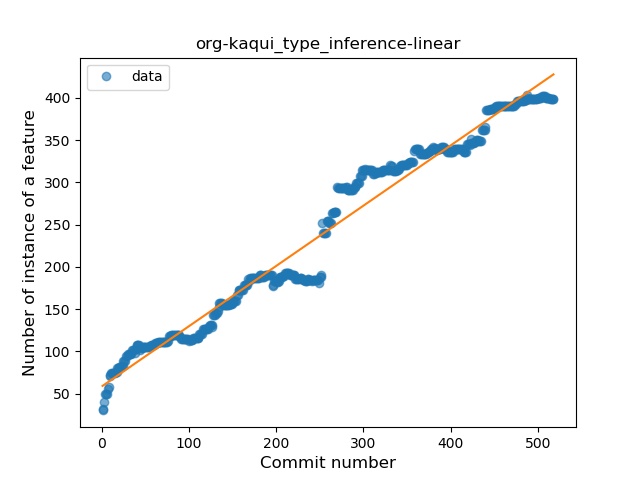
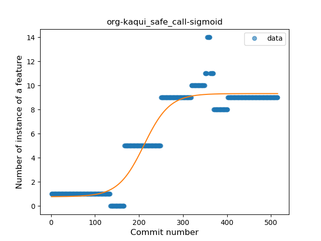
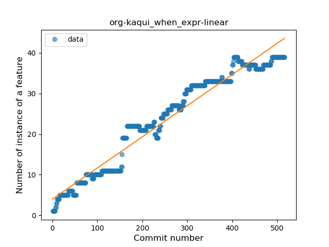
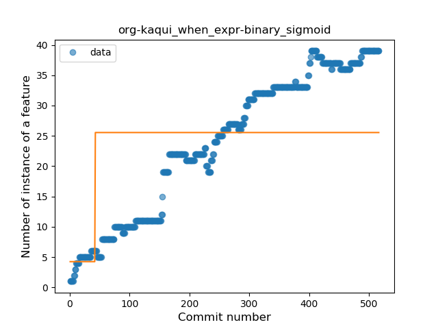
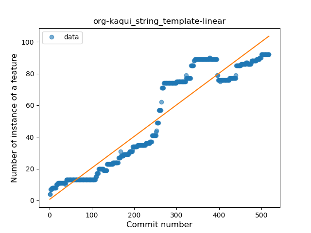
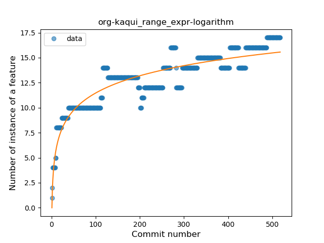
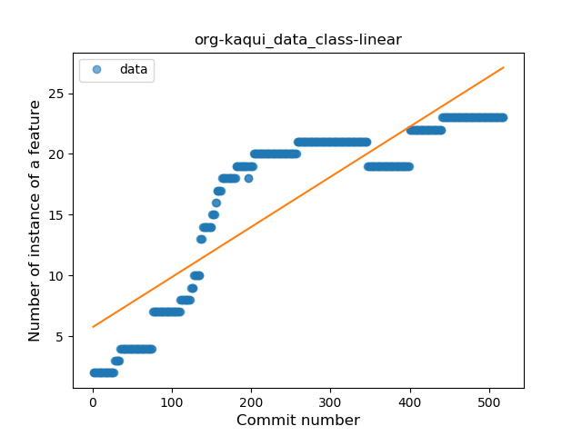
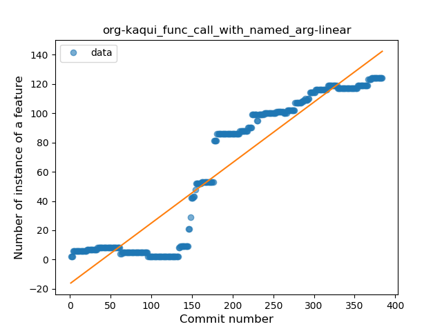
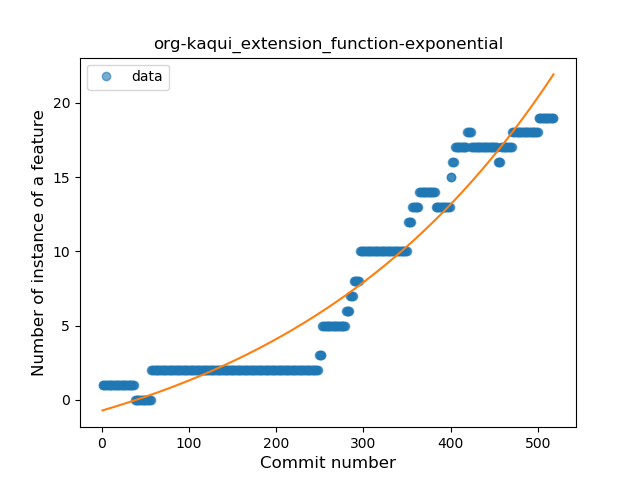
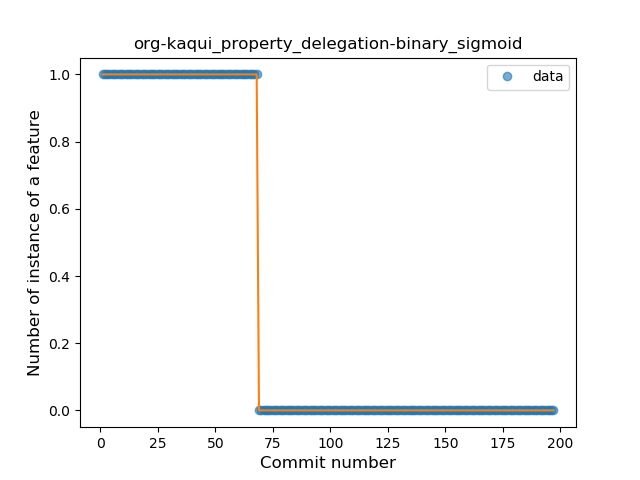

## org-kaqui
----
#### Metrics provided by Detekt
* Number of lines of code 5376
* Number of Kotlin files: 41
* Cyclomatic complexity: 869
* Cyclomatic complexity by thousands of lines: 245 

----
**18** features analyzed

*	<a href="#type_inference">Type Inference</a> 
*	<a href="#lambda">Lambda</a> 
*	<a href="#safe_call">Safe Call</a> 
*	<a href="#when_expr">When expression</a> 
*	<a href="#unsafe_call">Unsafe Call</a> 
*	<a href="#companion_object">Companion Object</a> 
*	<a href="#string_template">String Template</a> 
*	<a href="#func_with_default_value">Function with Default Value</a> 
*	<a href="#range_expr">Range Expression</a> 
*	<a href="#smart_cast">Smart Cast</a> 
*	<a href="#data_class">Data Class</a> 
*	<a href="#func_call_with_named_arg">Function call with Named Argument</a> 
*	<a href="#extension_function">Extension Function</a> 
*	<a href="#property_delegation">Property Delegation</a> 
*	<a href="#destructuring_declaration">Destructuring Declaration</a> 
*	<a href="#inline_func">Inline Function</a> 
*	<a href="#coroutine">Coroutine</a> 
*	<a href="#sealed_class">Sealed Class</a> 

### <a name="type_inference">Type Inference</a>
----
#### Functions
* **Constant Rise - Linear:** 
    * **R_Squared:** 0.96831914
* **Plateau Sudden Rise - Binary Sigmoid:** 
    * **R_Squared:** 0.72799702
* **Sudden Rise Plateau - Logarithm:** 
    * **R_Squared:** 0.55331869

**Plots** :chart_with_upwards_trend:
-----

### <a name="lambda">Lambda</a>
----
#### Functions
* **Sudden Rise - Exponential:** 
    * **R_Squared:** 0.93093273
* **Constant Rise - Linear:** 
    * **R_Squared:** 0.90184784
* **Plateau Gradual Rise - Sigmoid:** 
    * **R_Squared:** 0.79170151
* **Sudden Rise Plateau - Logarithm:** 
    * **R_Squared:** 0.3241431

**Plots** :chart_with_upwards_trend:
-----

### <a name="safe_call">Safe Call</a>
----
#### Functions
* **Plateau Gradual Rise - Sigmoid:** 
    * **R_Squared:** 0.91742487
* **Constant Rise - Linear:** 
    * **R_Squared:** 0.75740816
* **Sudden Rise Plateau - Logarithm:** 
    * **R_Squared:** 0.36657732

**Plots** :chart_with_upwards_trend:
-----

### <a name="when_expr">When expression</a>
----
#### Functions
* **Constant Rise - Linear:** 
    * **R_Squared:** 0.95344147
* **Sudden Rise Plateau - Logarithm:** 
    * **R_Squared:** 0.54293249
* **Plateau Sudden Rise - Binary Sigmoid:** 
    * **R_Squared:** 0.24710787

**Plots** :chart_with_upwards_trend:
-----

### <a name="unsafe_call">Unsafe Call</a>
----
#### Functions
* **Sudden Rise - Exponential:** 
    * **R_Squared:** 0.92299967
* **Constant Rise - Linear:** 
    * **R_Squared:** 0.73232986
* **Sudden Rise Plateau - Logarithm:** 
    * **R_Squared:** 0.25042191
* **Plateau Sudden Rise - Binary Sigmoid:** 
    * **R_Squared:** 0.03025249

**Plots** :chart_with_upwards_trend:
-----

### <a name="companion_object">Companion Object</a>
----
#### Functions
* **Sudden Rise - Exponential:** 
    * **R_Squared:** 0.94994389
* **Constant Rise - Linear:** 
    * **R_Squared:** 0.93655719
* **Sudden Rise Plateau - Logarithm:** 
    * **R_Squared:** 0.4846232

**Plots** :chart_with_upwards_trend:
-----

### <a name="string_template">String Template</a>
----
#### Functions
* **Constant Rise - Linear:** 
    * **R_Squared:** 0.90220423
* **Sudden Rise Plateau - Logarithm:** 
    * **R_Squared:** 0.42356688
* **Plateau Gradual Rise - Sigmoid:** 
    * **R_Squared:** 0.12078189

**Plots** :chart_with_upwards_trend:
-----

### <a name="func_with_default_value">Function with Default Value</a>
----
#### Functions
* **Sudden Rise - Exponential:** 
    * **R_Squared:** 0.93008122
* **Constant Rise - Linear:** 
    * **R_Squared:** 0.88038881
* **Sudden Rise Plateau - Logarithm:** 
    * **R_Squared:** 0.32983193

**Plots** :chart_with_upwards_trend:
-----

### <a name="range_expr">Range Expression</a>
----
#### Functions
* **Sudden Rise Plateau - Logarithm:** 
    * **R_Squared:** 0.83625607
* **Constant Rise - Linear:** 
    * **R_Squared:** 0.76427522

**Plots** :chart_with_upwards_trend:
-----

### <a name="smart_cast">Smart Cast</a>
----
#### Functions
* **Constant Rise - Linear:** 
    * **R_Squared:** 0.90527338
* **Sudden Rise - Exponential:** 
    * **R_Squared:** 0.91163656
* **Sudden Rise Plateau - Logarithm:** 
    * **R_Squared:** 0.44640191

**Plots** :chart_with_upwards_trend:
-----

### <a name="data_class">Data Class</a>
----
#### Functions
* **Constant Rise - Linear:** 
    * **R_Squared:** 0.76767199
* **Sudden Rise Plateau - Logarithm:** 
    * **R_Squared:** 0.60701314

**Plots** :chart_with_upwards_trend:
-----

### <a name="func_call_with_named_arg">Function call with Named Argument</a>
----
#### Functions
* **Constant Rise - Linear:** 
    * **R_Squared:** 0.88876911
* **Sudden Rise Plateau - Logarithm:** 
    * **R_Squared:** 0.3474206
* **Plateau Sudden Rise - Binary Sigmoid:** 
    * **R_Squared:** 0.09327457

**Plots** :chart_with_upwards_trend:
-----

### <a name="extension_function">Extension Function</a>
----
#### Functions
* **Sudden Rise - Exponential:** 
    * **R_Squared:** 0.93543061
* **Constant Rise - Linear:** 
    * **R_Squared:** 0.88600696
* **Sudden Rise Plateau - Logarithm:** 
    * **R_Squared:** 0.27254756

**Plots** :chart_with_upwards_trend:
-----

### <a name="property_delegation">Property Delegation</a>
----
#### Functions
* **Plateau Sudden Decline - Binary Sigmoid:** 
    * **R_Squared:** 1.0
* **Sudden Decline - Exponential:** 
    * **R_Squared:** 0.75794654
* **Constant Decline - Linear:** 
    * **R_Squared:** 0.67810761
* **Sudden Rise Plateau - Logarithm:** 
    * **R_Squared:** -0.0

**Plots** :chart_with_upwards_trend:
-----

### <a name="destructuring_declaration">Destructuring Declaration</a>
----
#### Functions
* **Plateau Gradual Rise - Sigmoid:** 
    * **R_Squared:** 0.87486856
* **Sudden Rise - Exponential:** 
    * **R_Squared:** 0.65304456
* **Constant Rise - Linear:** 
    * **R_Squared:** 0.61747921
* **Sudden Rise Plateau - Logarithm:** 
    * **R_Squared:** 0.32469328

**Plots** :chart_with_upwards_trend:
-----

### <a name="inline_func">Inline Function</a>
----
#### Functions
* **Plateau Gradual Rise - Sigmoid:** 
    * **R_Squared:** 0.17237628
* **Constant Decline - Linear:** 
    * **R_Squared:** 0.11319186
* **Sudden Rise Plateau - Logarithm:** 
    * **R_Squared:** 0.00121492

**Plots** :chart_with_upwards_trend:
-----

### <a name="coroutine">Coroutine</a>
----
#### Functions
* **Plateau Gradual Rise - Sigmoid:** 
    * **R_Squared:** 0.97149787
* **Constant Rise - Linear:** 
    * **R_Squared:** 0.82622141
* **Sudden Rise Plateau - Logarithm:** 
    * **R_Squared:** 0.37656641

**Plots** :chart_with_upwards_trend:
-----

### <a name="sealed_class">Sealed Class</a>
----
#### Functions
* **Constant Rise - Linear:** 
    * **R_Squared:** 0.80812176
* **Sudden Rise Plateau - Logarithm:** 
    * **R_Squared:** 0.62516317

**Plots** :chart_with_upwards_trend:
-----

