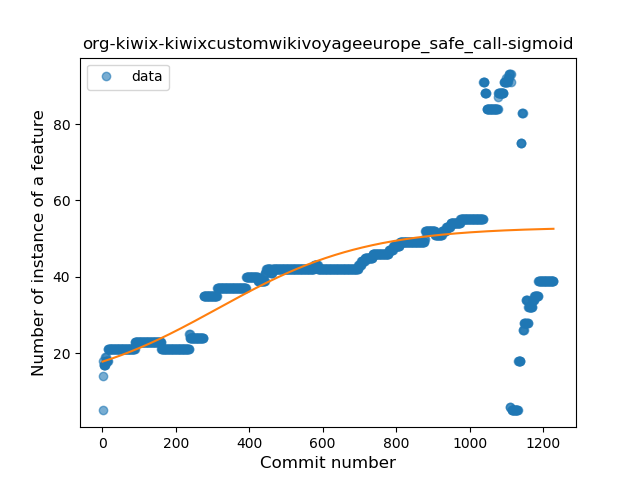
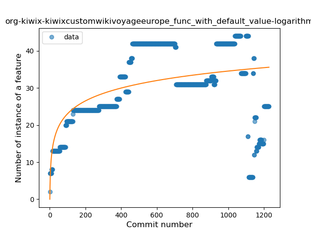
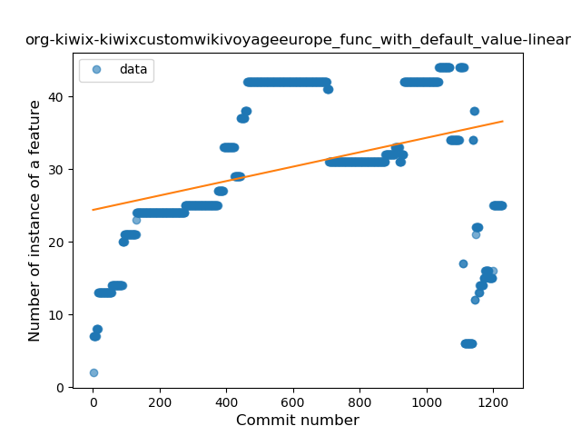
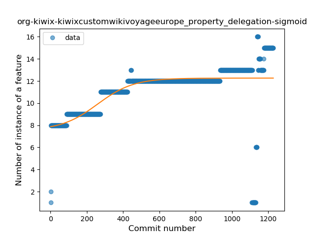

## org-kiwix-kiwixcustomwikivoyageeurope
----
#### Metrics provided by Detekt
* Number of lines of code 14852
* Number of Kotlin files: 200
* Cyclomatic complexity: 1251
* Cyclomatic complexity by thousands of lines: 201 

----
**21** features analyzed

*	<a href="#type_inference">Type Inference</a> 
*	<a href="#lambda">Lambda</a> 
*	<a href="#safe_call">Safe Call</a> 
*	<a href="#when_expr">When expression</a> 
*	<a href="#unsafe_call">Unsafe Call</a> 
*	<a href="#companion_object">Companion Object</a> 
*	<a href="#string_template">String Template</a> 
*	<a href="#func_with_default_value">Function with Default Value</a> 
*	<a href="#singleton">Singleton</a> 
*	<a href="#range_expr">Range Expression</a> 
*	<a href="#smart_cast">Smart Cast</a> 
*	<a href="#data_class">Data Class</a> 
*	<a href="#func_call_with_named_arg">Function call with Named Argument</a> 
*	<a href="#extension_function">Extension Function</a> 
*	<a href="#property_delegation">Property Delegation</a> 
*	<a href="#destructuring_declaration">Destructuring Declaration</a> 
*	<a href="#inline_func">Inline Function</a> 
*	<a href="#overloaded_op">Overloaded Operator</a> 
*	<a href="#sealed_class">Sealed Class</a> 
*	<a href="#infix_func">Infix Function</a> 
*	<a href="#inline_class">Inline Class</a> 

### <a name="type_inference">Type Inference</a>
----
#### Functions
* **Sudden Rise Plateau - Logarithm:** 
    * **R_Squared:** 0.54213777
* **Constant Rise - Linear:** 
    * **R_Squared:** 0.44779038
* **Plateau Sudden Rise - Binary Sigmoid:** 
    * **R_Squared:** 0.33718813

**Plots** :chart_with_upwards_trend:
-----

### <a name="lambda">Lambda</a>
----
#### Functions
* **Plateau Sudden Rise - Binary Sigmoid:** 
    * **R_Squared:** 0.4096281
* **Sudden Rise Plateau - Logarithm:** 
    * **R_Squared:** 0.39416609
* **Constant Rise - Linear:** 
    * **R_Squared:** 0.13870885

**Plots** :chart_with_upwards_trend:
-----

### <a name="safe_call">Safe Call</a>
----
#### Functions
* **Plateau Gradual Rise - Sigmoid:** 
    * **R_Squared:** 0.45600453
* **Constant Rise - Linear:** 
    * **R_Squared:** 0.40286439
* **Sudden Rise Plateau - Logarithm:** 
    * **R_Squared:** 0.33463908

**Plots** :chart_with_upwards_trend:
-----

### <a name="when_expr">When expression</a>
----
#### Functions
* **Sudden Rise Plateau - Logarithm:** 
    * **R_Squared:** 0.41178176
* **Constant Rise - Linear:** 
    * **R_Squared:** 0.32163678

**Plots** :chart_with_upwards_trend:
-----

### <a name="unsafe_call">Unsafe Call</a>
----
#### Functions
* **Plateau Gradual Rise - Sigmoid:** 
    * **R_Squared:** 0.19371688
* **Sudden Rise Plateau - Logarithm:** 
    * **R_Squared:** 0.16584755
* **Constant Rise - Linear:** 
    * **R_Squared:** 0.11689419

**Plots** :chart_with_upwards_trend:
-----

### <a name="companion_object">Companion Object</a>
----
#### Functions
* **Plateau Gradual Rise - Sigmoid:** 
    * **R_Squared:** 0.268761
* **Sudden Rise Plateau - Logarithm:** 
    * **R_Squared:** 0.19923008
* **Constant Rise - Linear:** 
    * **R_Squared:** 0.0686475

**Plots** :chart_with_upwards_trend:
-----

### <a name="string_template">String Template</a>
----
#### Functions
* **Plateau Gradual Rise - Sigmoid:** 
    * **R_Squared:** 0.84112531
* **Constant Rise - Linear:** 
    * **R_Squared:** 0.66137421
* **Sudden Rise Plateau - Logarithm:** 
    * **R_Squared:** 0.46520929

**Plots** :chart_with_upwards_trend:
-----

### <a name="func_with_default_value">Function with Default Value</a>
----
#### Functions
* **Plateau Gradual Rise - Sigmoid:** 
    * **R_Squared:** 0.3642009
* **Sudden Rise Plateau - Logarithm:** 
    * **R_Squared:** 0.29760206
* **Constant Rise - Linear:** 
    * **R_Squared:** 0.11915595

**Plots** :chart_with_upwards_trend:
-----

### <a name="singleton">Singleton</a>
----
#### Functions
* **Sudden Rise Plateau - Logarithm:** 
    * **R_Squared:** 0.15737246
* **Plateau Sudden Rise - Binary Sigmoid:** 
    * **R_Squared:** 0.05136147
* **Constant Rise - Linear:** 
    * **R_Squared:** 0.03570803

**Plots** :chart_with_upwards_trend:
-----

### <a name="range_expr">Range Expression</a>
----
#### Functions
* **Constant Rise - Linear:** 
    * **R_Squared:** 0.77674607
* **Sudden Rise Plateau - Logarithm:** 
    * **R_Squared:** 0.43895449

**Plots** :chart_with_upwards_trend:
-----

### <a name="smart_cast">Smart Cast</a>
----
#### Functions
* **Constant Rise - Linear:** 
    * **R_Squared:** 0.57309667
* **Sudden Rise Plateau - Logarithm:** 
    * **R_Squared:** 0.38719788
* **Plateau Sudden Rise - Binary Sigmoid:** 
    * **R_Squared:** 0.01491027

**Plots** :chart_with_upwards_trend:
-----

### <a name="data_class">Data Class</a>
----
#### Functions
* **Sudden Rise Plateau - Logarithm:** 
    * **R_Squared:** 0.33101253
* **Constant Rise - Linear:** 
    * **R_Squared:** 0.13576895

**Plots** :chart_with_upwards_trend:
-----

### <a name="func_call_with_named_arg">Function call with Named Argument</a>
----
#### Functions
* **Sudden Rise Plateau - Logarithm:** 
    * **R_Squared:** 0.49395696
* **Constant Rise - Linear:** 
    * **R_Squared:** 0.47933852

**Plots** :chart_with_upwards_trend:
-----

### <a name="extension_function">Extension Function</a>
----
#### Functions
* **Sudden Rise Plateau - Logarithm:** 
    * **R_Squared:** 0.51657486
* **Constant Rise - Linear:** 
    * **R_Squared:** 0.46394773

**Plots** :chart_with_upwards_trend:
-----

### <a name="property_delegation">Property Delegation</a>
----
#### Functions
* **Plateau Gradual Rise - Sigmoid:** 
    * **R_Squared:** 0.4156977
* **Sudden Rise Plateau - Logarithm:** 
    * **R_Squared:** 0.38540594
* **Constant Rise - Linear:** 
    * **R_Squared:** 0.32375656

**Plots** :chart_with_upwards_trend:
-----

### <a name="destructuring_declaration">Destructuring Declaration</a>
----
#### Functions
* **Plateau Sudden Decline - Binary Sigmoid:** 
    * **R_Squared:** 1.0
* **Constant Decline - Linear:** 
    * **R_Squared:** 0.56798343
* **Sudden Rise Plateau - Logarithm:** 
    * **R_Squared:** 0.0

**Plots** :chart_with_upwards_trend:
-----

### <a name="inline_func">Inline Function</a>
----
#### Functions
* **Plateau Gradual Rise - Sigmoid:** 
    * **R_Squared:** 0.85990696
* **Constant Rise - Linear:** 
    * **R_Squared:** 0.55402841
* **Sudden Rise Plateau - Logarithm:** 
    * **R_Squared:** 0.42878416

**Plots** :chart_with_upwards_trend:
-----

### <a name="overloaded_op">Overloaded Operator</a>
----
#### Functions
* **Plateau Gradual Decline - Sigmoid:** 
    * **R_Squared:** 0.98372727
* **Constant Decline - Linear:** 
    * **R_Squared:** 0.25856591
* **Sudden Rise Plateau - Logarithm:** 
    * **R_Squared:** -0.0

**Plots** :chart_with_upwards_trend:
-----

### <a name="sealed_class">Sealed Class</a>
----
#### Functions
* **Sudden Rise Plateau - Logarithm:** 
    * **R_Squared:** 0.36870292
* **Constant Rise - Linear:** 
    * **R_Squared:** 0.18865486
* **Plateau Gradual Rise - Sigmoid:** 
    * **R_Squared:** 0.0

**Plots** :chart_with_upwards_trend:
-----

### <a name="infix_func">Infix Function</a>
----
#### Functions
* **Plateau Sudden Rise - Binary Sigmoid:** 
    * **R_Squared:** 1.0
* **Constant Rise - Linear:** 
    * **R_Squared:** 0.61967051
* **Sudden Rise Plateau - Logarithm:** 
    * **R_Squared:** 0.61309497

**Plots** :chart_with_upwards_trend:
-----

### <a name="inline_class">Inline Class</a>
----
#### Functions
* **Sudden Rise Plateau - Logarithm:** 
    * **R_Squared:** 0.04908496
* **Constant Rise - Linear:** 
    * **R_Squared:** 0.0123655

**Plots** :chart_with_upwards_trend:
-----

