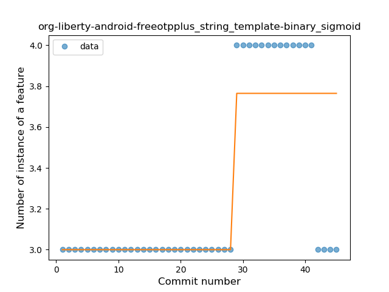

## org-liberty-android-freeotpplus
----
#### Metrics provided by Detekt
* Number of lines of code 2196
* Number of Kotlin files: 27
* Cyclomatic complexity: 232
* Cyclomatic complexity by thousands of lines: 224 

----
**10** features analyzed

*	<a href="#type_inference">Type Inference</a> 
*	<a href="#lambda">Lambda</a> 
*	<a href="#safe_call">Safe Call</a> 
*	<a href="#when_expr">When expression</a> 
*	<a href="#unsafe_call">Unsafe Call</a> 
*	<a href="#companion_object">Companion Object</a> 
*	<a href="#string_template">String Template</a> 
*	<a href="#range_expr">Range Expression</a> 
*	<a href="#overloaded_op">Overloaded Operator</a> 
*	<a href="#coroutine">Coroutine</a> 

### <a name="type_inference">Type Inference</a>
----
#### Functions
* **Constant Rise - Linear:** 
    * **R_Squared:** 0.83443898
* **Sudden Rise Plateau - Logarithm:** 
    * **R_Squared:** 0.59355191

**Plots** :chart_with_upwards_trend:
-----

### <a name="lambda">Lambda</a>
----
#### Functions
* **Instability - Polinomial 3:** )
    * **R_Squared:** 0.96521894
* **Constant Rise - Linear:** 
    * **R_Squared:** 0.94981868
* **Plateau Gradual Rise - Sigmoid:** 
    * **R_Squared:** 0.62788658
* **Sudden Rise Plateau - Logarithm:** 
    * **R_Squared:** 0.510395

**Plots** :chart_with_upwards_trend:
-----

### <a name="safe_call">Safe Call</a>
----
#### Functions
* **Instability - Polinomial 4:** 
    * **R_Squared:** 0.61111475
* **Instability - Polinomial 3:** )
    * **R_Squared:** 0.09857683
* **Constant Decline - Linear:** 
    * **R_Squared:** 0.01412544
* **Sudden Decline - Exponential:** 
    * **R_Squared:** 0.02006882
* **Sudden Rise Plateau - Logarithm:** 
    * **R_Squared:** -0.0

**Plots** :chart_with_upwards_trend:
-----

### <a name="when_expr">When expression</a>
----
#### Functions
* **Plateau Sudden Rise - Binary Sigmoid:** 
    * **R_Squared:** 0.84736718
* **Sudden Rise Plateau - Logarithm:** 
    * **R_Squared:** 0.56048826
* **Constant Rise - Linear:** 
    * **R_Squared:** 0.54055439

**Plots** :chart_with_upwards_trend:
-----

### <a name="unsafe_call">Unsafe Call</a>
----
#### Functions
* **Instability - Polinomial 3:** )
    * **R_Squared:** 0.18130023
* **Constant Rise - Linear:** 
    * **R_Squared:** 0.12318964
* **Sudden Rise Plateau - Logarithm:** 
    * **R_Squared:** 0.03195605

**Plots** :chart_with_upwards_trend:
-----

### <a name="companion_object">Companion Object</a>
----
#### Functions
* **Plateau Gradual Rise - Sigmoid:** 
    * **R_Squared:** 0.87547801
* **Constant Rise - Linear:** 
    * **R_Squared:** 0.67973575
* **Sudden Rise Plateau - Logarithm:** 
    * **R_Squared:** 0.5866092

**Plots** :chart_with_upwards_trend:
-----

### <a name="string_template">String Template</a>
----
#### Functions
* **Plateau Sudden Rise - Binary Sigmoid:** 
    * **R_Squared:** 0.66911765
* **Instability - Polinomial 3:** )
    * **R_Squared:** 0.62263996
* **Constant Rise - Linear:** 
    * **R_Squared:** 0.34683794
* **Sudden Rise Plateau - Logarithm:** 
    * **R_Squared:** 0.2471157

**Plots** :chart_with_upwards_trend:
-----

### <a name="range_expr">Range Expression</a>
----
#### Functions
* **Sudden Rise - Exponential:** 
    * **R_Squared:** 0.32065046
* **Constant Rise - Linear:** 
    * **R_Squared:** 0.29393342
* **Sudden Rise Plateau - Logarithm:** 
    * **R_Squared:** 0.17450719
* **Plateau Sudden Decline - Binary Sigmoid:** 
    * **R_Squared:** 0.01288109

**Plots** :chart_with_upwards_trend:
-----

### <a name="overloaded_op">Overloaded Operator</a>
----
#### Functions
* **Constant Decline - Linear:** 
    * **R_Squared:** 0.07057362
* **Plateau Sudden Decline - Binary Sigmoid:** 
    * **R_Squared:** 0.015625
* **Sudden Rise Plateau - Logarithm:** 
    * **R_Squared:** -0.0

**Plots** :chart_with_upwards_trend:
-----

### <a name="coroutine">Coroutine</a>
----
#### Functions
* **Instability - Polinomial 3:** )
    * **R_Squared:** 0.32146509
* **Constant Decline - Linear:** 
    * **R_Squared:** 0.05106765
* **Sudden Rise Plateau - Logarithm:** 
    * **R_Squared:** -1e-08

**Plots** :chart_with_upwards_trend:
-----

