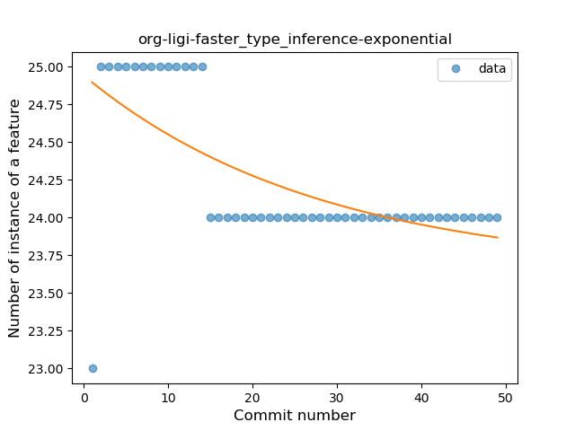
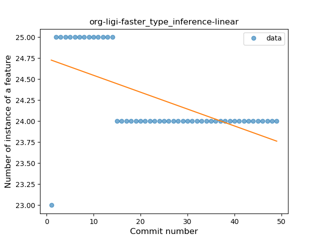
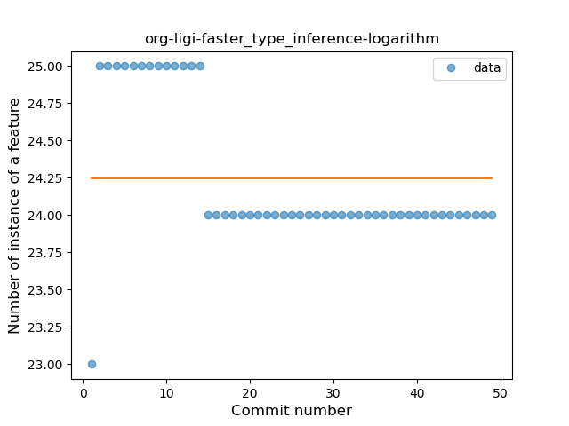
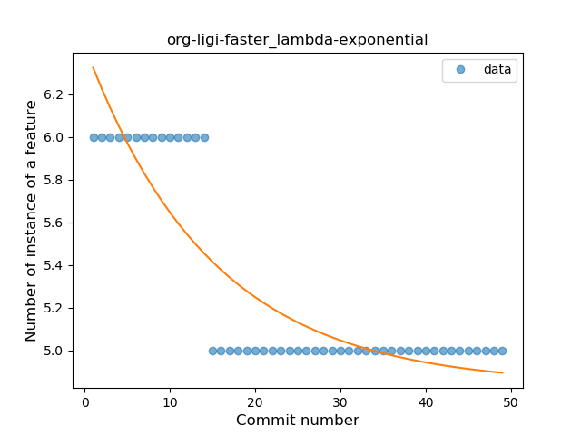
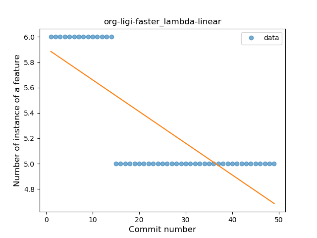
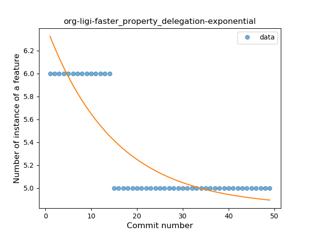
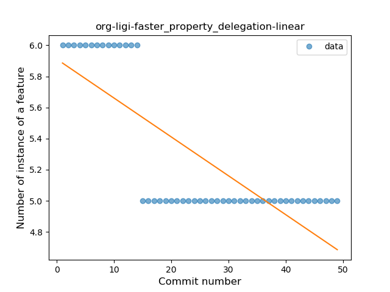
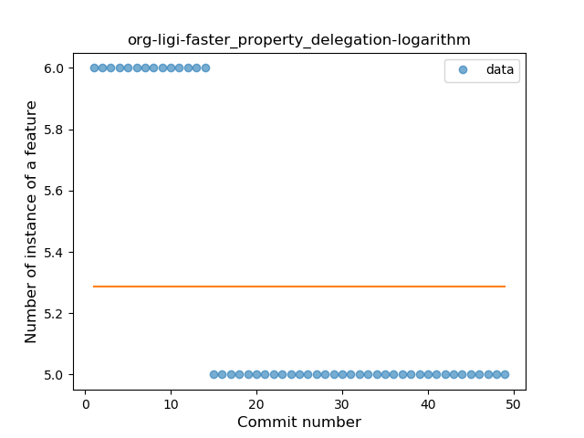

## org-ligi-faster
----
#### Metrics provided by Detekt
* Number of lines of code 239
* Number of Kotlin files: 5
* Cyclomatic complexity: 20
* Cyclomatic complexity by thousands of lines: 181 

----
**3** features analyzed

*	<a href="#type_inference">Type Inference</a> 
*	<a href="#lambda">Lambda</a> 
*	<a href="#property_delegation">Property Delegation</a> 

### <a name="type_inference">Type Inference</a>
----
#### Functions
* **Plateau Sudden Decline - Binary Sigmoid:** 
    * **R_Squared:** 0.66420664
* **Sudden Decline - Exponential:** 
    * **R_Squared:** 0.39083641
* **Constant Decline - Linear:** 
    * **R_Squared:** 0.35801661
* **Sudden Rise Plateau - Logarithm:** 
    * **R_Squared:** -0.0

**Plots** :chart_with_upwards_trend:
-----

### <a name="lambda">Lambda</a>
----
#### Functions
* **Sudden Decline - Exponential:** 
    * **R_Squared:** 0.76566091
* **Constant Decline - Linear:** 
    * **R_Squared:** 0.6125
* **Sudden Rise Plateau - Logarithm:** 
    * **R_Squared:** -0.0

**Plots** :chart_with_upwards_trend:
-----

### <a name="property_delegation">Property Delegation</a>
----
#### Functions
* **Sudden Decline - Exponential:** 
    * **R_Squared:** 0.76566091
* **Constant Decline - Linear:** 
    * **R_Squared:** 0.6125
* **Sudden Rise Plateau - Logarithm:** 
    * **R_Squared:** -0.0

**Plots** :chart_with_upwards_trend:
-----

