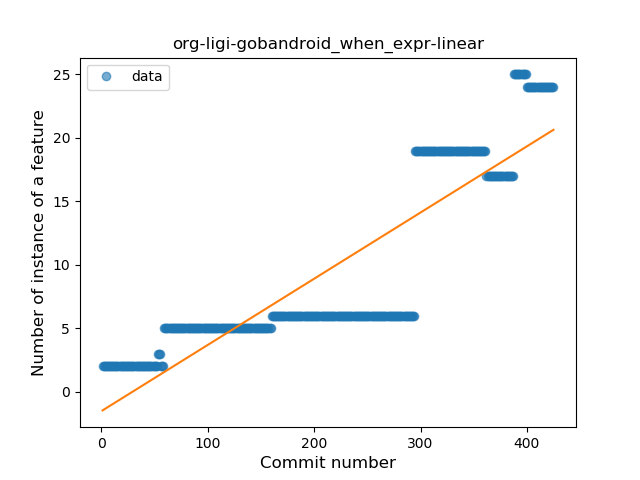
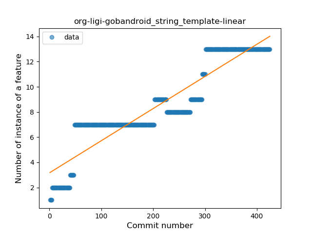
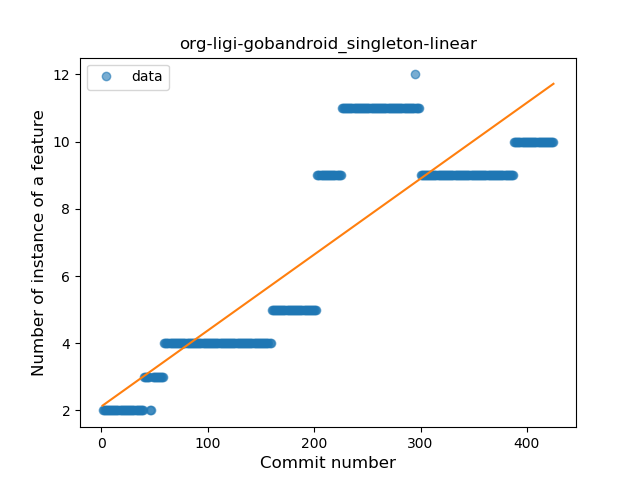
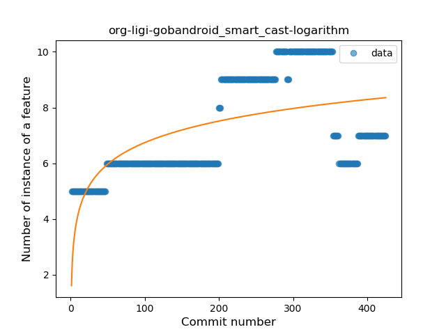

## org-ligi-gobandroid
----
#### Metrics provided by Detekt
* Number of lines of code 11130
* Number of Kotlin files: 143
* Cyclomatic complexity: 1431
* Cyclomatic complexity by thousands of lines: 285 

----
**16** features analyzed

*	<a href="#type_inference">Type Inference</a> 
*	<a href="#lambda">Lambda</a> 
*	<a href="#safe_call">Safe Call</a> 
*	<a href="#when_expr">When expression</a> 
*	<a href="#unsafe_call">Unsafe Call</a> 
*	<a href="#companion_object">Companion Object</a> 
*	<a href="#string_template">String Template</a> 
*	<a href="#func_with_default_value">Function with Default Value</a> 
*	<a href="#singleton">Singleton</a> 
*	<a href="#range_expr">Range Expression</a> 
*	<a href="#smart_cast">Smart Cast</a> 
*	<a href="#data_class">Data Class</a> 
*	<a href="#func_call_with_named_arg">Function call with Named Argument</a> 
*	<a href="#extension_function">Extension Function</a> 
*	<a href="#property_delegation">Property Delegation</a> 
*	<a href="#super_delegation">Super Delegation</a> 

### <a name="type_inference">Type Inference</a>
----
#### Functions
* **Sudden Rise - Exponential:** 
    * **R_Squared:** 0.91116782
* **Constant Rise - Linear:** 
    * **R_Squared:** 0.84062874
* **Sudden Rise Plateau - Logarithm:** 
    * **R_Squared:** 0.37208415
* **Plateau Sudden Rise - Binary Sigmoid:** 
    * **R_Squared:** 0.2091136

**Plots** :chart_with_upwards_trend:
-----

### <a name="lambda">Lambda</a>
----
#### Functions
* **Sudden Rise - Exponential:** 
    * **R_Squared:** 0.92329685
* **Constant Rise - Linear:** 
    * **R_Squared:** 0.88663089
* **Sudden Rise Plateau - Logarithm:** 
    * **R_Squared:** 0.42078147
* **Plateau Sudden Rise - Binary Sigmoid:** 
    * **R_Squared:** 0.39939674

**Plots** :chart_with_upwards_trend:
-----

### <a name="safe_call">Safe Call</a>
----
#### Functions
* **Sudden Rise - Exponential:** 
    * **R_Squared:** 0.90530826
* **Constant Rise - Linear:** 
    * **R_Squared:** 0.78025561
* **Sudden Rise Plateau - Logarithm:** 
    * **R_Squared:** 0.26193625

**Plots** :chart_with_upwards_trend:
-----

### <a name="when_expr">When expression</a>
----
#### Functions
* **Plateau Gradual Rise - Sigmoid:** 
    * **R_Squared:** 0.92758762
* **Sudden Rise - Exponential:** 
    * **R_Squared:** 0.86693098
* **Constant Rise - Linear:** 
    * **R_Squared:** 0.76326333
* **Sudden Rise Plateau - Logarithm:** 
    * **R_Squared:** 0.28083363

**Plots** :chart_with_upwards_trend:
-----

### <a name="unsafe_call">Unsafe Call</a>
----
#### Functions
* **Sudden Rise - Exponential:** 
    * **R_Squared:** 0.89275824
* **Constant Rise - Linear:** 
    * **R_Squared:** 0.66514383
* **Sudden Rise Plateau - Logarithm:** 
    * **R_Squared:** 0.24498014

**Plots** :chart_with_upwards_trend:
-----

### <a name="companion_object">Companion Object</a>
----
#### Functions
* **Sudden Rise - Exponential:** 
    * **R_Squared:** 0.92673901
* **Constant Rise - Linear:** 
    * **R_Squared:** 0.80608942
* **Sudden Rise Plateau - Logarithm:** 
    * **R_Squared:** 0.27057713

**Plots** :chart_with_upwards_trend:
-----

### <a name="string_template">String Template</a>
----
#### Functions
* **Constant Rise - Linear:** 
    * **R_Squared:** 0.85419765
* **Sudden Rise Plateau - Logarithm:** 
    * **R_Squared:** 0.61011121

**Plots** :chart_with_upwards_trend:
-----

### <a name="func_with_default_value">Function with Default Value</a>
----
#### Functions
* **Constant Rise - Linear:** 
    * **R_Squared:** 0.91150695
* **Sudden Rise - Exponential:** 
    * **R_Squared:** 0.92149796
* **Sudden Rise Plateau - Logarithm:** 
    * **R_Squared:** 0.59689144

**Plots** :chart_with_upwards_trend:
-----

### <a name="singleton">Singleton</a>
----
#### Functions
* **Constant Rise - Linear:** 
    * **R_Squared:** 0.74951498
* **Sudden Rise Plateau - Logarithm:** 
    * **R_Squared:** 0.503168

**Plots** :chart_with_upwards_trend:
-----

### <a name="range_expr">Range Expression</a>
----
#### Functions
* **Sudden Rise - Exponential:** 
    * **R_Squared:** 0.73952475
* **Constant Rise - Linear:** 
    * **R_Squared:** 0.67277593
* **Sudden Rise Plateau - Logarithm:** 
    * **R_Squared:** 0.44094585
* **Plateau Sudden Rise - Binary Sigmoid:** 
    * **R_Squared:** 0.14500986

**Plots** :chart_with_upwards_trend:
-----

### <a name="smart_cast">Smart Cast</a>
----
#### Functions
* **Plateau Gradual Rise - Sigmoid:** 
    * **R_Squared:** 0.62985827
* **Sudden Rise Plateau - Logarithm:** 
    * **R_Squared:** 0.3782347
* **Constant Rise - Linear:** 
    * **R_Squared:** 0.35123939

**Plots** :chart_with_upwards_trend:
-----

### <a name="data_class">Data Class</a>
----
#### Functions
* **Plateau Sudden Rise - Binary Sigmoid:** 
    * **R_Squared:** 1.0
* **Sudden Rise Plateau - Logarithm:** 
    * **R_Squared:** 0.65549261
* **Constant Rise - Linear:** 
    * **R_Squared:** 0.42213659

**Plots** :chart_with_upwards_trend:
-----

### <a name="func_call_with_named_arg">Function call with Named Argument</a>
----
#### Functions
* **Plateau Gradual Rise - Sigmoid:** 
    * **R_Squared:** 0.99473349
* **Constant Rise - Linear:** 
    * **R_Squared:** 0.73550998
* **Sudden Rise Plateau - Logarithm:** 
    * **R_Squared:** 0.39138527

**Plots** :chart_with_upwards_trend:
-----

### <a name="extension_function">Extension Function</a>
----
#### Functions
* **Sudden Rise - Exponential:** 
    * **R_Squared:** 0.64159539
* **Constant Rise - Linear:** 
    * **R_Squared:** 0.32415609
* **Sudden Rise Plateau - Logarithm:** 
    * **R_Squared:** 0.23692459
* **Plateau Sudden Rise - Binary Sigmoid:** 
    * **R_Squared:** 0.23284694

**Plots** :chart_with_upwards_trend:
-----

### <a name="property_delegation">Property Delegation</a>
----
#### Functions
* **Sudden Rise - Exponential:** 
    * **R_Squared:** 0.9148276
* **Constant Rise - Linear:** 
    * **R_Squared:** 0.89538567
* **Sudden Rise Plateau - Logarithm:** 
    * **R_Squared:** 0.3316081
* **Plateau Sudden Rise - Binary Sigmoid:** 
    * **R_Squared:** 0.08619389

**Plots** :chart_with_upwards_trend:
-----

### <a name="super_delegation">Super Delegation</a>
----
#### Functions
* **Plateau Sudden Rise - Binary Sigmoid:** 
    * **R_Squared:** 1.0
* **Sudden Rise Plateau - Logarithm:** 
    * **R_Squared:** 0.14935973
* **Constant Rise - Linear:** 
    * **R_Squared:** 0.02088076

**Plots** :chart_with_upwards_trend:
-----

