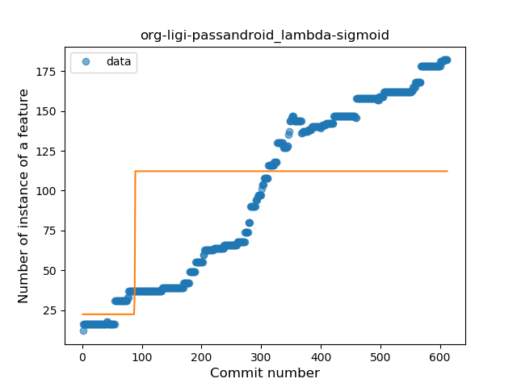
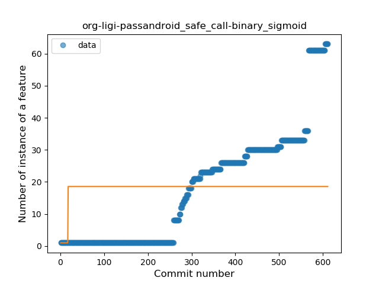
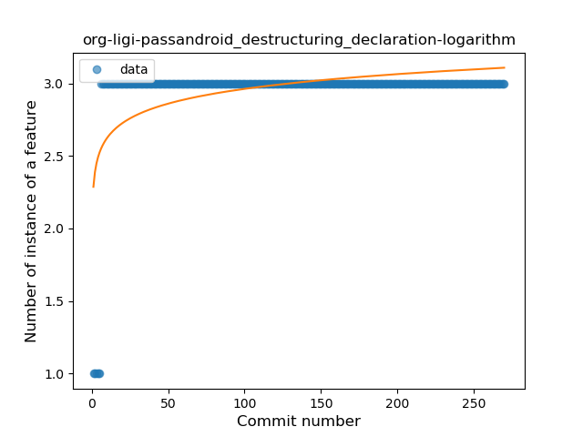
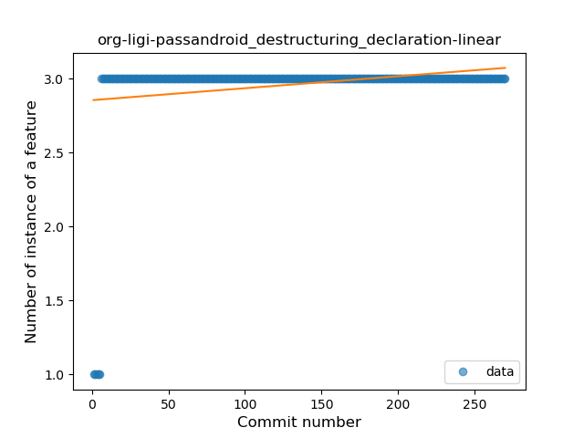

## org-ligi-passandroid
----
#### Metrics provided by Detekt
* Number of lines of code 8060
* Number of Kotlin files: 130
* Cyclomatic complexity: 1052
* Cyclomatic complexity by thousands of lines: 279 

----
**15** features analyzed

*	<a href="#type_inference">Type Inference</a> 
*	<a href="#lambda">Lambda</a> 
*	<a href="#safe_call">Safe Call</a> 
*	<a href="#when_expr">When expression</a> 
*	<a href="#unsafe_call">Unsafe Call</a> 
*	<a href="#companion_object">Companion Object</a> 
*	<a href="#string_template">String Template</a> 
*	<a href="#func_with_default_value">Function with Default Value</a> 
*	<a href="#singleton">Singleton</a> 
*	<a href="#range_expr">Range Expression</a> 
*	<a href="#smart_cast">Smart Cast</a> 
*	<a href="#func_call_with_named_arg">Function call with Named Argument</a> 
*	<a href="#extension_function">Extension Function</a> 
*	<a href="#property_delegation">Property Delegation</a> 
*	<a href="#destructuring_declaration">Destructuring Declaration</a> 

### <a name="type_inference">Type Inference</a>
----
#### Functions
* **Constant Rise - Linear:** 
    * **R_Squared:** 0.90999061
* **Sudden Rise Plateau - Logarithm:** 
    * **R_Squared:** 0.4387804
* **Plateau Sudden Rise - Binary Sigmoid:** 
    * **R_Squared:** 0.36432017

**Plots** :chart_with_upwards_trend:
-----

### <a name="lambda">Lambda</a>
----
#### Functions
* **Constant Rise - Linear:** 
    * **R_Squared:** 0.95789806
* **Sudden Rise Plateau - Logarithm:** 
    * **R_Squared:** 0.44576205
* **Plateau Gradual Rise - Sigmoid:** 
    * **R_Squared:** 0.31214136

**Plots** :chart_with_upwards_trend:
-----

### <a name="safe_call">Safe Call</a>
----
#### Functions
* **Sudden Rise - Exponential:** 
    * **R_Squared:** 0.90529768
* **Constant Rise - Linear:** 
    * **R_Squared:** 0.84561021
* **Sudden Rise Plateau - Logarithm:** 
    * **R_Squared:** 0.2335473
* **Plateau Sudden Rise - Binary Sigmoid:** 
    * **R_Squared:** 0.02644558

**Plots** :chart_with_upwards_trend:
-----

### <a name="when_expr">When expression</a>
----
#### Functions
* **Constant Rise - Linear:** 
    * **R_Squared:** 0.91386708
* **Sudden Rise Plateau - Logarithm:** 
    * **R_Squared:** 0.37230095

**Plots** :chart_with_upwards_trend:
-----

### <a name="unsafe_call">Unsafe Call</a>
----
#### Functions
* **Constant Rise - Linear:** 
    * **R_Squared:** 0.90589479
* **Sudden Rise Plateau - Logarithm:** 
    * **R_Squared:** 0.35276419
* **Plateau Sudden Rise - Binary Sigmoid:** 
    * **R_Squared:** 0.02181345

**Plots** :chart_with_upwards_trend:
-----

### <a name="companion_object">Companion Object</a>
----
#### Functions
* **Constant Rise - Linear:** 
    * **R_Squared:** 0.8832478
* **Sudden Rise - Exponential:** 
    * **R_Squared:** 0.88538438
* **Sudden Rise Plateau - Logarithm:** 
    * **R_Squared:** 0.37909004
* **Plateau Sudden Rise - Binary Sigmoid:** 
    * **R_Squared:** 0.00641992

**Plots** :chart_with_upwards_trend:
-----

### <a name="string_template">String Template</a>
----
#### Functions
* **Sudden Rise - Exponential:** 
    * **R_Squared:** 0.82796821
* **Constant Rise - Linear:** 
    * **R_Squared:** 0.76756122
* **Sudden Rise Plateau - Logarithm:** 
    * **R_Squared:** 0.32581931

**Plots** :chart_with_upwards_trend:
-----

### <a name="func_with_default_value">Function with Default Value</a>
----
#### Functions
* **Plateau Gradual Rise - Sigmoid:** 
    * **R_Squared:** 0.9393536
* **Constant Rise - Linear:** 
    * **R_Squared:** 0.89122869
* **Sudden Rise - Exponential:** 
    * **R_Squared:** 0.89132883
* **Sudden Rise Plateau - Logarithm:** 
    * **R_Squared:** 0.58454373

**Plots** :chart_with_upwards_trend:
-----

### <a name="singleton">Singleton</a>
----
#### Functions
* **Plateau Gradual Rise - Sigmoid:** 
    * **R_Squared:** 0.48994346
* **Sudden Rise Plateau - Logarithm:** 
    * **R_Squared:** 0.35228994
* **Constant Rise - Linear:** 
    * **R_Squared:** 0.16672492

**Plots** :chart_with_upwards_trend:
-----

### <a name="range_expr">Range Expression</a>
----
#### Functions
* **Plateau Gradual Rise - Sigmoid:** 
    * **R_Squared:** 0.97248033
* **Sudden Rise - Exponential:** 
    * **R_Squared:** 0.9092191
* **Constant Rise - Linear:** 
    * **R_Squared:** 0.84202663
* **Sudden Rise Plateau - Logarithm:** 
    * **R_Squared:** 0.27836715

**Plots** :chart_with_upwards_trend:
-----

### <a name="smart_cast">Smart Cast</a>
----
#### Functions
* **Constant Decline - Linear:** 
    * **R_Squared:** 0.3977627
* **Sudden Rise Plateau - Logarithm:** 
    * **R_Squared:** -0.0

**Plots** :chart_with_upwards_trend:
-----

### <a name="func_call_with_named_arg">Function call with Named Argument</a>
----
#### Functions
* **Plateau Gradual Rise - Sigmoid:** 
    * **R_Squared:** 0.92759957
* **Sudden Rise - Exponential:** 
    * **R_Squared:** 0.91503949
* **Constant Rise - Linear:** 
    * **R_Squared:** 0.8887702
* **Sudden Rise Plateau - Logarithm:** 
    * **R_Squared:** 0.52124127

**Plots** :chart_with_upwards_trend:
-----

### <a name="extension_function">Extension Function</a>
----
#### Functions
* **Plateau Sudden Rise - Binary Sigmoid:** 
    * **R_Squared:** 0.96360232
* **Sudden Rise Plateau - Logarithm:** 
    * **R_Squared:** 0.72336491
* **Constant Rise - Linear:** 
    * **R_Squared:** 0.5307863

**Plots** :chart_with_upwards_trend:
-----

### <a name="property_delegation">Property Delegation</a>
----
#### Functions
* **Constant Rise - Linear:** 
    * **R_Squared:** 0.63107162
* **Sudden Rise Plateau - Logarithm:** 
    * **R_Squared:** 0.5842598
* **Plateau Sudden Rise - Binary Sigmoid:** 
    * **R_Squared:** 0.09455763

**Plots** :chart_with_upwards_trend:
-----

### <a name="destructuring_declaration">Destructuring Declaration</a>
----
#### Functions
* **Plateau Sudden Rise - Binary Sigmoid:** 
    * **R_Squared:** 1.0
* **Sudden Rise Plateau - Logarithm:** 
    * **R_Squared:** 0.27281035
* **Constant Rise - Linear:** 
    * **R_Squared:** 0.0545275

**Plots** :chart_with_upwards_trend:
-----

