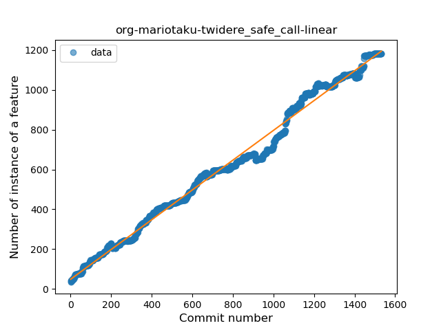
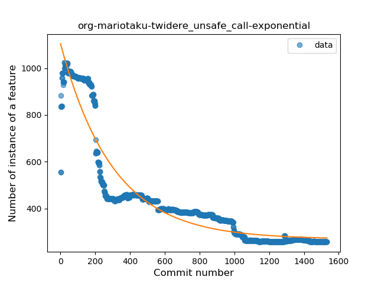
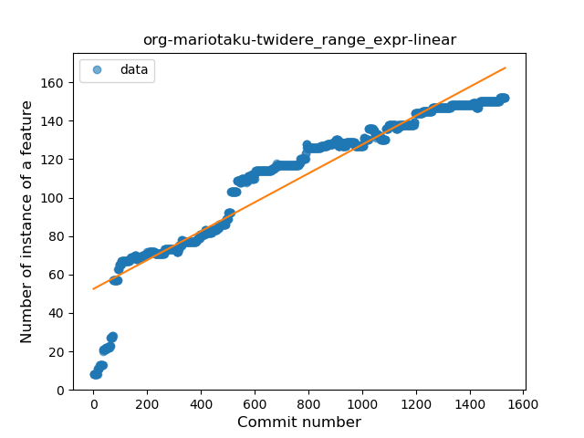
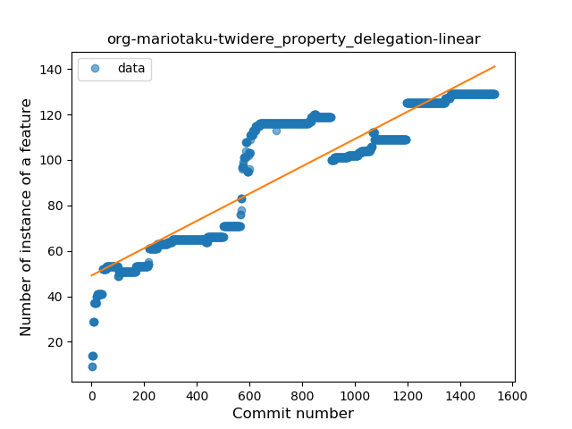
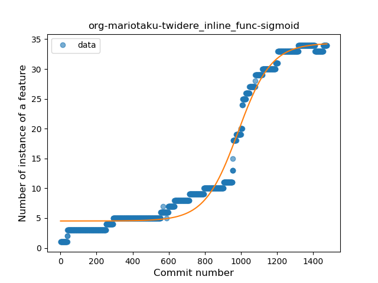

## org-mariotaku-twidere
----
#### Metrics provided by Detekt
* Number of lines of code 94575
* Number of Kotlin files: 823
* Cyclomatic complexity: 12936
* Cyclomatic complexity by thousands of lines: 275 

----
**19** features analyzed

*	<a href="#type_inference">Type Inference</a> 
*	<a href="#lambda">Lambda</a> 
*	<a href="#safe_call">Safe Call</a> 
*	<a href="#when_expr">When expression</a> 
*	<a href="#unsafe_call">Unsafe Call</a> 
*	<a href="#companion_object">Companion Object</a> 
*	<a href="#string_template">String Template</a> 
*	<a href="#func_with_default_value">Function with Default Value</a> 
*	<a href="#singleton">Singleton</a> 
*	<a href="#range_expr">Range Expression</a> 
*	<a href="#smart_cast">Smart Cast</a> 
*	<a href="#data_class">Data Class</a> 
*	<a href="#func_call_with_named_arg">Function call with Named Argument</a> 
*	<a href="#extension_function">Extension Function</a> 
*	<a href="#property_delegation">Property Delegation</a> 
*	<a href="#destructuring_declaration">Destructuring Declaration</a> 
*	<a href="#inline_func">Inline Function</a> 
*	<a href="#overloaded_op">Overloaded Operator</a> 
*	<a href="#type_alias">Type Alias</a> 

### <a name="type_inference">Type Inference</a>
----
#### Functions
* **Constant Rise - Linear:** 
    * **R_Squared:** 0.97405046
* **Sudden Rise Plateau - Logarithm:** 
    * **R_Squared:** 0.75492668

**Plots** :chart_with_upwards_trend:
-----

### <a name="lambda">Lambda</a>
----
#### Functions
* **Constant Rise - Linear:** 
    * **R_Squared:** 0.98858718
* **Sudden Rise Plateau - Logarithm:** 
    * **R_Squared:** 0.46739672
* **Plateau Sudden Rise - Binary Sigmoid:** 
    * **R_Squared:** 0.16620259

**Plots** :chart_with_upwards_trend:
-----

### <a name="safe_call">Safe Call</a>
----
#### Functions
* **Constant Rise - Linear:** 
    * **R_Squared:** 0.98968138
* **Sudden Rise - Exponential:** 
    * **R_Squared:** 0.99035231
* **Sudden Rise Plateau - Logarithm:** 
    * **R_Squared:** 0.42556147
* **Plateau Sudden Rise - Binary Sigmoid:** 
    * **R_Squared:** 0.21112135

**Plots** :chart_with_upwards_trend:
-----

### <a name="when_expr">When expression</a>
----
#### Functions
* **Constant Rise - Linear:** 
    * **R_Squared:** 0.97219437
* **Sudden Rise Plateau - Logarithm:** 
    * **R_Squared:** 0.7331541
* **Plateau Sudden Rise - Binary Sigmoid:** 
    * **R_Squared:** 0.26696707

**Plots** :chart_with_upwards_trend:
-----

### <a name="unsafe_call">Unsafe Call</a>
----
#### Functions
* **Sudden Decline - Exponential:** 
    * **R_Squared:** 0.8980148
* **Constant Decline - Linear:** 
    * **R_Squared:** 0.67715889
* **Sudden Rise Plateau - Logarithm:** 
    * **R_Squared:** -0.0

**Plots** :chart_with_upwards_trend:
-----

### <a name="companion_object">Companion Object</a>
----
#### Functions
* **Constant Rise - Linear:** 
    * **R_Squared:** 0.97229588
* **Sudden Rise Plateau - Logarithm:** 
    * **R_Squared:** 0.75446539
* **Plateau Sudden Rise - Binary Sigmoid:** 
    * **R_Squared:** 0.6464403

**Plots** :chart_with_upwards_trend:
-----

### <a name="string_template">String Template</a>
----
#### Functions
* **Constant Rise - Linear:** 
    * **R_Squared:** 0.97745318
* **Sudden Rise - Exponential:** 
    * **R_Squared:** 0.98666186
* **Sudden Rise Plateau - Logarithm:** 
    * **R_Squared:** 0.4014867
* **Plateau Sudden Rise - Binary Sigmoid:** 
    * **R_Squared:** 0.13139307

**Plots** :chart_with_upwards_trend:
-----

### <a name="func_with_default_value">Function with Default Value</a>
----
#### Functions
* **Constant Rise - Linear:** 
    * **R_Squared:** 0.99428334
* **Sudden Rise Plateau - Logarithm:** 
    * **R_Squared:** 0.40661256
* **Plateau Sudden Rise - Binary Sigmoid:** 
    * **R_Squared:** 0.25313913

**Plots** :chart_with_upwards_trend:
-----

### <a name="singleton">Singleton</a>
----
#### Functions
* **Plateau Gradual Rise - Sigmoid:** 
    * **R_Squared:** 0.98885655
* **Constant Rise - Linear:** 
    * **R_Squared:** 0.97530135
* **Sudden Rise Plateau - Logarithm:** 
    * **R_Squared:** 0.4222462

**Plots** :chart_with_upwards_trend:
-----

### <a name="range_expr">Range Expression</a>
----
#### Functions
* **Constant Rise - Linear:** 
    * **R_Squared:** 0.89394378
* **Sudden Rise Plateau - Logarithm:** 
    * **R_Squared:** 0.70001721
* **Plateau Sudden Rise - Binary Sigmoid:** 
    * **R_Squared:** 0.38430891

**Plots** :chart_with_upwards_trend:
-----

### <a name="smart_cast">Smart Cast</a>
----
#### Functions
* **Constant Rise - Linear:** 
    * **R_Squared:** 0.90234792
* **Sudden Rise Plateau - Logarithm:** 
    * **R_Squared:** 0.71814599
* **Plateau Sudden Rise - Binary Sigmoid:** 
    * **R_Squared:** 0.16585165

**Plots** :chart_with_upwards_trend:
-----

### <a name="data_class">Data Class</a>
----
#### Functions
* **Constant Rise - Linear:** 
    * **R_Squared:** 0.95519266
* **Sudden Rise Plateau - Logarithm:** 
    * **R_Squared:** 0.4945672

**Plots** :chart_with_upwards_trend:
-----

### <a name="func_call_with_named_arg">Function call with Named Argument</a>
----
#### Functions
* **Constant Rise - Linear:** 
    * **R_Squared:** 0.98363711
* **Sudden Rise Plateau - Logarithm:** 
    * **R_Squared:** 0.42816153
* **Plateau Sudden Rise - Binary Sigmoid:** 
    * **R_Squared:** 0.33556033

**Plots** :chart_with_upwards_trend:
-----

### <a name="extension_function">Extension Function</a>
----
#### Functions
* **Constant Rise - Linear:** 
    * **R_Squared:** 0.97863731
* **Sudden Rise - Exponential:** 
    * **R_Squared:** 0.97895895
* **Plateau Sudden Rise - Binary Sigmoid:** 
    * **R_Squared:** 0.51472711
* **Sudden Rise Plateau - Logarithm:** 
    * **R_Squared:** 0.39534831

**Plots** :chart_with_upwards_trend:
-----

### <a name="property_delegation">Property Delegation</a>
----
#### Functions
* **Constant Rise - Linear:** 
    * **R_Squared:** 0.82499663
* **Sudden Rise Plateau - Logarithm:** 
    * **R_Squared:** 0.63185493

**Plots** :chart_with_upwards_trend:
-----

### <a name="destructuring_declaration">Destructuring Declaration</a>
----
#### Functions
* **Sudden Rise - Exponential:** 
    * **R_Squared:** 0.97613311
* **Constant Rise - Linear:** 
    * **R_Squared:** 0.944786
* **Sudden Rise Plateau - Logarithm:** 
    * **R_Squared:** 0.2781939
* **Plateau Sudden Rise - Binary Sigmoid:** 
    * **R_Squared:** 0.03647664

**Plots** :chart_with_upwards_trend:
-----

### <a name="inline_func">Inline Function</a>
----
#### Functions
* **Plateau Gradual Rise - Sigmoid:** 
    * **R_Squared:** 0.98165132
* **Sudden Rise - Exponential:** 
    * **R_Squared:** 0.92218894
* **Constant Rise - Linear:** 
    * **R_Squared:** 0.85889256
* **Sudden Rise Plateau - Logarithm:** 
    * **R_Squared:** 0.23712097

**Plots** :chart_with_upwards_trend:
-----

### <a name="overloaded_op">Overloaded Operator</a>
----
#### Functions
* **Sudden Rise - Exponential:** 
    * **R_Squared:** 0.95872928
* **Constant Rise - Linear:** 
    * **R_Squared:** 0.93959358
* **Sudden Rise Plateau - Logarithm:** 
    * **R_Squared:** 0.41183502
* **Plateau Sudden Rise - Binary Sigmoid:** 
    * **R_Squared:** 0.02219992

**Plots** :chart_with_upwards_trend:
-----

### <a name="type_alias">Type Alias</a>
----
#### Functions
* **Plateau Sudden Rise - Binary Sigmoid:** 
    * **R_Squared:** 0.57403126
* **Sudden Rise Plateau - Logarithm:** 
    * **R_Squared:** 0.41725467
* **Constant Rise - Linear:** 
    * **R_Squared:** 0.27228996

**Plots** :chart_with_upwards_trend:
-----

