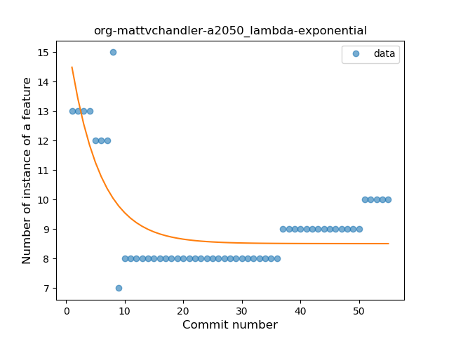
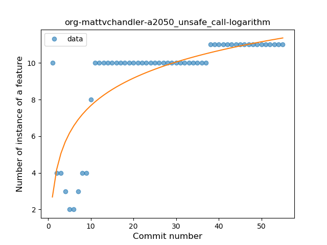

## org-mattvchandler-a2050
----
#### Metrics provided by Detekt
* Number of lines of code 679
* Number of Kotlin files: 4
* Cyclomatic complexity: 100
* Cyclomatic complexity by thousands of lines: 272 

----
**6** features analyzed

*	<a href="#type_inference">Type Inference</a> 
*	<a href="#lambda">Lambda</a> 
*	<a href="#safe_call">Safe Call</a> 
*	<a href="#when_expr">When expression</a> 
*	<a href="#unsafe_call">Unsafe Call</a> 
*	<a href="#companion_object">Companion Object</a> 

### <a name="type_inference">Type Inference</a>
----
#### Functions
* **Sudden Rise Plateau - Logarithm:** 
    * **R_Squared:** 0.70406893
* **Instability - Polinomial 3:** )
    * **R_Squared:** 0.67164035
* **Plateau Sudden Rise - Binary Sigmoid:** 
    * **R_Squared:** 0.50051416
* **Constant Rise - Linear:** 
    * **R_Squared:** 0.38957816

**Plots** :chart_with_upwards_trend:
-----

### <a name="lambda">Lambda</a>
----
#### Functions
* **Instability - Polinomial 3:** )
    * **R_Squared:** 0.7200302
* **Sudden Decline - Exponential:** 
    * **R_Squared:** 0.55793378
* **Constant Decline - Linear:** 
    * **R_Squared:** 0.08152991
* **Sudden Rise Plateau - Logarithm:** 
    * **R_Squared:** -0.0

**Plots** :chart_with_upwards_trend:
-----

### <a name="safe_call">Safe Call</a>
----
#### Functions
* **Sudden Rise - Exponential:** 
    * **R_Squared:** 0.5858681
* **Constant Rise - Linear:** 
    * **R_Squared:** 0.52226431
* **Sudden Rise Plateau - Logarithm:** 
    * **R_Squared:** 0.42285319

**Plots** :chart_with_upwards_trend:
-----

### <a name="when_expr">When expression</a>
----
#### Functions
* **Instability - Polinomial 3:** )
    * **R_Squared:** 0.7874625
* **Sudden Rise Plateau - Logarithm:** 
    * **R_Squared:** 0.69860264
* **Constant Rise - Linear:** 
    * **R_Squared:** 0.35984848

**Plots** :chart_with_upwards_trend:
-----

### <a name="unsafe_call">Unsafe Call</a>
----
#### Functions
* **Sudden Rise Plateau - Logarithm:** 
    * **R_Squared:** 0.55502104
* **Constant Rise - Linear:** 
    * **R_Squared:** 0.49495782

**Plots** :chart_with_upwards_trend:
-----

### <a name="companion_object">Companion Object</a>
----
#### Functions
* **Sudden Rise Plateau - Logarithm:** 
    * **R_Squared:** 0.21817294
* **Constant Rise - Linear:** 
    * **R_Squared:** 0.05263158

**Plots** :chart_with_upwards_trend:
-----

