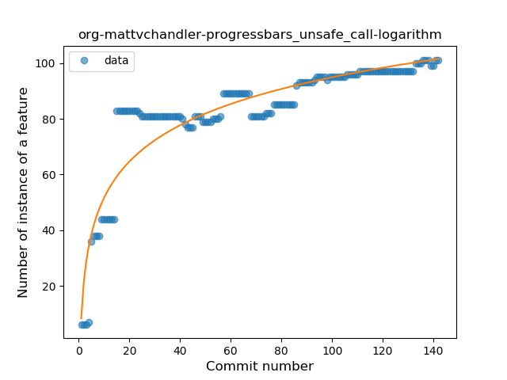
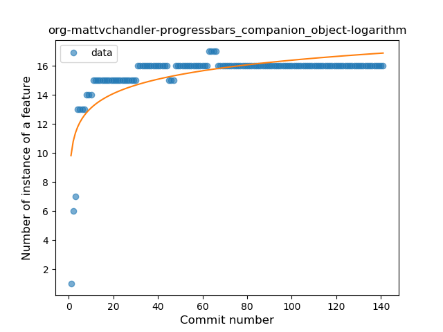
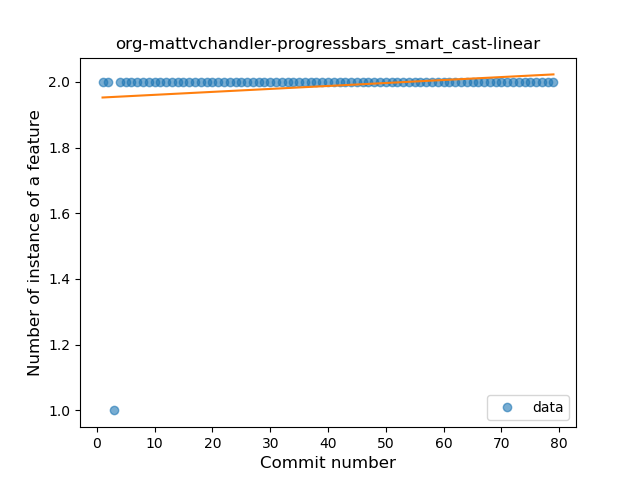
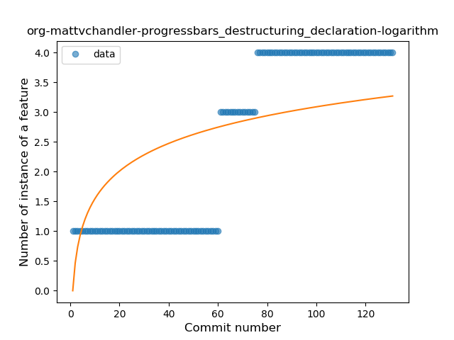

## org-mattvchandler-progressbars
----
#### Metrics provided by Detekt
* Number of lines of code 4540
* Number of Kotlin files: 20
* Cyclomatic complexity: 604
* Cyclomatic complexity by thousands of lines: 207 

----
**12** features analyzed

*	<a href="#type_inference">Type Inference</a> 
*	<a href="#lambda">Lambda</a> 
*	<a href="#safe_call">Safe Call</a> 
*	<a href="#when_expr">When expression</a> 
*	<a href="#unsafe_call">Unsafe Call</a> 
*	<a href="#companion_object">Companion Object</a> 
*	<a href="#string_template">String Template</a> 
*	<a href="#range_expr">Range Expression</a> 
*	<a href="#smart_cast">Smart Cast</a> 
*	<a href="#data_class">Data Class</a> 
*	<a href="#extension_function">Extension Function</a> 
*	<a href="#destructuring_declaration">Destructuring Declaration</a> 

### <a name="type_inference">Type Inference</a>
----
#### Functions
* **Instability - Polinomial 3:** )
    * **R_Squared:** 0.4388021
* **Sudden Rise Plateau - Logarithm:** 
    * **R_Squared:** 0.41776559
* **Constant Rise - Linear:** 
    * **R_Squared:** 0.13235123

**Plots** :chart_with_upwards_trend:
-----

### <a name="lambda">Lambda</a>
----
#### Functions
* **Plateau Gradual Rise - Sigmoid:** 
    * **R_Squared:** 0.76450886
* **Constant Rise - Linear:** 
    * **R_Squared:** 0.69889324
* **Sudden Rise Plateau - Logarithm:** 
    * **R_Squared:** 0.68180245

**Plots** :chart_with_upwards_trend:
-----

### <a name="safe_call">Safe Call</a>
----
#### Functions
* **Constant Rise - Linear:** 
    * **R_Squared:** 0.84656566
* **Sudden Rise Plateau - Logarithm:** 
    * **R_Squared:** 0.73546302

**Plots** :chart_with_upwards_trend:
-----

### <a name="when_expr">When expression</a>
----
#### Functions
* **Constant Rise - Linear:** 
    * **R_Squared:** 0.86668625
* **Sudden Rise Plateau - Logarithm:** 
    * **R_Squared:** 0.85483543

**Plots** :chart_with_upwards_trend:
-----

### <a name="unsafe_call">Unsafe Call</a>
----
#### Functions
* **Sudden Rise Plateau - Logarithm:** 
    * **R_Squared:** 0.84493731
* **Instability - Polinomial 3:** )
    * **R_Squared:** 0.79091019
* **Constant Rise - Linear:** 
    * **R_Squared:** 0.56363633
* **Plateau Sudden Rise - Binary Sigmoid:** 
    * **R_Squared:** 0.31573561

**Plots** :chart_with_upwards_trend:
-----

### <a name="companion_object">Companion Object</a>
----
#### Functions
* **Sudden Rise Plateau - Logarithm:** 
    * **R_Squared:** 0.56913301
* **Plateau Sudden Rise - Binary Sigmoid:** 
    * **R_Squared:** 0.21079955
* **Constant Rise - Linear:** 
    * **R_Squared:** 0.20071779

**Plots** :chart_with_upwards_trend:
-----

### <a name="string_template">String Template</a>
----
#### Functions
* **Sudden Rise Plateau - Logarithm:** 
    * **R_Squared:** 0.52300649
* **Constant Rise - Linear:** 
    * **R_Squared:** 0.33242853

**Plots** :chart_with_upwards_trend:
-----

### <a name="range_expr">Range Expression</a>
----
#### Functions
* **Sudden Rise - Exponential:** 
    * **R_Squared:** 0.40438117
* **Sudden Rise Plateau - Logarithm:** 
    * **R_Squared:** 0.25765817
* **Constant Rise - Linear:** 
    * **R_Squared:** 0.18664078

**Plots** :chart_with_upwards_trend:
-----

### <a name="smart_cast">Smart Cast</a>
----
#### Functions
* **Sudden Rise Plateau - Logarithm:** 
    * **R_Squared:** 0.08251564
* **Constant Rise - Linear:** 
    * **R_Squared:** 0.03375247

**Plots** :chart_with_upwards_trend:
-----

### <a name="data_class">Data Class</a>
----
#### Functions
* **Sudden Rise - Exponential:** 
    * **R_Squared:** 0.30234724
* **Constant Rise - Linear:** 
    * **R_Squared:** 0.25365831
* **Sudden Rise Plateau - Logarithm:** 
    * **R_Squared:** 0.0444478

**Plots** :chart_with_upwards_trend:
-----

### <a name="extension_function">Extension Function</a>
----
#### Functions
* **Plateau Sudden Rise - Binary Sigmoid:** 
    * **R_Squared:** 0.9479697
* **Sudden Rise - Exponential:** 
    * **R_Squared:** 0.82150104
* **Constant Rise - Linear:** 
    * **R_Squared:** 0.77936101
* **Sudden Rise Plateau - Logarithm:** 
    * **R_Squared:** 0.46536271

**Plots** :chart_with_upwards_trend:
-----

### <a name="destructuring_declaration">Destructuring Declaration</a>
----
#### Functions
* **Plateau Gradual Rise - Sigmoid:** 
    * **R_Squared:** 0.97274425
* **Constant Rise - Linear:** 
    * **R_Squared:** 0.81564111
* **Sudden Rise Plateau - Logarithm:** 
    * **R_Squared:** 0.46591151

**Plots** :chart_with_upwards_trend:
-----

