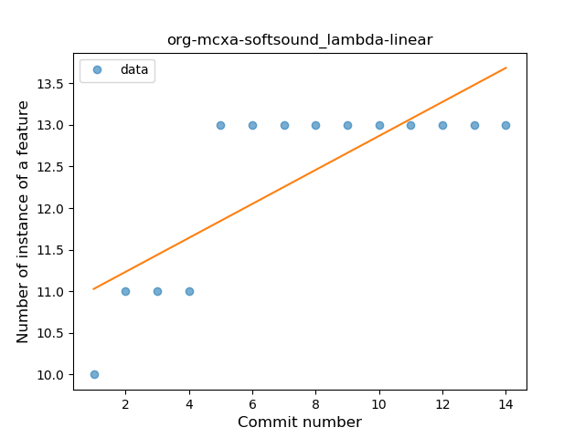

## org-mcxa-softsound
----
#### Metrics provided by Detekt
* Number of lines of code 321
* Number of Kotlin files: 4
* Cyclomatic complexity: 40
* Cyclomatic complexity by thousands of lines: 264 

----
**2** features analyzed

*	<a href="#lambda">Lambda</a> 
*	<a href="#safe_call">Safe Call</a> 

### <a name="lambda">Lambda</a>
----
#### Functions
* **Instability - Polinomial 4:** 
    * **R_Squared:** 0.90298965
* **Sudden Rise Plateau - Logarithm:** 
    * **R_Squared:** 0.81666014
* **Constant Rise - Linear:** 
    * **R_Squared:** 0.62470206

**Plots** :chart_with_upwards_trend:
-----

### <a name="safe_call">Safe Call</a>
----
#### Functions
* **Instability - Polinomial 3:** )
    * **R_Squared:** 0.91375949
* **Instability - Polinomial 4:** 
    * **R_Squared:** 0.91407646
* **Sudden Rise Plateau - Logarithm:** 
    * **R_Squared:** 0.83354871
* **Constant Rise - Linear:** 
    * **R_Squared:** 0.59199157

**Plots** :chart_with_upwards_trend:
-----

