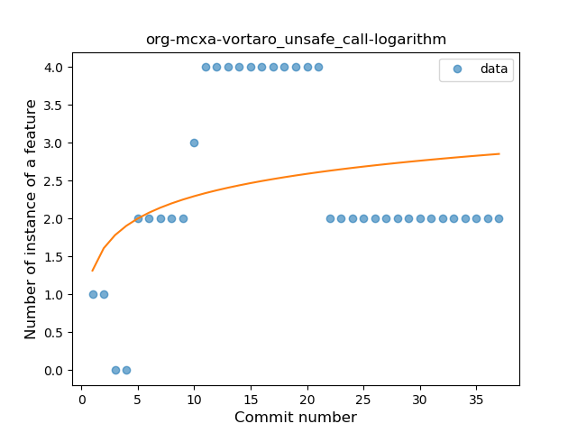
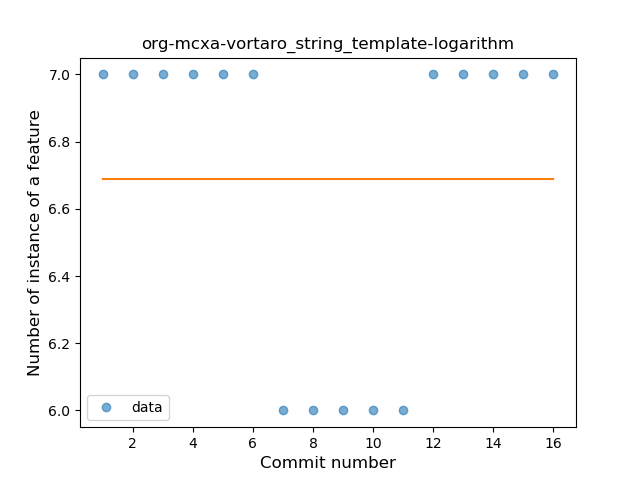
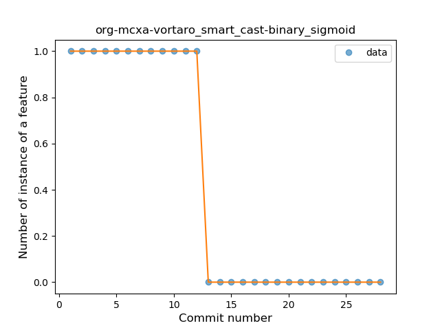

## org-mcxa-vortaro
----
#### Metrics provided by Detekt
* Number of lines of code 417
* Number of Kotlin files: 4
* Cyclomatic complexity: 68
* Cyclomatic complexity by thousands of lines: 317 

----
**10** features analyzed

*	<a href="#type_inference">Type Inference</a> 
*	<a href="#lambda">Lambda</a> 
*	<a href="#safe_call">Safe Call</a> 
*	<a href="#when_expr">When expression</a> 
*	<a href="#unsafe_call">Unsafe Call</a> 
*	<a href="#string_template">String Template</a> 
*	<a href="#range_expr">Range Expression</a> 
*	<a href="#smart_cast">Smart Cast</a> 
*	<a href="#data_class">Data Class</a> 
*	<a href="#extension_function">Extension Function</a> 

### <a name="type_inference">Type Inference</a>
----
#### Functions
* **Instability - Polinomial 4:** 
    * **R_Squared:** 0.86040108
* **Instability - Polinomial 3:** )
    * **R_Squared:** 0.82732241
* **Sudden Rise Plateau - Logarithm:** 
    * **R_Squared:** 0.54975091
* **Constant Rise - Linear:** 
    * **R_Squared:** 0.29125369
* **Plateau Sudden Rise - Binary Sigmoid:** 
    * **R_Squared:** 0.0295352

**Plots** :chart_with_upwards_trend:
-----

### <a name="lambda">Lambda</a>
----
#### Functions
* **Plateau Gradual Rise - Sigmoid:** 
    * **R_Squared:** 0.89397015
* **Sudden Rise Plateau - Logarithm:** 
    * **R_Squared:** 0.85760857
* **Constant Rise - Linear:** 
    * **R_Squared:** 0.79420201

**Plots** :chart_with_upwards_trend:
-----

### <a name="safe_call">Safe Call</a>
----
#### Functions
* **Sudden Rise Plateau - Logarithm:** 
    * **R_Squared:** 0.71987214
* **Constant Rise - Linear:** 
    * **R_Squared:** 0.52641266

**Plots** :chart_with_upwards_trend:
-----

### <a name="when_expr">When expression</a>
----
#### Functions
* **Plateau Sudden Rise - Binary Sigmoid:** 
    * **R_Squared:** 1.0
* **Instability - Polinomial 3:** )
    * **R_Squared:** 0.85784148
* **Constant Rise - Linear:** 
    * **R_Squared:** 0.74749722
* **Sudden Rise Plateau - Logarithm:** 
    * **R_Squared:** 0.52550426

**Plots** :chart_with_upwards_trend:
-----

### <a name="unsafe_call">Unsafe Call</a>
----
#### Functions
* **Instability - Polinomial 3:** )
    * **R_Squared:** 0.70570412
* **Plateau Gradual Rise - Sigmoid:** 
    * **R_Squared:** 0.38030301
* **Sudden Rise Plateau - Logarithm:** 
    * **R_Squared:** 0.10440253
* **Constant Rise - Linear:** 
    * **R_Squared:** 0.00243162

**Plots** :chart_with_upwards_trend:
-----

### <a name="string_template">String Template</a>
----
#### Functions
* **Instability - Polinomial 4:** 
    * **R_Squared:** 0.75389378
* **Sudden Decline - Exponential:** 
    * **R_Squared:** 0.1174689
* **Constant Decline - Linear:** 
    * **R_Squared:** 0.00534759
* **Sudden Rise Plateau - Logarithm:** 
    * **R_Squared:** -0.0

**Plots** :chart_with_upwards_trend:
-----

### <a name="range_expr">Range Expression</a>
----
#### Functions
* **Sudden Decline - Exponential:** 
    * **R_Squared:** 0.81140237
* **Instability - Polinomial 3:** )
    * **R_Squared:** 0.7371054
* **Constant Decline - Linear:** 
    * **R_Squared:** 0.25513196
* **Sudden Rise Plateau - Logarithm:** 
    * **R_Squared:** -0.0

**Plots** :chart_with_upwards_trend:
-----

### <a name="smart_cast">Smart Cast</a>
----
#### Functions
* **Plateau Sudden Decline - Binary Sigmoid:** 
    * **R_Squared:** 1.0
* **Instability - Polinomial 3:** )
    * **R_Squared:** 0.84774156
* **Sudden Decline - Exponential:** 
    * **R_Squared:** 0.75274781
* **Constant Decline - Linear:** 
    * **R_Squared:** 0.73563218
* **Sudden Rise Plateau - Logarithm:** 
    * **R_Squared:** 0.0

**Plots** :chart_with_upwards_trend:
-----

### <a name="data_class">Data Class</a>
----
#### Functions
* **Instability - Polinomial 3:** )
    * **R_Squared:** 0.73541792
* **Plateau Sudden Rise - Binary Sigmoid:** 
    * **R_Squared:** 0.5959596
* **Sudden Rise Plateau - Logarithm:** 
    * **R_Squared:** 0.16573761
* **Constant Rise - Linear:** 
    * **R_Squared:** 0.01797386

**Plots** :chart_with_upwards_trend:
-----

### <a name="extension_function">Extension Function</a>
----
#### Functions
* **Plateau Sudden Decline - Binary Sigmoid:** 
    * **R_Squared:** 0.86877828
* **Instability - Polinomial 4:** 
    * **R_Squared:** 0.85448243
* **Instability - Polinomial 3:** )
    * **R_Squared:** 0.78496349
* **Constant Decline - Linear:** 
    * **R_Squared:** 0.56722689
* **Sudden Rise Plateau - Logarithm:** 
    * **R_Squared:** -0.0

**Plots** :chart_with_upwards_trend:
-----

