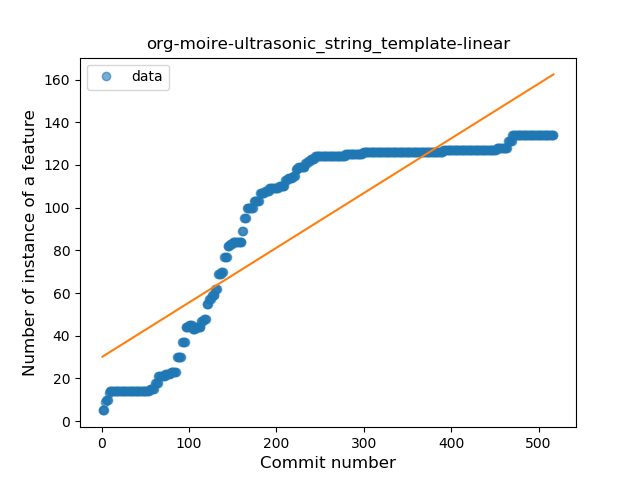
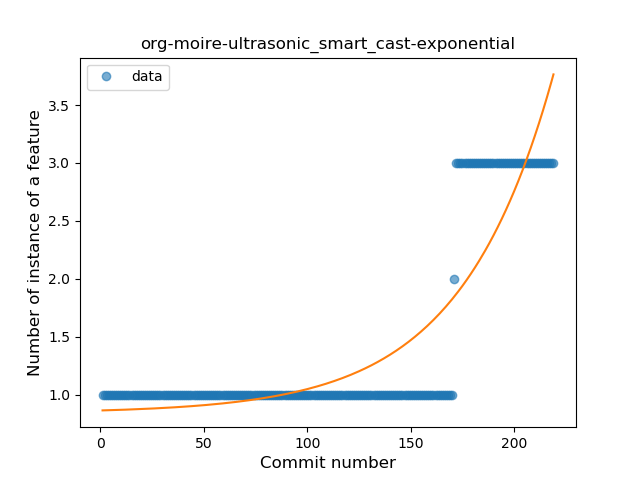
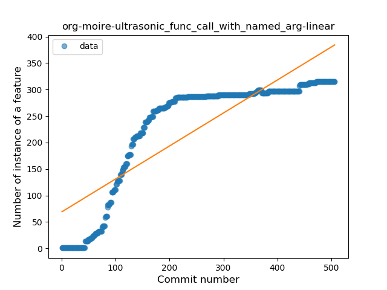
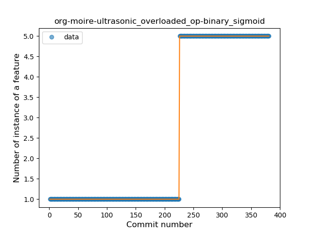
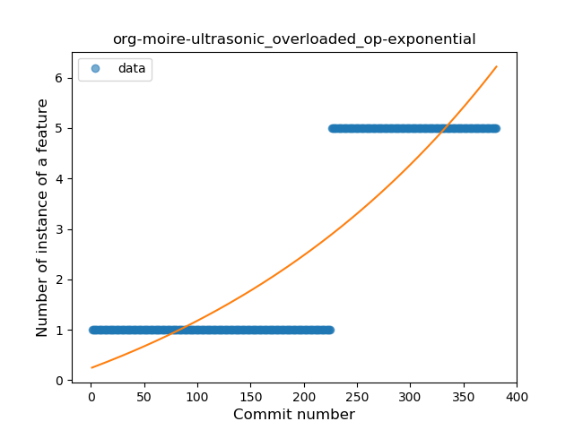
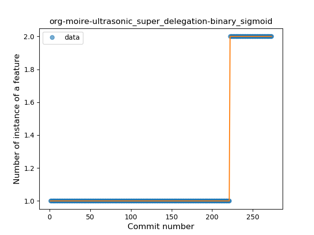

## org-moire-ultrasonic
----
#### Metrics provided by Detekt
* Number of lines of code 8786
* Number of Kotlin files: 207
* Cyclomatic complexity: 744
* Cyclomatic complexity by thousands of lines: 159 

----
**19** features analyzed

*	<a href="#type_inference">Type Inference</a> 
*	<a href="#lambda">Lambda</a> 
*	<a href="#safe_call">Safe Call</a> 
*	<a href="#when_expr">When expression</a> 
*	<a href="#unsafe_call">Unsafe Call</a> 
*	<a href="#companion_object">Companion Object</a> 
*	<a href="#string_template">String Template</a> 
*	<a href="#func_with_default_value">Function with Default Value</a> 
*	<a href="#singleton">Singleton</a> 
*	<a href="#range_expr">Range Expression</a> 
*	<a href="#smart_cast">Smart Cast</a> 
*	<a href="#data_class">Data Class</a> 
*	<a href="#func_call_with_named_arg">Function call with Named Argument</a> 
*	<a href="#extension_function">Extension Function</a> 
*	<a href="#property_delegation">Property Delegation</a> 
*	<a href="#overloaded_op">Overloaded Operator</a> 
*	<a href="#sealed_class">Sealed Class</a> 
*	<a href="#type_alias">Type Alias</a> 
*	<a href="#super_delegation">Super Delegation</a> 

### <a name="type_inference">Type Inference</a>
----
#### Functions
* **Constant Rise - Linear:** 
    * **R_Squared:** 0.95598092
* **Plateau Sudden Rise - Binary Sigmoid:** 
    * **R_Squared:** 0.67836067
* **Sudden Rise Plateau - Logarithm:** 
    * **R_Squared:** 0.54265208

**Plots** :chart_with_upwards_trend:
-----

### <a name="lambda">Lambda</a>
----
#### Functions
* **Constant Rise - Linear:** 
    * **R_Squared:** 0.76350325
* **Sudden Rise Plateau - Logarithm:** 
    * **R_Squared:** 0.58836224
* **Plateau Sudden Rise - Binary Sigmoid:** 
    * **R_Squared:** 0.1990182

**Plots** :chart_with_upwards_trend:
-----

### <a name="safe_call">Safe Call</a>
----
#### Functions
* **Constant Rise - Linear:** 
    * **R_Squared:** 0.79385487
* **Sudden Rise Plateau - Logarithm:** 
    * **R_Squared:** 0.54084597

**Plots** :chart_with_upwards_trend:
-----

### <a name="when_expr">When expression</a>
----
#### Functions
* **Plateau Gradual Rise - Sigmoid:** 
    * **R_Squared:** 0.93937981
* **Constant Rise - Linear:** 
    * **R_Squared:** 0.88003317
* **Sudden Rise - Exponential:** 
    * **R_Squared:** 0.88907584
* **Sudden Rise Plateau - Logarithm:** 
    * **R_Squared:** 0.379061

**Plots** :chart_with_upwards_trend:
-----

### <a name="unsafe_call">Unsafe Call</a>
----
#### Functions
* **Plateau Gradual Rise - Sigmoid:** 
    * **R_Squared:** 0.98565799
* **Sudden Rise - Exponential:** 
    * **R_Squared:** 0.78847579
* **Constant Rise - Linear:** 
    * **R_Squared:** 0.50348175
* **Sudden Rise Plateau - Logarithm:** 
    * **R_Squared:** 0.13024967

**Plots** :chart_with_upwards_trend:
-----

### <a name="companion_object">Companion Object</a>
----
#### Functions
* **Constant Rise - Linear:** 
    * **R_Squared:** 0.05973265
* **Sudden Rise - Exponential:** 
    * **R_Squared:** 0.06585666
* **Sudden Rise Plateau - Logarithm:** 
    * **R_Squared:** 0.02715612

**Plots** :chart_with_upwards_trend:
-----

### <a name="string_template">String Template</a>
----
#### Functions
* **Plateau Gradual Rise - Sigmoid:** 
    * **R_Squared:** 0.9954708
* **Constant Rise - Linear:** 
    * **R_Squared:** 0.77416261
* **Sudden Rise Plateau - Logarithm:** 
    * **R_Squared:** 0.58688849

**Plots** :chart_with_upwards_trend:
-----

### <a name="func_with_default_value">Function with Default Value</a>
----
#### Functions
* **Constant Rise - Linear:** 
    * **R_Squared:** 0.76832145
* **Sudden Rise Plateau - Logarithm:** 
    * **R_Squared:** 0.63024825
* **Plateau Sudden Rise - Binary Sigmoid:** 
    * **R_Squared:** 0.33510884

**Plots** :chart_with_upwards_trend:
-----

### <a name="singleton">Singleton</a>
----
#### Functions
* **Sudden Rise - Exponential:** 
    * **R_Squared:** 0.88388978
* **Constant Rise - Linear:** 
    * **R_Squared:** 0.62787534
* **Sudden Rise Plateau - Logarithm:** 
    * **R_Squared:** 0.29423983

**Plots** :chart_with_upwards_trend:
-----

### <a name="range_expr">Range Expression</a>
----
#### Functions
* **Plateau Sudden Rise - Binary Sigmoid:** 
    * **R_Squared:** 1.0
* **Constant Rise - Linear:** 
    * **R_Squared:** 0.63466219
* **Sudden Rise Plateau - Logarithm:** 
    * **R_Squared:** 0.62358929

**Plots** :chart_with_upwards_trend:
-----

### <a name="smart_cast">Smart Cast</a>
----
#### Functions
* **Plateau Gradual Rise - Sigmoid:** 
    * **R_Squared:** 1.0
* **Sudden Rise - Exponential:** 
    * **R_Squared:** 0.77994282
* **Constant Rise - Linear:** 
    * **R_Squared:** 0.52067525
* **Sudden Rise Plateau - Logarithm:** 
    * **R_Squared:** 0.22450459

**Plots** :chart_with_upwards_trend:
-----

### <a name="data_class">Data Class</a>
----
#### Functions
* **Constant Rise - Linear:** 
    * **R_Squared:** 0.9215884
* **Sudden Rise Plateau - Logarithm:** 
    * **R_Squared:** 0.68953056

**Plots** :chart_with_upwards_trend:
-----

### <a name="func_call_with_named_arg">Function call with Named Argument</a>
----
#### Functions
* **Constant Rise - Linear:** 
    * **R_Squared:** 0.72606056
* **Sudden Rise Plateau - Logarithm:** 
    * **R_Squared:** 0.57768876
* **Plateau Sudden Rise - Binary Sigmoid:** 
    * **R_Squared:** 0.16064428

**Plots** :chart_with_upwards_trend:
-----

### <a name="extension_function">Extension Function</a>
----
#### Functions
* **Sudden Rise Plateau - Logarithm:** 
    * **R_Squared:** 0.60253701
* **Constant Rise - Linear:** 
    * **R_Squared:** 0.50680665
* **Plateau Sudden Rise - Binary Sigmoid:** 
    * **R_Squared:** 0.3808254

**Plots** :chart_with_upwards_trend:
-----

### <a name="property_delegation">Property Delegation</a>
----
#### Functions
* **Sudden Rise Plateau - Logarithm:** 
    * **R_Squared:** 0.63241582
* **Constant Rise - Linear:** 
    * **R_Squared:** 0.48406592

**Plots** :chart_with_upwards_trend:
-----

### <a name="overloaded_op">Overloaded Operator</a>
----
#### Functions
* **Plateau Sudden Rise - Binary Sigmoid:** 
    * **R_Squared:** 1.0
* **Sudden Rise - Exponential:** 
    * **R_Squared:** 0.75273158
* **Constant Rise - Linear:** 
    * **R_Squared:** 0.72540645
* **Sudden Rise Plateau - Logarithm:** 
    * **R_Squared:** 0.27517775

**Plots** :chart_with_upwards_trend:
-----

### <a name="sealed_class">Sealed Class</a>
----
#### Functions
* **Plateau Sudden Rise - Binary Sigmoid:** 
    * **R_Squared:** 1.0
* **Sudden Rise - Exponential:** 
    * **R_Squared:** 0.77447127
* **Constant Rise - Linear:** 
    * **R_Squared:** 0.52105922
* **Sudden Rise Plateau - Logarithm:** 
    * **R_Squared:** 0.23634671

**Plots** :chart_with_upwards_trend:
-----

### <a name="type_alias">Type Alias</a>
----
#### Functions
* **Sudden Rise - Exponential:** 
    * **R_Squared:** 0.5025968
* **Constant Rise - Linear:** 
    * **R_Squared:** 0.21203906
* **Plateau Sudden Decline - Binary Sigmoid:** 
    * **R_Squared:** 0.15688904
* **Sudden Rise Plateau - Logarithm:** 
    * **R_Squared:** 0.00625056

**Plots** :chart_with_upwards_trend:
-----

### <a name="super_delegation">Super Delegation</a>
----
#### Functions
* **Plateau Sudden Rise - Binary Sigmoid:** 
    * **R_Squared:** 1.0
* **Sudden Rise - Exponential:** 
    * **R_Squared:** 0.78019716
* **Constant Rise - Linear:** 
    * **R_Squared:** 0.46259124
* **Sudden Rise Plateau - Logarithm:** 
    * **R_Squared:** 0.20002536

**Plots** :chart_with_upwards_trend:
-----

