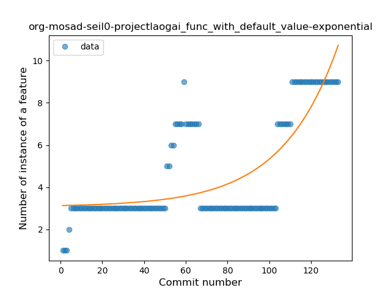
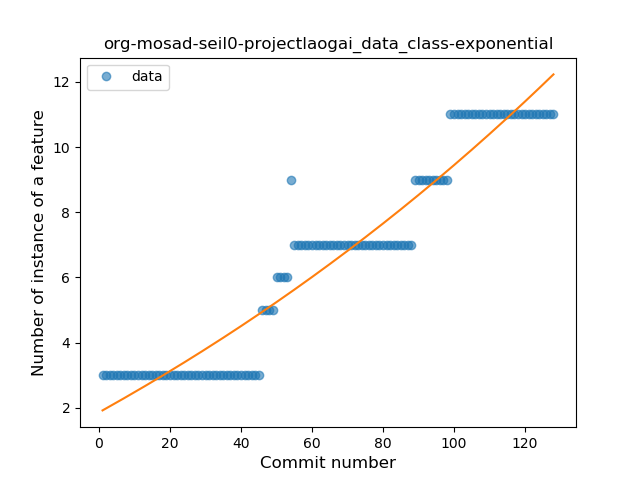
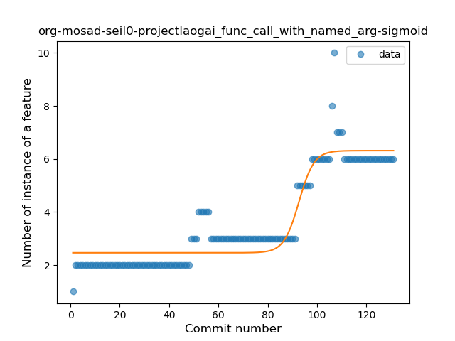

## org-mosad-seil0-projectlaogai
----
#### Metrics provided by Detekt
* Number of lines of code 2983
* Number of Kotlin files: 24
* Cyclomatic complexity: 272
* Cyclomatic complexity by thousands of lines: 208 

----
**14** features analyzed

*	<a href="#type_inference">Type Inference</a> 
*	<a href="#lambda">Lambda</a> 
*	<a href="#safe_call">Safe Call</a> 
*	<a href="#when_expr">When expression</a> 
*	<a href="#unsafe_call">Unsafe Call</a> 
*	<a href="#companion_object">Companion Object</a> 
*	<a href="#string_template">String Template</a> 
*	<a href="#func_with_default_value">Function with Default Value</a> 
*	<a href="#range_expr">Range Expression</a> 
*	<a href="#smart_cast">Smart Cast</a> 
*	<a href="#data_class">Data Class</a> 
*	<a href="#func_call_with_named_arg">Function call with Named Argument</a> 
*	<a href="#destructuring_declaration">Destructuring Declaration</a> 
*	<a href="#coroutine">Coroutine</a> 

### <a name="type_inference">Type Inference</a>
----
#### Functions
* **Sudden Rise - Exponential:** 
    * **R_Squared:** 0.80264271
* **Constant Rise - Linear:** 
    * **R_Squared:** 0.77218955
* **Sudden Rise Plateau - Logarithm:** 
    * **R_Squared:** 0.57763206
* **Plateau Sudden Rise - Binary Sigmoid:** 
    * **R_Squared:** 0.54828971

**Plots** :chart_with_upwards_trend:
-----

### <a name="lambda">Lambda</a>
----
#### Functions
* **Constant Rise - Linear:** 
    * **R_Squared:** 0.95106204
* **Sudden Rise Plateau - Logarithm:** 
    * **R_Squared:** 0.76474349
* **Plateau Gradual Rise - Sigmoid:** 
    * **R_Squared:** 0.56942632

**Plots** :chart_with_upwards_trend:
-----

### <a name="safe_call">Safe Call</a>
----
#### Functions
* **Plateau Gradual Rise - Sigmoid:** 
    * **R_Squared:** 0.47916666
* **Instability - Polinomial 3:** )
    * **R_Squared:** 0.23415242
* **Sudden Rise Plateau - Logarithm:** 
    * **R_Squared:** 0.16507319
* **Constant Rise - Linear:** 
    * **R_Squared:** 0.09695513

**Plots** :chart_with_upwards_trend:
-----

### <a name="when_expr">When expression</a>
----
#### Functions
* **Plateau Gradual Rise - Sigmoid:** 
    * **R_Squared:** 0.88465347
* **Sudden Rise - Exponential:** 
    * **R_Squared:** 0.82149421
* **Constant Rise - Linear:** 
    * **R_Squared:** 0.49338979
* **Sudden Rise Plateau - Logarithm:** 
    * **R_Squared:** 0.32596462

**Plots** :chart_with_upwards_trend:
-----

### <a name="unsafe_call">Unsafe Call</a>
----
#### Functions
* **Constant Rise - Linear:** 
    * **R_Squared:** 0.77667656
* **Sudden Rise Plateau - Logarithm:** 
    * **R_Squared:** 0.6523085

**Plots** :chart_with_upwards_trend:
-----

### <a name="companion_object">Companion Object</a>
----
#### Functions
* **Plateau Gradual Rise - Sigmoid:** 
    * **R_Squared:** 0.95286719
* **Sudden Rise - Exponential:** 
    * **R_Squared:** 0.87760772
* **Constant Rise - Linear:** 
    * **R_Squared:** 0.76637085
* **Sudden Rise Plateau - Logarithm:** 
    * **R_Squared:** 0.35987903

**Plots** :chart_with_upwards_trend:
-----

### <a name="string_template">String Template</a>
----
#### Functions
* **Sudden Rise - Exponential:** 
    * **R_Squared:** 0.86556172
* **Constant Rise - Linear:** 
    * **R_Squared:** 0.83789614
* **Sudden Rise Plateau - Logarithm:** 
    * **R_Squared:** 0.40629942

**Plots** :chart_with_upwards_trend:
-----

### <a name="func_with_default_value">Function with Default Value</a>
----
#### Functions
* **Plateau Gradual Rise - Sigmoid:** 
    * **R_Squared:** 0.71320217
* **Sudden Rise - Exponential:** 
    * **R_Squared:** 0.59204581
* **Constant Rise - Linear:** 
    * **R_Squared:** 0.46409585
* **Sudden Rise Plateau - Logarithm:** 
    * **R_Squared:** 0.30515776

**Plots** :chart_with_upwards_trend:
-----

### <a name="range_expr">Range Expression</a>
----
#### Functions
* **Plateau Gradual Decline - Sigmoid:** 
    * **R_Squared:** 0.9051511
* **Instability - Polinomial 3:** )
    * **R_Squared:** 0.76629305
* **Sudden Decline - Exponential:** 
    * **R_Squared:** 0.55788738
* **Constant Decline - Linear:** 
    * **R_Squared:** 0.52259869
* **Sudden Rise Plateau - Logarithm:** 
    * **R_Squared:** -0.0

**Plots** :chart_with_upwards_trend:
-----

### <a name="smart_cast">Smart Cast</a>
----
#### Functions
* **Plateau Sudden Rise - Binary Sigmoid:** 
    * **R_Squared:** 1.0
* **Instability - Polinomial 4:** 
    * **R_Squared:** 0.8135868
* **Instability - Polinomial 3:** )
    * **R_Squared:** 0.69444444
* **Sudden Rise Plateau - Logarithm:** 
    * **R_Squared:** 0.50689939
* **Constant Rise - Linear:** 
    * **R_Squared:** 0.22115385

**Plots** :chart_with_upwards_trend:
-----

### <a name="data_class">Data Class</a>
----
#### Functions
* **Constant Rise - Linear:** 
    * **R_Squared:** 0.91379178
* **Sudden Rise - Exponential:** 
    * **R_Squared:** 0.91930002
* **Sudden Rise Plateau - Logarithm:** 
    * **R_Squared:** 0.55660933

**Plots** :chart_with_upwards_trend:
-----

### <a name="func_call_with_named_arg">Function call with Named Argument</a>
----
#### Functions
* **Plateau Gradual Rise - Sigmoid:** 
    * **R_Squared:** 0.86604589
* **Sudden Rise - Exponential:** 
    * **R_Squared:** 0.79606982
* **Constant Rise - Linear:** 
    * **R_Squared:** 0.75389943
* **Sudden Rise Plateau - Logarithm:** 
    * **R_Squared:** 0.43785765

**Plots** :chart_with_upwards_trend:
-----

### <a name="destructuring_declaration">Destructuring Declaration</a>
----
#### Functions
* **Plateau Gradual Rise - Sigmoid:** 
    * **R_Squared:** 0.34862355
* **Sudden Rise Plateau - Logarithm:** 
    * **R_Squared:** 0.04283005
* **Constant Decline - Linear:** 
    * **R_Squared:** 0.02196797

**Plots** :chart_with_upwards_trend:
-----

### <a name="coroutine">Coroutine</a>
----
#### Functions
* **Constant Decline - Linear:** 
    * **R_Squared:** 0.03125
* **Sudden Rise Plateau - Logarithm:** 
    * **R_Squared:** -0.0

**Plots** :chart_with_upwards_trend:
-----

