## org-mozilla-klar
----
#### Metrics provided by Detekt
* Number of lines of code 15695
* Number of Kotlin files: 142
* Cyclomatic complexity: 2092
* Cyclomatic complexity by thousands of lines: 263 

----
**19** features analyzed

*	<a href="#type_inference">Type Inference</a> 
*	<a href="#lambda">Lambda</a> 
*	<a href="#safe_call">Safe Call</a> 
*	<a href="#when_expr">When expression</a> 
*	<a href="#unsafe_call">Unsafe Call</a> 
*	<a href="#companion_object">Companion Object</a> 
*	<a href="#string_template">String Template</a> 
*	<a href="#func_with_default_value">Function with Default Value</a> 
*	<a href="#singleton">Singleton</a> 
*	<a href="#range_expr">Range Expression</a> 
*	<a href="#smart_cast">Smart Cast</a> 
*	<a href="#data_class">Data Class</a> 
*	<a href="#func_call_with_named_arg">Function call with Named Argument</a> 
*	<a href="#extension_function">Extension Function</a> 
*	<a href="#property_delegation">Property Delegation</a> 
*	<a href="#destructuring_declaration">Destructuring Declaration</a> 
*	<a href="#coroutine">Coroutine</a> 
*	<a href="#sealed_class">Sealed Class</a> 
*	<a href="#type_alias">Type Alias</a> 

### <a name="type_inference">Type Inference</a>
----
#### Functions
* **Sudden Rise - Exponential:** 
    * **R_Squared:** 0.96493056
* **Constant Rise - Linear:** 
    * **R_Squared:** 0.94498569
* **Sudden Rise Plateau - Logarithm:** 
    * **R_Squared:** 0.32983037
* **Plateau Sudden Rise - Binary Sigmoid:** 
    * **R_Squared:** 0.23581556

**Plots** :chart_with_upwards_trend:
-----

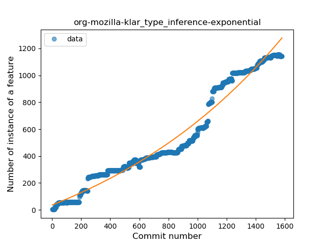

### <a name="lambda">Lambda</a>
----
#### Functions
* **Sudden Rise - Exponential:** 
    * **R_Squared:** 0.97831201
* **Constant Rise - Linear:** 
    * **R_Squared:** 0.94914903
* **Sudden Rise Plateau - Logarithm:** 
    * **R_Squared:** 0.30734691
* **Plateau Sudden Rise - Binary Sigmoid:** 
    * **R_Squared:** 0.15830761

**Plots** :chart_with_upwards_trend:
-----

### <a name="safe_call">Safe Call</a>
----
#### Functions
* **Constant Rise - Linear:** 
    * **R_Squared:** 0.97484822
* **Sudden Rise - Exponential:** 
    * **R_Squared:** 0.98217033
* **Sudden Rise Plateau - Logarithm:** 
    * **R_Squared:** 0.3276659
* **Plateau Sudden Rise - Binary Sigmoid:** 
    * **R_Squared:** 0.20284704

**Plots** :chart_with_upwards_trend:
-----

### <a name="when_expr">When expression</a>
----
#### Functions
* **Sudden Rise - Exponential:** 
    * **R_Squared:** 0.98145791
* **Constant Rise - Linear:** 
    * **R_Squared:** 0.96604683
* **Sudden Rise Plateau - Logarithm:** 
    * **R_Squared:** 0.34725329
* **Plateau Sudden Rise - Binary Sigmoid:** 
    * **R_Squared:** 0.05350408

**Plots** :chart_with_upwards_trend:
-----

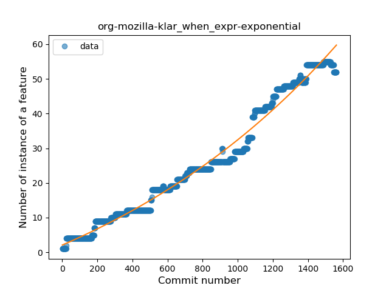

### <a name="unsafe_call">Unsafe Call</a>
----
#### Functions
* **Sudden Rise - Exponential:** 
    * **R_Squared:** 0.8071065
* **Constant Rise - Linear:** 
    * **R_Squared:** 0.75906943
* **Sudden Rise Plateau - Logarithm:** 
    * **R_Squared:** 0.1667402
* **Plateau Sudden Rise - Binary Sigmoid:** 
    * **R_Squared:** 0.0691717

**Plots** :chart_with_upwards_trend:
-----

### <a name="companion_object">Companion Object</a>
----
#### Functions
* **Sudden Rise - Exponential:** 
    * **R_Squared:** 0.97281328
* **Constant Rise - Linear:** 
    * **R_Squared:** 0.95595535
* **Sudden Rise Plateau - Logarithm:** 
    * **R_Squared:** 0.34799544
* **Plateau Sudden Rise - Binary Sigmoid:** 
    * **R_Squared:** 0.02148039

**Plots** :chart_with_upwards_trend:
-----

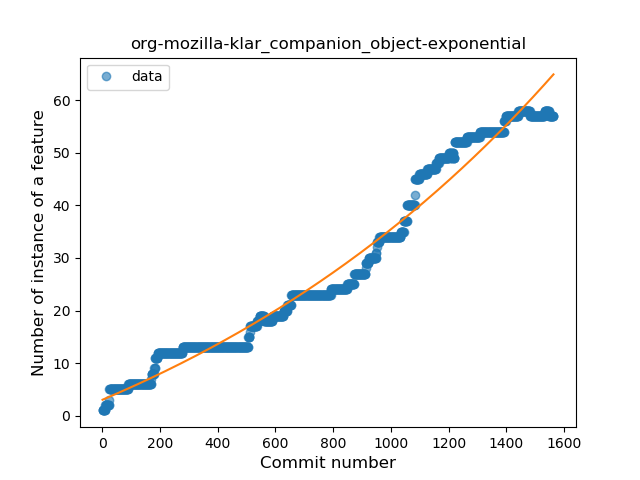

### <a name="string_template">String Template</a>
----
#### Functions
* **Sudden Rise - Exponential:** 
    * **R_Squared:** 0.93516582
* **Constant Rise - Linear:** 
    * **R_Squared:** 0.84541025
* **Sudden Rise Plateau - Logarithm:** 
    * **R_Squared:** 0.2576323
* **Plateau Sudden Rise - Binary Sigmoid:** 
    * **R_Squared:** 0.00769342

**Plots** :chart_with_upwards_trend:
-----

### <a name="func_with_default_value">Function with Default Value</a>
----
#### Functions
* **Plateau Gradual Rise - Sigmoid:** 
    * **R_Squared:** 0.96317471
* **Sudden Rise - Exponential:** 
    * **R_Squared:** 0.90762086
* **Constant Rise - Linear:** 
    * **R_Squared:** 0.70094246
* **Sudden Rise Plateau - Logarithm:** 
    * **R_Squared:** 0.22544829

**Plots** :chart_with_upwards_trend:
-----

### <a name="singleton">Singleton</a>
----
#### Functions
* **Constant Rise - Linear:** 
    * **R_Squared:** 0.94654779
* **Sudden Rise Plateau - Logarithm:** 
    * **R_Squared:** 0.41907744

**Plots** :chart_with_upwards_trend:
-----

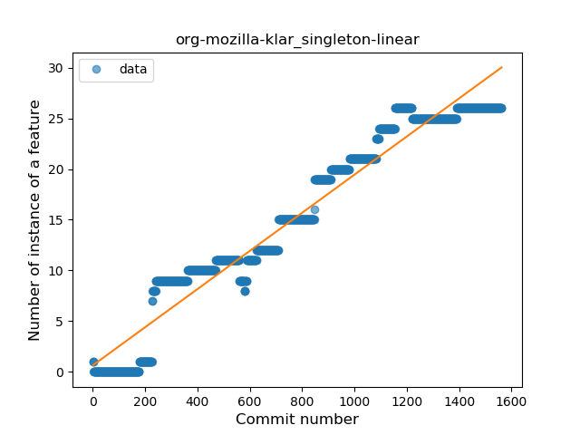

### <a name="range_expr">Range Expression</a>
----
#### Functions
* **Plateau Gradual Rise - Sigmoid:** 
    * **R_Squared:** 0.95257877
* **Sudden Rise - Exponential:** 
    * **R_Squared:** 0.84162259
* **Constant Rise - Linear:** 
    * **R_Squared:** 0.71872768
* **Sudden Rise Plateau - Logarithm:** 
    * **R_Squared:** 0.27324452

**Plots** :chart_with_upwards_trend:
-----

### <a name="smart_cast">Smart Cast</a>
----
#### Functions
* **Constant Rise - Linear:** 
    * **R_Squared:** 0.9521892
* **Sudden Rise - Exponential:** 
    * **R_Squared:** 0.95561948
* **Sudden Rise Plateau - Logarithm:** 
    * **R_Squared:** 0.4146014

**Plots** :chart_with_upwards_trend:
-----

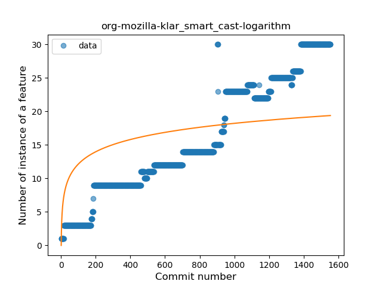
### <a name="data_class">Data Class</a>
----
#### Functions
* **Plateau Gradual Rise - Sigmoid:** 
    * **R_Squared:** 0.95522033
* **Constant Rise - Linear:** 
    * **R_Squared:** 0.83628424
* **Sudden Rise Plateau - Logarithm:** 
    * **R_Squared:** 0.36946447

**Plots** :chart_with_upwards_trend:
-----

### <a name="func_call_with_named_arg">Function call with Named Argument</a>
----
#### Functions
* **Sudden Rise - Exponential:** 
    * **R_Squared:** 0.84334743
* **Constant Rise - Linear:** 
    * **R_Squared:** 0.56954572
* **Sudden Rise Plateau - Logarithm:** 
    * **R_Squared:** 0.11621752

**Plots** :chart_with_upwards_trend:
-----

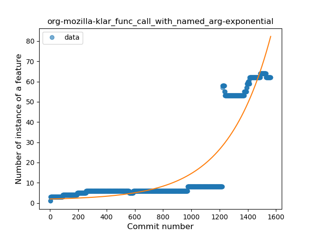

### <a name="extension_function">Extension Function</a>
----
#### Functions
* **Plateau Gradual Rise - Sigmoid:** 
    * **R_Squared:** 0.88106319
* **Sudden Rise - Exponential:** 
    * **R_Squared:** 0.84040122
* **Constant Rise - Linear:** 
    * **R_Squared:** 0.61741069
* **Sudden Rise Plateau - Logarithm:** 
    * **R_Squared:** 0.34127228

**Plots** :chart_with_upwards_trend:
-----

### <a name="property_delegation">Property Delegation</a>
----
#### Functions
* **Sudden Rise - Exponential:** 
    * **R_Squared:** 0.90514764
* **Plateau Gradual Rise - Sigmoid:** 
    * **R_Squared:** 0.91338942
* **Constant Rise - Linear:** 
    * **R_Squared:** 0.84064332
* **Sudden Rise Plateau - Logarithm:** 
    * **R_Squared:** 0.2543052

**Plots** :chart_with_upwards_trend:
-----

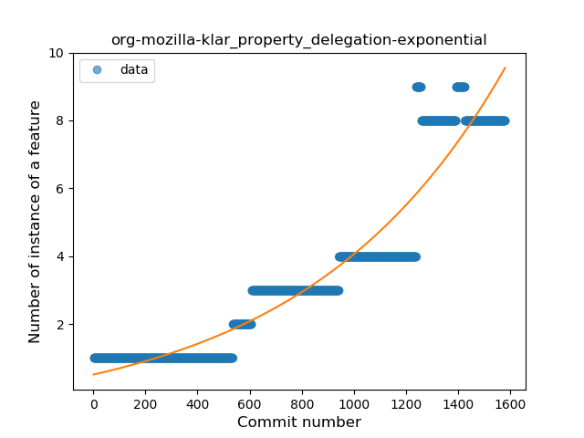

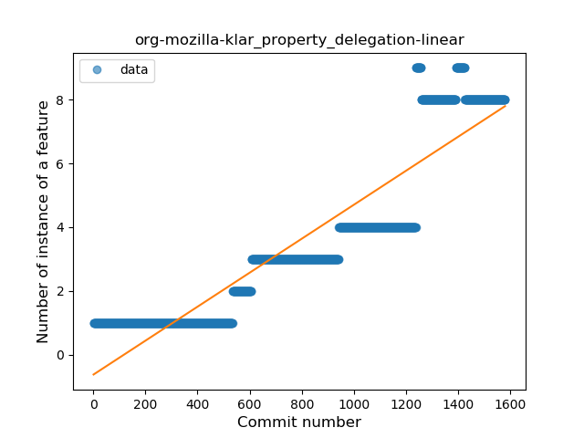

### <a name="destructuring_declaration">Destructuring Declaration</a>
----
#### Functions
* **Plateau Sudden Rise - Binary Sigmoid:** 
    * **R_Squared:** 0.99229461
* **Constant Rise - Linear:** 
    * **R_Squared:** 0.73271885
* **Sudden Rise - Exponential:** 
    * **R_Squared:** 0.73970711
* **Sudden Rise Plateau - Logarithm:** 
    * **R_Squared:** 0.17155678

**Plots** :chart_with_upwards_trend:
-----

### <a name="coroutine">Coroutine</a>
----
#### Functions
* **Sudden Rise - Exponential:** 
    * **R_Squared:** 0.94996529
* **Constant Rise - Linear:** 
    * **R_Squared:** 0.90314556
* **Sudden Rise Plateau - Logarithm:** 
    * **R_Squared:** 0.37543981
* **Plateau Sudden Rise - Binary Sigmoid:** 
    * **R_Squared:** 0.02196932

**Plots** :chart_with_upwards_trend:
-----

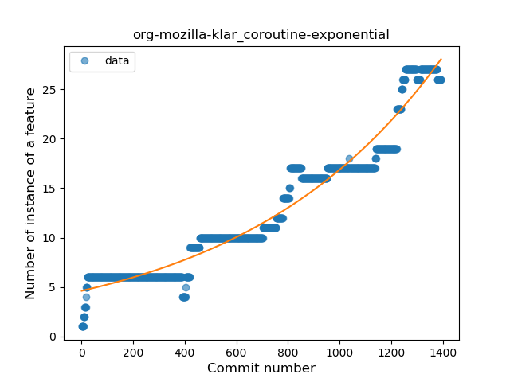

### <a name="sealed_class">Sealed Class</a>
----
#### Functions
* **Plateau Sudden Rise - Binary Sigmoid:** 
    * **R_Squared:** 1.0
* **Constant Rise - Linear:** 
    * **R_Squared:** 0.61566943
* **Sudden Rise Plateau - Logarithm:** 
    * **R_Squared:** 0.61525256

**Plots** :chart_with_upwards_trend:
-----

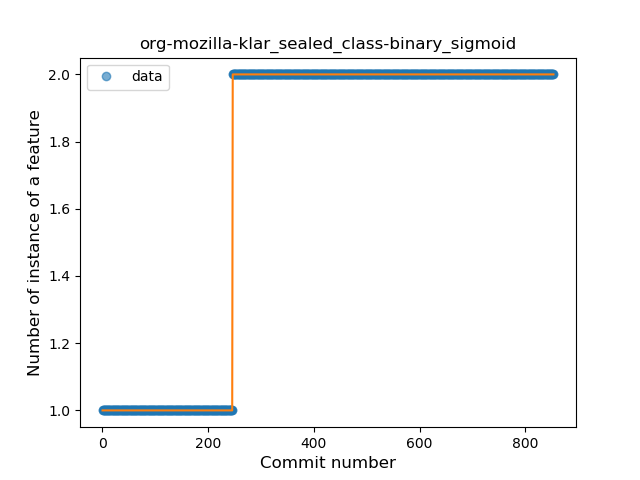

### <a name="type_alias">Type Alias</a>
----
#### Functions
* **Sudden Rise - Exponential:** 
    * **R_Squared:** 0.78139014
* **Constant Rise - Linear:** 
    * **R_Squared:** 0.44960636
* **Sudden Rise Plateau - Logarithm:** 
    * **R_Squared:** 0.1871596

**Plots** :chart_with_upwards_trend:
-----

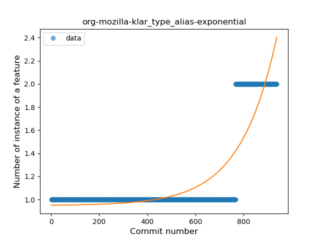

