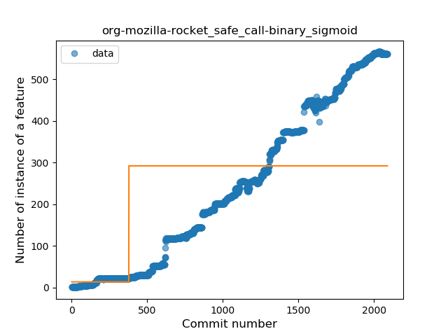
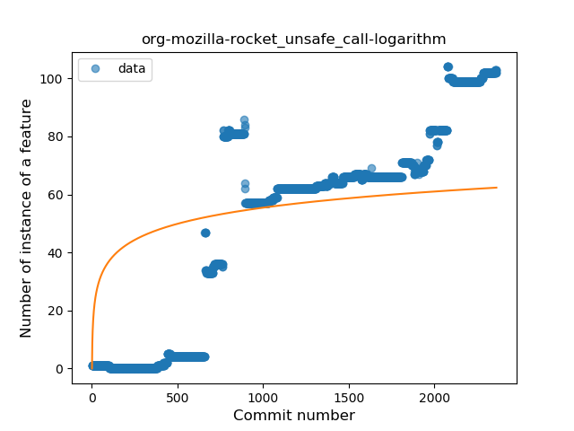
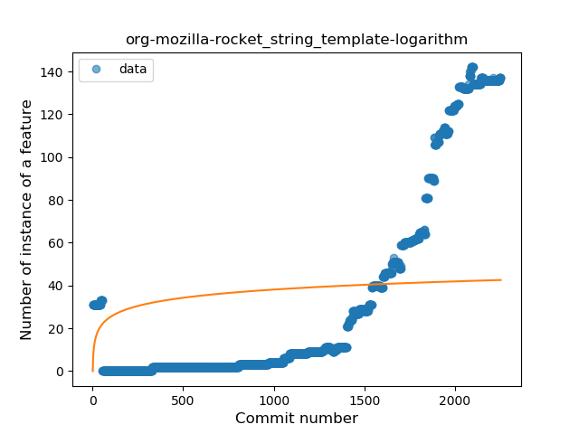
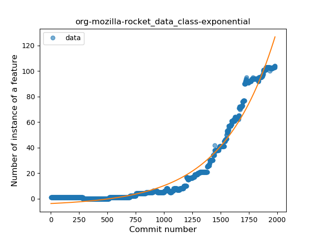
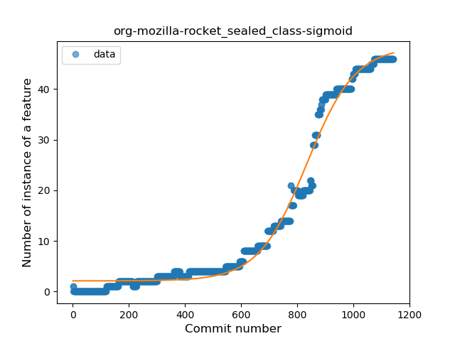
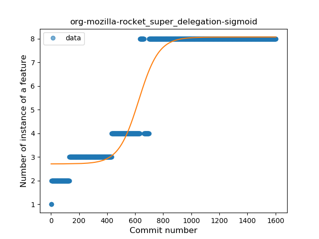

## org-mozilla-rocket
----
#### Metrics provided by Detekt
* Number of lines of code 37726
* Number of Kotlin files: 412
* Cyclomatic complexity: 5079
* Cyclomatic complexity by thousands of lines: 237 

----
**23** features analyzed

*	<a href="#type_inference">Type Inference</a> 
*	<a href="#lambda">Lambda</a> 
*	<a href="#safe_call">Safe Call</a> 
*	<a href="#when_expr">When expression</a> 
*	<a href="#unsafe_call">Unsafe Call</a> 
*	<a href="#companion_object">Companion Object</a> 
*	<a href="#string_template">String Template</a> 
*	<a href="#func_with_default_value">Function with Default Value</a> 
*	<a href="#singleton">Singleton</a> 
*	<a href="#range_expr">Range Expression</a> 
*	<a href="#smart_cast">Smart Cast</a> 
*	<a href="#data_class">Data Class</a> 
*	<a href="#func_call_with_named_arg">Function call with Named Argument</a> 
*	<a href="#extension_function">Extension Function</a> 
*	<a href="#property_delegation">Property Delegation</a> 
*	<a href="#destructuring_declaration">Destructuring Declaration</a> 
*	<a href="#inline_func">Inline Function</a> 
*	<a href="#overloaded_op">Overloaded Operator</a> 
*	<a href="#coroutine">Coroutine</a> 
*	<a href="#sealed_class">Sealed Class</a> 
*	<a href="#type_alias">Type Alias</a> 
*	<a href="#super_delegation">Super Delegation</a> 
*	<a href="#infix_func">Infix Function</a> 

### <a name="type_inference">Type Inference</a>
----
#### Functions
* **Sudden Rise - Exponential:** 
    * **R_Squared:** 0.99258525
* **Constant Rise - Linear:** 
    * **R_Squared:** 0.92848423
* **Sudden Rise Plateau - Logarithm:** 
    * **R_Squared:** 0.23796589
* **Plateau Sudden Rise - Binary Sigmoid:** 
    * **R_Squared:** 0.07446872

**Plots** :chart_with_upwards_trend:
-----

### <a name="lambda">Lambda</a>
----
#### Functions
* **Sudden Rise - Exponential:** 
    * **R_Squared:** 0.98889341
* **Constant Rise - Linear:** 
    * **R_Squared:** 0.85193416
* **Sudden Rise Plateau - Logarithm:** 
    * **R_Squared:** 0.18646554
* **Plateau Sudden Rise - Binary Sigmoid:** 
    * **R_Squared:** 0.10997851

**Plots** :chart_with_upwards_trend:
-----

### <a name="safe_call">Safe Call</a>
----
#### Functions
* **Sudden Rise - Exponential:** 
    * **R_Squared:** 0.98772266
* **Constant Rise - Linear:** 
    * **R_Squared:** 0.97439497
* **Plateau Sudden Rise - Binary Sigmoid:** 
    * **R_Squared:** 0.32119335
* **Sudden Rise Plateau - Logarithm:** 
    * **R_Squared:** 0.27647551

**Plots** :chart_with_upwards_trend:
-----

### <a name="when_expr">When expression</a>
----
#### Functions
* **Sudden Rise - Exponential:** 
    * **R_Squared:** 0.98077562
* **Constant Rise - Linear:** 
    * **R_Squared:** 0.82626842
* **Sudden Rise Plateau - Logarithm:** 
    * **R_Squared:** 0.20496682
* **Plateau Sudden Rise - Binary Sigmoid:** 
    * **R_Squared:** 0.01569327

**Plots** :chart_with_upwards_trend:
-----

### <a name="unsafe_call">Unsafe Call</a>
----
#### Functions
* **Plateau Gradual Rise - Sigmoid:** 
    * **R_Squared:** 0.83595468
* **Constant Rise - Linear:** 
    * **R_Squared:** 0.81145354
* **Sudden Rise Plateau - Logarithm:** 
    * **R_Squared:** 0.32185145

**Plots** :chart_with_upwards_trend:
-----

### <a name="companion_object">Companion Object</a>
----
#### Functions
* **Sudden Rise - Exponential:** 
    * **R_Squared:** 0.98820192
* **Constant Rise - Linear:** 
    * **R_Squared:** 0.92044527
* **Sudden Rise Plateau - Logarithm:** 
    * **R_Squared:** 0.2363392

**Plots** :chart_with_upwards_trend:
-----

### <a name="string_template">String Template</a>
----
#### Functions
* **Sudden Rise - Exponential:** 
    * **R_Squared:** 0.94508624
* **Constant Rise - Linear:** 
    * **R_Squared:** 0.68194376
* **Sudden Rise Plateau - Logarithm:** 
    * **R_Squared:** 0.10742623

**Plots** :chart_with_upwards_trend:
-----

### <a name="func_with_default_value">Function with Default Value</a>
----
#### Functions
* **Sudden Rise - Exponential:** 
    * **R_Squared:** 0.98372338
* **Constant Rise - Linear:** 
    * **R_Squared:** 0.9604394
* **Sudden Rise Plateau - Logarithm:** 
    * **R_Squared:** 0.29959261
* **Plateau Sudden Rise - Binary Sigmoid:** 
    * **R_Squared:** 0.04121349

**Plots** :chart_with_upwards_trend:
-----

### <a name="singleton">Singleton</a>
----
#### Functions
* **Sudden Rise - Exponential:** 
    * **R_Squared:** 0.94569752
* **Constant Rise - Linear:** 
    * **R_Squared:** 0.82590606
* **Plateau Gradual Rise - Sigmoid:** 
    * **R_Squared:** 0.53550782
* **Sudden Rise Plateau - Logarithm:** 
    * **R_Squared:** 0.19548937

**Plots** :chart_with_upwards_trend:
-----

### <a name="range_expr">Range Expression</a>
----
#### Functions
* **Sudden Rise - Exponential:** 
    * **R_Squared:** 0.95125812
* **Constant Rise - Linear:** 
    * **R_Squared:** 0.79607567
* **Sudden Rise Plateau - Logarithm:** 
    * **R_Squared:** 0.167686

**Plots** :chart_with_upwards_trend:
-----

### <a name="smart_cast">Smart Cast</a>
----
#### Functions
* **Sudden Rise - Exponential:** 
    * **R_Squared:** 0.94560424
* **Constant Rise - Linear:** 
    * **R_Squared:** 0.6242055
* **Sudden Rise Plateau - Logarithm:** 
    * **R_Squared:** 0.1101566
* **Plateau Sudden Rise - Binary Sigmoid:** 
    * **R_Squared:** 0.00552393

**Plots** :chart_with_upwards_trend:
-----

### <a name="data_class">Data Class</a>
----
#### Functions
* **Sudden Rise - Exponential:** 
    * **R_Squared:** 0.96621948
* **Constant Rise - Linear:** 
    * **R_Squared:** 0.72433903
* **Sudden Rise Plateau - Logarithm:** 
    * **R_Squared:** 0.12131975

**Plots** :chart_with_upwards_trend:
-----

### <a name="func_call_with_named_arg">Function call with Named Argument</a>
----
#### Functions
* **Sudden Rise - Exponential:** 
    * **R_Squared:** 0.96593305
* **Constant Rise - Linear:** 
    * **R_Squared:** 0.87817662
* **Sudden Rise Plateau - Logarithm:** 
    * **R_Squared:** 0.28546576
* **Plateau Sudden Rise - Binary Sigmoid:** 
    * **R_Squared:** 0.00454492

**Plots** :chart_with_upwards_trend:
-----

### <a name="extension_function">Extension Function</a>
----
#### Functions
* **Constant Rise - Linear:** 
    * **R_Squared:** 0.9602668
* **Sudden Rise - Exponential:** 
    * **R_Squared:** 0.96685842
* **Sudden Rise Plateau - Logarithm:** 
    * **R_Squared:** 0.28398821
* **Plateau Sudden Rise - Binary Sigmoid:** 
    * **R_Squared:** 0.03355773

**Plots** :chart_with_upwards_trend:
-----

### <a name="property_delegation">Property Delegation</a>
----
#### Functions
* **Constant Rise - Linear:** 
    * **R_Squared:** 0.93003623
* **Sudden Rise - Exponential:** 
    * **R_Squared:** 0.93026111
* **Sudden Rise Plateau - Logarithm:** 
    * **R_Squared:** 0.59838193

**Plots** :chart_with_upwards_trend:
-----

### <a name="destructuring_declaration">Destructuring Declaration</a>
----
#### Functions
* **Constant Rise - Linear:** 
    * **R_Squared:** 0.7275018
* **Sudden Rise Plateau - Logarithm:** 
    * **R_Squared:** 0.71504162
* **Plateau Gradual Decline - Sigmoid:** 
    * **R_Squared:** -0.0

**Plots** :chart_with_upwards_trend:
-----

### <a name="inline_func">Inline Function</a>
----
#### Functions
* **Sudden Rise - Exponential:** 
    * **R_Squared:** 0.95274976
* **Constant Rise - Linear:** 
    * **R_Squared:** 0.92255926
* **Sudden Rise Plateau - Logarithm:** 
    * **R_Squared:** 0.29457822

**Plots** :chart_with_upwards_trend:
-----

### <a name="overloaded_op">Overloaded Operator</a>
----
#### Functions
* **Constant Rise - Linear:** 
    * **R_Squared:** 0.9287069
* **Plateau Gradual Rise - Sigmoid:** 
    * **R_Squared:** 0.88806015
* **Sudden Rise Plateau - Logarithm:** 
    * **R_Squared:** 0.38646653

**Plots** :chart_with_upwards_trend:
-----

### <a name="coroutine">Coroutine</a>
----
#### Functions
* **Constant Rise - Linear:** 
    * **R_Squared:** 0.91891882
* **Sudden Rise - Exponential:** 
    * **R_Squared:** 0.92127857
* **Sudden Rise Plateau - Logarithm:** 
    * **R_Squared:** 0.29698628
* **Plateau Sudden Rise - Binary Sigmoid:** 
    * **R_Squared:** 0.07417807

**Plots** :chart_with_upwards_trend:
-----

### <a name="sealed_class">Sealed Class</a>
----
#### Functions
* **Plateau Gradual Rise - Sigmoid:** 
    * **R_Squared:** 0.98759582
* **Sudden Rise - Exponential:** 
    * **R_Squared:** 0.94416277
* **Constant Rise - Linear:** 
    * **R_Squared:** 0.80985333
* **Sudden Rise Plateau - Logarithm:** 
    * **R_Squared:** 0.17713281

**Plots** :chart_with_upwards_trend:
-----

### <a name="type_alias">Type Alias</a>
----
#### Functions
* **Plateau Sudden Decline - Binary Sigmoid:** 
    * **R_Squared:** 0.61042123
* **Sudden Decline - Exponential:** 
    * **R_Squared:** 0.48800374
* **Constant Decline - Linear:** 
    * **R_Squared:** 0.10857019
* **Sudden Rise Plateau - Logarithm:** 
    * **R_Squared:** 0.0

**Plots** :chart_with_upwards_trend:
-----

### <a name="super_delegation">Super Delegation</a>
----
#### Functions
* **Plateau Gradual Rise - Sigmoid:** 
    * **R_Squared:** 0.93492806
* **Constant Rise - Linear:** 
    * **R_Squared:** 0.78108209
* **Sudden Rise Plateau - Logarithm:** 
    * **R_Squared:** 0.49622533

**Plots** :chart_with_upwards_trend:
-----

### <a name="infix_func">Infix Function</a>
----
#### Functions
* **Plateau Sudden Decline - Binary Sigmoid:** 
    * **R_Squared:** 1.0
* **Sudden Decline - Exponential:** 
    * **R_Squared:** 0.76772719
* **Constant Decline - Linear:** 
    * **R_Squared:** 0.58632866
* **Sudden Rise Plateau - Logarithm:** 
    * **R_Squared:** -0.0

**Plots** :chart_with_upwards_trend:
-----

