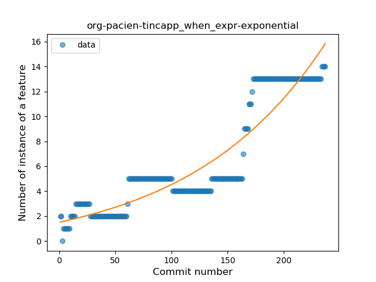
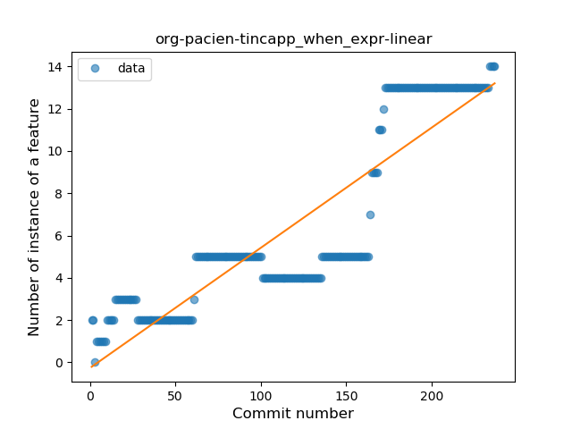
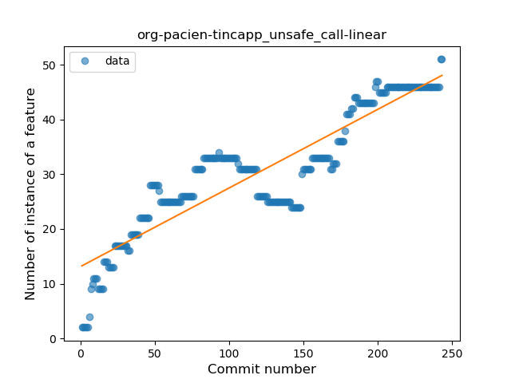
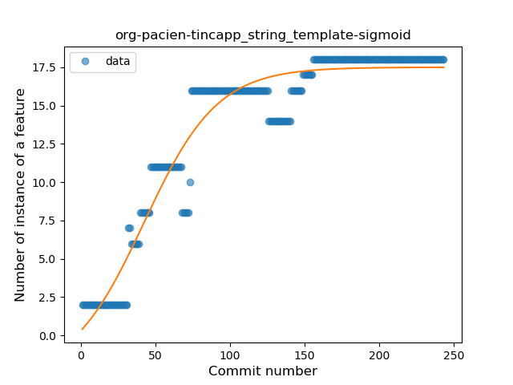
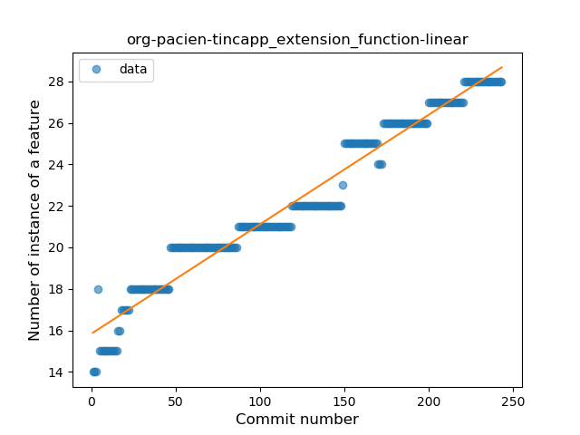
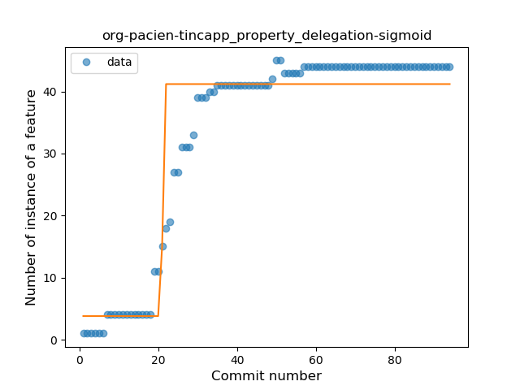
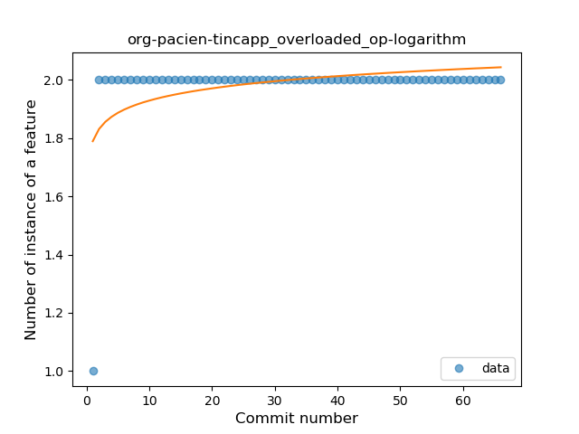

## org-pacien-tincapp
----
#### Metrics provided by Detekt
* Number of lines of code 3747
* Number of Kotlin files: 60
* Cyclomatic complexity: 449
* Cyclomatic complexity by thousands of lines: 340 

----
**15** features analyzed

*	<a href="#type_inference">Type Inference</a> 
*	<a href="#lambda">Lambda</a> 
*	<a href="#safe_call">Safe Call</a> 
*	<a href="#when_expr">When expression</a> 
*	<a href="#unsafe_call">Unsafe Call</a> 
*	<a href="#companion_object">Companion Object</a> 
*	<a href="#string_template">String Template</a> 
*	<a href="#func_with_default_value">Function with Default Value</a> 
*	<a href="#singleton">Singleton</a> 
*	<a href="#smart_cast">Smart Cast</a> 
*	<a href="#data_class">Data Class</a> 
*	<a href="#func_call_with_named_arg">Function call with Named Argument</a> 
*	<a href="#extension_function">Extension Function</a> 
*	<a href="#property_delegation">Property Delegation</a> 
*	<a href="#overloaded_op">Overloaded Operator</a> 

### <a name="type_inference">Type Inference</a>
----
#### Functions
* **Sudden Rise - Exponential:** 
    * **R_Squared:** 0.95677134
* **Constant Rise - Linear:** 
    * **R_Squared:** 0.94431626
* **Sudden Rise Plateau - Logarithm:** 
    * **R_Squared:** 0.50038056
* **Plateau Sudden Rise - Binary Sigmoid:** 
    * **R_Squared:** 0.42916049

**Plots** :chart_with_upwards_trend:
-----

### <a name="lambda">Lambda</a>
----
#### Functions
* **Constant Rise - Linear:** 
    * **R_Squared:** 0.9075246
* **Plateau Sudden Rise - Binary Sigmoid:** 
    * **R_Squared:** 0.75925762
* **Sudden Rise Plateau - Logarithm:** 
    * **R_Squared:** 0.70220871

**Plots** :chart_with_upwards_trend:
-----

### <a name="safe_call">Safe Call</a>
----
#### Functions
* **Sudden Rise Plateau - Logarithm:** 
    * **R_Squared:** 0.56147861
* **Constant Rise - Linear:** 
    * **R_Squared:** 0.3791742
* **Plateau Sudden Rise - Binary Sigmoid:** 
    * **R_Squared:** 0.12031145

**Plots** :chart_with_upwards_trend:
-----

### <a name="when_expr">When expression</a>
----
#### Functions
* **Sudden Rise - Exponential:** 
    * **R_Squared:** 0.85465934
* **Constant Rise - Linear:** 
    * **R_Squared:** 0.79726388
* **Plateau Sudden Rise - Binary Sigmoid:** 
    * **R_Squared:** 0.40852445
* **Sudden Rise Plateau - Logarithm:** 
    * **R_Squared:** 0.35780268

**Plots** :chart_with_upwards_trend:
-----

### <a name="unsafe_call">Unsafe Call</a>
----
#### Functions
* **Constant Rise - Linear:** 
    * **R_Squared:** 0.81750079
* **Sudden Rise Plateau - Logarithm:** 
    * **R_Squared:** 0.69376184
* **Plateau Gradual Rise - Sigmoid:** 
    * **R_Squared:** 0.47403438

**Plots** :chart_with_upwards_trend:
-----

### <a name="companion_object">Companion Object</a>
----
#### Functions
* **Sudden Rise Plateau - Logarithm:** 
    * **R_Squared:** 0.73229499
* **Constant Rise - Linear:** 
    * **R_Squared:** 0.36168208

**Plots** :chart_with_upwards_trend:
-----

### <a name="string_template">String Template</a>
----
#### Functions
* **Plateau Gradual Rise - Sigmoid:** 
    * **R_Squared:** 0.93401177
* **Constant Rise - Linear:** 
    * **R_Squared:** 0.73440922
* **Sudden Rise Plateau - Logarithm:** 
    * **R_Squared:** 0.69956928

**Plots** :chart_with_upwards_trend:
-----

### <a name="func_with_default_value">Function with Default Value</a>
----
#### Functions
* **Sudden Rise Plateau - Logarithm:** 
    * **R_Squared:** 0.69745373
* **Constant Rise - Linear:** 
    * **R_Squared:** 0.55435115

**Plots** :chart_with_upwards_trend:
-----

### <a name="singleton">Singleton</a>
----
#### Functions
* **Sudden Rise Plateau - Logarithm:** 
    * **R_Squared:** 0.87617956
* **Constant Rise - Linear:** 
    * **R_Squared:** 0.81597061

**Plots** :chart_with_upwards_trend:
-----

### <a name="smart_cast">Smart Cast</a>
----
#### Functions
* **Plateau Sudden Rise - Binary Sigmoid:** 
    * **R_Squared:** 0.96710855
* **Sudden Rise Plateau - Logarithm:** 
    * **R_Squared:** 0.60764379
* **Constant Rise - Linear:** 
    * **R_Squared:** 0.52891535

**Plots** :chart_with_upwards_trend:
-----

### <a name="data_class">Data Class</a>
----
#### Functions
* **Sudden Rise - Exponential:** 
    * **R_Squared:** 0.81054331
* **Constant Rise - Linear:** 
    * **R_Squared:** 0.77860445
* **Sudden Rise Plateau - Logarithm:** 
    * **R_Squared:** 0.57387048

**Plots** :chart_with_upwards_trend:
-----

### <a name="func_call_with_named_arg">Function call with Named Argument</a>
----
#### Functions
* **Constant Rise - Linear:** 
    * **R_Squared:** 0.88164482
* **Sudden Rise Plateau - Logarithm:** 
    * **R_Squared:** 0.82917881

**Plots** :chart_with_upwards_trend:
-----

### <a name="extension_function">Extension Function</a>
----
#### Functions
* **Constant Rise - Linear:** 
    * **R_Squared:** 0.95893559
* **Sudden Rise Plateau - Logarithm:** 
    * **R_Squared:** 0.80206766

**Plots** :chart_with_upwards_trend:
-----

### <a name="property_delegation">Property Delegation</a>
----
#### Functions
* **Plateau Gradual Rise - Sigmoid:** 
    * **R_Squared:** 0.90543325
* **Constant Rise - Linear:** 
    * **R_Squared:** 0.69546298
* **Sudden Rise Plateau - Logarithm:** 
    * **R_Squared:** 0.68138646

**Plots** :chart_with_upwards_trend:
-----

### <a name="overloaded_op">Overloaded Operator</a>
----
#### Functions
* **Sudden Rise Plateau - Logarithm:** 
    * **R_Squared:** 0.19899987
* **Constant Rise - Linear:** 
    * **R_Squared:** 0.04477612

**Plots** :chart_with_upwards_trend:
-----

