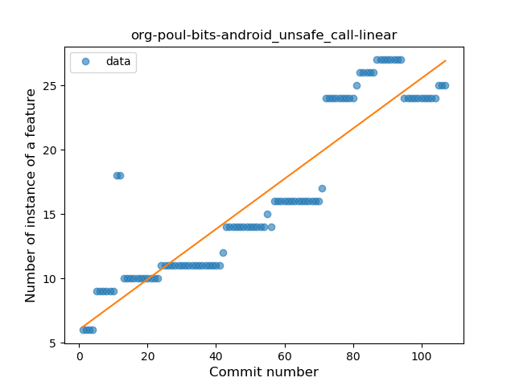
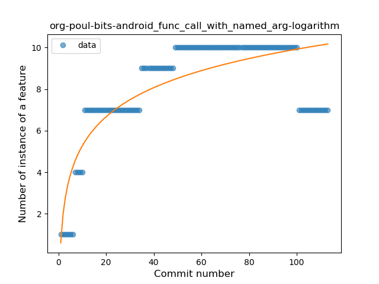

## org-poul-bits-android
----
#### Metrics provided by Detekt
* Number of lines of code 1934
* Number of Kotlin files: 45
* Cyclomatic complexity: 268
* Cyclomatic complexity by thousands of lines: 264 

----
**14** features analyzed

*	<a href="#type_inference">Type Inference</a> 
*	<a href="#lambda">Lambda</a> 
*	<a href="#safe_call">Safe Call</a> 
*	<a href="#when_expr">When expression</a> 
*	<a href="#unsafe_call">Unsafe Call</a> 
*	<a href="#companion_object">Companion Object</a> 
*	<a href="#string_template">String Template</a> 
*	<a href="#func_with_default_value">Function with Default Value</a> 
*	<a href="#singleton">Singleton</a> 
*	<a href="#range_expr">Range Expression</a> 
*	<a href="#data_class">Data Class</a> 
*	<a href="#func_call_with_named_arg">Function call with Named Argument</a> 
*	<a href="#extension_function">Extension Function</a> 
*	<a href="#inline_func">Inline Function</a> 

### <a name="type_inference">Type Inference</a>
----
#### Functions
* **Sudden Rise Plateau - Logarithm:** 
    * **R_Squared:** 0.74221014
* **Constant Rise - Linear:** 
    * **R_Squared:** 0.68836023
* **Plateau Sudden Rise - Binary Sigmoid:** 
    * **R_Squared:** 0.46418107

**Plots** :chart_with_upwards_trend:
-----

### <a name="lambda">Lambda</a>
----
#### Functions
* **Constant Rise - Linear:** 
    * **R_Squared:** 0.7607536
* **Sudden Rise Plateau - Logarithm:** 
    * **R_Squared:** 0.75542556

**Plots** :chart_with_upwards_trend:
-----

### <a name="safe_call">Safe Call</a>
----
#### Functions
* **Plateau Gradual Rise - Sigmoid:** 
    * **R_Squared:** 0.80360741
* **Constant Rise - Linear:** 
    * **R_Squared:** 0.58239936
* **Sudden Rise - Exponential:** 
    * **R_Squared:** 0.5828618
* **Sudden Rise Plateau - Logarithm:** 
    * **R_Squared:** 0.47030299

**Plots** :chart_with_upwards_trend:
-----

### <a name="when_expr">When expression</a>
----
#### Functions
* **Plateau Gradual Rise - Sigmoid:** 
    * **R_Squared:** 0.93640611
* **Constant Rise - Linear:** 
    * **R_Squared:** 0.91085449
* **Sudden Rise Plateau - Logarithm:** 
    * **R_Squared:** 0.66604438

**Plots** :chart_with_upwards_trend:
-----

### <a name="unsafe_call">Unsafe Call</a>
----
#### Functions
* **Constant Rise - Linear:** 
    * **R_Squared:** 0.84765495
* **Sudden Rise - Exponential:** 
    * **R_Squared:** 0.85676244
* **Sudden Rise Plateau - Logarithm:** 
    * **R_Squared:** 0.59569614

**Plots** :chart_with_upwards_trend:
-----

### <a name="companion_object">Companion Object</a>
----
#### Functions
* **Constant Rise - Linear:** 
    * **R_Squared:** 0.84928823
* **Sudden Rise Plateau - Logarithm:** 
    * **R_Squared:** 0.70324373

**Plots** :chart_with_upwards_trend:
-----

### <a name="string_template">String Template</a>
----
#### Functions
* **Constant Rise - Linear:** 
    * **R_Squared:** 0.79169162
* **Sudden Rise Plateau - Logarithm:** 
    * **R_Squared:** 0.63170205
* **Plateau Gradual Rise - Sigmoid:** 
    * **R_Squared:** 0.59670781

**Plots** :chart_with_upwards_trend:
-----

### <a name="func_with_default_value">Function with Default Value</a>
----
#### Functions
* **Instability - Polinomial 3:** )
    * **R_Squared:** 0.67947676
* **Constant Decline - Linear:** 
    * **R_Squared:** 0.03043481
* **Sudden Rise Plateau - Logarithm:** 
    * **R_Squared:** 0.0017801

**Plots** :chart_with_upwards_trend:
-----

### <a name="singleton">Singleton</a>
----
#### Functions
* **Plateau Gradual Rise - Sigmoid:** 
    * **R_Squared:** 0.93619634
* **Constant Rise - Linear:** 
    * **R_Squared:** 0.91061385
* **Sudden Rise Plateau - Logarithm:** 
    * **R_Squared:** 0.56354998

**Plots** :chart_with_upwards_trend:
-----

### <a name="range_expr">Range Expression</a>
----
#### Functions
* **Plateau Sudden Decline - Binary Sigmoid:** 
    * **R_Squared:** 1.0
* **Constant Decline - Linear:** 
    * **R_Squared:** 0.30882353
* **Sudden Rise Plateau - Logarithm:** 
    * **R_Squared:** -0.0

**Plots** :chart_with_upwards_trend:
-----

### <a name="data_class">Data Class</a>
----
#### Functions
* **Sudden Rise - Exponential:** 
    * **R_Squared:** 0.79877752
* **Constant Rise - Linear:** 
    * **R_Squared:** 0.77997811
* **Sudden Rise Plateau - Logarithm:** 
    * **R_Squared:** 0.54946064
* **Plateau Sudden Rise - Binary Sigmoid:** 
    * **R_Squared:** 0.30735539

**Plots** :chart_with_upwards_trend:
-----

### <a name="func_call_with_named_arg">Function call with Named Argument</a>
----
#### Functions
* **Sudden Rise Plateau - Logarithm:** 
    * **R_Squared:** 0.65237667
* **Constant Rise - Linear:** 
    * **R_Squared:** 0.31347902
* **Plateau Gradual Decline - Sigmoid:** 
    * **R_Squared:** 0.0

**Plots** :chart_with_upwards_trend:
-----

### <a name="extension_function">Extension Function</a>
----
#### Functions
* **Plateau Sudden Rise - Binary Sigmoid:** 
    * **R_Squared:** 0.09857383
* **Sudden Rise Plateau - Logarithm:** 
    * **R_Squared:** 0.08470434
* **Constant Decline - Linear:** 
    * **R_Squared:** 0.00094365
* **Sudden Decline - Exponential:** 
    * **R_Squared:** 7.154e-05

**Plots** :chart_with_upwards_trend:
-----

### <a name="inline_func">Inline Function</a>
----
#### Functions
* **Constant Decline - Linear:** 
    * **R_Squared:** 0.31767127
* **Sudden Rise Plateau - Logarithm:** 
    * **R_Squared:** -0.0

**Plots** :chart_with_upwards_trend:
-----

