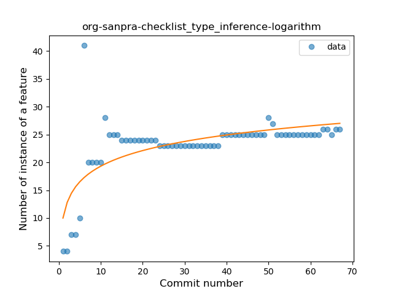
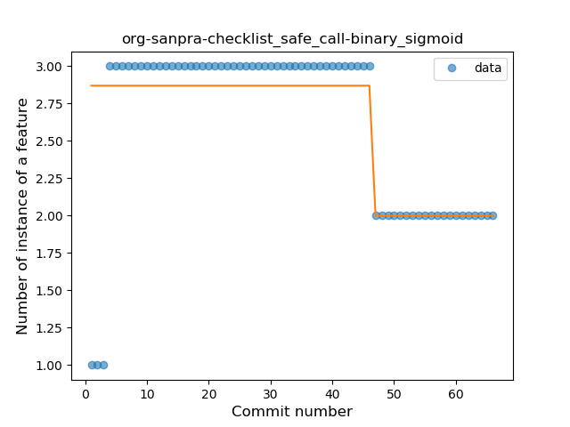
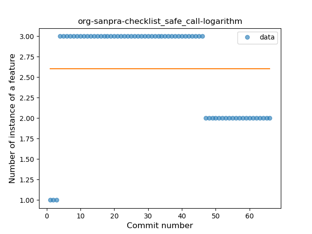
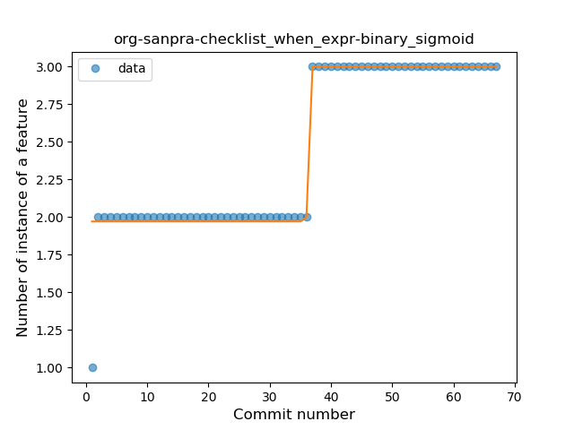
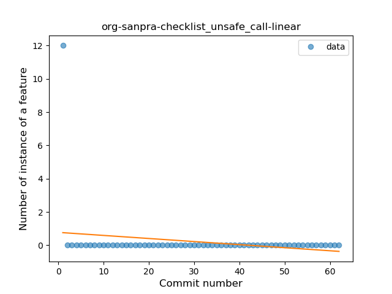

## org-sanpra-checklist
----
#### Metrics provided by Detekt
* Number of lines of code 788
* Number of Kotlin files: 9
* Cyclomatic complexity: 89
* Cyclomatic complexity by thousands of lines: 213 

----
**8** features analyzed

*	<a href="#type_inference">Type Inference</a> 
*	<a href="#lambda">Lambda</a> 
*	<a href="#safe_call">Safe Call</a> 
*	<a href="#when_expr">When expression</a> 
*	<a href="#unsafe_call">Unsafe Call</a> 
*	<a href="#companion_object">Companion Object</a> 
*	<a href="#string_template">String Template</a> 
*	<a href="#singleton">Singleton</a> 

### <a name="type_inference">Type Inference</a>
----
#### Functions
* **Sudden Rise Plateau - Logarithm:** 
    * **R_Squared:** 0.45044794
* **Instability - Polinomial 3:** )
    * **R_Squared:** 0.45707611
* **Constant Rise - Linear:** 
    * **R_Squared:** 0.22282011
* **Plateau Sudden Rise - Binary Sigmoid:** 
    * **R_Squared:** 0.11937805

**Plots** :chart_with_upwards_trend:
-----

### <a name="lambda">Lambda</a>
----
#### Functions
* **Plateau Gradual Rise - Sigmoid:** 
    * **R_Squared:** 0.9502496
* **Instability - Polinomial 3:** )
    * **R_Squared:** 0.73113423
* **Sudden Rise Plateau - Logarithm:** 
    * **R_Squared:** 0.58104182
* **Constant Rise - Linear:** 
    * **R_Squared:** 0.27988882

**Plots** :chart_with_upwards_trend:
-----

### <a name="safe_call">Safe Call</a>
----
#### Functions
* **Plateau Sudden Decline - Binary Sigmoid:** 
    * **R_Squared:** 0.48443745
* **Constant Decline - Linear:** 
    * **R_Squared:** 0.14092149
* **Sudden Rise Plateau - Logarithm:** 
    * **R_Squared:** -0.0

**Plots** :chart_with_upwards_trend:
-----

### <a name="when_expr">When expression</a>
----
#### Functions
* **Plateau Sudden Rise - Binary Sigmoid:** 
    * **R_Squared:** 0.94768029
* **Constant Rise - Linear:** 
    * **R_Squared:** 0.75072863
* **Sudden Rise - Exponential:** 
    * **R_Squared:** 0.75097346
* **Sudden Rise Plateau - Logarithm:** 
    * **R_Squared:** 0.59610914

**Plots** :chart_with_upwards_trend:
-----

### <a name="unsafe_call">Unsafe Call</a>
----
#### Functions
* **Instability - Polinomial 3:** )
    * **R_Squared:** 0.21657509
* **Constant Decline - Linear:** 
    * **R_Squared:** 0.04761905
* **Sudden Rise Plateau - Logarithm:** 
    * **R_Squared:** -0.0

**Plots** :chart_with_upwards_trend:
-----

### <a name="companion_object">Companion Object</a>
----
#### Functions
* **Constant Decline - Linear:** 
    * **R_Squared:** 0.16248096
* **Plateau Sudden Rise - Binary Sigmoid:** 
    * **R_Squared:** 0.15117124
* **Sudden Rise Plateau - Logarithm:** 
    * **R_Squared:** -0.0

**Plots** :chart_with_upwards_trend:
-----

### <a name="string_template">String Template</a>
----
#### Functions
* **Plateau Sudden Rise - Binary Sigmoid:** 
    * **R_Squared:** 0.99960856
* **Sudden Rise - Exponential:** 
    * **R_Squared:** 0.76252412
* **Constant Rise - Linear:** 
    * **R_Squared:** 0.61323301
* **Sudden Rise Plateau - Logarithm:** 
    * **R_Squared:** 0.18203836

**Plots** :chart_with_upwards_trend:
-----

### <a name="singleton">Singleton</a>
----
#### Functions
* **Plateau Sudden Rise - Binary Sigmoid:** 
    * **R_Squared:** 0.58832325
* **Sudden Rise - Exponential:** 
    * **R_Squared:** 0.37088226
* **Constant Rise - Linear:** 
    * **R_Squared:** 0.01562134
* **Sudden Rise Plateau - Logarithm:** 
    * **R_Squared:** 0.00413477

**Plots** :chart_with_upwards_trend:
-----

