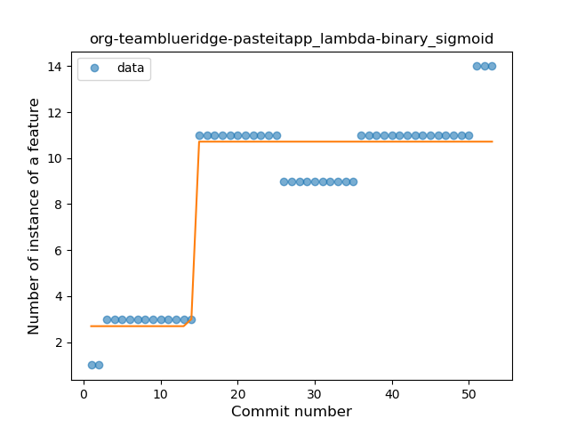
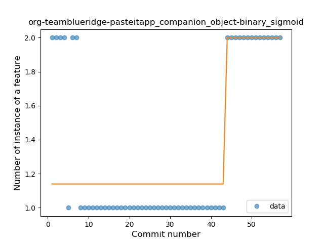
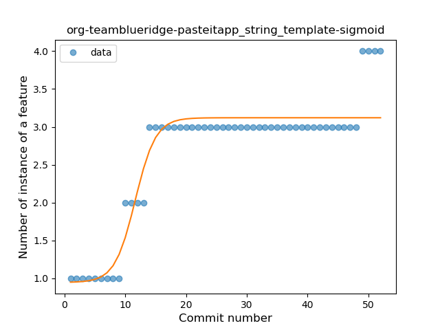

## org-teamblueridge-pasteitapp
----
#### Metrics provided by Detekt
* Number of lines of code 602
* Number of Kotlin files: 7
* Cyclomatic complexity: 87
* Cyclomatic complexity by thousands of lines: 268 

----
**8** features analyzed

*	<a href="#type_inference">Type Inference</a> 
*	<a href="#lambda">Lambda</a> 
*	<a href="#safe_call">Safe Call</a> 
*	<a href="#when_expr">When expression</a> 
*	<a href="#unsafe_call">Unsafe Call</a> 
*	<a href="#companion_object">Companion Object</a> 
*	<a href="#string_template">String Template</a> 
*	<a href="#func_with_default_value">Function with Default Value</a> 

### <a name="type_inference">Type Inference</a>
----
#### Functions
* **Instability - Polinomial 4:** 
    * **R_Squared:** 0.71931162
* **Instability - Polinomial 3:** )
    * **R_Squared:** 0.46881733
* **Plateau Sudden Decline - Binary Sigmoid:** 
    * **R_Squared:** 0.06997998
* **Constant Decline - Linear:** 
    * **R_Squared:** 0.01880942
* **Sudden Rise Plateau - Logarithm:** 
    * **R_Squared:** 0.02429429
* **Sudden Decline - Exponential:** 
    * **R_Squared:** -0.0

**Plots** :chart_with_upwards_trend:
-----

### <a name="lambda">Lambda</a>
----
#### Functions
* **Plateau Sudden Rise - Binary Sigmoid:** 
    * **R_Squared:** 0.90328634
* **Sudden Rise Plateau - Logarithm:** 
    * **R_Squared:** 0.69996096
* **Constant Rise - Linear:** 
    * **R_Squared:** 0.65753225

**Plots** :chart_with_upwards_trend:
-----

### <a name="safe_call">Safe Call</a>
----
#### Functions
* **Instability - Polinomial 4:** 
    * **R_Squared:** 0.87787512
* **Sudden Decline - Exponential:** 
    * **R_Squared:** 0.80702148
* **Constant Decline - Linear:** 
    * **R_Squared:** 0.61874709
* **Plateau Gradual Decline - Sigmoid:** 
    * **R_Squared:** 0.35575221
* **Sudden Rise Plateau - Logarithm:** 
    * **R_Squared:** 0.0

**Plots** :chart_with_upwards_trend:
-----

### <a name="when_expr">When expression</a>
----
#### Functions
* **Plateau Gradual Rise - Sigmoid:** 
    * **R_Squared:** 0.64213911
* **Sudden Rise Plateau - Logarithm:** 
    * **R_Squared:** 0.57475175
* **Constant Rise - Linear:** 
    * **R_Squared:** 0.38333054

**Plots** :chart_with_upwards_trend:
-----

### <a name="unsafe_call">Unsafe Call</a>
----
#### Functions
* **Sudden Decline - Exponential:** 
    * **R_Squared:** 0.71072133
* **Constant Decline - Linear:** 
    * **R_Squared:** 0.53108461
* **Sudden Rise Plateau - Logarithm:** 
    * **R_Squared:** 0.0

**Plots** :chart_with_upwards_trend:
-----

### <a name="companion_object">Companion Object</a>
----
#### Functions
* **Plateau Sudden Rise - Binary Sigmoid:** 
    * **R_Squared:** 0.60232558
* **Sudden Rise - Exponential:** 
    * **R_Squared:** 0.39307333
* **Constant Rise - Linear:** 
    * **R_Squared:** 0.11233524
* **Sudden Rise Plateau - Logarithm:** 
    * **R_Squared:** -0.0

**Plots** :chart_with_upwards_trend:
-----

### <a name="string_template">String Template</a>
----
#### Functions
* **Plateau Gradual Rise - Sigmoid:** 
    * **R_Squared:** 0.88753258
* **Instability - Polinomial 3:** )
    * **R_Squared:** 0.87189669
* **Sudden Rise Plateau - Logarithm:** 
    * **R_Squared:** 0.77513267
* **Constant Rise - Linear:** 
    * **R_Squared:** 0.6664896

**Plots** :chart_with_upwards_trend:
-----

### <a name="func_with_default_value">Function with Default Value</a>
----
#### Functions
* **Plateau Sudden Rise - Binary Sigmoid:** 
    * **R_Squared:** 1.0
* **Instability - Polinomial 4:** 
    * **R_Squared:** 0.88432311
* **Sudden Rise Plateau - Logarithm:** 
    * **R_Squared:** 0.70518116
* **Constant Rise - Linear:** 
    * **R_Squared:** 0.66873065

**Plots** :chart_with_upwards_trend:
-----

