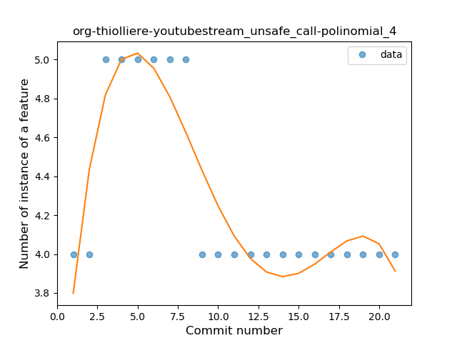
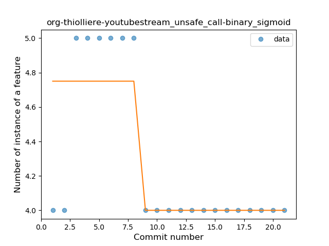

## org-thiolliere-youtubestream
----
#### Metrics provided by Detekt
* Number of lines of code 177
* Number of Kotlin files: 4
* Cyclomatic complexity: 20
* Cyclomatic complexity by thousands of lines: 253 

----
**2** features analyzed

*	<a href="#type_inference">Type Inference</a> 
*	<a href="#unsafe_call">Unsafe Call</a> 

### <a name="type_inference">Type Inference</a>
----
#### Functions
* **Instability - Polinomial 4:** 
    * **R_Squared:** 0.88273392
* **Sudden Decline - Exponential:** 
    * **R_Squared:** 0.75688765
* **Constant Decline - Linear:** 
    * **R_Squared:** 0.70909091
* **Sudden Rise Plateau - Logarithm:** 
    * **R_Squared:** -0.0

**Plots** :chart_with_upwards_trend:
-----

### <a name="unsafe_call">Unsafe Call</a>
----
#### Functions
* **Instability - Polinomial 4:** 
    * **R_Squared:** 0.82335068
* **Plateau Sudden Decline - Binary Sigmoid:** 
    * **R_Squared:** 0.65
* **Instability - Polinomial 3:** )
    * **R_Squared:** 0.62753816
* **Constant Decline - Linear:** 
    * **R_Squared:** 0.33
* **Sudden Rise Plateau - Logarithm:** 
    * **R_Squared:** -0.0

**Plots** :chart_with_upwards_trend:
-----

