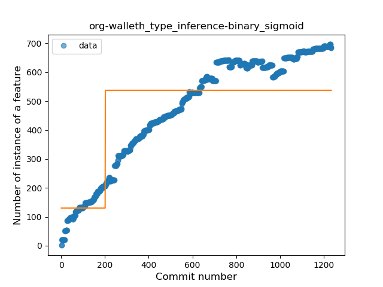
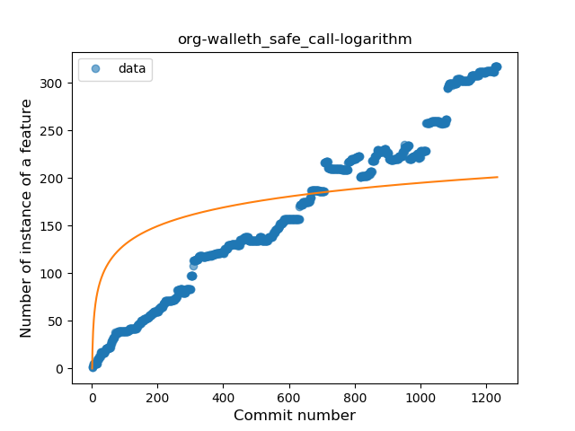
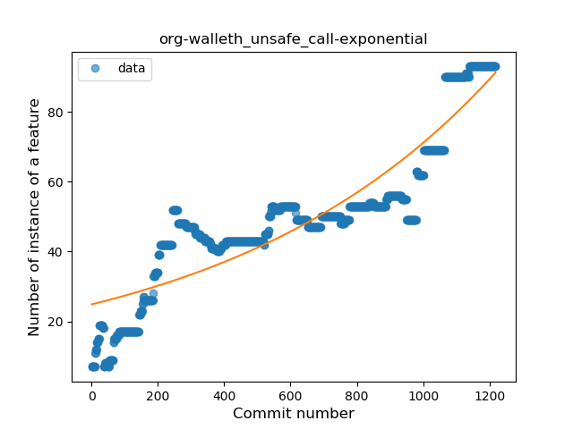
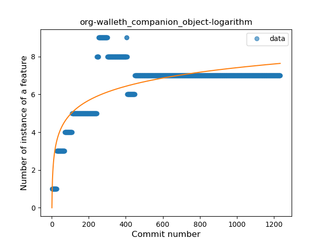
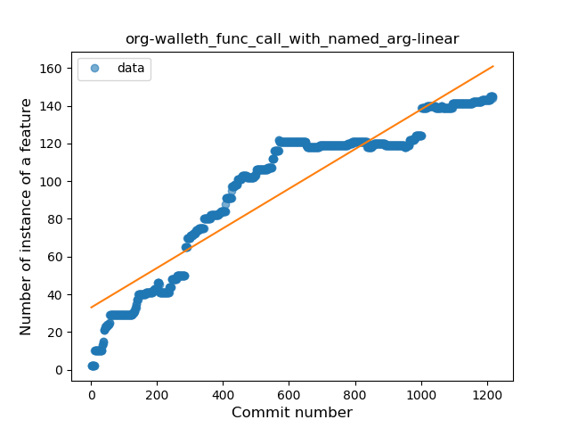

## org-walleth
----
#### Metrics provided by Detekt
* Number of lines of code 11917
* Number of Kotlin files: 183
* Cyclomatic complexity: 1608
* Cyclomatic complexity by thousands of lines: 278 

----
**16** features analyzed

*	<a href="#type_inference">Type Inference</a> 
*	<a href="#lambda">Lambda</a> 
*	<a href="#safe_call">Safe Call</a> 
*	<a href="#when_expr">When expression</a> 
*	<a href="#unsafe_call">Unsafe Call</a> 
*	<a href="#companion_object">Companion Object</a> 
*	<a href="#string_template">String Template</a> 
*	<a href="#func_with_default_value">Function with Default Value</a> 
*	<a href="#singleton">Singleton</a> 
*	<a href="#range_expr">Range Expression</a> 
*	<a href="#smart_cast">Smart Cast</a> 
*	<a href="#data_class">Data Class</a> 
*	<a href="#func_call_with_named_arg">Function call with Named Argument</a> 
*	<a href="#extension_function">Extension Function</a> 
*	<a href="#property_delegation">Property Delegation</a> 
*	<a href="#coroutine">Coroutine</a> 

### <a name="type_inference">Type Inference</a>
----
#### Functions
* **Constant Rise - Linear:** 
    * **R_Squared:** 0.8972435
* **Plateau Sudden Rise - Binary Sigmoid:** 
    * **R_Squared:** 0.60340632
* **Sudden Rise Plateau - Logarithm:** 
    * **R_Squared:** 0.58898432

**Plots** :chart_with_upwards_trend:
-----

### <a name="lambda">Lambda</a>
----
#### Functions
* **Constant Rise - Linear:** 
    * **R_Squared:** 0.98609735
* **Plateau Sudden Rise - Binary Sigmoid:** 
    * **R_Squared:** 0.55865658
* **Sudden Rise Plateau - Logarithm:** 
    * **R_Squared:** 0.5117296

**Plots** :chart_with_upwards_trend:
-----

### <a name="safe_call">Safe Call</a>
----
#### Functions
* **Constant Rise - Linear:** 
    * **R_Squared:** 0.97999036
* **Sudden Rise Plateau - Logarithm:** 
    * **R_Squared:** 0.45597323
* **Plateau Sudden Rise - Binary Sigmoid:** 
    * **R_Squared:** 0.38476098

**Plots** :chart_with_upwards_trend:
-----

### <a name="when_expr">When expression</a>
----
#### Functions
* **Constant Rise - Linear:** 
    * **R_Squared:** 0.95643442
* **Sudden Rise Plateau - Logarithm:** 
    * **R_Squared:** 0.57435904
* **Plateau Sudden Rise - Binary Sigmoid:** 
    * **R_Squared:** 0.30288464

**Plots** :chart_with_upwards_trend:
-----

### <a name="unsafe_call">Unsafe Call</a>
----
#### Functions
* **Sudden Rise - Exponential:** 
    * **R_Squared:** 0.81740236
* **Constant Rise - Linear:** 
    * **R_Squared:** 0.80240905
* **Sudden Rise Plateau - Logarithm:** 
    * **R_Squared:** 0.48885332
* **Plateau Sudden Rise - Binary Sigmoid:** 
    * **R_Squared:** 0.07273715

**Plots** :chart_with_upwards_trend:
-----

### <a name="companion_object">Companion Object</a>
----
#### Functions
* **Sudden Rise Plateau - Logarithm:** 
    * **R_Squared:** 0.58125673
* **Constant Rise - Linear:** 
    * **R_Squared:** 0.24315446

**Plots** :chart_with_upwards_trend:
-----

### <a name="string_template">String Template</a>
----
#### Functions
* **Plateau Gradual Rise - Sigmoid:** 
    * **R_Squared:** 0.89985452
* **Constant Rise - Linear:** 
    * **R_Squared:** 0.85887358
* **Sudden Rise - Exponential:** 
    * **R_Squared:** 0.86129868
* **Sudden Rise Plateau - Logarithm:** 
    * **R_Squared:** 0.40698695

**Plots** :chart_with_upwards_trend:
-----

### <a name="func_with_default_value">Function with Default Value</a>
----
#### Functions
* **Sudden Rise - Exponential:** 
    * **R_Squared:** 0.93583513
* **Constant Rise - Linear:** 
    * **R_Squared:** 0.87372957
* **Sudden Rise Plateau - Logarithm:** 
    * **R_Squared:** 0.39477144

**Plots** :chart_with_upwards_trend:
-----

### <a name="singleton">Singleton</a>
----
#### Functions
* **Sudden Rise - Exponential:** 
    * **R_Squared:** 0.35447112
* **Constant Rise - Linear:** 
    * **R_Squared:** 0.10524494
* **Sudden Rise Plateau - Logarithm:** 
    * **R_Squared:** 0.03583669
* **Plateau Sudden Rise - Binary Sigmoid:** 
    * **R_Squared:** 0.02025688

**Plots** :chart_with_upwards_trend:
-----

### <a name="range_expr">Range Expression</a>
----
#### Functions
* **Sudden Rise Plateau - Logarithm:** 
    * **R_Squared:** 0.22041428
* **Constant Rise - Linear:** 
    * **R_Squared:** 0.02496082

**Plots** :chart_with_upwards_trend:
-----

### <a name="smart_cast">Smart Cast</a>
----
#### Functions
* **Sudden Rise - Exponential:** 
    * **R_Squared:** 0.962096
* **Constant Rise - Linear:** 
    * **R_Squared:** 0.812245
* **Sudden Rise Plateau - Logarithm:** 
    * **R_Squared:** 0.34019

**Plots** :chart_with_upwards_trend:
-----

### <a name="data_class">Data Class</a>
----
#### Functions
* **Constant Rise - Linear:** 
    * **R_Squared:** 0.83073837
* **Sudden Rise Plateau - Logarithm:** 
    * **R_Squared:** 0.52972166

**Plots** :chart_with_upwards_trend:
-----

### <a name="func_call_with_named_arg">Function call with Named Argument</a>
----
#### Functions
* **Constant Rise - Linear:** 
    * **R_Squared:** 0.87382986
* **Sudden Rise Plateau - Logarithm:** 
    * **R_Squared:** 0.58890401
* **Plateau Sudden Rise - Binary Sigmoid:** 
    * **R_Squared:** 0.36486434

**Plots** :chart_with_upwards_trend:
-----

### <a name="extension_function">Extension Function</a>
----
#### Functions
* **Constant Rise - Linear:** 
    * **R_Squared:** 0.94469898
* **Sudden Rise Plateau - Logarithm:** 
    * **R_Squared:** 0.47961793

**Plots** :chart_with_upwards_trend:
-----

### <a name="property_delegation">Property Delegation</a>
----
#### Functions
* **Constant Rise - Linear:** 
    * **R_Squared:** 0.86161535
* **Sudden Rise Plateau - Logarithm:** 
    * **R_Squared:** 0.65123849
* **Plateau Sudden Rise - Binary Sigmoid:** 
    * **R_Squared:** 0.43132712

**Plots** :chart_with_upwards_trend:
-----

### <a name="coroutine">Coroutine</a>
----
#### Functions
* **Sudden Rise - Exponential:** 
    * **R_Squared:** 0.94891424
* **Constant Rise - Linear:** 
    * **R_Squared:** 0.87990983
* **Sudden Rise Plateau - Logarithm:** 
    * **R_Squared:** 0.48677079
* **Plateau Sudden Rise - Binary Sigmoid:** 
    * **R_Squared:** 0.0646604

**Plots** :chart_with_upwards_trend:
-----

