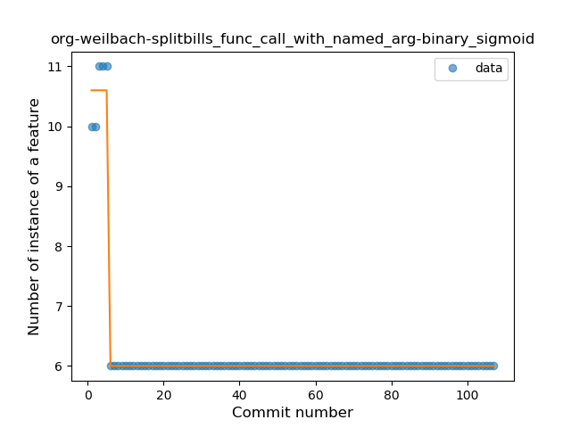
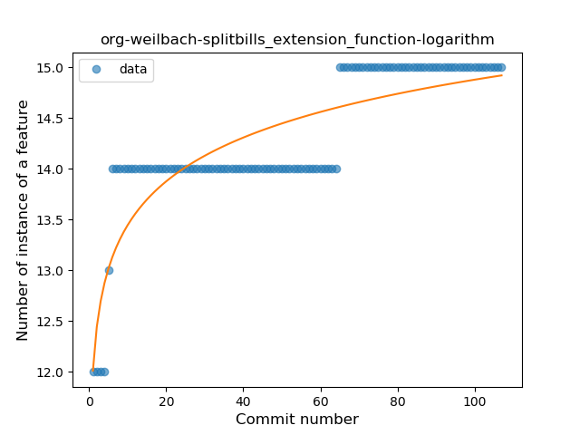

## org-weilbach-splitbills
----
#### Metrics provided by Detekt
* Number of lines of code 9429
* Number of Kotlin files: 113
* Cyclomatic complexity: 1199
* Cyclomatic complexity by thousands of lines: 238 

----
**13** features analyzed

*	<a href="#type_inference">Type Inference</a> 
*	<a href="#lambda">Lambda</a> 
*	<a href="#safe_call">Safe Call</a> 
*	<a href="#when_expr">When expression</a> 
*	<a href="#unsafe_call">Unsafe Call</a> 
*	<a href="#companion_object">Companion Object</a> 
*	<a href="#string_template">String Template</a> 
*	<a href="#singleton">Singleton</a> 
*	<a href="#smart_cast">Smart Cast</a> 
*	<a href="#func_call_with_named_arg">Function call with Named Argument</a> 
*	<a href="#extension_function">Extension Function</a> 
*	<a href="#destructuring_declaration">Destructuring Declaration</a> 
*	<a href="#inline_func">Inline Function</a> 

### <a name="type_inference">Type Inference</a>
----
#### Functions
* **Constant Rise - Linear:** 
    * **R_Squared:** 0.87205549
* **Sudden Rise Plateau - Logarithm:** 
    * **R_Squared:** 0.86650863
* **Plateau Gradual Rise - Sigmoid:** 
    * **R_Squared:** 0.63070022

**Plots** :chart_with_upwards_trend:
-----

### <a name="lambda">Lambda</a>
----
#### Functions
* **Sudden Rise Plateau - Logarithm:** 
    * **R_Squared:** 0.88883302
* **Constant Rise - Linear:** 
    * **R_Squared:** 0.7449742

**Plots** :chart_with_upwards_trend:
-----

### <a name="safe_call">Safe Call</a>
----
#### Functions
* **Sudden Rise Plateau - Logarithm:** 
    * **R_Squared:** 0.88807343
* **Constant Rise - Linear:** 
    * **R_Squared:** 0.65707332

**Plots** :chart_with_upwards_trend:
-----

### <a name="when_expr">When expression</a>
----
#### Functions
* **Sudden Rise Plateau - Logarithm:** 
    * **R_Squared:** 0.75486169
* **Constant Rise - Linear:** 
    * **R_Squared:** 0.67235477

**Plots** :chart_with_upwards_trend:
-----

### <a name="unsafe_call">Unsafe Call</a>
----
#### Functions
* **Instability - Polinomial 3:** )
    * **R_Squared:** 0.42971947
* **Constant Decline - Linear:** 
    * **R_Squared:** 0.31409128
* **Sudden Decline - Exponential:** 
    * **R_Squared:** 0.3146298
* **Sudden Rise Plateau - Logarithm:** 
    * **R_Squared:** -0.0

**Plots** :chart_with_upwards_trend:
-----

### <a name="companion_object">Companion Object</a>
----
#### Functions
* **Plateau Sudden Rise - Binary Sigmoid:** 
    * **R_Squared:** 0.84265367
* **Sudden Rise Plateau - Logarithm:** 
    * **R_Squared:** 0.47151519
* **Instability - Polinomial 3:** )
    * **R_Squared:** 0.47505297
* **Constant Rise - Linear:** 
    * **R_Squared:** 0.15813857

**Plots** :chart_with_upwards_trend:
-----

### <a name="string_template">String Template</a>
----
#### Functions
* **Plateau Sudden Rise - Binary Sigmoid:** 
    * **R_Squared:** 0.34098833
* **Constant Decline - Linear:** 
    * **R_Squared:** 0.15067073
* **Sudden Rise Plateau - Logarithm:** 
    * **R_Squared:** -0.0

**Plots** :chart_with_upwards_trend:
-----

### <a name="singleton">Singleton</a>
----
#### Functions
* **Constant Rise - Linear:** 
    * **R_Squared:** 0.85263972
* **Sudden Rise - Exponential:** 
    * **R_Squared:** 0.85285619
* **Sudden Rise Plateau - Logarithm:** 
    * **R_Squared:** 0.71558606

**Plots** :chart_with_upwards_trend:
-----

### <a name="smart_cast">Smart Cast</a>
----
#### Functions
* **Sudden Rise Plateau - Logarithm:** 
    * **R_Squared:** 0.83606853
* **Constant Rise - Linear:** 
    * **R_Squared:** 0.60880294

**Plots** :chart_with_upwards_trend:
-----

### <a name="func_call_with_named_arg">Function call with Named Argument</a>
----
#### Functions
* **Plateau Sudden Decline - Binary Sigmoid:** 
    * **R_Squared:** 0.98824176
* **Sudden Decline - Exponential:** 
    * **R_Squared:** 0.74798093
* **Constant Decline - Linear:** 
    * **R_Squared:** 0.13140162
* **Sudden Rise Plateau - Logarithm:** 
    * **R_Squared:** -0.0

**Plots** :chart_with_upwards_trend:
-----

### <a name="extension_function">Extension Function</a>
----
#### Functions
* **Sudden Rise Plateau - Logarithm:** 
    * **R_Squared:** 0.72377514
* **Constant Rise - Linear:** 
    * **R_Squared:** 0.67197646

**Plots** :chart_with_upwards_trend:
-----

### <a name="destructuring_declaration">Destructuring Declaration</a>
----
#### Functions
* **Plateau Sudden Decline - Binary Sigmoid:** 
    * **R_Squared:** 1.0
* **Sudden Decline - Exponential:** 
    * **R_Squared:** 0.81103726
* **Constant Decline - Linear:** 
    * **R_Squared:** 0.1336478
* **Sudden Rise Plateau - Logarithm:** 
    * **R_Squared:** -0.0

**Plots** :chart_with_upwards_trend:
-----

### <a name="inline_func">Inline Function</a>
----
#### Functions
* **Sudden Decline - Exponential:** 
    * **R_Squared:** 0.4562746
* **Plateau Sudden Decline - Binary Sigmoid:** 
    * **R_Squared:** 0.27040272
* **Constant Decline - Linear:** 
    * **R_Squared:** 0.09930922
* **Sudden Rise Plateau - Logarithm:** 
    * **R_Squared:** -0.0

**Plots** :chart_with_upwards_trend:
-----

