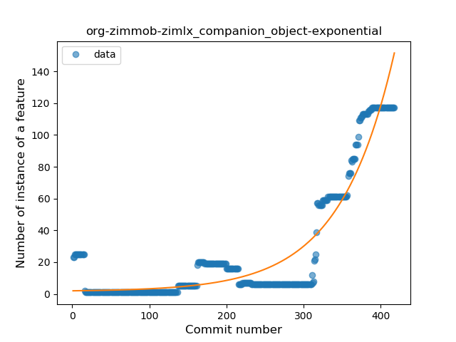
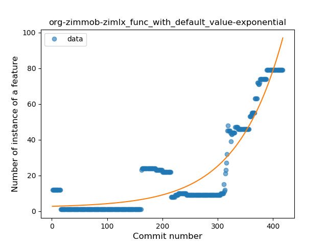
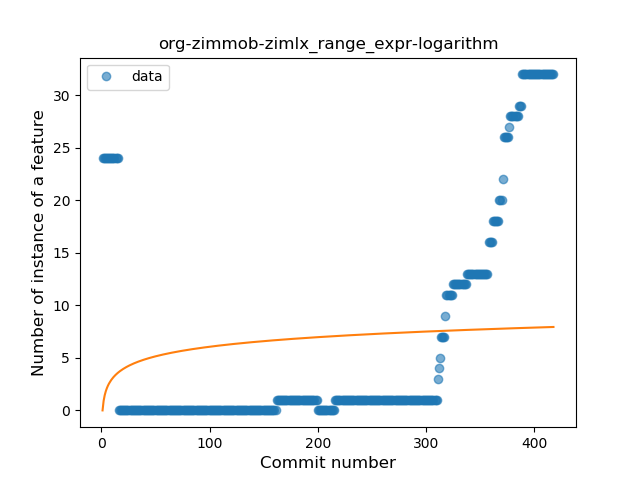
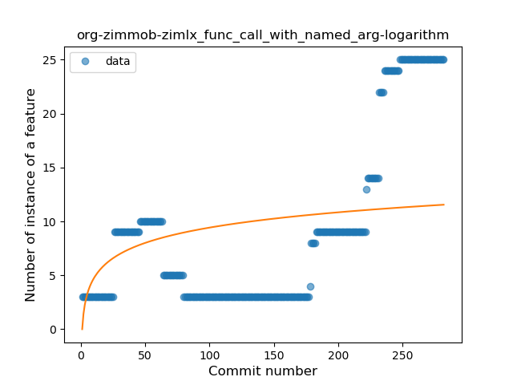
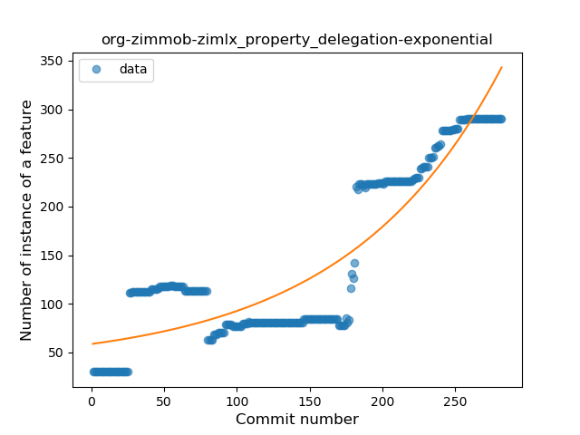
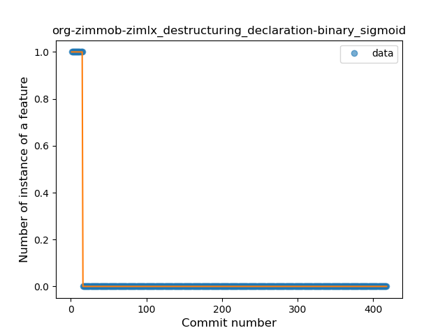
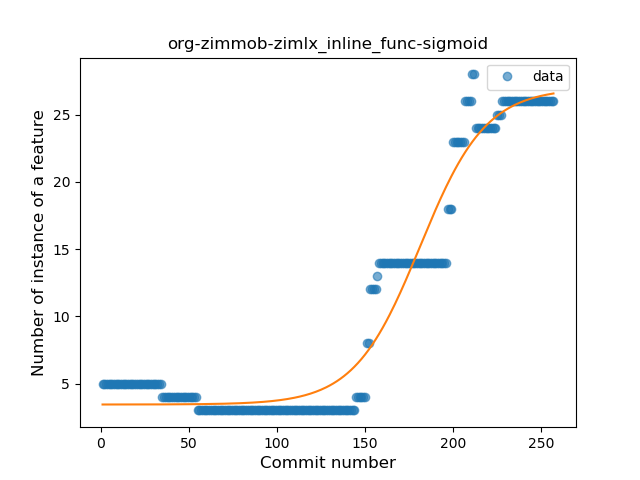
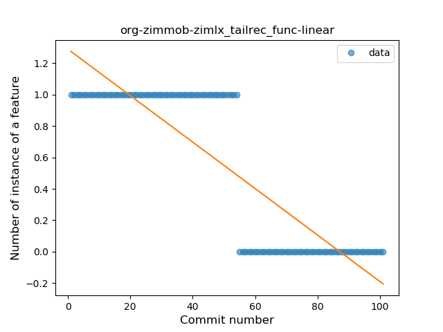

## org-zimmob-zimlx
----
#### Metrics provided by Detekt
* Number of lines of code 29738
* Number of Kotlin files: 272
* Cyclomatic complexity: 4262
* Cyclomatic complexity by thousands of lines: 308 

----
**21** features analyzed

*	<a href="#type_inference">Type Inference</a> 
*	<a href="#lambda">Lambda</a> 
*	<a href="#safe_call">Safe Call</a> 
*	<a href="#when_expr">When expression</a> 
*	<a href="#unsafe_call">Unsafe Call</a> 
*	<a href="#companion_object">Companion Object</a> 
*	<a href="#string_template">String Template</a> 
*	<a href="#func_with_default_value">Function with Default Value</a> 
*	<a href="#singleton">Singleton</a> 
*	<a href="#range_expr">Range Expression</a> 
*	<a href="#smart_cast">Smart Cast</a> 
*	<a href="#data_class">Data Class</a> 
*	<a href="#func_call_with_named_arg">Function call with Named Argument</a> 
*	<a href="#extension_function">Extension Function</a> 
*	<a href="#property_delegation">Property Delegation</a> 
*	<a href="#destructuring_declaration">Destructuring Declaration</a> 
*	<a href="#inline_func">Inline Function</a> 
*	<a href="#overloaded_op">Overloaded Operator</a> 
*	<a href="#sealed_class">Sealed Class</a> 
*	<a href="#super_delegation">Super Delegation</a> 
*	<a href="#tailrec_func">Tail-recursive Function</a> 

### <a name="type_inference">Type Inference</a>
----
#### Functions
* **Sudden Rise - Exponential:** 
    * **R_Squared:** 0.8838029
* **Instability - Polinomial 3:** )
    * **R_Squared:** 0.88453812
* **Constant Rise - Linear:** 
    * **R_Squared:** 0.62123148
* **Sudden Rise Plateau - Logarithm:** 
    * **R_Squared:** 0.143986

**Plots** :chart_with_upwards_trend:
-----

### <a name="lambda">Lambda</a>
----
#### Functions
* **Sudden Rise - Exponential:** 
    * **R_Squared:** 0.93670993
* **Constant Rise - Linear:** 
    * **R_Squared:** 0.64799554
* **Plateau Sudden Rise - Binary Sigmoid:** 
    * **R_Squared:** 0.41830213
* **Sudden Rise Plateau - Logarithm:** 
    * **R_Squared:** 0.13818674

**Plots** :chart_with_upwards_trend:
-----

### <a name="safe_call">Safe Call</a>
----
#### Functions
* **Sudden Rise - Exponential:** 
    * **R_Squared:** 0.90546438
* **Constant Rise - Linear:** 
    * **R_Squared:** 0.62682023
* **Sudden Rise Plateau - Logarithm:** 
    * **R_Squared:** 0.13470641

**Plots** :chart_with_upwards_trend:
-----

### <a name="when_expr">When expression</a>
----
#### Functions
* **Sudden Rise - Exponential:** 
    * **R_Squared:** 0.89082675
* **Constant Rise - Linear:** 
    * **R_Squared:** 0.57345914
* **Sudden Rise Plateau - Logarithm:** 
    * **R_Squared:** 0.12071712

**Plots** :chart_with_upwards_trend:
-----

### <a name="unsafe_call">Unsafe Call</a>
----
#### Functions
* **Sudden Rise - Exponential:** 
    * **R_Squared:** 0.51509433
* **Constant Rise - Linear:** 
    * **R_Squared:** 0.29301672
* **Sudden Rise Plateau - Logarithm:** 
    * **R_Squared:** 0.03452502

**Plots** :chart_with_upwards_trend:
-----

### <a name="companion_object">Companion Object</a>
----
#### Functions
* **Sudden Rise - Exponential:** 
    * **R_Squared:** 0.89058662
* **Constant Rise - Linear:** 
    * **R_Squared:** 0.55537565
* **Sudden Rise Plateau - Logarithm:** 
    * **R_Squared:** 0.11457975

**Plots** :chart_with_upwards_trend:
-----

### <a name="string_template">String Template</a>
----
#### Functions
* **Plateau Gradual Rise - Sigmoid:** 
    * **R_Squared:** 0.92923621
* **Sudden Rise - Exponential:** 
    * **R_Squared:** 0.83418315
* **Constant Rise - Linear:** 
    * **R_Squared:** 0.68533322
* **Sudden Rise Plateau - Logarithm:** 
    * **R_Squared:** 0.2419304

**Plots** :chart_with_upwards_trend:
-----

### <a name="func_with_default_value">Function with Default Value</a>
----
#### Functions
* **Sudden Rise - Exponential:** 
    * **R_Squared:** 0.87437529
* **Constant Rise - Linear:** 
    * **R_Squared:** 0.63572182
* **Sudden Rise Plateau - Logarithm:** 
    * **R_Squared:** 0.15637093

**Plots** :chart_with_upwards_trend:
-----

### <a name="singleton">Singleton</a>
----
#### Functions
* **Sudden Rise - Exponential:** 
    * **R_Squared:** 0.66762891
* **Constant Rise - Linear:** 
    * **R_Squared:** 0.25704707
* **Sudden Rise Plateau - Logarithm:** 
    * **R_Squared:** 0.04411385
* **Plateau Sudden Decline - Binary Sigmoid:** 
    * **R_Squared:** 0.01635883

**Plots** :chart_with_upwards_trend:
-----

### <a name="range_expr">Range Expression</a>
----
#### Functions
* **Sudden Rise - Exponential:** 
    * **R_Squared:** 0.76659004
* **Constant Rise - Linear:** 
    * **R_Squared:** 0.33220331
* **Sudden Rise Plateau - Logarithm:** 
    * **R_Squared:** 0.03492032

**Plots** :chart_with_upwards_trend:
-----

### <a name="smart_cast">Smart Cast</a>
----
#### Functions
* **Sudden Rise - Exponential:** 
    * **R_Squared:** 0.84213851
* **Constant Rise - Linear:** 
    * **R_Squared:** 0.52333285
* **Sudden Rise Plateau - Logarithm:** 
    * **R_Squared:** 0.09053059
* **Plateau Sudden Decline - Binary Sigmoid:** 
    * **R_Squared:** 2.659e-05

**Plots** :chart_with_upwards_trend:
-----

### <a name="data_class">Data Class</a>
----
#### Functions
* **Plateau Gradual Rise - Sigmoid:** 
    * **R_Squared:** 0.94280693
* **Sudden Rise - Exponential:** 
    * **R_Squared:** 0.890249
* **Constant Rise - Linear:** 
    * **R_Squared:** 0.56860901
* **Sudden Rise Plateau - Logarithm:** 
    * **R_Squared:** 0.12263934

**Plots** :chart_with_upwards_trend:
-----

### <a name="func_call_with_named_arg">Function call with Named Argument</a>
----
#### Functions
* **Sudden Rise - Exponential:** 
    * **R_Squared:** 0.80636435
* **Constant Rise - Linear:** 
    * **R_Squared:** 0.48801386
* **Sudden Rise Plateau - Logarithm:** 
    * **R_Squared:** 0.1716262

**Plots** :chart_with_upwards_trend:
-----

### <a name="extension_function">Extension Function</a>
----
#### Functions
* **Sudden Rise - Exponential:** 
    * **R_Squared:** 0.80711475
* **Constant Rise - Linear:** 
    * **R_Squared:** 0.51347081
* **Sudden Rise Plateau - Logarithm:** 
    * **R_Squared:** 0.08920267

**Plots** :chart_with_upwards_trend:
-----

### <a name="property_delegation">Property Delegation</a>
----
#### Functions
* **Sudden Rise - Exponential:** 
    * **R_Squared:** 0.82373404
* **Constant Rise - Linear:** 
    * **R_Squared:** 0.72662861
* **Sudden Rise Plateau - Logarithm:** 
    * **R_Squared:** 0.35565178
* **Plateau Sudden Rise - Binary Sigmoid:** 
    * **R_Squared:** 0.2769551

**Plots** :chart_with_upwards_trend:
-----

### <a name="destructuring_declaration">Destructuring Declaration</a>
----
#### Functions
* **Plateau Sudden Decline - Binary Sigmoid:** 
    * **R_Squared:** 1.0
* **Sudden Decline - Exponential:** 
    * **R_Squared:** 0.80890876
* **Constant Decline - Linear:** 
    * **R_Squared:** 0.10379286
* **Sudden Rise Plateau - Logarithm:** 
    * **R_Squared:** -0.0

**Plots** :chart_with_upwards_trend:
-----

### <a name="inline_func">Inline Function</a>
----
#### Functions
* **Plateau Gradual Rise - Sigmoid:** 
    * **R_Squared:** 0.95406189
* **Sudden Rise - Exponential:** 
    * **R_Squared:** 0.87709393
* **Constant Rise - Linear:** 
    * **R_Squared:** 0.72338458
* **Sudden Rise Plateau - Logarithm:** 
    * **R_Squared:** 0.23295954

**Plots** :chart_with_upwards_trend:
-----

### <a name="overloaded_op">Overloaded Operator</a>
----
#### Functions
* **Constant Rise - Linear:** 
    * **R_Squared:** 0.91636517
* **Plateau Gradual Rise - Sigmoid:** 
    * **R_Squared:** 0.91720793
* **Sudden Rise Plateau - Logarithm:** 
    * **R_Squared:** 0.4813595

**Plots** :chart_with_upwards_trend:
-----

### <a name="sealed_class">Sealed Class</a>
----
#### Functions
* **Plateau Sudden Rise - Binary Sigmoid:** 
    * **R_Squared:** 1.0
* **Sudden Rise Plateau - Logarithm:** 
    * **R_Squared:** 0.49074301
* **Constant Rise - Linear:** 
    * **R_Squared:** 0.18387097

**Plots** :chart_with_upwards_trend:
-----

### <a name="super_delegation">Super Delegation</a>
----
#### Functions
* **Plateau Gradual Rise - Sigmoid:** 
    * **R_Squared:** 0.94971365
* **Constant Rise - Linear:** 
    * **R_Squared:** 0.88232942
* **Sudden Rise - Exponential:** 
    * **R_Squared:** 0.88342533
* **Sudden Rise Plateau - Logarithm:** 
    * **R_Squared:** 0.60051433

**Plots** :chart_with_upwards_trend:
-----

### <a name="tailrec_func">Tail-recursive Function</a>
----
#### Functions
* **Plateau Sudden Decline - Binary Sigmoid:** 
    * **R_Squared:** 1.0
* **Constant Decline - Linear:** 
    * **R_Squared:** 0.74647059
* **Sudden Rise Plateau - Logarithm:** 
    * **R_Squared:** -0.0

**Plots** :chart_with_upwards_trend:
-----

