## orgzly-orgzly-android
----
#### Metrics provided by Detekt
* Number of lines of code 9596
* Number of Kotlin files: 76
* Cyclomatic complexity: 1441
* Cyclomatic complexity by thousands of lines: 279 

----
**16** features analyzed

*	<a href="#type_inference">Type Inference</a> 
*	<a href="#lambda">Lambda</a> 
*	<a href="#safe_call">Safe Call</a> 
*	<a href="#when_expr">When expression</a> 
*	<a href="#companion_object">Companion Object</a> 
*	<a href="#unsafe_call">Unsafe Call</a> 
*	<a href="#string_template">String Template</a> 
*	<a href="#func_with_default_value">Function with Default Value</a> 
*	<a href="#singleton">Singleton</a> 
*	<a href="#smart_cast">Smart Cast</a> 
*	<a href="#range_expr">Range Expression</a> 
*	<a href="#func_call_with_named_arg">Function call with Named Argument</a> 
*	<a href="#data_class">Data Class</a> 
*	<a href="#property_delegation">Property Delegation</a> 
*	<a href="#destructuring_declaration">Destructuring Declaration</a> 
*	<a href="#overloaded_op">Overloaded Operator</a> 

### <a name="type_inference">Type Inference</a>
----
#### Functions
* **Sudden Rise - Exponential:** 
    * **R_Squared:** 0.97717863
* **Constant Rise - Linear:** 
    * **R_Squared:** 0.9552086
* **Plateau Sudden Rise - Binary Sigmoid:** 
    * **R_Squared:** 0.47279989
* **Sudden Rise Plateau - Logarithm:** 
    * **R_Squared:** 0.42444225

**Plots** :chart_with_upwards_trend:
-----

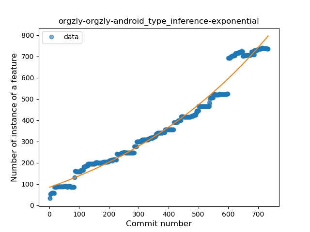
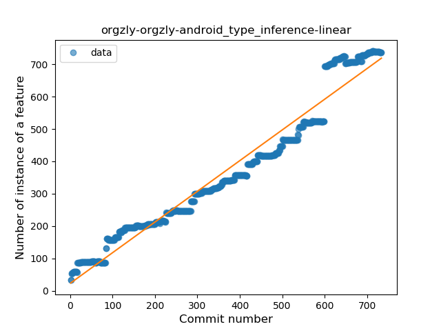
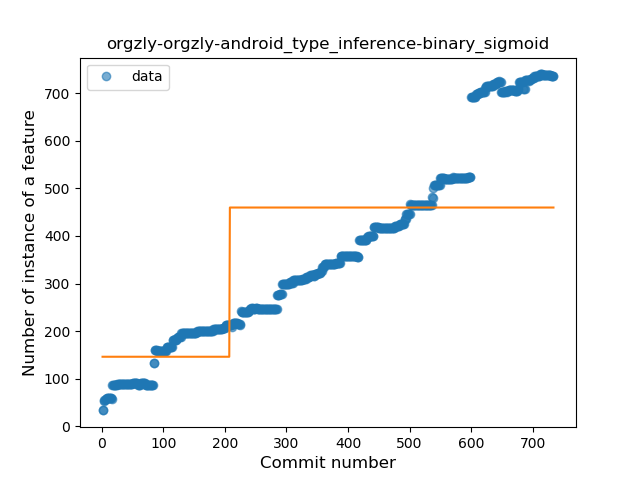
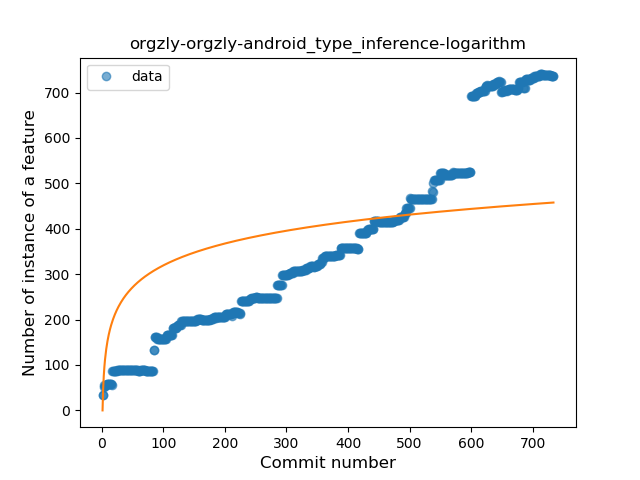
### <a name="lambda">Lambda</a>
----
#### Functions
* **Constant Rise - Linear:** 
    * **R_Squared:** 0.93915571
* **Sudden Rise Plateau - Logarithm:** 
    * **R_Squared:** 0.56470625
* **Plateau Sudden Rise - Binary Sigmoid:** 
    * **R_Squared:** 0.52913354

**Plots** :chart_with_upwards_trend:
-----

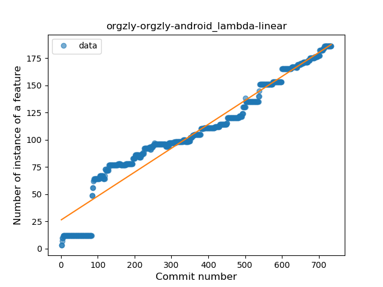
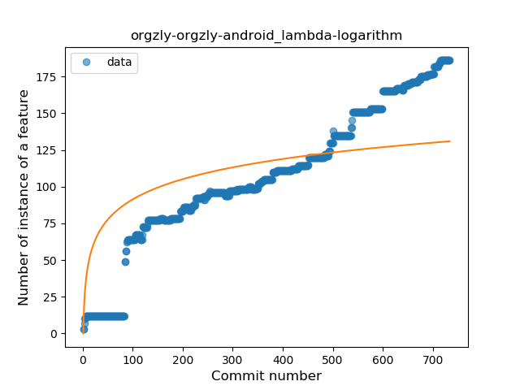
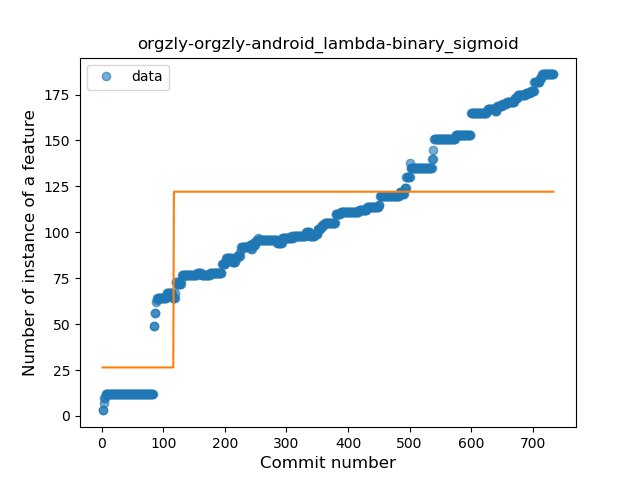
### <a name="safe_call">Safe Call</a>
----
#### Functions
* **Constant Rise - Linear:** 
    * **R_Squared:** 0.77864413
* **Sudden Rise Plateau - Logarithm:** 
    * **R_Squared:** 0.78312426
* **Plateau Sudden Rise - Binary Sigmoid:** 
    * **R_Squared:** 0.40901679

**Plots** :chart_with_upwards_trend:
-----

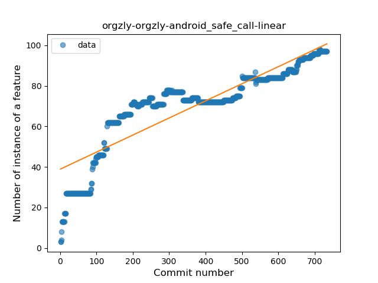
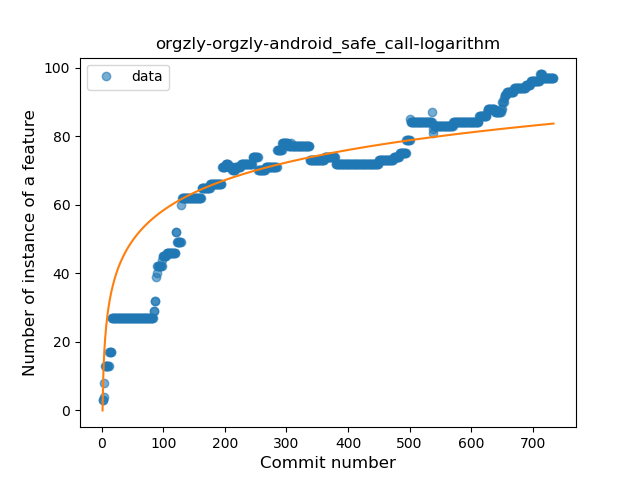

### <a name="when_expr">When expression</a>
----
#### Functions
* **Sudden Rise - Exponential:** 
    * **R_Squared:** 0.93792473
* **Constant Rise - Linear:** 
    * **R_Squared:** 0.92788018
* **Sudden Rise Plateau - Logarithm:** 
    * **R_Squared:** 0.4468133

**Plots** :chart_with_upwards_trend:
-----

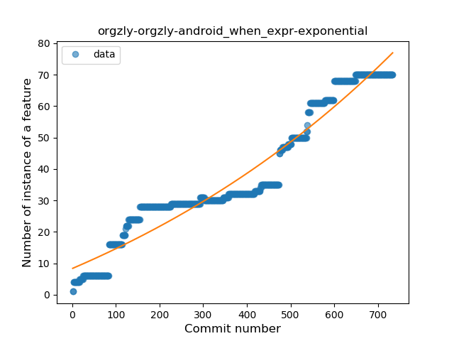
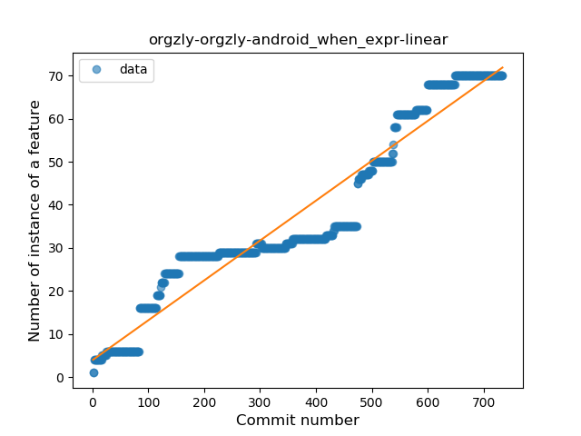
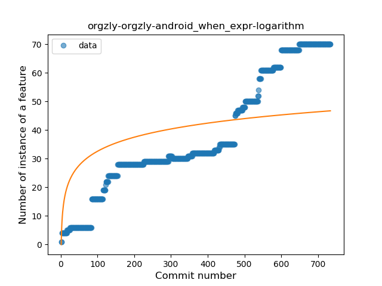
### <a name="companion_object">Companion Object</a>
----
#### Functions
* **Sudden Rise - Exponential:** 
    * **R_Squared:** 0.98691528
* **Constant Rise - Linear:** 
    * **R_Squared:** 0.95700399
* **Sudden Rise Plateau - Logarithm:** 
    * **R_Squared:** 0.42416213

**Plots** :chart_with_upwards_trend:
-----

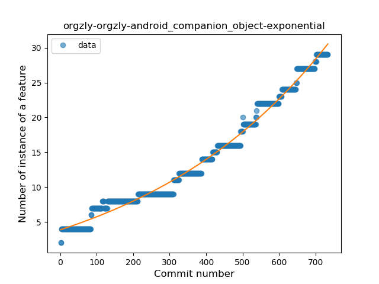
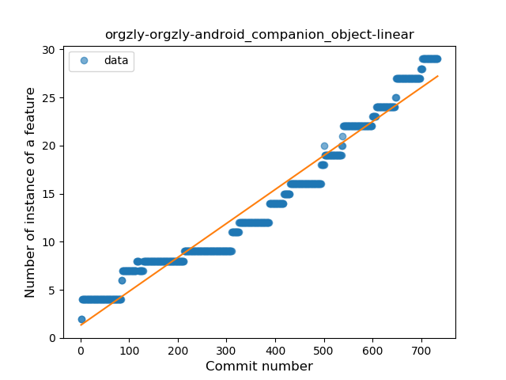
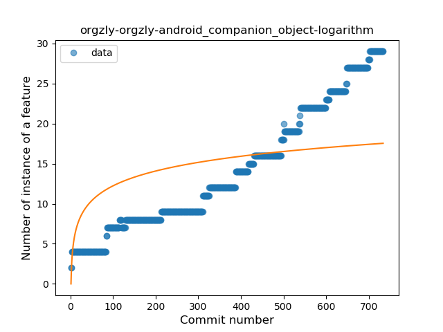
### <a name="unsafe_call">Unsafe Call</a>
----
#### Functions
* **Sudden Rise - Exponential:** 
    * **R_Squared:** 0.85855564
* **Constant Rise - Linear:** 
    * **R_Squared:** 0.55933945
* **Sudden Rise Plateau - Logarithm:** 
    * **R_Squared:** 0.12509567

**Plots** :chart_with_upwards_trend:
-----

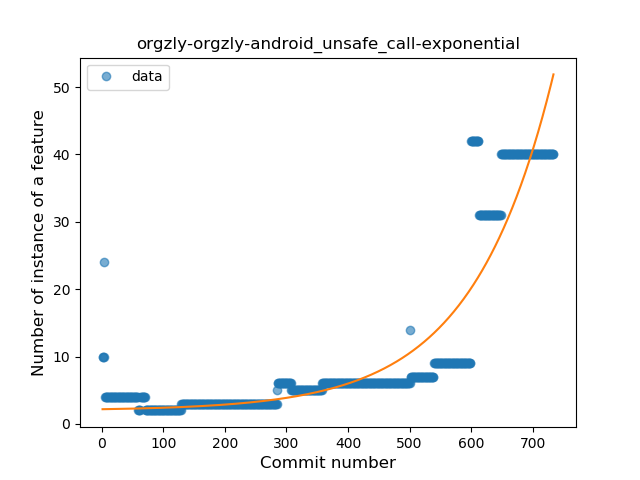
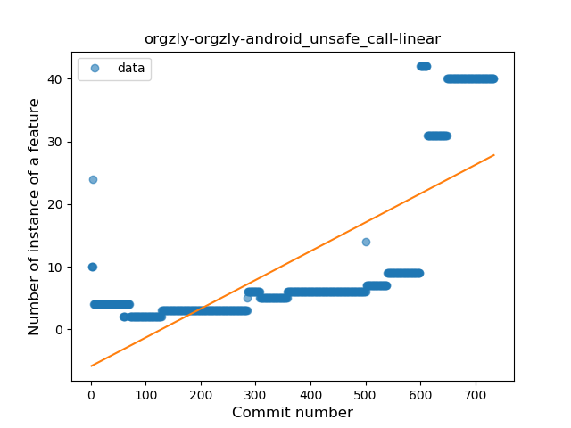
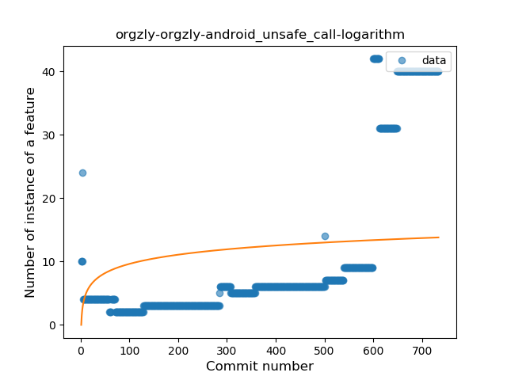
### <a name="string_template">String Template</a>
----
#### Functions
* **Constant Rise - Linear:** 
    * **R_Squared:** 0.76392587
* **Sudden Rise Plateau - Logarithm:** 
    * **R_Squared:** 0.66830501
* **Plateau Sudden Rise - Binary Sigmoid:** 
    * **R_Squared:** 0.42674765

**Plots** :chart_with_upwards_trend:
-----

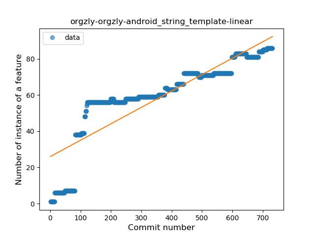

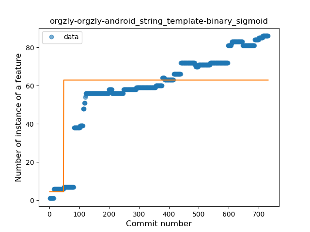
### <a name="func_with_default_value">Function with Default Value</a>
----
#### Functions
* **Constant Rise - Linear:** 
    * **R_Squared:** 0.84457825
* **Sudden Rise Plateau - Logarithm:** 
    * **R_Squared:** 0.63221368
* **Plateau Sudden Rise - Binary Sigmoid:** 
    * **R_Squared:** 0.32587658

**Plots** :chart_with_upwards_trend:
-----

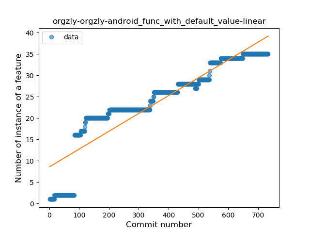
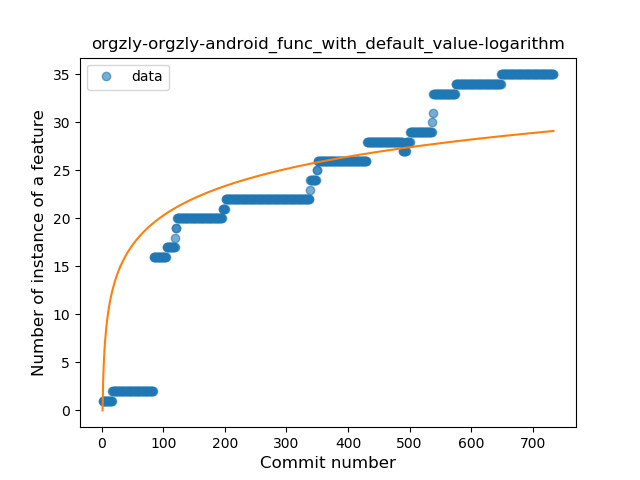
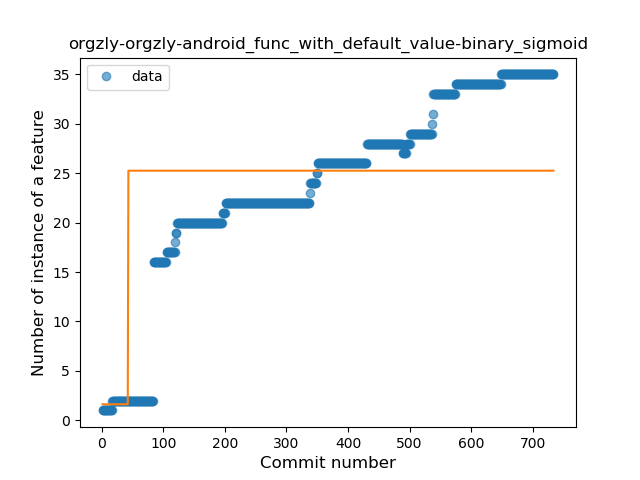
### <a name="singleton">Singleton</a>
----
#### Functions
* **Plateau Gradual Rise - Sigmoid:** 
    * **R_Squared:** 0.97930396
* **Constant Rise - Linear:** 
    * **R_Squared:** 0.94889563
* **Sudden Rise Plateau - Logarithm:** 
    * **R_Squared:** 0.4786357

**Plots** :chart_with_upwards_trend:
-----

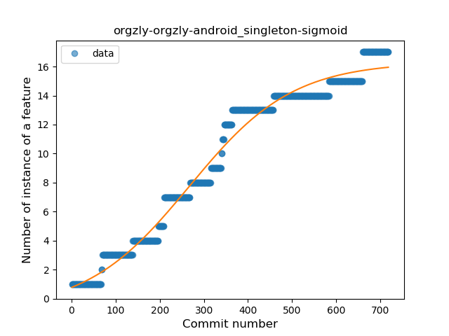
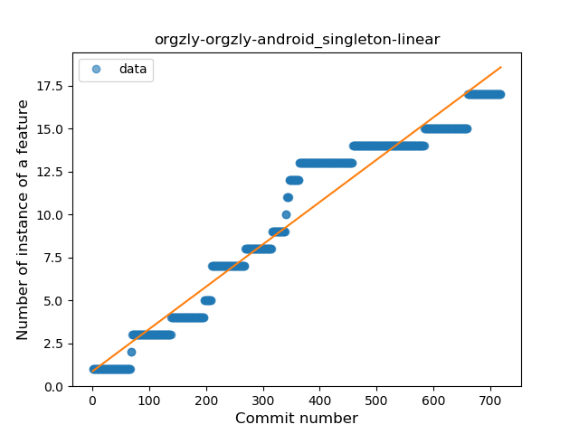
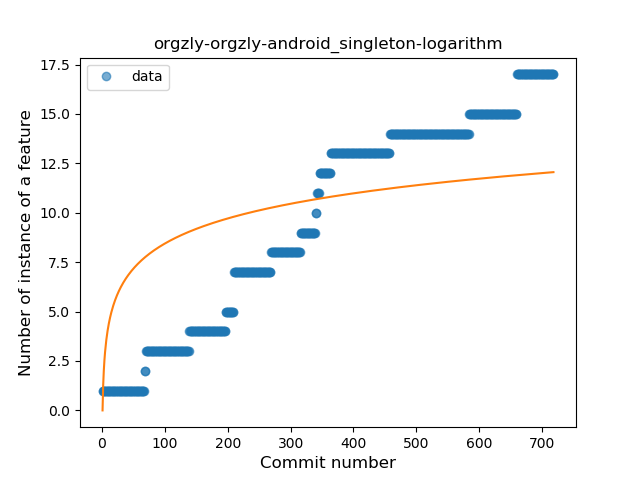
### <a name="smart_cast">Smart Cast</a>
----
#### Functions
* **Constant Rise - Linear:** 
    * **R_Squared:** 0.73549097
* **Sudden Rise Plateau - Logarithm:** 
    * **R_Squared:** 0.64079722

**Plots** :chart_with_upwards_trend:
-----

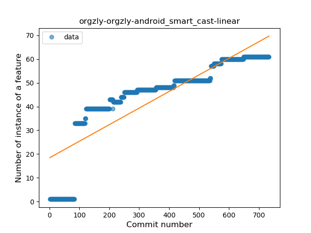
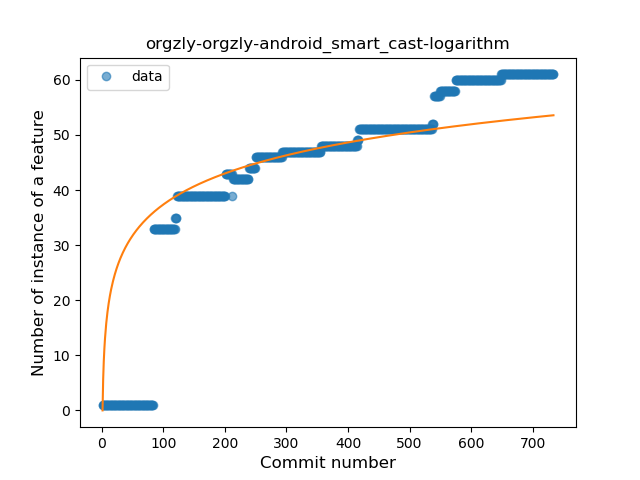
### <a name="range_expr">Range Expression</a>
----
#### Functions
* **Plateau Gradual Rise - Sigmoid:** 
    * **R_Squared:** 0.97744979
* **Constant Rise - Linear:** 
    * **R_Squared:** 0.88044692
* **Sudden Rise - Exponential:** 
    * **R_Squared:** 0.88539465
* **Sudden Rise Plateau - Logarithm:** 
    * **R_Squared:** 0.35187523

**Plots** :chart_with_upwards_trend:
-----

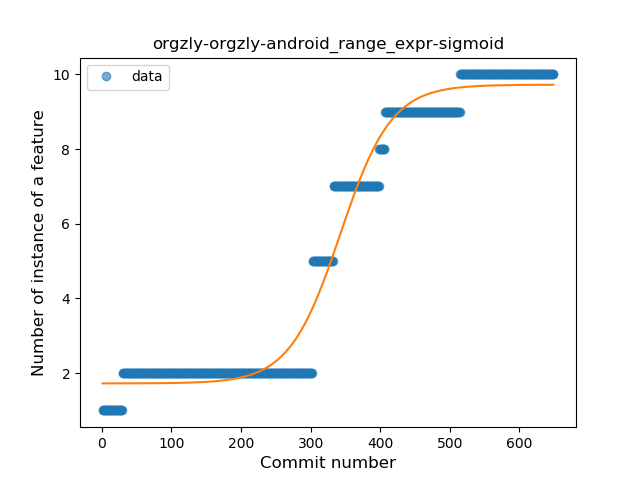
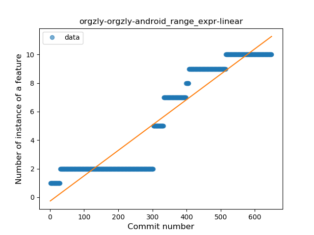
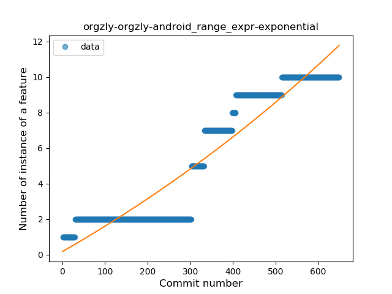
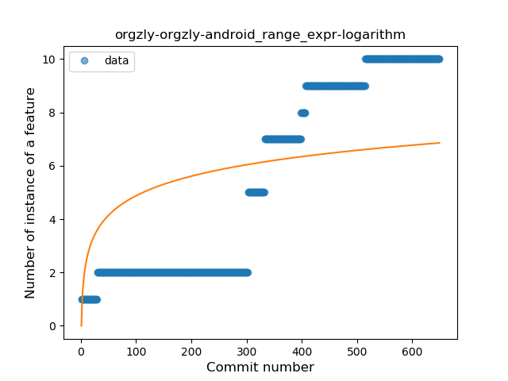
### <a name="func_call_with_named_arg">Function call with Named Argument</a>
----
#### Functions
* **Constant Rise - Linear:** 
    * **R_Squared:** 0.57595668
* **Sudden Rise Plateau - Logarithm:** 
    * **R_Squared:** 0.58364375

**Plots** :chart_with_upwards_trend:
-----

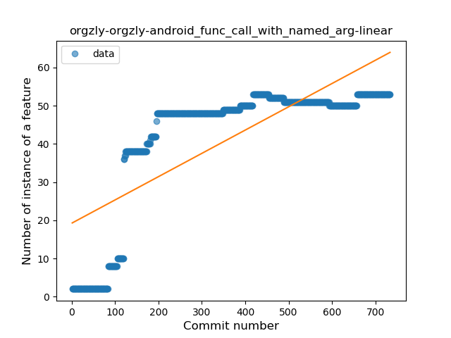
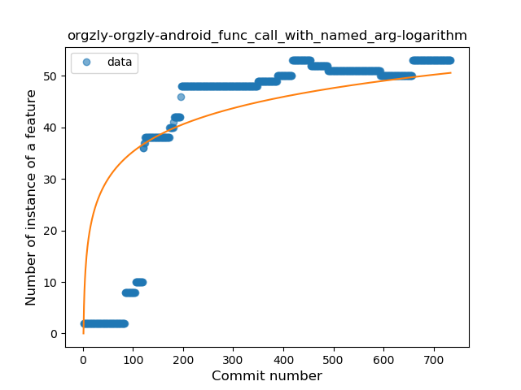
### <a name="data_class">Data Class</a>
----
#### Functions
* **Constant Rise - Linear:** 
    * **R_Squared:** 0.95281439
* **Sudden Rise Plateau - Logarithm:** 
    * **R_Squared:** 0.87699917

**Plots** :chart_with_upwards_trend:
-----

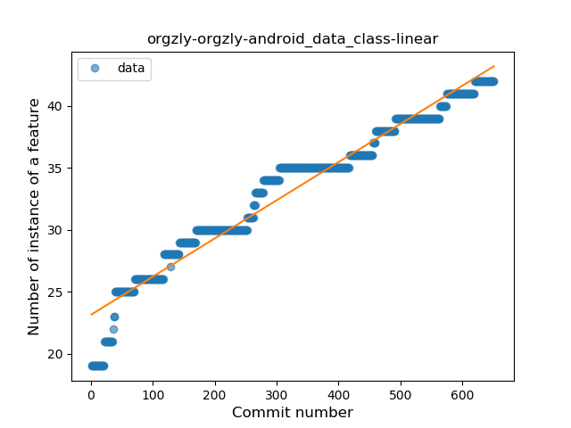
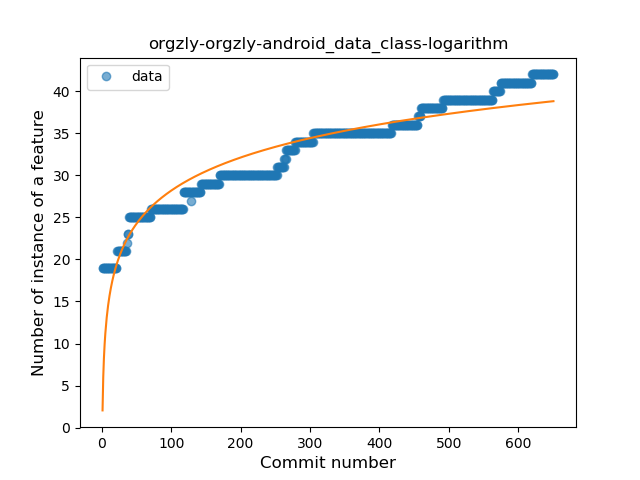
### <a name="property_delegation">Property Delegation</a>
----
#### Functions
* **Plateau Sudden Decline - Binary Sigmoid:** 
    * **R_Squared:** 0.55531073
* **Sudden Decline - Exponential:** 
    * **R_Squared:** 0.40043269
* **Constant Decline - Linear:** 
    * **R_Squared:** 0.06436509
* **Sudden Rise Plateau - Logarithm:** 
    * **R_Squared:** -0.0

**Plots** :chart_with_upwards_trend:
-----

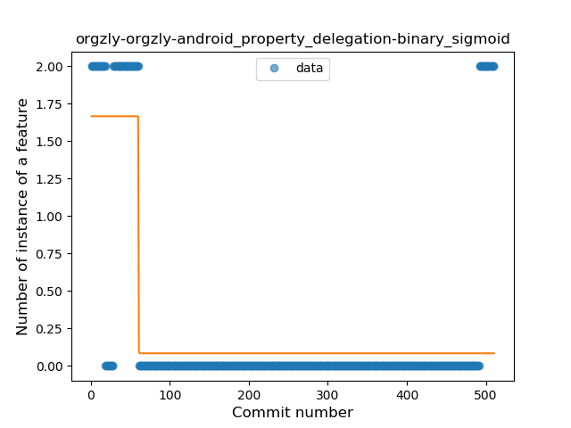
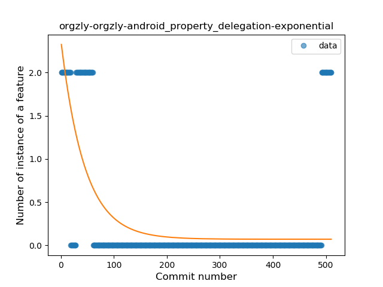
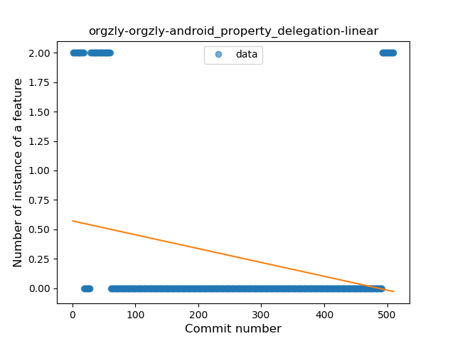
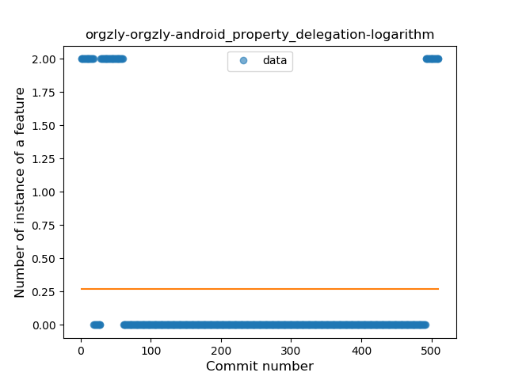
### <a name="destructuring_declaration">Destructuring Declaration</a>
----
#### Functions
* **Sudden Rise Plateau - Logarithm:** 
    * **R_Squared:** 0.66681739
* **Constant Rise - Linear:** 
    * **R_Squared:** 0.58574924

**Plots** :chart_with_upwards_trend:
-----

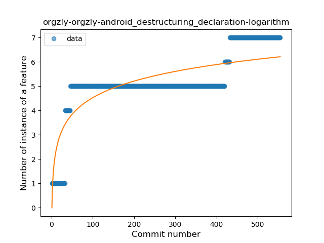
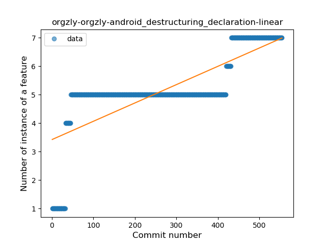
### <a name="overloaded_op">Overloaded Operator</a>
----
#### Functions
* **Plateau Sudden Rise - Binary Sigmoid:** 
    * **R_Squared:** 1.0
* **Constant Rise - Linear:** 
    * **R_Squared:** 0.67948718
* **Sudden Rise Plateau - Logarithm:** 
    * **R_Squared:** 0.4923422

**Plots** :chart_with_upwards_trend:
-----

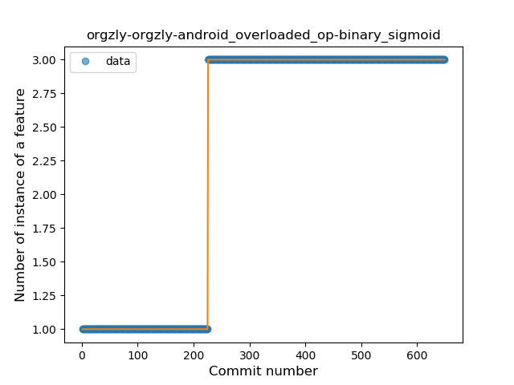
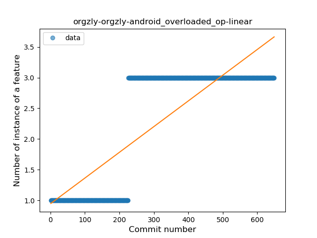
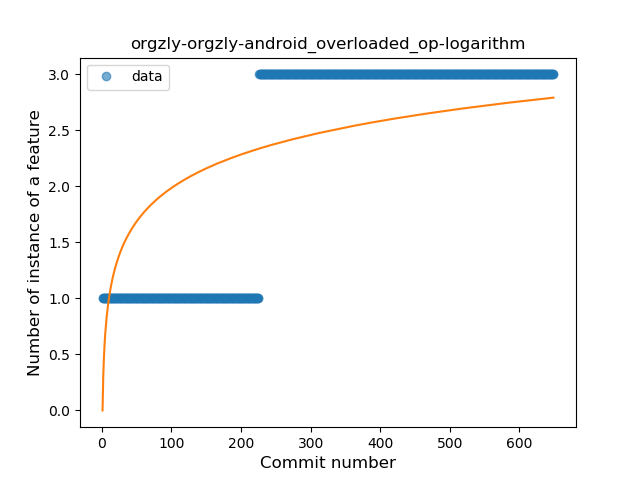
