## osmandapp-Osmand
----
#### Metrics provided by Detekt
* Number of lines of code 11060
* Number of Kotlin files: 41
* Cyclomatic complexity: 2318
* Cyclomatic complexity by thousands of lines: 351 

----
**12** features analyzed

*	<a href="#type_inference">Type Inference</a> 
*	<a href="#lambda">Lambda</a> 
*	<a href="#safe_call">Safe Call</a> 
*	<a href="#when_expr">When expression</a> 
*	<a href="#companion_object">Companion Object</a> 
*	<a href="#unsafe_call">Unsafe Call</a> 
*	<a href="#string_template">String Template</a> 
*	<a href="#func_with_default_value">Function with Default Value</a> 
*	<a href="#singleton">Singleton</a> 
*	<a href="#smart_cast">Smart Cast</a> 
*	<a href="#range_expr">Range Expression</a> 
*	<a href="#destructuring_declaration">Destructuring Declaration</a> 

### <a name="type_inference">Type Inference</a>
----
#### Functions
* **Constant Rise - Linear:** 
    * **R_Squared:** 0.93730598
* **Sudden Rise Plateau - Logarithm:** 
    * **R_Squared:** 0.64809263
* **Plateau Sudden Rise - Binary Sigmoid:** 
    * **R_Squared:** 0.21598566

**Plots** :chart_with_upwards_trend:
-----

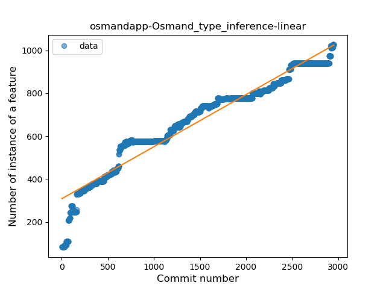
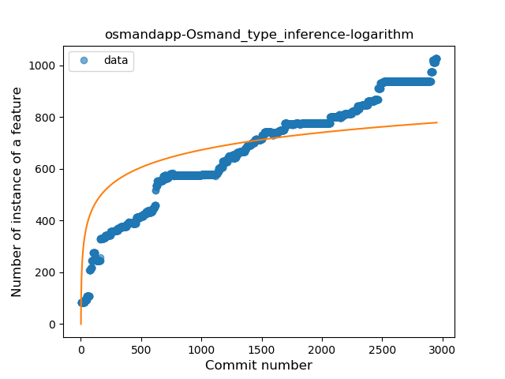
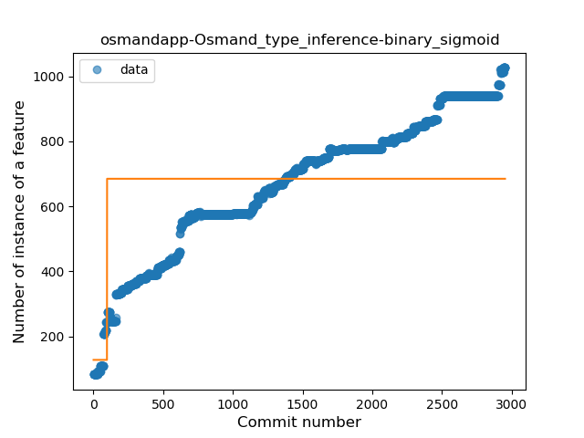
### <a name="lambda">Lambda</a>
----
#### Functions
* **Constant Rise - Linear:** 
    * **R_Squared:** 0.97800616
* **Sudden Rise Plateau - Logarithm:** 
    * **R_Squared:** 0.45036518
* **Plateau Sudden Rise - Binary Sigmoid:** 
    * **R_Squared:** 0.26791436

**Plots** :chart_with_upwards_trend:
-----

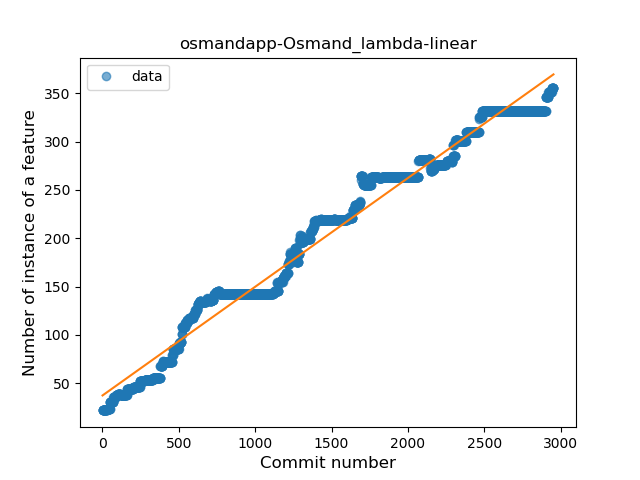
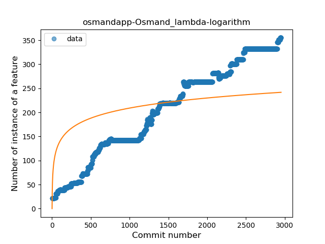
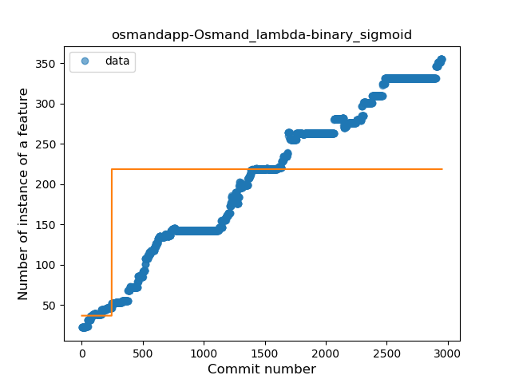
### <a name="safe_call">Safe Call</a>
----
#### Functions
* **Constant Rise - Linear:** 
    * **R_Squared:** 0.87319105
* **Sudden Rise Plateau - Logarithm:** 
    * **R_Squared:** 0.67226651
* **Plateau Sudden Rise - Binary Sigmoid:** 
    * **R_Squared:** 0.57058149

**Plots** :chart_with_upwards_trend:
-----

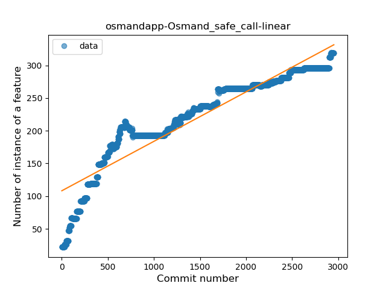
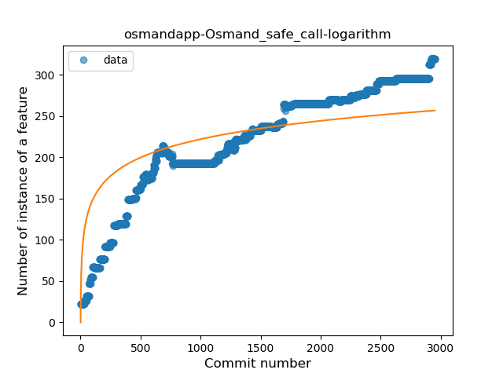
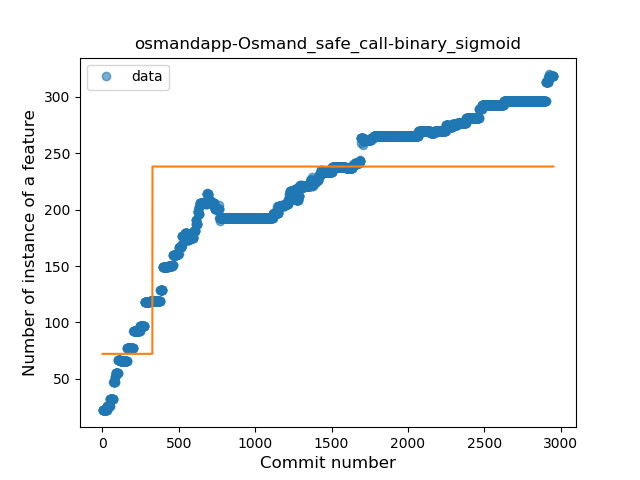
### <a name="when_expr">When expression</a>
----
#### Functions
* **Constant Rise - Linear:** 
    * **R_Squared:** 0.93486574
* **Sudden Rise Plateau - Logarithm:** 
    * **R_Squared:** 0.64383251

**Plots** :chart_with_upwards_trend:
-----

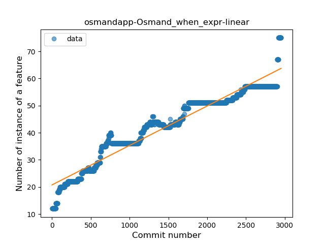
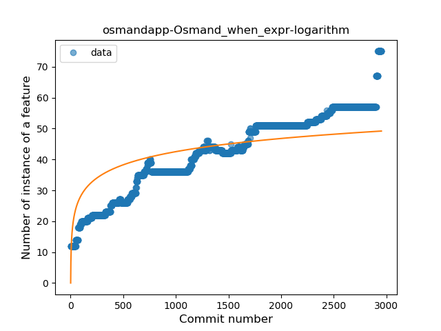
### <a name="companion_object">Companion Object</a>
----
#### Functions
* **Plateau Gradual Rise - Sigmoid:** 
    * **R_Squared:** 0.91041425
* **Sudden Rise - Exponential:** 
    * **R_Squared:** 0.8883662
* **Constant Rise - Linear:** 
    * **R_Squared:** 0.86635456
* **Sudden Rise Plateau - Logarithm:** 
    * **R_Squared:** 0.47182058

**Plots** :chart_with_upwards_trend:
-----

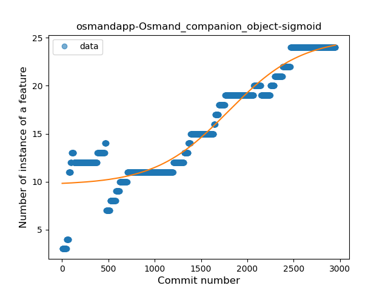
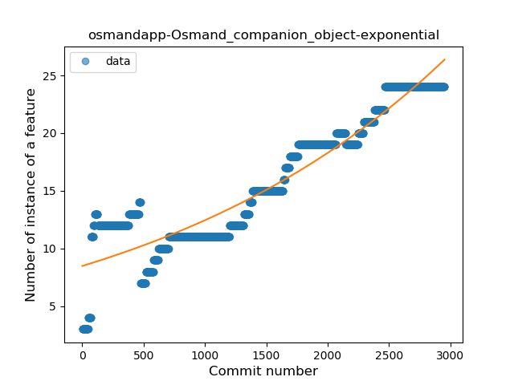
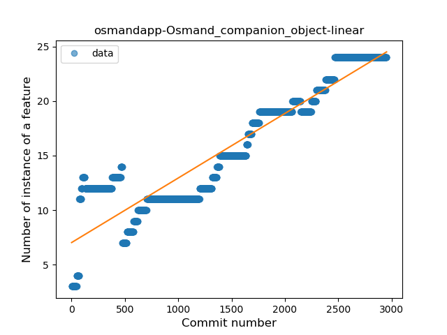
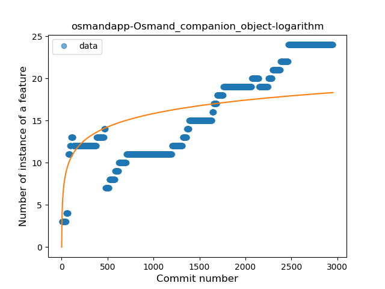
### <a name="unsafe_call">Unsafe Call</a>
----
#### Functions
* **Constant Rise - Linear:** 
    * **R_Squared:** 0.88822338
* **Sudden Rise Plateau - Logarithm:** 
    * **R_Squared:** 0.71598395

**Plots** :chart_with_upwards_trend:
-----

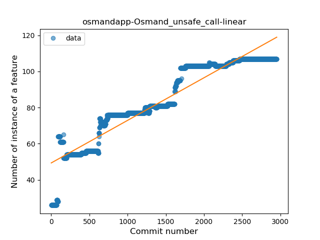
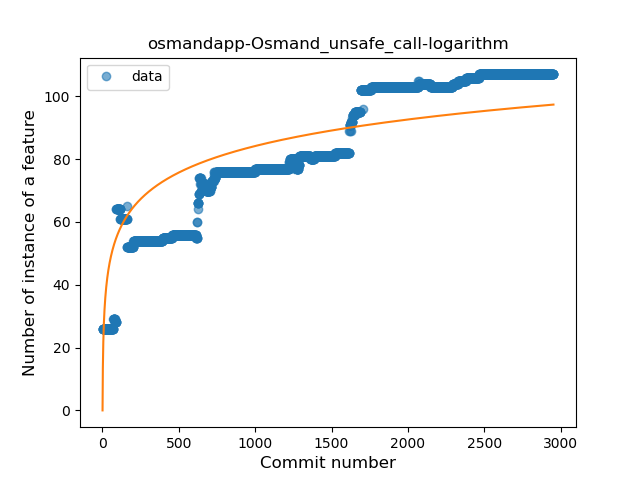
### <a name="string_template">String Template</a>
----
#### Functions
* **Constant Rise - Linear:** 
    * **R_Squared:** 0.95560875
* **Sudden Rise Plateau - Logarithm:** 
    * **R_Squared:** 0.42596441

**Plots** :chart_with_upwards_trend:
-----

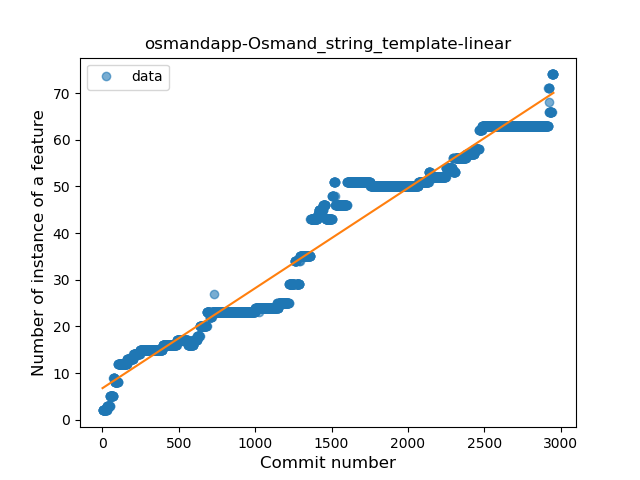
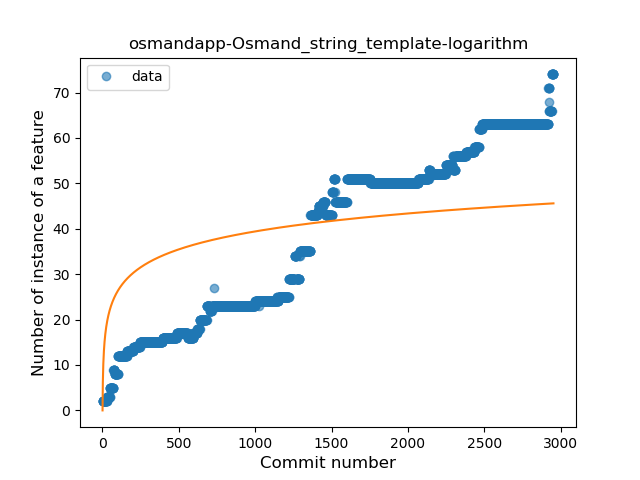
### <a name="func_with_default_value">Function with Default Value</a>
----
#### Functions
* **Constant Rise - Linear:** 
    * **R_Squared:** 0.90158778
* **Sudden Rise Plateau - Logarithm:** 
    * **R_Squared:** 0.58331111
* **Plateau Sudden Rise - Binary Sigmoid:** 
    * **R_Squared:** 0.06319352

**Plots** :chart_with_upwards_trend:
-----

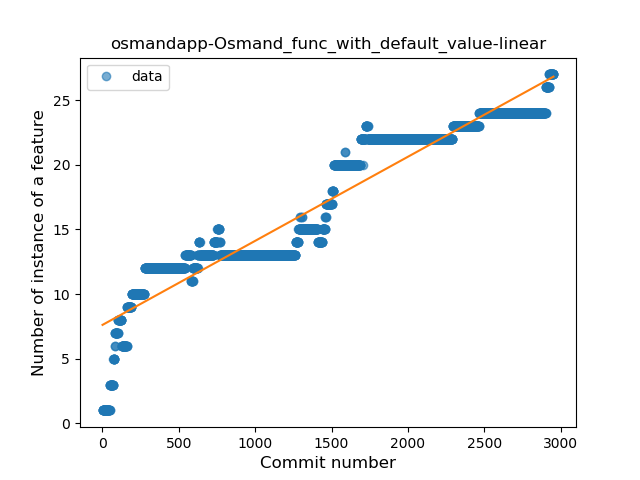

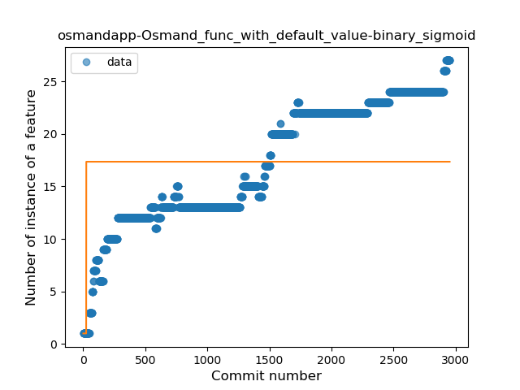
### <a name="singleton">Singleton</a>
----
#### Functions
* **Constant Rise - Linear:** 
    * **R_Squared:** 0.8046949
* **Sudden Rise Plateau - Logarithm:** 
    * **R_Squared:** 0.55816918

**Plots** :chart_with_upwards_trend:
-----

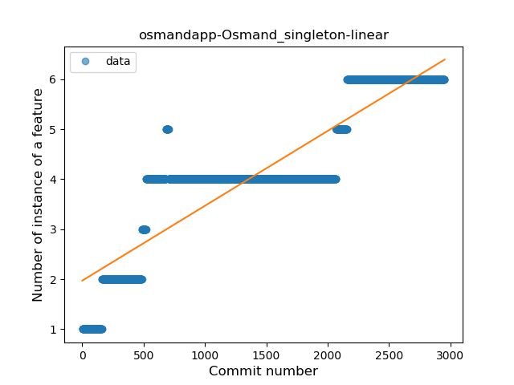
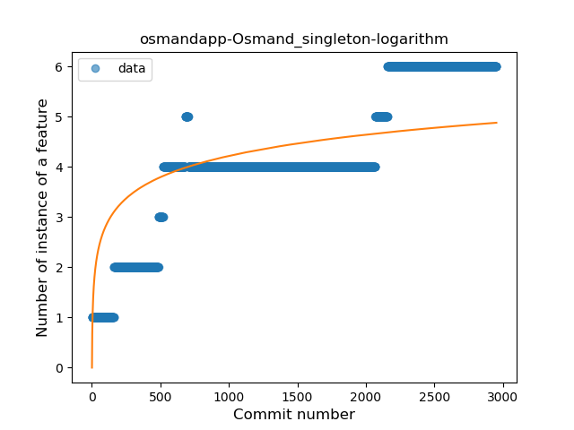
### <a name="smart_cast">Smart Cast</a>
----
#### Functions
* **Constant Rise - Linear:** 
    * **R_Squared:** 0.83504464
* **Sudden Rise Plateau - Logarithm:** 
    * **R_Squared:** 0.49285983

**Plots** :chart_with_upwards_trend:
-----

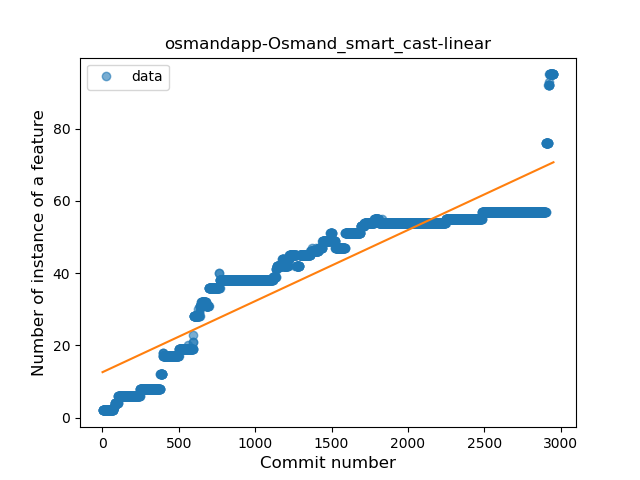
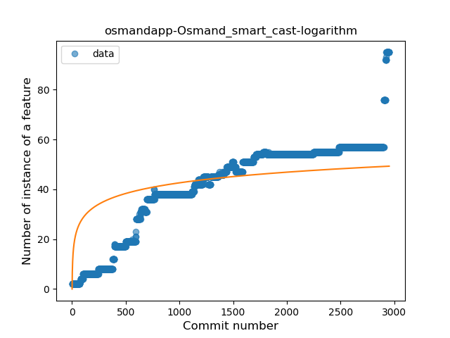
### <a name="range_expr">Range Expression</a>
----
#### Functions
* **Plateau Gradual Rise - Sigmoid:** 
    * **R_Squared:** 0.94101073
* **Sudden Rise - Exponential:** 
    * **R_Squared:** 0.90111814
* **Constant Rise - Linear:** 
    * **R_Squared:** 0.86352162
* **Sudden Rise Plateau - Logarithm:** 
    * **R_Squared:** 0.28836774

**Plots** :chart_with_upwards_trend:
-----

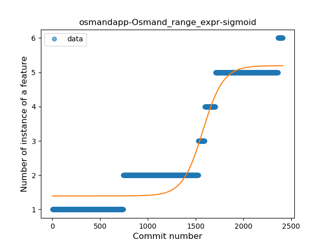
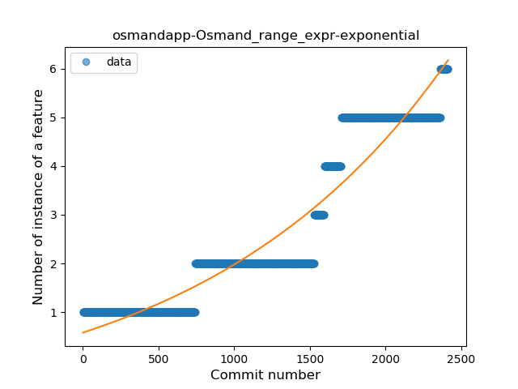
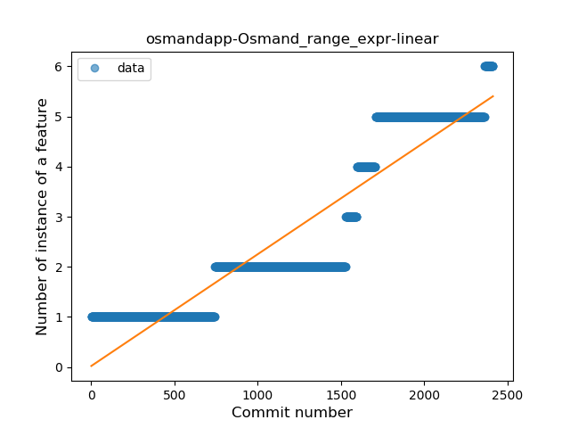
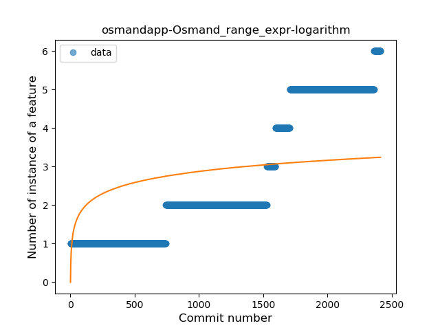
### <a name="destructuring_declaration">Destructuring Declaration</a>
----
#### Functions
* **Constant Rise - Linear:** 
    * **R_Squared:** 0.95836322
* **Sudden Rise Plateau - Logarithm:** 
    * **R_Squared:** 0.3775708

**Plots** :chart_with_upwards_trend:
-----

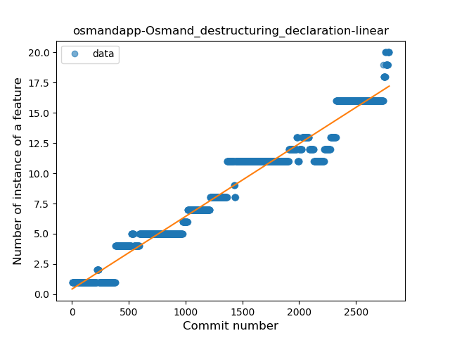
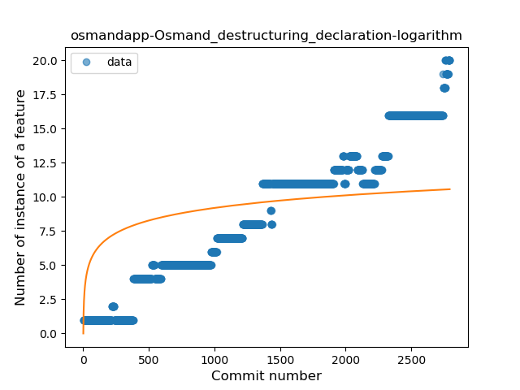
